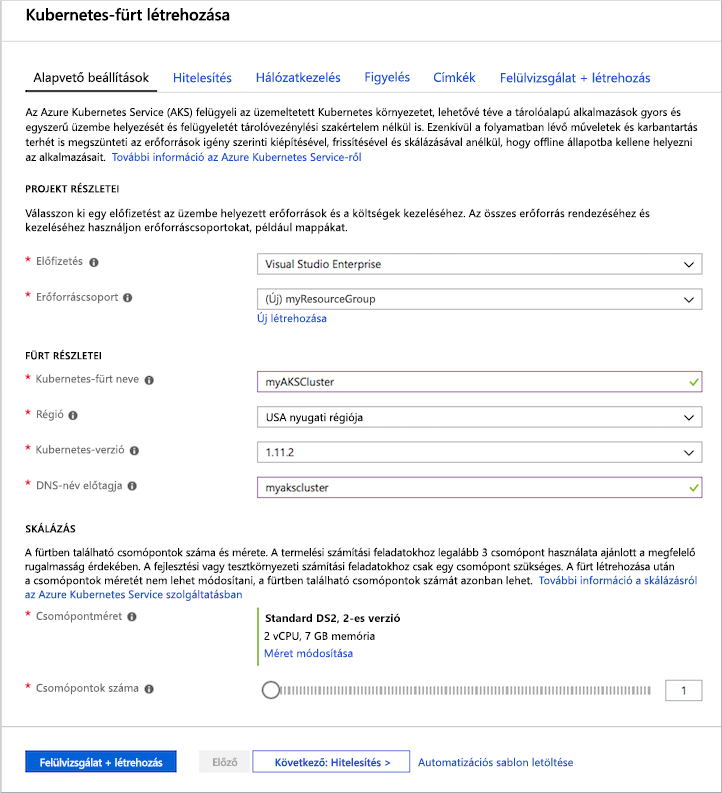
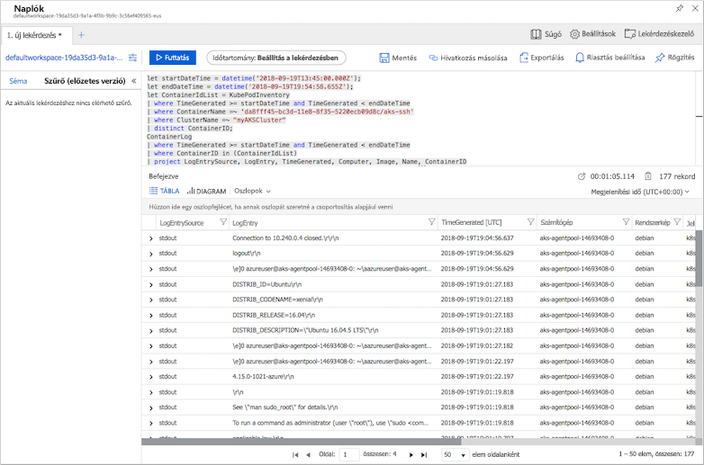

# <a name="quickstart-deploy-an-azure-kubernetes-service-aks-cluster-using-the-azure-portal"></a>Gyors útmutató: Fürt üzembe helyezése az Azure Kubernetes Service (AKS) az Azure portal használatával

Az Azure Kubernetes Service (AKS) egy felügyelt Kubernetes szolgáltatás, amellyel gyorsabban helyezheti üzembe és kezelheti a fürtöket. Ebben a rövid útmutatóban egy AKS-fürtöt helyezünk üzembe az Azure Portal használatával. Egy többtárolós alkalmazást helyezünk egy webes előtérrendszert és a egy Redis-példányt tartalmazó fut a fürtben. Ekkor megjelenik a fürt és az alkalmazást futtató podok állapotának figyelése.


A rövid útmutató feltételezi, hogy rendelkezik a Kubernetes használatára vonatkozó alapvető ismeretekkel. További információkért lásd: [Kubernetes alapvető fogalmait Azure Kubernetes Service (AKS)][kubernetes-concepts].

Ha nem rendelkezik Azure-előfizetéssel, mindössze néhány perc alatt létrehozhat egy [ingyenes fiókot](https://azure.microsoft.com/free/?WT.mc_id=A261C142F) a virtuális gép létrehozásának megkezdése előtt.

## <a name="sign-in-to-azure"></a>Bejelentkezés az Azure-ba

Jelentkezzen be az Azure Portalra a https://portal.azure.com webhelyen.

## <a name="create-an-aks-cluster"></a>AKS-fürt létrehozása

Az Azure portal bal felső sarkában válassza **+ erőforrás létrehozása** > **Kubernetes-szolgáltatást**.

AKS-fürt létrehozásához hajtsa végre a következő lépéseket:

1. **Alapvető beállítások** – Konfigurálja a következő beállításokat:
    - *A PROJECT DETAILS*: Válassza ki az Azure-előfizetéssel, majd válassza ki vagy hozzon létre egy Azure-erőforráscsoportot, mint például *myResourceGroup*. Adja meg a **Kubernetes-fürt nevét**, például *myAKSCluster*.
    - *FÜRT RÉSZLETES ADATAI*: Válassza ki a régió, a Kubernetes-verziót és a DNS-név előtagja az AKS-fürtöt.
    - *MÉRETEZÉSI CSOPORT*: Válassza ki az AKS-csomópontok Virtuálisgép-méretét. A virtuálisgép-méret az AKS-fürt telepítését követően **nem** módosítható.
        - Adja meg a fürtre telepítendő csomópontok számát. Ehhez a rövid útmutatóhoz a **Csomópontok száma** beállítás értékeként adjon meg *1*-et. A csomópontok száma a fürt telepítése után is **módosítható**.
    
    

    Válassza ki **tovább: Hitelesítési** teljes.

1. **Hitelesítési**: Konfigurálja a következő beállításokat:
    - Hozzon létre egy új szolgáltatásnevet, vagy *konfigurálja* a rendszert valamelyik meglévő használatára. Meglévő SPN használata esetén meg kell adnia az SPN ügyfélazonosítóját és kulcsát.
    - Engedélyezze a Kubernetes szerepköralapú hozzáférés-vezérlők (RBAC) használatát. Ezekkel a vezérlőkkel pontosabban szabályozhatja a hozzáférést az AKS-fürtben üzembe helyezett Kubernetes-erőforrásokhoz.

    Alapértelmezés szerint *alapszintű* hálózatkezelés szolgál, és az Azure Monitor for containers szolgáltatásban engedélyezve van. Amikor elkészült, válassza az **Áttekintés + létrehozás**, majd a **Létrehozás** lehetőséget.

Az AKS-fürt létrehozása és a használatra való előkészítése néhány percet vesz igénybe. Amikor végzett, tallózással keresse meg az AKS-fürt erőforráscsoportja például *myResourceGroup*, és válassza ki például az AKS erőforrás *myAKSCluster*. Megjelenik az AKS-fürt irányítópultja, ahogyan az a következő példa képernyőfelvételen is látható:


## <a name="connect-to-the-cluster"></a>Csatlakozás a fürthöz

Kubernetes-fürtök kezeléséhez használja [kubectl][kubectl], a Kubernetes parancssori ügyfelét. A `kubectl` ügyfél előzetesen már telepítve van az Azure Cloud Shellben.

Nyissa meg a Cloud Shellt az Azure Portal jobb felső sarkában található gomb használatával.


Az [aks get-credentials][az-aks-get-credentials] paranccsal konfigurálható`kubectl` a Kubernetes-fürthöz való csatlakozásra. Ez a parancs letölti a hitelesítő adatokat, és konfigurálja a Kubernetes parancssori Felületét azok használatára. A következő példa lekéri a *myResourceGroup* erőforrásban lévő *myAKSCluster* fürtnév hitelesítő adatait:

```azurecli-interactive
az aks get-credentials --resource-group myResourceGroup --name myAKSCluster
```

A fürthöz való csatlakozás ellenőrzéséhez használja a [kubectl get][kubectl-get] parancsot a fürtcsomópontok listájának lekéréséhez.

```azurecli-interactive
kubectl get nodes
```

A következő példakimenet az előző lépésekben létrehozott csomópontot mutatja be. Győződjön meg arról, hogy a csomópont állapota *készen*:

```
NAME                       STATUS    ROLES     AGE       VERSION
aks-agentpool-14693408-0   Ready     agent     15m       v1.11.5
```

## <a name="run-the-application"></a>Az alkalmazás futtatása

Kubernetes-jegyzékfájl meghatározza, milyen tároló-lemezkép futtatásához például a fürt célállapotát. Ebben a rövid útmutatóban egy jegyzékfájlt használunk az Azure Vote-alkalmazás futtatásához szükséges összes objektum létrehozásához. A jegyzékfájlt tartalmaz két [Kubernetes-üzembehelyezés] [ kubernetes-deployment] – egy az Azure Vote Python mintaalkalmazásból, a másik pedig a Redis-példánynak. Két [Kubernetes-szolgáltatás] [ kubernetes-service] is létrejönnek - egy belső szolgáltatás a Redis-példányt, és a egy külső szolgáltatás az Azure Vote-alkalmazás elérésére az internetről.

> [!TIP]
> A rövid útmutatóban manuálisan hozza létre és helyezi üzembe az alkalmazásjegyzék-fájlokat az AKS-fürtön. A valósághoz közelebbi felhasználási forgatókönyvekben az [Azure Dev Spaces][azure-dev-spaces] használatával közvetlenül az AKS-fürtön végezheti a kód gyors iterálását és hibaelhárítását. A Dev Spaces több operációsrendszer-platformon és fejlesztői környezetben használható, és támogatja a csapaton belüli együttműködést.

Hozzon létre egy fájlt `azure-vote.yaml` , és másolja a következő YAML-definícióban. Az Azure Cloud Shellben, létrehozhatja a fájlt `vi` vagy `Nano`, mintha egy virtuális vagy fizikai rendszeren:

```yaml
apiVersion: apps/v1
kind: Deployment
metadata:
  name: azure-vote-back
spec:
  replicas: 1
  selector:
    matchLabels:
      app: azure-vote-back
  template:
    metadata:
      labels:
        app: azure-vote-back
    spec:
      containers:
      - name: azure-vote-back
        image: redis
        resources:
          requests:
            cpu: 100m
            memory: 128Mi
          limits:
            cpu: 250m
            memory: 256Mi
        ports:
        - containerPort: 6379
          name: redis
---
apiVersion: v1
kind: Service
metadata:
  name: azure-vote-back
spec:
  ports:
  - port: 6379
  selector:
    app: azure-vote-back
---
apiVersion: apps/v1
kind: Deployment
metadata:
  name: azure-vote-front
spec:
  replicas: 1
  selector:
    matchLabels:
      app: azure-vote-front
  template:
    metadata:
      labels:
        app: azure-vote-front
    spec:
      containers:
      - name: azure-vote-front
        image: microsoft/azure-vote-front:v1
        resources:
          requests:
            cpu: 100m
            memory: 128Mi
          limits:
            cpu: 250m
            memory: 256Mi
        ports:
        - containerPort: 80
        env:
        - name: REDIS
          value: "azure-vote-back"
---
apiVersion: v1
kind: Service
metadata:
  name: azure-vote-front
spec:
  type: LoadBalancer
  ports:
  - port: 80
  selector:
    app: azure-vote-front
```

Üzembe helyezés az alkalmazás a [a kubectl a alkalmazni] [ kubectl-apply] parancsot, majd adja meg a YAML-jegyzékfájl neve:

```azurecli-interactive
kubectl apply -f azure-vote.yaml
```

Az alábbi példa kimenetében látható, a központi telepítések és a szolgáltatások létrehozása sikerült:

```
deployment "azure-vote-back" created
service "azure-vote-back" created
deployment "azure-vote-front" created
service "azure-vote-front" created
```

## <a name="test-the-application"></a>Az alkalmazás tesztelése

Az alkalmazás futtatásakor egy Kubernetes-szolgáltatást mutatja meg az alkalmazás előtér az internethez. A folyamat eltarthat pár percig.

A folyamat állapotának monitorozásához használja [kubectl get service][kubectl-get] parancsot a `--watch` argumentummal.

```azurecli-interactive
kubectl get service azure-vote-front --watch
```

Kezdetben a *EXTERNAL-IP* számára a *azure-vote-front* szolgáltatás jelenik meg, mint *függőben lévő*.

```
NAME               TYPE           CLUSTER-IP   EXTERNAL-IP   PORT(S)        AGE
azure-vote-front   LoadBalancer   10.0.37.27   <pending>     80:30572/TCP   6s
```

Ha a *EXTERNAL-IP* -cím módosul a *függőben lévő* egy tényleges nyilvános IP-címet használja `CTRL-C` leállítani a `kubectl` tekintse meg a folyamatot. Az alábbi példa kimenetében látható, érvényes nyilvános IP-címet rendel hozzá a szolgáltatáshoz:

```
azure-vote-front   LoadBalancer   10.0.37.27   52.179.23.131   80:30572/TCP   2m
```

A művelet az Azure Vote alkalmazás megtekintéséhez nyissa meg a szolgáltatás külső IP-címét egy webböngészőben.


## <a name="monitor-health-and-logs"></a>Állapot és naplók monitorozása

A fürt létrehozásakor az Azure Monitor-tárolókhoz engedélyezték. Ez a monitorozási funkció az AKS-fürt és a fürtön futó podok állapotával kapcsolatos mérőszámokat biztosít.

Az adatok Azure Portalra történő feltöltése eltarthat néhány percig. Az Azure Vote-podok jelenlegi állapotának, üzemidejének és erőforrás-felhasználásának megjelenítéséhez lépjen vissza az AKS-erőforráshoz az Azure Portalon (például *myAKSCluster*). Az állapotot ezután a következő módon érheti el:

1. A **figyelés** a bal oldalon válassza ki a **Insights**
1. Válassza a **+ Szűrő hozzáadása** elemet a képernyő felső részén
1. Válassza ki a *Névtér* tulajdonságot, majd az *\<All but kube-system\>* (Összes, kivéve a kube rendszer) lehetőséget
1. Válassza a **Tárolók** nézetet.

Megjelenik az *azure-vote-back* és az *azure-vote-front* tároló, az alábbi példában látható módon:


Az `azure-vote-front` pod naplóinak megtekintéséhez kattintson a **View container logs** (Tárolónaplók megtekintése) hivatkozásra a tárolók listájának jobb oldalán. Ezek a naplók tartalmazzák a tároló *stdout* és *stderr* streamjét is.



## <a name="delete-cluster"></a>A fürt törlése

Ha a fürtre már nincs szükség, törölje az erőforráscsoportot. Ezzel törli az összes társított erőforrást is. Ezt a műveletet az Azure Portalon végezheti el, ha az AKS-fürt irányítópultján a **Törlés** gombra kattint. Ezenkívül az [az aks delete][az-aks-delete] parancsot is használhatja a Cloud Shellben:

```azurecli-interactive
az aks delete --resource-group myResourceGroup --name myAKSCluster --no-wait
```

> [!NOTE]
> A fürt törlésekor az AKS-fürt által használt Azure Active Directory-szolgáltatásnév nem lesz eltávolítva. A szolgáltatásnév eltávolításának lépéseiért lásd [az AKS-szolgáltatásnevekre vonatkozó szempontokat és a szolgáltatásnevek törlését][sp-delete] ismertető cikket.

## <a name="get-the-code"></a>A kód letöltése

Ez a rövid útmutatóban előre létrehozott tárolórendszerképek használták a Kubernetes üzembe helyezése. A kapcsolódó alkalmazáskód, Docker-fájl és Kubernetes-jegyzékfájl a GitHubon érhetőek el.

[https://github.com/Azure-Samples/azure-voting-app-redis][azure-vote-app]

## <a name="next-steps"></a>További lépések

Ebben a rövid útmutatóban egy Kubernetes-fürtöt és azon egy többtárolós alkalmazást helyezett üzembe.

Az AKS-sel kapcsolatos további információkért és a kódtól az üzembe helyezésig terjedő teljes útmutatóért folytassa a Kubernetes-fürtöket bemutató oktatóanyaggal.

> [!div class="nextstepaction"]
> [AKS-oktatóanyag][aks-tutorial]

<!-- LINKS - external -->
[azure-vote-app]: https://github.com/Azure-Samples/azure-voting-app-redis.git
[kubectl]: https://kubernetes.io/docs/user-guide/kubectl/
[kubectl-apply]: https://kubernetes.io/docs/reference/generated/kubectl/kubectl-commands#apply
[kubectl-get]: https://kubernetes.io/docs/reference/generated/kubectl/kubectl-commands#get
[kubernetes-documentation]: https://kubernetes.io/docs/home/

<!-- LINKS - internal -->
[kubernetes-concepts]: concepts-clusters-workloads.md
[az-aks-get-credentials]: /cli/azure/aks?view=azure-cli-latest#az-aks-get-credentials
[az-aks-delete]: /cli/azure/aks#az-aks-delete
[aks-monitor]: ../monitoring/monitoring-container-health.md
[aks-network]: ./concepts-network.md
[aks-tutorial]: ./tutorial-kubernetes-prepare-app.md
[http-routing]: ./http-application-routing.md
[sp-delete]: kubernetes-service-principal.md#additional-considerations
[azure-dev-spaces]: https://docs.microsoft.com/azure/dev-spaces/
[kubernetes-deployment]: concepts-clusters-workloads.md#deployments-and-yaml-manifests
[kubernetes-service]: concepts-network.md#services
