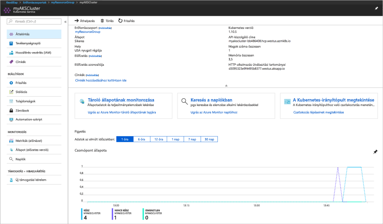
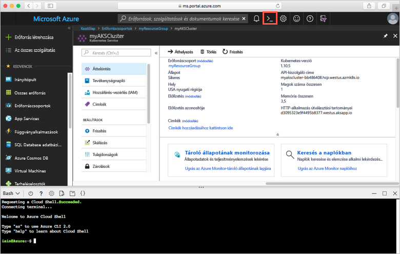
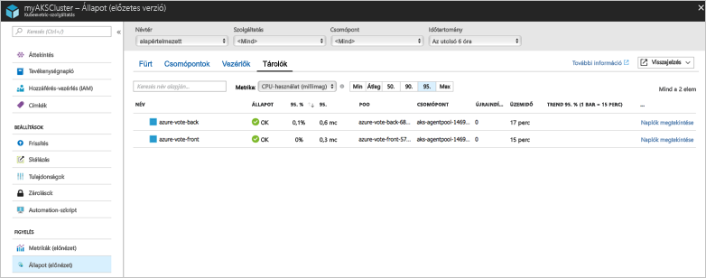

# <a name="quickstart-deploy-an-azure-kubernetes-service-aks-cluster"></a>Rövid útmutató: Azure Kubernetes Service- (AKS-) fürt üzembe helyezése

Ebben a rövid útmutatóban egy AKS-fürtöt helyezünk üzembe az Azure Portal használatával. Ezután egy webes előtérrendszert és egy Redis-példányt magában foglaló többtárolós alkalmazást futtatunk a fürtön. Miután végeztünk ezzel, az alkalmazás elérhető lesz az interneten.


A rövid útmutató feltételezi, hogy rendelkezik a Kubernetes használatára vonatkozó alapvető ismeretekkel. A Kubernetesszel kapcsolatos részletes információkért lásd a [Kubernetes dokumentációját][kubernetes-documentation].

## <a name="sign-in-to-azure"></a>Bejelentkezés az Azure-ba

Jelentkezzen be az Azure Portalra a http://portal.azure.com webhelyen.

## <a name="create-an-aks-cluster"></a>AKS-fürt létrehozása

Az Azure Portal bal felső sarkában válassza az **Erőforrás létrehozása** > **Kubernetes Service** lehetőséget.

AKS-fürt létrehozásához hajtsa végre a következő lépéseket:

1. **Alapvető beállítások** – Konfigurálja a következő beállításokat:
    - *PROJEKT ADATAI*: Válasszon ki egy Azure-előfizetést, majd válasszon ki vagy hozzon létre egy Azure-erőforráscsoportot, például: *myResourceGroup*. Adja meg a **Kubernetes-fürt nevét**, például *myAKSCluster*.
    - *FÜRT ADATAI*: Válasszon egy régiót, Kubernetes-verziót és DNS-névelőtagot az AKS-fürthöz.
    - *MÉRET*: Válassza ki a virtuális gép méretét az AKS-csomópontok számára. A virtuálisgép-méret az AKS-fürt telepítését követően **nem** módosítható.
        - Adja meg a fürtre telepítendő csomópontok számát. Ehhez a rövid útmutatóhoz a **Csomópontok száma** beállítás értékeként adjon meg *1*-et. A csomópontok száma a fürt telepítése után is **módosítható**.
    
    

    Ha kész, válassza a **Következő: Hitelesítés** elemet.

1. **Hitelesítés**: Konfigurálja a következő beállításokat:
    - Hozzon létre egy új szolgáltatásnevet, vagy *konfigurálja* a rendszert valamelyik meglévő használatára. Meglévő SPN használata esetén meg kell adnia az SPN ügyfélazonosítóját és kulcsát.
    - Engedélyezze a Kubernetes szerepköralapú hozzáférés-vezérlők (RBAC) használatát. Ezekkel a vezérlőkkel pontosabban szabályozhatja a hozzáférést az AKS-fürtben üzembe helyezett Kubernetes-erőforrásokhoz.

    

    Ha kész, válassza a **Következő: Hálózat** elemet.

1. **Hálózat**: Konfigurálja a következő hálózati beállításokat, amelyek alapértelmezett értékkel rendelkeznek:
    
    - **HTTP-alkalmazásútválasztás** – Válassza az **Igen** lehetőséget egy integrált bejövőforgalom-vezérlő konfigurálásához automatikus nyilvános DNS-név-létrehozással. A Http-útválasztással kapcsolatban [az AKS HTTP-útválasztásával és a DNS-sel][http-routing] kapcsolatos szakasz szolgál további információkkal.
    - **Hálózati konfiguráció** – Válassza a [kubenet][kubenet] Kubernetes beépülő modult alkalmazó **alapszintű** hálózati konfigurációt az [Azure CNI][azure-cni] használatára épülő fejlett hálózati konfiguráció helyett. A hálózati beállításokkal kapcsolatos további információért lásd az [AKS hálózati áttekintésével][aks-network] foglalkozó témakört.
    
    Ha kész, válassza a **Következő: monitorozás** elemet.

1. AKS-fürt telepítésekor az Azure Container Insights beállítható úgy, hogy monitorozza az AKS-fürt és a fürtön futó podok állapotát. A tároló állapotának monitorozásával kapcsolatos további információ [az Azure Kubernetes Service állapotmonitorozásáról][aks-monitor] szóló témakörben érhető el.

    A tároló monitorozásának engedélyezéséhez válassza az **Igen** lehetőséget, majd válasszon ki egy meglévő Log Analytics-munkaterületet vagy hozzon létre egy újat.
    
    Amikor elkészült, válassza az **Áttekintés + létrehozás**, majd a **Létrehozás** lehetőséget.

Az AKS-fürt létrehozása és a használatra való előkészítése néhány percet vesz igénybe. Keresse meg az AKS-fürt erőforráscsoportját, például: *myResourceGroup*, és válassza ki az AKS-erőforrást, például: *myAKSCluster*. Megjelenik az AKS-fürt irányítópultja, ahogyan az a következő példa képernyőfelvételen is látható:



## <a name="connect-to-the-cluster"></a>Csatlakozás a fürthöz

Kubernetes-fürtök kezeléséhez használja a [kubectl][kubectl] eszközt, a Kubernetes parancssori ügyfelét. A `kubectl` ügyfél előzetesen már telepítve van az Azure Cloud Shellben.

Nyissa meg a Cloud Shellt az Azure Portal jobb felső sarkában található gomb használatával.



Az [az aks get-credentials][az-aks-get-credentials] paranccsal konfigurálhatja a `kubectl` ügyfelet a Kubernetes-fürthöz való csatlakozásra. A következő példa lekéri a *myResourceGroup* erőforrásban lévő *myAKSCluster* fürtnév hitelesítő adatait:

```azurecli-interactive
az aks get-credentials --resource-group myResourceGroup --name myAKSCluster
```

A fürthöz való csatlakozás ellenőrzéséhez használja a [kubectl get][kubectl-get] parancsot a fürtcsomópontok listájának lekéréséhez.

```azurecli-interactive
kubectl get nodes
```

A következő példakimenet az előző lépésekben létrehozott csomópontot mutatja be.

```
NAME                       STATUS    ROLES     AGE       VERSION
aks-agentpool-14693408-0   Ready     agent     10m       v1.10.5
```

## <a name="run-the-application"></a>Az alkalmazás futtatása

A Kubernetes-jegyzékfájlok meghatározzák a fürt célállapotát, például azt, hogy milyen tárolórendszerképeknek kell futniuk. Ebben a rövid útmutatóban egy jegyzékfájlt használunk az Azure Vote mintaalkalmazás futtatásához szükséges összes objektum létrehozásához. Ezen objektumok közé tartozik két [Kubernetes-telepítés][kubernetes-deployment], egy az Azure Vote kezelőfelülete, egy pedig a Redis-példány számára. Emellett létrejön két [Kubernetes-szolgáltatás][kubernetes-service]: egy belső szolgáltatás a Redis-példány számára, és egy külső szolgáltatás az Azure Vote alkalmazás internetről történő eléréséhez.

Hozzon létre egy `azure-vote.yaml` nevű fájlt, és másolja bele a következő YAML-kódot. Ha az Azure Cloud Shellben dolgozik, ez a fájl a `vi` vagy a `Nano` alkalmazással hozható létre, ugyanúgy mint egy virtuális vagy fizikai rendszeren.

```yaml
apiVersion: apps/v1beta1
kind: Deployment
metadata:
  name: azure-vote-back
spec:
  replicas: 1
  template:
    metadata:
      labels:
        app: azure-vote-back
    spec:
      containers:
      - name: azure-vote-back
        image: redis
        ports:
        - containerPort: 6379
          name: redis
---
apiVersion: v1
kind: Service
metadata:
  name: azure-vote-back
spec:
  ports:
  - port: 6379
  selector:
    app: azure-vote-back
---
apiVersion: apps/v1beta1
kind: Deployment
metadata:
  name: azure-vote-front
spec:
  replicas: 1
  template:
    metadata:
      labels:
        app: azure-vote-front
    spec:
      containers:
      - name: azure-vote-front
        image: microsoft/azure-vote-front:v1
        ports:
        - containerPort: 80
        env:
        - name: REDIS
          value: "azure-vote-back"
---
apiVersion: v1
kind: Service
metadata:
  name: azure-vote-front
spec:
  type: LoadBalancer
  ports:
  - port: 80
  selector:
    app: azure-vote-front
```

Az alkalmazást a [kubectl apply][kubectl-apply] paranccsal futtathatja.

```azurecli-interactive
kubectl create -f azure-vote.yaml
```

A következő példakimenet az AKS-fürtön létrehozott Kubernetes-erőforrásokat mutatja be:

```
deployment "azure-vote-back" created
service "azure-vote-back" created
deployment "azure-vote-front" created
service "azure-vote-front" created
```

## <a name="test-the-application"></a>Az alkalmazás tesztelése

Az alkalmazás futtatásakor a rendszer létrehoz egy [Kubernetes-szolgáltatást][kubernetes-service], amely közzéteszi az alkalmazást az interneten. A folyamat eltarthat pár percig.

A folyamat állapotának monitorozásához használja [kubectl get service][kubectl-get] parancsot a `--watch` argumentummal.

```azurecli-interactive
kubectl get service azure-vote-front --watch
```

Kezdetben az *azure-vote-front* szolgáltatás *EXTERNAL-IP* értéke *pending* állapotú.

```
NAME               TYPE           CLUSTER-IP   EXTERNAL-IP   PORT(S)        AGE
azure-vote-front   LoadBalancer   10.0.37.27   <pending>     80:30572/TCP   6s
```

Miután az *EXTERNAL-IP* cím *pending* állapotról egy *IP-címre* változik, a `CTRL-C` billentyűparanccsal állítsa le a kubectl figyelési folyamatát.

```
azure-vote-front   LoadBalancer   10.0.37.27   52.179.23.131   80:30572/TCP   2m
```

Nyissa meg a webböngészőben a szolgáltatás külső IP-címét az Azure Vote alkalmazás megtekintéséhez a következő példában látható módon:


## <a name="monitor-health-and-logs"></a>Állapot és naplók monitorozása

Amikor létrehozta a fürtöt, engedélyezte a tárolóelemzés monitorozását. Ez a monitorozási funkció az AKS-fürt és a fürtön futó podok állapotával kapcsolatos mérőszámokat biztosít. A tároló állapotának monitorozásával kapcsolatos további információ [az Azure Kubernetes Service állapotmonitorozásáról][aks-monitor] szóló témakörben érhető el.

Az adatok Azure Portalra történő feltöltése eltarthat néhány percig. Az Azure Vote-podok jelenlegi állapotának, üzemidejének és erőforrás-felhasználásának megjelenítéséhez lépjen vissza az AKS-erőforráshoz az Azure Portalon (például *myAKSCluster*). Válassza ki a **Tároló állapotának monitorozása** lehetőséget > válassza az **alapértelmezett** névteret, majd a **Tárolók** lehetőséget.  Megjelenik az *azure-vote-back* és az *azure-vote-front* tároló:



Az `azure-vote-front` pod naplóinak megtekintéséhez kattintson a **Naplók megtekintése** hivatkozásra a tárolók listájának jobb oldalán. Ezek a naplók tartalmazzák a tároló *stdout* és *stderr* streamjét is.


## <a name="delete-cluster"></a>A fürt törlése

Ha a fürtre már nincs szükség, törölje az erőforráscsoportot. Ezzel törli az összes társított erőforrást is. Ezt a műveletet az Azure Portalon végezheti el, ha az AKS-fürt irányítópultján a **Törlés** gombra kattint. Ezenkívül az [az aks delete][az-aks-delete] parancsot is használhatja a Cloud Shellben:

```azurecli-interactive
az aks delete --resource-group myResourceGroup --name myAKSCluster --no-wait
```

## <a name="get-the-code"></a>A kód letöltése

Ebben a rövid útmutatóban előre elkészített tárolórendszerképekkel hoztunk létre egy üzemelő Kubernetes-példányt. A kapcsolódó alkalmazáskód, Docker-fájl és Kubernetes-jegyzékfájl a GitHubon érhetőek el.

[https://github.com/Azure-Samples/azure-voting-app-redis][azure-vote-app]

## <a name="next-steps"></a>További lépések

Ebben a rövid útmutatóban egy Kubernetes-fürtöt és azon egy többtárolós alkalmazást helyezett üzembe.

Az AKS-sel kapcsolatos további információkért és a kódtól az üzembe helyezésig terjedő teljes útmutatóért folytassa a Kubernetes-fürtöket bemutató oktatóanyaggal.

> [!div class="nextstepaction"]
> [AKS-oktatóanyag][aks-tutorial]

<!-- LINKS - external -->
[azure-vote-app]: https://github.com/Azure-Samples/azure-voting-app-redis.git
[azure-cni]: https://github.com/Azure/azure-container-networking/blob/master/docs/cni.md
[kubectl]: https://kubernetes.io/docs/user-guide/kubectl/
[kubectl-apply]: https://kubernetes.io/docs/reference/generated/kubectl/kubectl-commands#apply
[kubectl-get]: https://kubernetes.io/docs/reference/generated/kubectl/kubectl-commands#get
[kubenet]: https://kubernetes.io/docs/concepts/cluster-administration/network-plugins/#kubenet
[kubernetes-deployment]: https://kubernetes.io/docs/concepts/workloads/controllers/deployment/
[kubernetes-documentation]: https://kubernetes.io/docs/home/
[kubernetes-service]: https://kubernetes.io/docs/concepts/services-networking/service/

<!-- LINKS - internal -->
[az-aks-get-credentials]: /cli/azure/aks?view=azure-cli-latest#az_aks_get_credentials
[az-aks-delete]: /cli/azure/aks#az-aks-delete
[aks-monitor]: ../monitoring/monitoring-container-health.md
[aks-network]: ./networking-overview.md
[aks-tutorial]: ./tutorial-kubernetes-prepare-app.md
[http-routing]: ./http-application-routing.md
