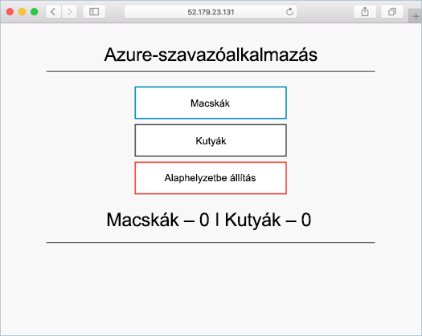

# <a name="prepare-application-for-azure-container-service-aks"></a>Felkészülés az alkalmazás Azure tároló szolgáltatás (AKS)

Ebben az oktatóanyagban első nyolc, a tárolót több alkalmazás Kubernetes használatra kész. Befejeződött a lépések az alábbiak:  

> [!div class="checklist"]
> * Alkalmazás forrásának klónozása a GitHubról  
> * Az alkalmazás forrás tároló lemezkép létrehozása
> * Az alkalmazás tesztelése a helyi Docker-környezetben

Ezt követően a helyi fejlesztési környezetben a következő alkalmazás érhető el.



A következő útmutatókból a tároló lemezkép van egy Azure-tároló beállításjegyzék feltöltött, és futtassa AKS fürtben.

## <a name="before-you-begin"></a>Előkészületek

Az oktatóanyag feltételezi, hogy rendelkezik a Docker fő fogalmaira, például a tárolókra, tárolórendszerképekre és az alapszintű Docker-parancsokra vonatkozó alapvető ismeretekkel. Amennyiben szükséges, tekintse meg a tárolók alapfogalmainak ismertetését a [Bevezetés a Docker használatába]( https://docs.docker.com/get-started/) című cikkben. 

Az oktatóanyag elvégzéséhez szüksége lesz egy Docker-fejlesztési környezetre. A Docker csomagokat biztosít, amelyekkel a Docker egyszerűen konfigurálható bármely [Mac](https://docs.docker.com/docker-for-mac/), [Windows](https://docs.docker.com/docker-for-windows/) vagy [Linux](https://docs.docker.com/engine/installation/#supported-platforms) rendszeren.

Azure Cloud rendszerhéj nem tartalmazza a Docker-összetevők minden egyes lépéseinek befejezéséhez szükséges az oktatóanyag. Ezért ajánlott egy teljes Docker fejlesztési környezet használatával.

## <a name="get-application-code"></a>Az alkalmazáskód letöltése

Ebben az oktatóanyagban használt mintaalkalmazás egy alapszintű szavazó alkalmazást. Az alkalmazás egy előtér-webkiszolgáló és egy háttér-Redis-példányt tartalmaz. A webalkalmazás-összetevő egy egyéni tároló lemezképpel lesz csomagolva. A Redis-példány egy Docker Hub változatlan lemezképét használja.  

A git segítségével töltse le az alkalmazást a fejlesztési környezetet.

```console
git clone https://github.com/Azure-Samples/azure-voting-app-redis.git
```

Módosítsa a könyvtárat, hogy a klónozott könyvtárból dolgozik.

```console
cd azure-voting-app-redis
```

A könyvtárán belül van az alkalmazás forráskódjához, egy előre létrehozott Docker compose fájlt, és Kubernetes jegyzékfájlt. Ezeket a fájlokat az oktatóanyag set egyaránt használatban. 

## <a name="create-container-images"></a>Tároló képek létrehozása

[Docker Compose](https://docs.docker.com/compose/) segítségével automatizálhatja a build tároló lemezképeket és az alkalmazások több tároló telepítését.

Futtassa a `docker-compose.yml` fájl tároló lemezkép létrehozásához, letölti a Redis-lemezképet, és indítsa el az alkalmazást.

```console
docker-compose up -d
```

Amikor elkészült, használja a [docker képek](https://docs.docker.com/engine/reference/commandline/images/) parancsot a létrehozott lemezképek.

```console
docker images
```

Figyelje meg, hogy három képek letöltése vagy létrehozni. A `azure-vote-front` lemezképet tartalmazza az alkalmazás, és használja a `nginx-flask` kép alapjaként. A `redis` lemezkép használatával indítsa el a Redis-példányt.

```
REPOSITORY                   TAG        IMAGE ID            CREATED             SIZE
azure-vote-front             latest     9cc914e25834        40 seconds ago      694MB
redis                        latest     a1b99da73d05        7 days ago          106MB
tiangolo/uwsgi-nginx-flask   flask      788ca94b2313        9 months ago        694MB
```

Futtassa a [docker ps](https://docs.docker.com/engine/reference/commandline/ps/) parancsot a futó tárolók megtekintéséhez.

```console
docker ps
```

Kimenet:

```
CONTAINER ID        IMAGE             COMMAND                  CREATED             STATUS              PORTS                           NAMES
82411933e8f9        azure-vote-front  "/usr/bin/supervisord"   57 seconds ago      Up 30 seconds       443/tcp, 0.0.0.0:8080->80/tcp   azure-vote-front
b68fed4b66b6        redis             "docker-entrypoint..."   57 seconds ago      Up 30 seconds       0.0.0.0:6379->6379/tcp          azure-vote-back
```

## <a name="test-application-locally"></a>Alkalmazás helyi teszteléséhez

Tallózással keresse meg az futó alkalmazást 8080.


## <a name="clean-up-resources"></a>Az erőforrások eltávolítása

Most, hogy az alkalmazás működésének ellenőrzése megtörtént, a futó tárolók leállítása és eltávolítása. Ne törölje a tároló képek. A `azure-vote-front` képet tölt fel az Azure-tároló beállításjegyzék példánya a következő oktatóanyag.

Futtassa a következő leállítja a futó tárolók.

```console
docker-compose stop
```

Törölje a leállított tárolók és erőforrások a következő paranccsal.

```console
docker-compose down
```

A művelet befejezését, a tároló lemezkép az Azure szavazattal alkalmazást tartalmazó van.

## <a name="next-steps"></a>Következő lépések

Ebben az oktatóanyagban egy alkalmazás teszteltük, és az alkalmazáshoz létrehozott tároló képek. A következő lépéseket hajtotta végre:

> [!div class="checklist"]
> * Az alkalmazás forrásának klónozása a GitHubról  
> * A tároló lemezkép létrehozott alkalmazás adatforrás
> * Az alkalmazás tesztelése a helyi Docker-környezetben

Folytassa a következő oktatóanyaggal, amelyben a tárolórendszerképek az Azure Container Registry-ben való tárolásának módját ismerheti meg.

> [!div class="nextstepaction"]
> [Rendszerképek leküldése az Azure Container Registry-be](./tutorial-kubernetes-prepare-acr.md)
