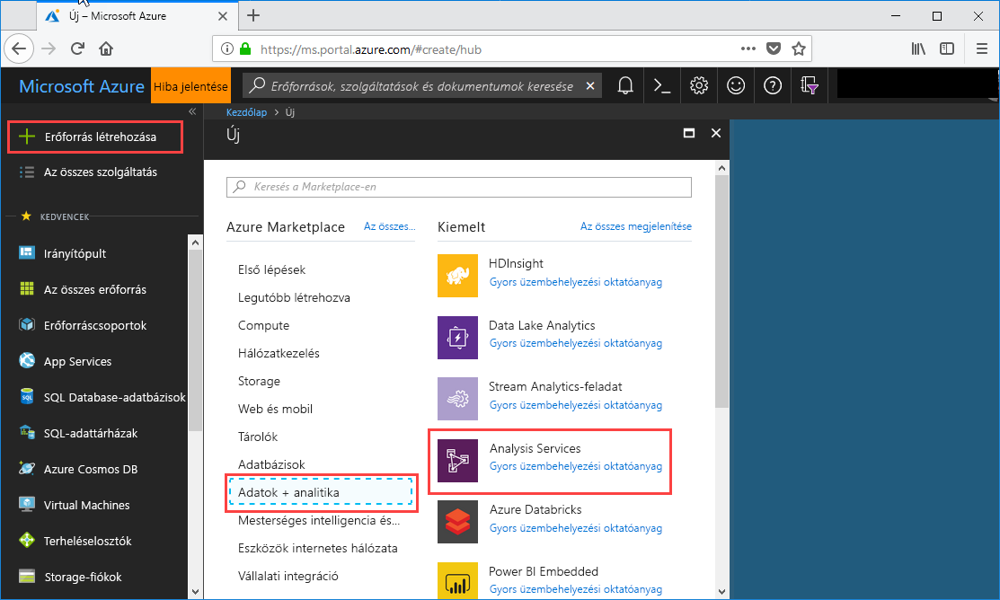
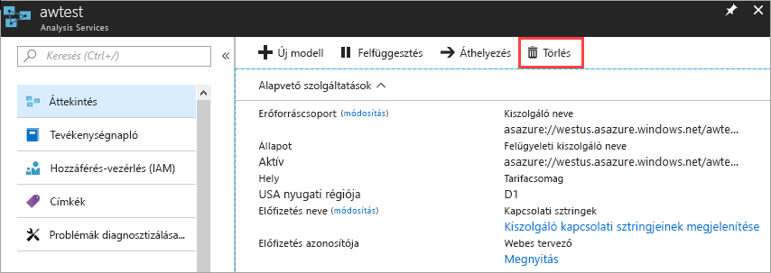

# Egy Analysis Services-kiszolgáló létrehozása az Azure-portálon
Ez a cikk végigvezeti egy Analysis Services-kiszolgáló erőforrás létrehozása az Azure-előfizetéshez.

Mielőtt elkezdené, lesz szüksége: 

* **Azure-előfizetés**: A fiók létrehozásával kapcsolatban lásd: [Ingyenes Azure-próbaverzió](https://azure.microsoft.com/offers/ms-azr-0044p/).
* **Az Azure Active Directory**: az előfizetéshez kell tartoznia az Azure Active Directory-bérlő. És meg kell jelentkeznie az Azure-bA egy olyan fiókkal, az adott Azure Active Directoryban. További információ: [Hitelesítés és felhasználói engedélyek](analysis-services-manage-users.md).

## Bejelentkezés az Azure Portalra 

Jelentkezzen be az [Azure Portalra](https://portal.azure.com)

## A kiszolgáló létrehozása

1. Kattintson a **+ hozzon létre egy erőforrást** > **adatok + analitika** > **Analysis Services**.

    

2. A **Analysis Services**, töltse ki a kötelező mezőket, és nyomja le az **létrehozása**.
   
    
   
   * **Kiszolgálónév**: Adjon meg egy egyedi nevet mutató hivatkozás a kiszolgálón.
   * **Előfizetés**: válassza ki az ehhez a kiszolgálóhoz társított előfizetést.
   * **Erőforráscsoport**: hozzon létre egy új erőforráscsoportot, vagy válasszon ki egy már rendelkezik. Erőforráscsoportok vannak célja, hogy az Azure-erőforrások gyűjteményeinek kezelését. További tudnivalókért lásd: [erőforráscsoportok](../azure-resource-manager/resource-group-overview.md).
   * **Hely**: az Azure-adatközpont hely üzemelteti a kiszolgálót. Válasszon a legnagyobb felhasználói bázis legközelebbi helyet.
   * **IP-címek**: tarifacsomag kiválasztása. Ha éppen tesztel, és a modell mintaadatbázis telepíteni szeretné, jelölje be a szabad **D1** réteg. További tudnivalókért lásd: [Azure Analysis Services díjszabása](https://azure.microsoft.com/pricing/details/analysis-services/). 
    * **Rendszergazda**: alapértelmezés szerint ez lesz a fiók, akkor van bejelentkezve. Az Azure Active Directory közül választhat egy másik fiókot.
    * **Biztonsági mentés tárolási beállítását**: nem kötelező. Ha már rendelkezik egy [tárfiók](../storage/common/storage-introduction.md), modell-adatbázis biztonsági másolatának alapértelmezett adhat meg. Azt is megadhatja, [biztonsági mentése és visszaállítása](analysis-services-backup.md) beállításait később.
    * **Tárolási kulcslejárat**: nem kötelező. A storage-kulcs lejárati időt megadni.
3. Kattintson a **Create** (Létrehozás) gombra.

Hozzon létre egy perc alatt általában időt vesz igénybe. Ha a kiválasztott **portálon**, keresse meg a portálhoz, és az új kiszolgáló. Vagy keresse meg **minden szolgáltatás** > **Analysis Services** megjelenítéséhez, ha a kiszolgáló készen áll-e.

## Az erőforrások eltávolítása
Ha már nincs szükség, a kiszolgáló törlése. A Server **áttekintése**, kattintson a **törlése**. 

 

## További lépések

[Egy minta adatmodell hozzáadása](analysis-services-create-sample-model.md) -kiszolgálóhoz.  
[Telepítsen egy helyszíni adatok átjárót](analysis-services-gateway-install.md) Ha saját adatmodelljének csatlakozik a helyi adatforrások.  
[A táblázatos modell projekt telepítése](analysis-services-deploy.md) a Visual Studio eszközből.   

