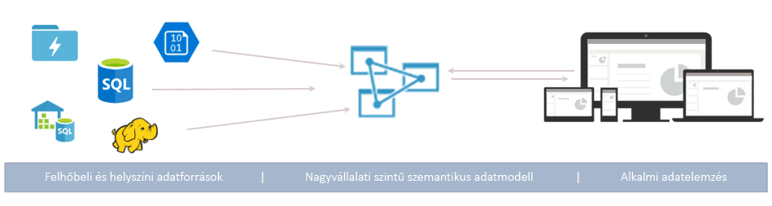
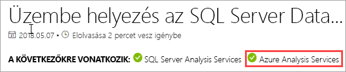
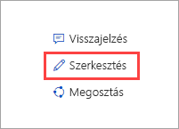

# Mi az Azure Analysis Services?

Az Azure Analysis Services egy teljes körűen felügyelt platformszolgáltatás (PaaS), amely vállalati szintű adatmodellezésre biztosít lehetőséget a felhőben. E szolgáltatás adategyesítési és modellezési funkcióival több forrásból egyesítheti az adatokat, mérőszámokat határozhat meg, és egyetlen, megbízható, táblázatos szemantikai adatmodellben biztosíthatja az adatok védelmét. Az adatmodell egyszerűbb és gyorsabb módot biztosít a felhasználók számára, hogy nagy mennyiségű adatok között böngésszenek alkalmi adatelemzés céljából.

**Videó:** Tekintse meg [Azure Analysis Services áttekintése](https://sec.ch9.ms/ch9/d6dd/a1cda46b-ef03-4cea-8f11-68da23c5d6dd/AzureASoverview_high.mp4) ismerje meg, hogy az Azure Analysis Services hogyan illeszkedik a Microsoft által az általános BI-képességei.

## Gyors beállítás és használat

Percek alatt [létrehozhat egy kiszolgálót](analysis-services-create-server.md) az Azure Portalon. Az Azure Resource Manager-[sablonok](../azure-resource-manager/resource-manager-create-first-template.md) és a PowerShell használatával pedig deklaratív sablonokkal hozhat létre kiszolgálókat. Egyetlen sablonnal kiszolgálói erőforrásokat is üzembe helyezhet, egyéb Azure-összetevőkkel (például tárfiókokkal és az Azure Functions szolgáltatással) együtt. 

**Videó:** Tekintse meg [üzembe helyezésének automatizálása a](https://channel9.msdn.com/series/Azure-Analysis-Services/AzureAnalysisServicesAutomation) tudhat meg többet hogyan használhatja az Azure Automation sebesség kiszolgáló létrehozása.

Az Azure Analysis Services számos Azure-szolgáltatással integrálható, így kifinomult elemzési megoldásokat hozhat létre. Az [Azure Active Directoryval](../active-directory/fundamentals/active-directory-whatis.md) való integráció biztonságos, szerepköralapú hozzáférést biztosít a kritikus fontosságú adatokhoz. [Azure Data Factory-folyamatokba](../data-factory/introduction.md) integrálható egy olyan tevékenység bevonásával, amely adatokat tölt be a modellbe. Az [Azure Automation](../automation/automation-intro.md) és az [Azure Functions](../azure-functions/functions-overview.md) egyéni kódot használó modellek egyszerűbb vezénylésére használható. 

## A megfelelő szint – igény szerint

Az Azure Analysis Services **fejlesztői**, **alap-** és **standard** szinten is elérhető. Az egyes szinteken belül a csomagköltségek a feldolgozási teljesítmény, a QPU-k és a memória mérete alapján változnak. Amikor létrehoz egy kiszolgálót, egy adott szinten belül választ ki egy csomagot. A csomagokat a szinten belül magasabb vagy alacsonyabb szintre módosíthatja, vagy frissíthet magasabb szintre, de magasabb szintről nem léphet vissza egy alacsonyabbra.

### Fejlesztői szint

Ezt a szintet kiértékeléshez, valamint fejlesztési és tesztelési forgatókönyvekhez ajánljuk. Egyetlen csomagban tartalmazza a standard szintű csomagéval megegyező funkciókat, de korlátozott feldolgozási teljesítménnyel, QPU-val és memóriamérettel rendelkezik. Kibővített lekérdezésreplika ehhez a szinthez *nem érhető el*. Ehhez a szinthez nem tartozik SLA.

|Felkészülés  |QPU-k  |Memória (GB)  |
|---------|---------|---------|
|D1    |    20     |    3     |

### Alapszintű csomag

Ezt a szintet olyan éles környezetben való használatra ajánlunk, amelyben kis méretű táblázatos modellek, korlátozott mennyiségű párhuzamos felhasználó és egyszerűbb adatfrissítési követelmények szerepelnek. Kibővített lekérdezésreplika ehhez a szinthez *nem érhető el*. A perspektívák, a több partíció használata és a DirectQuery táblázatosmodell-funkciók *nem támogatottak* ezen a szinten.  

|Felkészülés  |QPU-k  |Memória (GB)  |
|---------|---------|---------|
|B1    |    40     |    10     |
|B2    |    80     |    20     |

### Standard csomag

Ez a szint olyan létfontosságú, éles környezetben használt alkalmazásokhoz ideális, amelyek rugalmasságot követelnek meg a párhuzamos felhasználói tevékenységekre vonatkozóan, és amelyek gyorsan növekvő adatmodelleket használnak. Támogatja a speciális adatfrissítést az adatmodellek közel valós idejű frissítése érdekében, valamint az összes táblázatos modellezési funkciót is.

|Felkészülés  |QPU-k  |Memória (GB)  |
|---------|---------|---------|
|S1    |    40     |    10     |
|S2    |    100     |    25     |
|S3    |    200     |    50     |
|S4    |    400     |    100     |
|S8*    |    320     |    200     |
|S9*    |    640    |    400     |

\* Nem érhető el az összes régióban.  

## Rendelkezésre állás régiónként

Az Azure Analysis Services a világ összes régiójában támogatott. A támogatott csomagok és lekérdezésreplikák a választott régiótól függően változnak. A csomagok és lekérdezésreplikák elérhetősége az egyes régiókban jellemző igények és az elérhető erőforrások függvényében változhat. 

### Amerika

|Régió  | Támogatott csomagok | Lekérdezésreplikák (csak standard csomagok esetén) |
|---------|---------|:---------:|
|Dél-Brazília     |    B1, B2, S0, S1, S2, S4, D1     |     1    |
|Közép-Kanada    |     B1, B2, S0, S1, S2, S4, D1    |     1    |
|USA keleti régiója     |     B1, B2, S0, S1, S2, S4, D1    |    1     |
|USA 2. keleti régiója     |     B1, B2, S0, S1, S2, S4, D1   |    7    |
|USA 2. keleti régiója     |     S8, S9   |    1    |
|USA északi középső régiója     |     B1, B2, S0, S1, S2, S4, D1     |    1     |
|USA középső régiója     |    B1, B2, S0, S1, S2, S4, D1     |    1     |
|USA déli középső régiója     |    B1, B2, S0, S1, S2, S4, D1     |    1     |
|USA nyugati középső régiója   |     B1, B2, S0, S1, S2, S4, D1    |    3     |
|USA nyugati régiója     |    B1, B2, S0, S1, S2, S4, D1    |    7   |
|USA nyugati régiója     |    S8, S9   |    2  |
|USA 2. nyugati régiója    |    B1, B2, S0, S1, S2, S4, D1    |    3   |
|USA 2. nyugati régiója    |    S8, S9  |    1     |

### Európa

|Régió  | Támogatott csomagok | Lekérdezésreplikák (csak standard csomagok esetén) |
|---------|---------|:---------:|
|Észak-Európa     |    B1, B2, S0, S1, S2, S4, D1      |    7     |
|Az Egyesült Királyság déli régiója     |    B1, B2, S0, S1, S2, S4, D1      |     1    |
|Nyugat-Európa     |    B1, B2, S0, S1, S2, S4, D1   |    7    |
|Nyugat-Európa    |   S8, S9  |  1  |

### Ázsia és a Csendes-óceáni térség 

|Régió  | Támogatott csomagok | Lekérdezésreplikák (csak standard csomagok esetén) |
|---------|---------|:---------:|
|Kelet-Ausztrália     |    B1, B2, S0, S1, S2, S4     |    3     |
|Kelet-Ausztrália     |    S8, S9    |    1     |
|Délkelet-Ausztrália     | B1, B2, S0, S1, S2, S4, D1       |    1     |
|Kelet-Japán     |   B1, B2, S0, S1, S2, S4, D1       |    1     |
|Délkelet-Ázsia     |     B1, B2, S0, S1, S2, S4, S8, S9, D1     |   1      |
|Nyugat-India     |    B1, B2, S0, S1, S2, S4, D1     |    1     |

## Igényei szerint méretezhető

### Vertikális fel- vagy leskálázás, felfüggesztés és folytatás

Fel- vagy leskálázhatja, illetve szüneteltetheti a kiszolgálóját. Ehhez használhatja az Azure Portalt, illetve a PowerShellt, amely azonnali és teljes körű vezérlést biztosít. A fizetés használat alapján történik.  

### Erőforrások kibővítése a lekérdezési válaszadás felgyorsítása érdekében

Kibővített erőforrások esetében az ügyféllekérdezések több *lekérdezésreplikára* vannak kiosztva az adott lekérdezési készletben. A lekérdezésreplikák a táblázatos modellek szinkronizált másolataival rendelkeznek. A lekérdezésekből származó számítási feladatok felosztásával csökkenthető a válaszidő az erőforrás-igényesebb feladatok esetén. A modellfeldolgozási műveletek elkülöníthetők a lekérdezési készletből, ezáltal biztosítható, hogy a feldolgozási műveletek ne legyenek negatív hatással az ügyféllekérdezésekre. 

A létrehozott lekérdezési készlet legfeljebb hét további lekérdezésreplikát tartalmazhat (a kiszolgálóval együtt összesen nyolcat). A lekérdezési készletben elhelyezhető lekérdezésreplikák száma a kiválasztott csomagtól és régiótól függ. A lekérdezésreplikák nem helyezhetők el a kiszolgáló régióján kívül. A lekérdezésreplikák díjszabása megegyezik a kiszolgálóéval.

A szint módosításához hasonlóan a lekérdezésreplikák is igény szerint bővíthetők. A bővítést a portálon vagy REST API-k használatával konfigurálhatja. További tudnivalókért lásd az [Azure Analysis Services kibővítését](analysis-services-scale-out.md) ismertető témakört.

## Díjszabás

A teljes költség számos tényezőtől (például a választott régiótól, szinttől, lekérdezésreplikáktól és a szüneteltetés/folytatás állapotától) függ. Az adott régióra jellemző díjszabást az [Azure Analysis Services díjszabását](https://azure.microsoft.com/pricing/details/analysis-services/) ismertető részben szereplő díjkalkulátorral határozhatja meg. Az eszköz egyetlen kiszolgálóra és régióra számolja ki a díjszabást. Vegye figyelembe, hogy a lekérdezésreplikák díjszabása megegyezik a kiszolgálóéval. 

## Az SQL Server Analysis Servicesre épül

Az Azure Analysis Services kompatibilis az SQL Server Analysis Services Enterprise Editionben már meglévő számos nagyszerű funkcióval. Az Azure Analysis Services támogatja a táblázatos modelleket az 1200-as és az ennél magasabb [kompatibilitási szinteken](analysis-services-compat-level.md). A táblázatos modellek olyan relációs modellezési szerkezetek (modell, táblák, oszlopok), amelyek táblázatos metaadatok objektumdefinícióiban vannak meghatározva a táblázatos modell parancsnyelvén (TMSL) és a táblázatos objektummodell (TOM) kódjában. Támogatja a partíciókat, a perspektívákat, a sorszintű biztonságot, a kétirányú kapcsolatokat és a fordításokat.* A többdimenziós modellek és a SharePoint rendszerhez készült PowerPivot használatát az Azure Analysis Services *nem támogatja*.

A táblázatos modelleket a memóriában tárolt és a DirectQuery módok egyaránt támogatják. A memóriában tárolt mód (alapértelmezett) táblázatos modelljei több adatforrás használatát is támogatják. Nagy mennyiségű adatok esetében ez a mód biztosítja a leggyorsabb lekérdezési választ, mivel a modell adatai nagymértékben tömörítettek, és a memóriában vannak gyorsítótárazva. Összetett adatkészletek és lekérdezések esetében szintén ez a mód biztosítja a legnagyobb rugalmasságot. A particionálás révén elérhetővé válik a növekményes betöltés, növelhető a párhuzamos folyamatkezelés mértéke, és csökkenthető a memóriahasználat. Ezen kívül olyan speciális adatmodellezési funkciók is támogatottak, mint például a számított táblázatok és az összes DAX-függvény. Az adatforrásokból származó, gyorsítótárazott adatok frissítéséhez a memóriában tárolt modelleket frissíteni kell (fel kell dolgozni). Az Azure szolgáltatásnév-támogatásának köszönhetően a PowerShell, TOM, TMSL és REST használatával működő, felügyelet nélküli frissítési műveletek rugalmasan alkalmazhatók a modelladatok naprakészen tartásához. 

A tároláshoz és a lekérdezések futtatásához a DirectQuery mód* a háttérbeli relációs adatbázist használja. Az egyedi SQL Server-, SQL Server Data Warehouse-, Azure SQL Database-, Azure SQL Data Warehouse-, Oracle- és Teradata-adatforrások rendkívül nagy méretű adatkészletei is támogatottak. A háttérbeli adatkészletek mérete meghaladhatja a rendelkezésre álló kiszolgálói erőforrás memóriájának méretét. Nincs szükség az összetett adatmodellek frissítésére. Érvényesek még további korlátozások (például adatforrás-típusokra és DAX-képletekre vonatkozó korlátozások), illetve bizonyos speciális adatmodellezési funkciók nem támogatottak. Az Ön számára legmegfelelőbb mód kiválasztása előtt tekintse át a [DirectQuery mód](https://docs.microsoft.com/sql/analysis-services/tabular-models/directquery-mode-ssas-tabular) szakaszban leírtakat.

\* A rendelkezésre álló funkciók köre a választott szinttől függ.

## Támogatott adatforrások

Az Azure Analysis Services táblázatos modelljei számos különféle adatforrást támogatnak, az egyszerű szöveges fájloktól kezdve az Azure Data Lake Store big data típusú adataiig. További információ: [Támogatott adatforrások az Azure Analysis Servicesben](analysis-services-datasource.md).

## Az adatok biztonságban vannak

Az Azure Analysis Services többszintű biztonságot nyújt bizalmas adatai számára. A kiszolgáló szintjén: Tűzfal, az Azure hitelesítési, a kiszolgáló-rendszergazdai szerepkörök és a kiszolgálóoldali titkosítás. Az adatmodell szintjén felhasználói szerepkörök, valamint a sor- és objektumszintű biztonság garantálja az adatok védelmét, továbbá biztosítja, hogy azokhoz csak a jogosult felhasználók férhessenek hozzá.

### Tűzfal

Az Azure Analysis Services tűzfala minden olyan ügyfélkapcsolatot blokkol, amelyek IP-címe nincs megadva a szabályokban. Az engedélyezett IP-címeket meghatározó szabályok egyesével, ügyfél IP-címenként vagy tartományonként is konfigurálhatók. A Power BI- (szolgáltatási) kapcsolatok szintén engedélyezhetők vagy blokkolhatók. A tűzfalat és a szabályokat a portálon vagy a PowerShell használatával konfigurálhatja. További információ: [Kiszolgálószintű tűzfal konfigurálása](analysis-services-qs-firewall.md).

### Hitelesítés

A felhasználóhitelesítést az [Azure Active Directory (AAD)](../active-directory/fundamentals/active-directory-whatis.md) kezeli. A bejelentkezéshez a felhasználók céges fiókidentitást használnak, amely szerepköralapú hozzáféréssel rendelkezik az adatbázishoz. A felhasználói identitásoknak a kiszolgálót tartalmazó előfizetés alapértelmezett Azure Active Directoryja tagjainak kell lenniük. További információ: [Hitelesítés és felhasználói engedélyek](analysis-services-manage-users.md).

### Adatbiztonság

Az Azure Analysis Services az Azure Blob Storage segítségével őrzi meg az Analysis Services-adatbázisok tárterületét és metaadatait. A Blobon belüli adatfájlok az [Azure Blob kiszolgálóoldali titkosításával (SSE)](../storage/common/storage-service-encryption.md) vannak titkosítva. Közvetlen lekérdezési mód használatakor a rendszer csak a metaadatokat tárolja. A tényleges adatok az adatforrásból érhetőek el a lekérdezés során egy titkosított protokollon keresztül.

A [helyszíni adatátjáró](analysis-services-gateway.md) telepítésével és konfigurálásával biztosíthatja a helyszíni céges adatforrásokhoz való biztonságos hozzáférést. Az átjárók hozzáférést biztosítanak az adatokhoz DirectQuery és memóriában tárolt módban is.

### Szerepkörök

Az Analysis Services [szerepköralapú hitelesítés](https://docs.microsoft.com/sql/analysis-services/tabular-models/roles-ssas-tabular) használatával biztosítja a kiszolgálóhoz, valamint a modelladatbázis műveleteihez, objektumaihoz és adataihoz való hozzáférést. A felhasználók a hozzájuk rendelt szerepkörön belüli Azure AD-felhasználói fiókjaikkal férnek hozzá az adott kiszolgálóhoz vagy adatbázishoz A kiszolgálói rendszergazdai szerepkör a kiszolgálói erőforrás szintjén van meghatározva. Alapértelmezés szerint a kiszolgáló létrehozásakor használt fiók automatikusan bekerül a Kiszolgálói rendszergazdák szerepkörbe. További felhasználói vagy csoportfiókok a portál, SSMS vagy PowerShell használatával vehetők fel.
  
Az adatlekérdezéseket végző nem rendszergazda végfelhasználók hozzáférését a rendszer adatbázis-szerepkörökön keresztül biztosítja. A rendszer az adatbázis-szerepkört külön objektumként hozza létre az adatbázisban, és csak arra az adatbázisra vonatkozik, amelyben az adott szerepkör létre lett hozva. Az adatbázis-szerepkörök (adatbázis-) Rendszergazda, Olvasás, valamint Olvasás és feldolgozás engedélyekkel vannak definiálva. Felhasználói vagy csoportfiókok SSMS vagy PowerShell használatával vehetők fel.

### Sorszintű biztonság

A táblázatos modellek minden kompatibilitási szinten támogatják a sorszintű biztonságot. A sorszintű biztonság modellbeli konfigurálása olyan DAX-kifejezések használatával történik, amelyek egy adott tábla sorait és egy, a felhasználók által lekérdezhető kapcsolódó tábla tetszőleges irányban lévő sorait határozzák meg. A DAX-kifejezéseket használó sorszűrők Olvasás és Olvasás és feldolgozás engedélyekkel vannak definiálva. 

### Objektumszintű biztonság 

A táblázatos modellek az 1400-as kompatibilitási szinten támogatják az objektumszintű biztonságot, amely magában foglalja a táblázat- és az oszlopszintű biztonságot is. Az objektumszintű biztonság beállítása a Model.bim fájl JSON-alapú metaadataiban történik, TMSL vagy TOM használatával. További információ: [Objektumszintű biztonság](https://docs.microsoft.com/sql/analysis-services/tabular-models/object-level-security).

### Automatizálás szolgáltatásnév használatával

A szolgáltatásnevek olyan Azure Active Directory-alkalmazáserőforrások, amelyeket felügyelet nélküli erőforrás- vagy szolgáltatásszintű műveletek végrehajtásához hozhat létre a bérlőn belül. A szolgáltatásnevek az Azure Automationben, a PowerShell felügyelet nélküli módjában, egyéni ügyfélalkalmazásokban és webalkalmazásokban használhatók gyakori feladatok (például adatfrissítés, vertikális fel- vagy leskálázás, szüneteltetés/folytatás) automatizálására. Az engedélyek szerepkörtagságon keresztül rendelhetők hozzá a szolgáltatásnevekhez További információ: [Automatizálás szolgáltatásnevekkel](analysis-services-service-principal.md).

### Azure Governance

Az Azure Analysis Servicesre a [Microsoft Online Services feltételei](https://www.microsoftvolumelicensing.com/DocumentSearch.aspx?Mode=3&DocumentTypeId=31) és a [Microsoft adatvédelmi nyilatkozata](https://privacy.microsoft.com/privacystatement) vonatkozik.
További információk az Azure Securityről: [Microsoft biztonsági és adatkezelési központ](https://www.microsoft.com/trustcenter).

## A már ismerős eszközöket használhatja

### Visual Studio

Az ingyenes [Visual Studióhoz készült SQL Server Data Tools (SSDT)](https://msdn.microsoft.com/library/mt204009.aspx) használatával modelleket fejleszthet és helyezhet üzembe. Az SSDT Analysis Services-projektsablonokat is tartalmaz a gyors üzembe állítás érdekében. Az SSDT már tartalmazza a Tabular 1400-modellekkel használható modern Adatok lekérése adatforrás-lekérdezési és adategyesítési funkciót is. Ha már ismeri a Power BI Desktop és az Excel 2016 Adatok lekérése funkcióját, akkor tudja, milyen egyszerűen hozhat létre nagymértékben testre szabott adatforrás-lekérdezéseket. 

A Visual Studio 2017 használata esetén a Microsoft Analysis Services-projektek ingyenesen telepíthető VSIX-csomagként elérhetők. [Letöltés a Marketplace-ről](https://marketplace.visualstudio.com/items?itemName=ProBITools.MicrosoftAnalysisServicesModelingProjects).

### Sql Server Management Studio

Felügyelheti kiszolgálóit és modelladatbázisait az [SQL Server Management Studio (SSMS)](https://docs.microsoft.com/sql/ssms/download-sql-server-management-studio-ssms) segítségével. Kapcsolódhat a felhőalapú kiszolgálóihoz. Közvetlenül az XMLA lekérdezési ablakból futtathat TMSL-szkripteket. A feladatokat e szkriptekkel és a PowerShell használatával automatizálhatja. Gyakran jelennek meg új szolgáltatások és funkciók – az SSMS havonta frissül.

### PowerShell

Az olyan kiszolgálóerőforrás-kezelési feladatok, mint például a kiszolgálói erőforrások létrehozása, a kiszolgálói műveletek felfüggesztése vagy folytatása, illetve a szolgáltatásszint módosítása Azure Resource Manager- (AzureRM-) parancsmagokkal történik. Az olyan egyéb adatbázis-kezelési feladatok, mint például a szerepkörtagok hozzáadása vagy eltávolítása, illetve a TMSL-szkriptek feldolgozása vagy futtatása az SqlServer modul parancsmagjait használják. További információ: [Az Azure Analysis Services kezelése a PowerShell-lel](analysis-services-powershell.md).

### Objektummodell és parancsprogramok használata

A táblázatos modellek gyors fejlesztést biztosítanak, és nagymértékben testre szabhatók. A táblázatos modellek közül a [táblázatos objektummodell](https://docs.microsoft.com/sql/analysis-services/tabular-model-programming-compatibility-level-1200/introduction-to-the-tabular-object-model-tom-in-analysis-services-amo) (TOM) is használható a modellobjektumok leírásához. A TOM a JSON-ban van közzétéve a [Táblázatos modell parancsnyelv (TMSL)](https://docs.microsoft.com/sql/analysis-services/tabular-model-scripting-language-tmsl-reference) és az AMO adatdefiníciós nyelv segítségével a [Microsoft.AnalysisServices.Tabular](https://msdn.microsoft.com/library/microsoft.analysisservices.tabular.aspx) névtérben. 

## Támogatja a legújabb ügyféleszközöket

Az olyan modern adatáttekintési és vizualizációs eszközök, mint például a Power BI, az Excel, a Reporting Services, illetve a harmadik felektől származó eszközök egyaránt támogatottak, így interaktív és vizuálisan gazdag modelladat-elemzéseket biztosítanak a felhasználóknak. 

## Monitorozás és diagnosztika

Az Azure Analysis Services integrálva van az Azure-metrikákkal, így számos erőforrás-specifikus metrikát biztosít a kiszolgálók teljesítményének és állapotának monitorozásához. További tudnivalókért lásd: [A kiszolgáló metrikáinak monitorozása](analysis-services-monitor.md). Végezze el a metrikák rögzítését az [Azure erőforrás-diagnosztikai naplóinak](../azure-monitor/platform/diagnostic-logs-overview.md) használatával. Monitorozhatja és elküldheti a naplókat az [Azure Storage](https://azure.microsoft.com/services/storage/)-be, streamelheti őket az [Azure Event Hubsra](https://azure.microsoft.com/services/event-hubs/), valamint exportálhatja őket a [Log Analytics](https://azure.microsoft.com/services/log-analytics/) nevű [Azure](https://www.microsoft.com/cloud-platform/operations-management-suite)-szolgáltatásba. További információ: [Diagnosztikai naplózás beállítása](analysis-services-logging.md).

Az Azure Analysis Services támogatja a [dinamikus felügyeleti nézetek (DMV-k)](https://docs.microsoft.com/sql/analysis-services/instances/use-dynamic-management-views-dmvs-to-monitor-analysis-services) használatát is. A DMV-k az SQL-szintaxis alapján kapcsolódnak azokhoz a sémasorkészletekhez, amelyek a kiszolgálópéldány metaadatait és monitorozási információit adják vissza.

## Dokumentáció

Itt található az Azure Analysis Services dokumentációja. A cikkeket a böngésző képernyőjének bal oldalán látható tartalomjegyzékben keresheti meg. 

Mivel az Azure Analysis Services táblázatos modelljei nagyban hasonlítanak az SQL Server Analysis Services hasonló modelljeihez, az [SQL Server Analysis Services dokumentációjában](https://docs.microsoft.com/sql/analysis-services/analysis-services) megtalálható egy, a közös használatú fogalmakat, eljárásokat, valamint fejlesztői és referenciaanyagokat tartalmazó könyvtár. Az SQL Server Analysis Services dokumentációjában szereplő cikkek esetében a cím alatt megjelenő APPLIES TO szalagcím mutatja, hogy az adott anyag az Azure Analysis Servicesre is érvényes-e.

### Számítunk közreműködésére!

Az Analysis Services dokumentációja, ahogy ez a cikk is, nyílt hozzáférésű. Ha rendelkezik GitHub-fiókkal, a cikk szerkesztéséhez kattintson a böngésző képernyőjének jobb felső sarkában látható Szerkesztés (ceruza) ikonra. Nyissa meg a böngésző szerkesztőjét, majd kattintson a Javaslat a fájl módosítására lehetőségre. 

Hozzájárulását a dokumentációs csapat fogja kiértékelni, és ha jóváhagyják azt, akkor GitHub-fiókjának nevét közreműködőként fogjuk feltüntetni. További információ: [Közreműködői útmutató](https://docs.microsoft.com/contribute/).

Az Analysis Services dokumentációja is használja a [GitHub-problémák](https://docs.microsoft.com/teamblog/a-new-feedback-system-is-coming-to-docs) fogalmát. Visszajelzés adhat a termékről vagy a dokumentációról. Ehhez használja a cikk alján látható **Visszajelzés** gombot. Az SQL Server Analysis Services dokumentációjában a GitHub-problémák még nincsenek engedélyezve. 

## Blogok

A dolgok gyorsan változnak. Az [Analysis Services csapatblogon](https://blogs.msdn.microsoft.com/analysisservices/) és az [Azure blogon](https://azure.microsoft.com/blog/) megtekintheti a legfrissebb információkat.

## Közösség

Az Analysis Services felhasználói pezsgő közösséget alkotnak. Csatlakozzon a párbeszédhez az [Azure Analysis Services fórumon](https://aka.ms/azureanalysisservicesforum).

## További lépések

> [!div class="nextstepaction"]
> [Az Azure ingyenes próbaverziójának kipróbálása](https://azure.microsoft.com/offers/ms-azr-0044p/)   

> [!div class="nextstepaction"]
> [Gyors útmutató: Kiszolgáló létrehozása – portál](analysis-services-create-server.md)   

> [!div class="nextstepaction"]
> [Gyors útmutató: Kiszolgáló létrehozása – PowerShell](analysis-services-create-powershell.md)  
