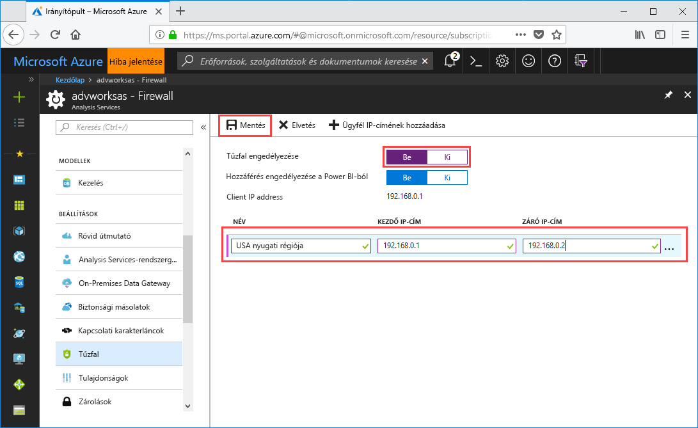

# Rövid útmutató: Kiszolgálótűzfal konfigurálása – Portál

Ez a rövid útmutató segítséget nyújt az Azure Analysis Services-kiszolgáló tűzfalának konfigurálásában. A kiszolgáló és az adatok védelmének fontos része egy tűzfal engedélyezése és IP-címtartományok konfigurálása csak a kiszolgálóhoz hozzáférő számítógépek számára.

## Előfeltételek

- Analysis Services-kiszolgáló az előfizetésben. További tudnivalókért lásd: [Rövid útmutató: Kiszolgáló létrehozása – Portál](analysis-services-create-server.md) vagy [Rövid útmutató: Kiszolgáló létrehozása – PowerShell](analysis-services-create-powershell.md)
- Egy vagy több IP-címtartomány ügyfélszámítógépekhez (ha szükséges).

## Bejelentkezés az Azure Portalra 

[Bejelentkezés a portálra](https://portal.azure.com)

## Tűzfal konfigurálása

1. Kattintson a kiszolgálóra az Áttekintés oldal megnyitásához. 
2. A **BEÁLLÍTÁSOK** > **Tűzfal** > **Tűzfal engedélyezése** részben kattintson a **Be** lehetőségre.
3. A DirectQuery-hozzáférés a Power BI szolgáltatásból történő engedélyezéséhez a **Hozzáférés engedélyezése Power BI-ból** területen kattintson a **Be** lehetőségre.  
4. (Opcionális) Adjon meg egy vagy több IP-címtartományt. Adjon meg egy nevet, valamint egy kezdő és egy záró IP-címet mindegyik tartomány számára. 
5. Kattintson a **Save** (Mentés) gombra.

     

## Az erőforrások eltávolítása

Ha már nincs rá szükség, törölje az IP-címtartományokat, vagy tiltsa le a tűzfalat.

## További lépések
Ebben a rövid útmutatóban megismerte, hogyan konfigurálhat tűzfalat a kiszolgálójához. Most, hogy tűfalas védelmet biztosított a kiszolgáló számára, hozzáadhat egy alapszintű minta adatmodellt a portálról. A mintamodell azért hasznos, mert segít megismerni a modell adatbázis-szerepkörök konfigurálását és az ügyfélkapcsolatok tesztelését. További tudnivalókért folytassa a mintamodell hozzáadását ismertető oktatóanyaggal.

> [!div class="nextstepaction"]
> [Oktatóanyag: Mintamodell hozzáadása a kiszolgálóhoz](analysis-services-create-sample-model.md)
