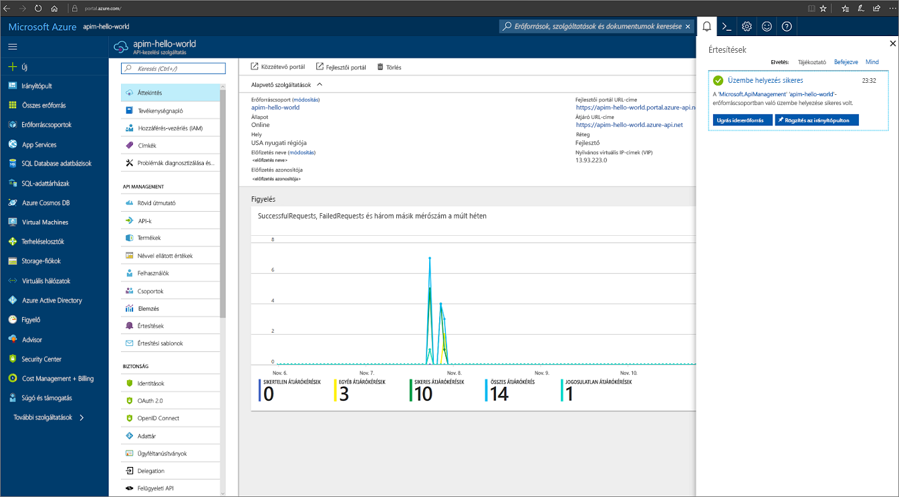
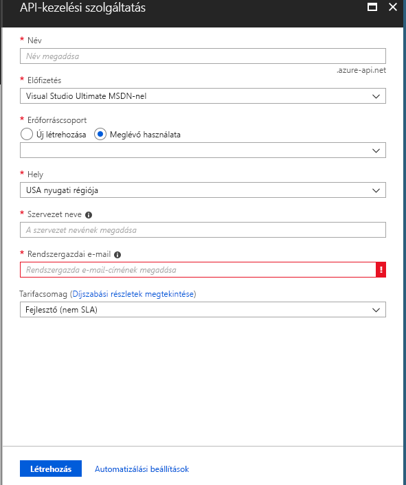

# Új Azure API Management-szolgáltatáspéldány létrehozása

Az Azure API Management (APIM) segít közzétenni az API-kat a külső, a partner- és a belső fejlesztők számára, hogy ki tudják használni az adataikban és szolgáltatásaikban rejlő lehetőségeket. Az API Management a fejlesztők bevonásán, az üzleti elemzéseken, a biztonságon és a védelmen keresztül biztosítja az alapvető kompetenciákat az API-program sikeressé tételéhez. Az APIM segítségével modern API-átjárókat hozhat létre meglévő háttérrendszerekhez, és az üzemeltetés helyétől függetlenül kezelheti azokat. További információt az [Áttekintés](api-management-key-concepts.md) témakörben talál.

Ez a gyors útmutató az új API Management-példányok Azure Portalon történő létrehozásának lépéseit mutatja be.

[!INCLUDE [quickstarts-free-trial-note](../../includes/quickstarts-free-trial-note.md)]

## Jelentkezzen be az Azure-ba

Jelentkezzen be az Azure Portalra a http://portal.azure.com címen.

## Új szolgáltatás létrehozása

1. Az [Azure Portalon](https://portal.azure.com/) válassza az **Erőforrás létrehozása** > **Vállalati integráció** > **API Management** lehetőséget.

    Azt is megteheti, hogy az **Új** lehetőséget választja, majd a keresőmezőbe beírja az `API management` kifejezést, és lenyomja az Enter billentyűt. Kattintson a **Create** (Létrehozás) gombra.

2. Az **API Management szolgáltatás** ablakban nyissa meg a beállításokat.

    

    | Beállítás      | Ajánlott érték  | Leírás              |
    | ------------ |  ------- | ---------------------------------|
    |**Name (Név)**|Az API Management szolgáltatás egyedi neve| A név később nem módosítható. A szolgáltatásnév alapján jön létre a *{név}.azure-api.net* formátumú alapértelmezett tartománynév. Ha egyéni tartománynevet kíván használni, tekintse meg az [Egyéni tartománynév konfigurálása](configure-custom-domain.md) témakört.   A szolgáltatásnév a szolgáltatásra és a megfelelő Azure erőforrásra utal.|
    |**Előfizetés**|Az Ön előfizetése | Az új szolgáltatáspéldány létrehozásához használt előfizetés. Az Ön számára elérhető Azure-előfizetések közül választhat.|
    |**Erőforráscsoport**|*apimResourceGroup*|Válasszon ki egy új vagy egy létező erőforrást. Az erőforráscsoport közös életciklussal, engedélyekkel és házirendekkel rendelkező erőforrások gyűjteménye. További információkat [itt](../azure-resource-manager/resource-group-overview.md#resource-groups) talál.|
    |**Hely**|*USA nyugati régiója*|Válassza ki az Önhöz legközelebbi földrajzi régiót. A legördülő listában csak az elérhető API Management szolgáltatási régiók jelennek meg. |
    |**Szervezet neve**|Az intézmény neve|Ezt a nevet sok helyen használja a rendszer, többek között a fejlesztői portál címében és az értesítő e-mailek küldőjeként.|
    |**Rendszergazdai e-mail**|*admin@org.com*|Az itt megadott e-mail-címre érkezik majd az **API Management** által küldött összes értesítés.|
    |**Tarifacsomag**|*Fejlesztői*|Állítsa be a **Fejlesztői** szintet a szolgáltatás értékeléséhez. Ez a szint nem használható éles környezetben. További információt az API Management szintjeinek skálázásáról a [frissítés és skálázás](upgrade-and-scale.md) oldalon talál.|
3. Válassza a **Létrehozás** elemet.

    > [!TIP]
    > Egy új API Management szolgáltatás létrehozása általában 20-30 percig tart. A **Rögzítés az irányítópulton** lehetőség használatával könnyebben megtalálhatja az újonnan létrehozott szolgáltatást.

[!INCLUDE [api-management-navigate-to-instance.md](../../includes/api-management-navigate-to-instance.md)]

## Az erőforrások eltávolítása

Ha már nincs rájuk szükség, eltávolíthatja az erőforráscsoportot és az összes kapcsolódó erőforrást az alábbi lépések végrehajtásával:

1. Az Azure Portalon kattintson ide: .
2. Válassza az **Erőforráscsoportok** lehetőséget.
3. Keresse meg a törölni kívánt erőforráscsoportot.
4. Kattintson a „. . .”, és törölje a csoportot.

## További lépések

> [!div class="nextstepaction"]
> [Az első API importálása és közzététele](import-and-publish.md)
