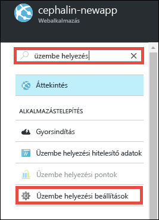
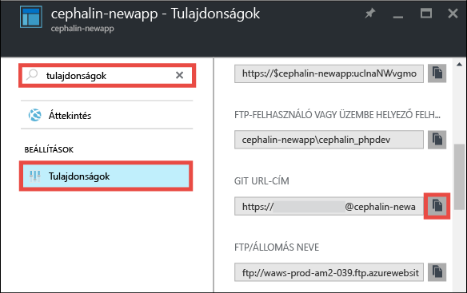
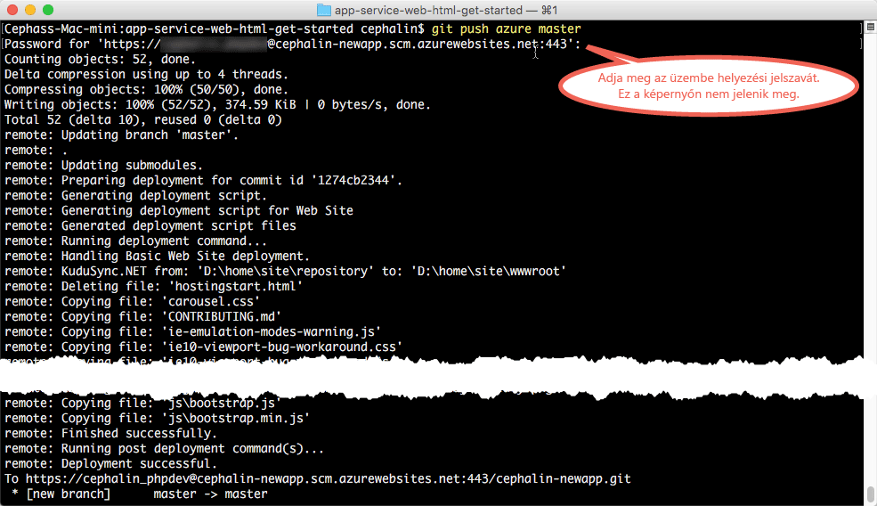

# Helyezze üzembe az első webalkalmazását öt perc alatt az Azure-ban
Ez az oktatóanyag segítséget nyújt egy egyszerű HTML+CSS-webalkalmazás üzembe helyezéséhez az [Azure App Service-ben](../app-service/app-service-value-prop-what-is.md).
Az App Service használatával webalkalmazásokat, [mobilalkalmazások háttérkomponenseit](/documentation/learning-paths/appservice-mobileapps/) és [API-alkalmazásokat](../app-service-api/app-service-api-apps-why-best-platform.md) hozhat létre.

Az alábbiakat fogja elvégezni: 

* Webalkalmazás létrehozása az Azure App Service használatával.
* HTML és CSS üzembe helyezése.
* Az oldalak üzemi környezetben való futtatása.
* Ugyanúgy frissítheti a tartalmat, mint ahogy azt a [Git-véglegesítéseknél is tenné](https://git-scm.com/docs/git-push).

## Előfeltételek
* [Telepítse a Git szoftvert](http://www.git-scm.com/downloads). Ellenőrizze a telepítés sikerességét a(z) `git --version` futtatásával egy új Windows-parancssorból, PowerShell-ablakból, Linux-shellből vagy OS X-terminálból.
* Szerezzen be egy Microsoft Azure-fiókot. Ha nincs fiókja, [regisztráljon egy ingyenes próbaverzióra](/pricing/free-trial/?WT.mc_id=A261C142F), vagy [aktiválhatja a Visual Studio előfizetői előnyeit](/pricing/member-offers/msdn-benefits-details/?WT.mc_id=A261C142F).

> [!NOTE]
> Az [App Service kipróbálása](http://go.microsoft.com/fwlink/?LinkId=523751) Azure-fiók nélkül is lehetséges. Hozzon létre egy kezdő szintű alkalmazást, amellyel legfeljebb egy óráig foglalkozhat – ehhez nincs szükség bankkártyára, és nem jár kötelezettségekkel.
> 
> 

## Webalkalmazás létrehozása
1. Jelentkezzen be az [Azure Portalra](https://portal.azure.com) az Azure-fiókjával.
2. Kattintson az **Új** > **Web + mobil** > **Webalkalmazás** elemre.
   
    
3. Az alkalmazás-létrehozási panelen használja az alábbi beállításokat az új alkalmazásához:
   
   * **Alkalmazás neve**: Írjon be egy egyedi nevet.
   * **Erőforráscsoport**: Válassza az **Új létrehozása** lehetőséget, majd adjon nevet az erőforráscsoportnak.
   * **App Service-csomag/Hely**: Kattintson rá a konfiguráláshoz, majd kattintson az **Új létrehozása** lehetőségre az App Service-csomag nevének, helyének és tarifacsomagjának beállításához. Nyugodtan használhatja az **Ingyenes** tarifacsomagot.
     
     Amikor elkészült, az alkalmazás-létrehozási panelnek az alábbihoz hasonlóan kell kinéznie:
     
     
4. Kattintson az alul lévő **Létrehozás** lehetőségre. A felül lévő **Értesítés** ikonra kattintva megtekintheti a folyamat állapotát.
   
    
5. Az üzembe helyezés befejezése után ennek az értesítési üzenetnek kell megjelennie. Kattintson az üzenetre az üzemelő példány panelének megnyitásához.
   
    
6. **Az üzembe helyezés sikeres** panelen kattintson az **Erőforrás** hivatkozásra az új webalkalmazás panelének megnyitásához.
   
    

## Tartalom üzembe helyezése a webalkalmazásban
Ideje tartalmakat üzembe helyezni az Azure-ban a Git használatával.

1. A webalkalmazás panelén görgessen le vagy keressen rá az **Deployment options** (Üzembe helyezési lehetőségek) elemre, majd kattintson rá. 
   
    
2. Kattintson a **Forrás kiválasztása** > **Helyi git-tárház** > **OK** elemre.
3. A webalkalmazás panelére visszatérve kattintson a **Telepítési hitelesítő adatok** elemre.
4. Adja meg az üzembehelyezési hitelesítő adatokat, majd kattintson a **Mentés** gombra.
5. Térjen vissza a webalkalmazás panelére, görgessen le vagy keressen rá a **Tulajdonságok** elemre, majd kattintson rá. A **Gites URL-cím** elem mellett kattintson a **Másolás** gombra.
   
    
   
    Készen áll a tartalom Git használatával történő üzembe helyezésére.
6. A parancssori terminálban váltson egy munkakönyvtárba (`CD`), és az alábbi módon klónozza a mintaalkalmazást:
   
        git clone https://github.com/Azure-Samples/app-service-web-html-get-started.git
   
    
7. Váltson a mintaalkalmazás adattárára. Például: 
   
        cd app-service-web-html-get-started
8. Konfigurálja az Azure-alkalmazás távoli Git-elemét a Git URL-címmel, amelyet néhány lépéssel korábban másolt a portálról.
   
        git remote add azure <giturlfromportal>
9. Helyezze üzembe a mintakódot az Azure-alkalmazásban ugyanolyan módon, ahogy azt Git-kódok esetén is tenné:
   
        git push azure master
   
        

Ennyi az egész! A kód mostantól élőben fut az Azure-ban. A böngészőjéből keresse fel a http://*&lt;alkalmazásnév>*.azurewebsites.net webhelyet, hogy működés közben láthassa. 

## Frissítések készítése az alkalmazáshoz
A Git segítségével mostantól bármikor leküldhet a projekt (adattár) gyökérkönyvtárából, ha frissítenie kell az élő webhelyet. Ezt ugyanolyan módon teheti meg, mint amikor az első alkalommal helyezte üzembe a tartalmat. Például minden alkalommal, amikor egy új, helyileg tesztelt módosítást kíván leküldeni, akkor egyszerűen csak futtatnia kell az alábbi parancsokat a projekt (adattár) gyökérkönyvtárából:

    git add .
    git commit -m "<your_message>"
    git push azure master

## Következő lépések
Keresse meg az előnyben részesített fejlesztési és üzembehelyezési lépéseket a nyelvi keretrendszeréhez:

> [!div class="op_single_selector"]
> * [.NET](web-sites-dotnet-get-started.md)
> * [PHP](app-service-web-php-get-started.md)
> * [Node.js](app-service-web-nodejs-get-started.md)
> * [Python](web-sites-python-ptvs-django-mysql.md)
> * [Java](web-sites-java-get-started.md)
> 
> 

Vagy tegyen még többet az első webalkalmazásával. Példa:

* Próbálja meg [egyéb módokon üzembe helyezni a kódot az Azure-ban](web-sites-deploy.md). Ha például az egyik GitHub-adattárból szeretné elvégezni a telepítést, egyszerűen válassza a **GitHub** lehetőséget a **Helyi git-tárház** helyett az **Üzembehelyezési lehetőségek** területen.
* Új szintre emelheti Azure alkalmazását. Hitelesítheti felhasználóit. Igény szerint méretezheti. Beállíthat a teljesítménnyel kapcsolatos riasztásokat. Mindezt csupán néhány kattintással. Lásd: [Funkciók hozzáadása az első webalkalmazásához](app-service-web-get-started-2.md).

<!--HONumber=Sep16_HO4-->

