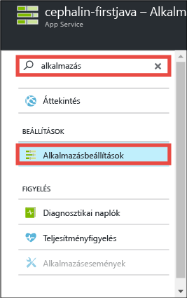
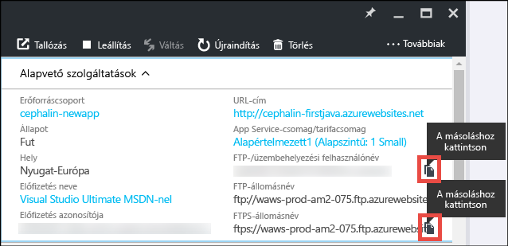
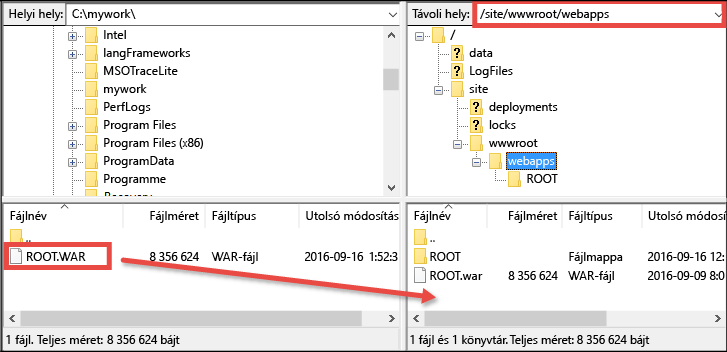

# Helyezze üzembe első Java-webalkalmazását öt perc alatt az Azure-ban (CLI 2.0 – előzetes verzió)

> [!div class="op_single_selector"]
> * [Első HTML-webhely](app-service-web-get-started-html-cli-nodejs.md)
> * [Első .NET-alkalmazás](app-service-web-get-started-dotnet-cli-nodejs.md)
> * [Első PHP-alkalmazás](app-service-web-get-started-php-cli-nodejs.md)
> * [Első Node.js-alkalmazás](app-service-web-get-started-nodejs-cli-nodejs.md)
> * [Első Python-alkalmazás](app-service-web-get-started-python-cli-nodejs.md)
> * [Első Java-alkalmazás](app-service-web-get-started-java.md)
> 
> 

Ez az oktatóanyag segítséget nyújt egy egyszerű Java-webalkalmazás üzembe helyezéséhez az [Azure App Service-ben](../app-service/app-service-value-prop-what-is.md).
Az App Service használatával webalkalmazásokat, [mobilalkalmazások háttérkomponenseit](/documentation/learning-paths/appservice-mobileapps/) és [API-alkalmazásokat](../app-service-api/app-service-api-apps-why-best-platform.md) hozhat létre.

Az alábbiakat fogja elvégezni: 

* Webalkalmazás létrehozása az Azure App Service használatával.
* Java-mintaalkalmazás üzembe helyezése.
* A kód élőben, üzemi környezetben való futtatása.

## Előfeltételek
* Szerezzen be egy FTP-/FTPS-ügyfelet, például a [FileZillát](https://filezilla-project.org/).
* Szerezzen be egy Microsoft Azure-fiókot. Ha nincs fiókja, [regisztráljon egy ingyenes próbaverzióra](https://azure.microsoft.com/pricing/free-trial/?WT.mc_id=A261C142F), vagy [aktiválhatja a Visual Studio előfizetői előnyeit](https://azure.microsoft.com/pricing/member-offers/msdn-benefits-details/?WT.mc_id=A261C142F).

> [!NOTE]
> Az [App Service kipróbálása](https://azure.microsoft.com/try/app-service/) Azure-fiók nélkül is lehetséges. Hozzon létre egy kezdő szintű alkalmazást, amellyel legfeljebb egy óráig foglalkozhat – ehhez nincs szükség bankkártyára, és nem jár kötelezettségekkel.
> 
> 

## Webalkalmazás létrehozása
1. Jelentkezzen be az [Azure Portalra](https://portal.azure.com) az Azure-fiókjával.
2. Kattintson az **Új** > **Web + mobil** > **Webalkalmazás** elemre.
   
    
3. Az alkalmazás-létrehozási panelen használja az alábbi beállításokat az új alkalmazásához:
   
   * **Alkalmazás neve**: Írjon be egy egyedi nevet.
   * **Erőforráscsoport**: Válassza az **Új létrehozása** lehetőséget, majd adjon nevet az erőforráscsoportnak.
   * **App Service-csomag/Hely**: Kattintson rá a konfiguráláshoz, majd kattintson az **Új létrehozása** lehetőségre az App Service-csomag nevének, helyének és tarifacsomagjának beállításához. Nyugodtan használhatja az **Ingyenes** tarifacsomagot.
     
     Amikor elkészült, az alkalmazás-létrehozási panelnek az alábbihoz hasonlóan kell kinéznie:
     
     
4. Kattintson az alul lévő **Létrehozás** lehetőségre. A felül lévő **Értesítés** ikonra kattintva megtekintheti a folyamat állapotát.
   
    
5. Az üzembe helyezés befejezése után ennek az értesítési üzenetnek kell megjelennie. Kattintson az üzenetre az üzemelő példány panelének megnyitásához.
   
    
6. **Az üzembe helyezés sikeres** panelen kattintson az **Erőforrás** hivatkozásra az új webalkalmazás panelének megnyitásához.
   
    

## Java-alkalmazás üzembe helyezése a webalkalmazásban
Ideje egy Java-alkalmazást üzembe helyezni az Azure-ban az FTPS-sel.

1. A webalkalmazás panelén görgessen le, vagy keressen rá az **Alkalmazásbeállítások** elemre, majd kattintson rá. 
   
    
2. A **Java-verzió** alatt válassza a **Java 8** lehetőséget, majd kattintson a **Mentés** parancsra.
   
    
   
    Amikor a **Sikeresen frissítette a webalkalmazás beállításait** értesítést kapja, keresse fel a http://*&lt;alkalmazásnév>*.azurewebsites.net webhelyet, hogy működés közben láthassa az alapértelmezett JSP-kiszolgálóprogramot.
3. Térjen vissza a webalkalmazás panelére, görgessen le, vagy keressen rá az **Üzembehelyezési hitelesítő adatok** elemre, majd kattintson rá.
4. Adja meg az üzembehelyezési hitelesítő adatokat, majd kattintson a **Mentés** gombra.
5. A webalkalmazás panelére visszatérve kattintson az **Áttekintés** elemre. Az **FTP-/üzembehelyezési felhasználónév** és az **FTPS-állomásnév** elem mellett kattintson a **Másolás** gombra az értékek másolásához.
   
    
   
    Készen áll a Java-alkalmazás FTPS használatával történő üzembe helyezésére.
6. Az FTP-/FTPS-ügyfélben jelentkezzen be az Azure-webalkalmazás FTP-kiszolgálójára az előző lépésben kimásolt értékekkel. Használja az előzőleg létrehozott üzembehelyezési jelszót.
   
    Az alábbi képernyőképen a FileZillával történő bejelentkezés látható.
   
    
   
    Az Azure ismeretlen SSL-tanúsítványával kapcsolatos biztonsági figyelmeztetés jelenhet meg. Lépjen tovább, és folytassa a műveletet.
7. Kattintson [erre a hivatkozásra](https://github.com/Azure-Samples/app-service-web-java-get-started/raw/master/webapps/ROOT.war) a WAR-fájl a helyi számítógépére történő letöltéséhez.
8. Az FTP-/FTPS-ügyfélben lépjen a távoli hely **/site/wwwroot/webapps** helyére, és húzza a helyi számítógépére letöltött WAR-fájlt abba a távoli könyvtárba.
   
    
   
    A fájl Azure-ban való felülírásához kattintson az **OK** gombra.
   
   > [!NOTE]
   > A Tomcat alapértelmezett viselkedésének megfelelően a /site/wwwroot/webapps **ROOT.war** fájlneve megadja a gyökér webalkalmazást (http://*&lt;alkalmazásnév>*.azurewebsites.net), a ***&lt;bármely_név>*.war** fájlnév pedig egy elnevezett webalkalamzást (http://*&lt;alkalmazásnév>*.azurewebsites.net/*&lt;bármely_név>*) ad meg.
   > 
   > 

Ennyi az egész! A Java-alkalmazás mostantól élesben fut az Azure-ban. A böngészőjéből keresse fel a http://*&lt;alkalmazásnév>*.azurewebsites.net webhelyet, hogy működés közben láthassa. 

## Frissítések készítése az alkalmazáshoz
Amikor csak frissítésre van szüksége, csak töltse fel az új WAR-fájlt ugyanabba a távoli könyvtárba az FTP-/FTPS-ügyféllel.

## Következő lépések
[Java-webalkalmazás létrehozása egy Azure Marketplace-ről beszerzett sablonnal](web-sites-java-get-started.md#marketplace). Beszerezheti a saját teljesen testreszabható Tomcat-tárolóját, és használhatja az ismerős kezelő felhasználói felületét. 

Az Azure-webalkalmazáson elvégezheti a hibakeresést közvetlenül az [IntelliJ](app-service-web-debug-java-web-app-in-intellij.md) vagy az [Eclipse](app-service-web-debug-java-web-app-in-eclipse.md) használatával.

Vagy tegyen még többet az első webalkalmazásával. Példa:

* Próbálja meg [egyéb módokon üzembe helyezni a kódot az Azure-ban](web-sites-deploy.md). 
* Új szintre emelheti Azure alkalmazását. Hitelesítheti felhasználóit. Igény szerint méretezheti. Beállíthat a teljesítménnyel kapcsolatos riasztásokat. Mindezt csupán néhány kattintással. Lásd: [Funkciók hozzáadása az első webalkalmazásához](app-service-web-get-started-2.md).

<!--HONumber=Feb17_HO3-->

