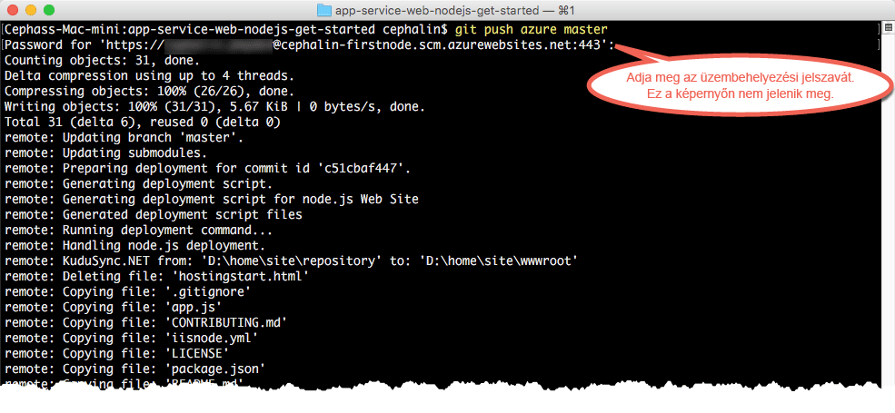

# Helyezze üzembe első Node.js-webalkalmazását öt perc alatt az Azure-ban (CLI 2.0 – előzetes verzió)

> [!div class="op_single_selector"]
> * [Első HTML-webhely](app-service-web-get-started-html.md)
> * [Első .NET-alkalmazás](app-service-web-get-started-dotnet.md)
> * [Első PHP-alkalmazás](app-service-web-get-started-php.md)
> * [Első Node.js-alkalmazás](app-service-web-get-started-nodejs.md)
> * [Első Python-alkalmazás](app-service-web-get-started-python.md)
> * [Első Java-alkalmazás](app-service-web-get-started-java.md)
> 
> 

Ez az oktatóanyag segítséget nyújt az első Node.js-webalkalmazás üzembe helyezéséhez az [Azure App Service-ben](../app-service/app-service-value-prop-what-is.md).
Az App Service használatával webalkalmazásokat, [mobilalkalmazások háttérkomponenseit](/documentation/learning-paths/appservice-mobileapps/) és [API-alkalmazásokat](../app-service-api/app-service-api-apps-why-best-platform.md) hozhat létre.

Az alábbiakat fogja elvégezni: 

* Webalkalmazás létrehozása az Azure App Service használatával.
* Node.js-mintakód üzembe helyezése.
* A kód élőben, üzemi környezetben való futtatása.
* Ugyanúgy frissítheti a webalkalmazását, mint ahogy azt a [Git-véglegesítéseknél is tenné](https://git-scm.com/docs/git-push).

[!INCLUDE [app-service-linux](../../includes/app-service-linux.md)]

## A feladat befejezéséhez használható CLI-verziók

A következő CLI-verziók egyikével elvégezheti a feladatot:

- [Azure CLI 1.0](app-service-web-get-started-nodejs-cli-nodejs.md) – parancssori felületünk a klasszikus és a Resource Management üzemi modellekhez
- [Azure CLI 2.0 (előzetes verzió)](app-service-web-get-started-nodejs.md) – a Resource Management üzemi modellhez tartozó parancssori felületek következő generációját képviseli

## Előfeltételek
* [Git](http://www.git-scm.com/downloads).
* [Azure CLI 2.0 előzetes verzió](/cli/azure/install-az-cli2).
* Egy Microsoft Azure-fiók. Ha nincs fiókja, [regisztráljon egy ingyenes próbaverzióra](https://azure.microsoft.com/pricing/free-trial/?WT.mc_id=A261C142F), vagy [aktiválhatja a Visual Studio előfizetői előnyeit](https://azure.microsoft.com/pricing/member-offers/msdn-benefits-details/?WT.mc_id=A261C142F).

> [!NOTE]
> Az [App Service kipróbálása](https://azure.microsoft.com/try/app-service/) Azure-fiók nélkül is lehetséges. Hozzon létre egy kezdő szintű alkalmazást, amellyel legfeljebb egy óráig foglalkozhat – ehhez nincs szükség bankkártyára, és nem jár kötelezettségekkel.
> 
> 

## Node.js-alapú webalkalmazás üzembe helyezése
1. Nyisson meg egy új Windows-parancssort, PowerShell-ablakot, Linux shellt vagy egy OS X terminált. A `git --version` és az `azure --version` paranccsal ellenőrizheti, hogy a Git és az Azure parancssori felülete telepítve van-e a számítógépen.
   
    
   
    Ha még nem telepítette az eszközöket, akkor telepítse őket. A letöltési hivatkozásokat az [Előfeltételek](#Prerequisites) szakaszban találja.
2. Jelentkezzen be az Azure-ba a következő módon:
   
        az login
   
    A bejelentkezési folyamat folytatásához kövesse a súgóüzenetet.
   
    

3. Állítsa be az üzembe helyező felhasználót az App Service számára. A kód üzembe helyezését később fogja elvégezni ezen hitelesítő adatok használatával.
   
        az appservice web deployment user set --user-name <username> --password <password>

3. Hozzon létre egy új [erőforráscsoportot](../azure-resource-manager/resource-group-overview.md). Az első App Service-oktatóanyaghoz nem feltétlenül szükséges tudnia, mi ez.

        az group create --location "<location>" --name my-first-app-group

    A `<location>` paraméterhez használható lehetséges értékek megtekintéséhez, használja az `az appservice list-locations` CLI-parancsot.

3. Hozzon létre egy új, „INGYENES” [App Service-csomagot](../app-service/azure-web-sites-web-hosting-plans-in-depth-overview.md). Az első App Service-oktatóanyaggal kapcsolatban tudnia kell, hogy nem kell fizetnie az ebben a csomagban szereplő webappokért.

        az appservice plan create --name my-free-appservice-plan --resource-group my-first-app-group --sku FREE

4. Hozzon létre egy új, egyéni névvel rendelkező webappot az `<app_name>` paraméterben.

        az appservice web create --name <app_name> --resource-group my-first-app-group --plan my-free-appservice-plan

4. Ezután kapja meg az üzembe helyezni kívánt Node.js-mintakódot. Váltson egy munkakönyvtárra (a `CD` paranccsal), és klónozza a példaalkalmazást az alábbi lépések szerint:
   
        cd <working_directory>
        git clone https://github.com/Azure-Samples/app-service-web-nodejs-get-started.git

5. Váltson a mintaalkalmazás adattárára.
   
        cd app-service-web-nodejs-get-started
5. Konfigurálja az App Service webapphoz tartozó helyi Git üzemelő példányt a következő paranccsal:

        az appservice web source-control config-local-git --name <app_name> --resource-group my-first-app-group

    Egy ehhez hasonló JSON-kimenet jön létre, ami azt jelenti, hogy a távoli Git-tárház be lett állítva:

        {
        "url": "https://<deployment_user>@<app_name>.scm.azurewebsites.net/<app_name>.git"
        }

6. Adja hozzá a JSON-ban található URL-címet a helyi tárházhoz távoli Git-elemként (az egyszerűség kedvéért nevezzük a következőnek: `azure`).

        git remote add azure https://<deployment_user>@<app_name>.scm.azurewebsites.net/<app_name>.git
   
7. Helyezze üzembe a mintakódot az Azure-alkalmazásban ugyanúgy, ahogy Git-kódok esetében is tenné. Ha a rendszer kéri, használja a korábban beállított jelszót.
   
        git push azure master
   
    
   
    A `git push` nem csak az Azure-be illeszti be a kódot, hanem üzembe helyezési feladatokat is aktivál az üzembe helyezési motorban. 
    Ha package.json fájl található a projekt (adattár) gyökérkönyvtárában, akkor az üzembehelyezési parancsfájl visszaállítja Önnek a szükséges csomagokat. 

Sikeresen üzembe helyezte az alkalmazást az Azure App Service-ben!

## Az alkalmazás megtekintése működés közben
Az Azure-alkalmazást az adattár valamelyik könyvtárában kiadott alábbi paranccsal tekintheti meg működés közben:

    azure site browse

## Az alkalmazás módosítása (frissítése)
A Git segítségével mostantól bármikor leküldhet a projekt (adattár) gyökérkönyvtárából, ha frissítenie kell az élő webhelyet. Ezt ugyanolyan módon teheti meg, mint amikor az első alkalommal helyezte üzembe a kódot. Például minden alkalommal, amikor egy új, helyileg tesztelt módosítást kíván leküldeni, akkor egyszerűen csak futtatnia kell az alábbi parancsokat a projekt (adattár) gyökérkönyvtárából:

    git add .
    git commit -m "<your_message>"
    git push azure master

## Következő lépések
[Node.js Express-webalkalmazás létrehozása, konfigurálása és üzembe helyezése az Azure-on](app-service-web-nodejs-get-started.md). Az oktatóanyag utasításait követve szert tehet a bármely Node.js-webalkalmazás Azure-ban való futtatásához szükséges alapszintű készségekre, többek között az alábbiakra:

* Alkalmazások létrehozása és konfigurálása az Azure-ban Powershellből/Bashből.
* A Node.js-verzió beállítása.
* Egy nem a gyökér-alkalmazáskönyvtárban található indítófájl használata.
* Automatizálás NPM-mel.
* Hiba és kimeneti naplók lekérése.

Vagy tegyen még többet az első webalkalmazásával. Példa:

* Próbálja meg [egyéb módokon üzembe helyezni a kódot az Azure-ban](web-sites-deploy.md). Ha például az egyik GitHub-adattárból szeretné elvégezni a telepítést, egyszerűen válassza a **GitHub** lehetőséget a **Helyi git-tárház** helyett az **Üzembehelyezési lehetőségek** területen.
* Új szintre emelheti Azure alkalmazását. Hitelesítheti felhasználóit. Igény szerint méretezheti. Beállíthat a teljesítménnyel kapcsolatos riasztásokat. Mindezt csupán néhány kattintással. Lásd: [Funkciók hozzáadása az első webalkalmazásához](app-service-web-get-started-2.md).

<!--HONumber=Jan17_HO3-->

