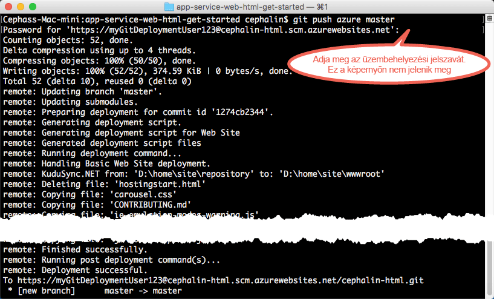

<properties 
    pageTitle="Helyezze üzembe az első webalkalmazását 5 perc alatt az Azure-ban" 
    description="Egy mintaalkalmazás mindössze néhány lépést igénylő üzembe helyezésével megtudhatja, mennyire egyszerű a webalkalmazások futtatása az App Service-ben. 5 perc alatt hozzáfoghat a valós fejlesztéshez, az eredményeket pedig azonnal meg is tekintheti." 
    services="app-service\web"
    documentationCenter=""
    authors="cephalin" 
    manager="wpickett" 
    editor="" 
/>

<tags 
    ms.service="app-service-web" 
    ms.workload="web" 
    ms.tgt_pltfrm="na" 
    ms.devlang="na" 
    ms.topic="hero-article"
    ms.date="05/12/2016" 
    ms.author="cephalin"
/>
    
# Helyezze üzembe az első webalkalmazását 5 perc alatt az Azure-ban

[AZURE.INCLUDE [tabs](../../includes/app-service-web-get-started-nav-tabs.md)]

Ez az oktatóanyag segítséget nyújt az első webalkalmazás üzembe helyezéséhez az [Azure App Service-ben](../app-service/app-service-value-prop-what-is.md). Az App Service segítségével webalkalmazásokat, [mobil háttéralkalmazásokat](/documentation/learning-paths/appservice-mobileapps/) és [API Apps](../app-service-api/app-service-api-apps-why-best-platform.md) alkalmazásokat hozhat létre.

Szinte nem is kell tennie semmit és: 

- Üzembe helyezhet egy minta-webalkalmazást (a következők közül választhat: ASP.NET, PHP, Node.js, Java vagy Python).
- Másodpercek alatt élőben futtathatja alkalmazásait.
- Ugyanúgy frissítheti a webalkalmazását, mint ahogy azt a [Git-véglegesítéseknél is tenné](https://git-scm.com/docs/git-push).

Az [Azure portálra](https://portal.azure.com) is vethet egy pillantást, és megtekintheti az ott elérhető szolgáltatásokat. 

## Előfeltételek

- [Telepítse a Git szoftvert](http://www.git-scm.com/downloads). 
- [Telepítse az Azure parancssori felületét](../xplat-cli-install.md). 
- Szerezzen be egy Microsoft Azure-fiókot. Ha nincs fiókja, [regisztráljon egy ingyenes próbaverzióra](/pricing/free-trial/?WT.mc_id=A261C142F), vagy [aktiválhatja a Visual Studio előfizetői előnyeit](/pricing/member-offers/msdn-benefits-details/?WT.mc_id=A261C142F).

>[AZURE.NOTE] Tekintsen meg működés közben egy webalkalmazást. [Próbálja ki az App Service-t](http://go.microsoft.com/fwlink/?LinkId=523751) azonnal, és hozzon létre egy rövid élettartamú alapszintű alkalmazást – ehhez nincs szükség bankkártyára, és nem jár kötelezettségekkel.

## Webalkalmazás üzembe helyezése

Helyezzünk üzembe egy webalkalmazást az Azure App Service-be. 

1. Nyisson meg egy új Windows parancssort, PowerShell-ablakot, Linux shellt vagy egy OS X terminált. Futtassa a `git --version` és az `azure --version` parancsot annak ellenőrzéséhez, hogy a Git és az Azure parancssori felülete telepítve vannak-e a számítógépre. 

    

    Ha még nem telepítette az eszközöket, akkor a letöltési hivatkozásokat az [Előfeltételek](#Prerequisites) részben találhatja.

1. `CD` paranccsal lépjen be egy munkakönyvtárba, és az alábbi módon klónozza a mintaalkalmazást:

        git clone <github_sample_url>

    

    A *&lt;github_sample_url>* paraméterben az Ön által kedvelt keretrendszertől függően használja az alábbi URL-címek egyikét: 

    - HTML+CSS+JS: [https://github.com/Azure-Samples/app-service-web-html-get-started.git](https://github.com/Azure-Samples/app-service-web-html-get-started.git)
    - ASP.NET: [https://github.com/Azure-Samples/app-service-web-dotnet-get-started.git](https://github.com/Azure-Samples/app-service-web-dotnet-get-started.git)
    - PHP (CodeIgniter): [https://github.com/Azure-Samples/app-service-web-php-get-started.git](https://github.com/Azure-Samples/app-service-web-php-get-started.git)
    - Node.js (Express): [https://github.com/Azure-Samples/app-service-web-nodejs-get-started.git](https://github.com/Azure-Samples/app-service-web-nodejs-get-started.git) 
    - Java: [https://github.com/Azure-Samples/app-service-web-java-get-started.git](https://github.com/Azure-Samples/app-service-web-java-get-started.git)
    - Python (Django): [https://github.com/Azure-Samples/app-service-web-python-get-started.git](https://github.com/Azure-Samples/app-service-web-python-get-started.git)

2. `CD` paranccsal lépjen be a mintaalkalmazás adattárába. Például: 

        cd app-service-web-html-get-started

3. Jelentkezzen be az Azure-ba az alábbi módon:

        azure login
    
    A bejelentkezési folyamat folytatásához kövesse a súgóüzenetet.
    
    

4. A következő paranccsal létrehozhat egy egyedi alkalmazásnévvel rendelkező App Service alkalmazás-erőforrást az Azure-ban. Amikor a rendszer kéri, adja meg a kívánt régió számát.

        azure site create --git <app_name>
    
    
    
    >[AZURE.NOTE] Ha még nem állított be üzembe helyezési hitelesítő adatokat az Azure-előfizetéséhez, a rendszer fel fogja szólítani rá. Ezeket a hitelesítő adatokat az App Service kizárólag a Git-telepítésekhez és FTP-bejelentkezéshez fogja használni az Azure fiókhitelesítő adatok helyett. 
    
    Az alkalmazás létre lett hozva az Azure-ban. Az aktuális könyvtár ezen kívül inicializálva lett a Git-hez, és távoli Git mappaként csatlakoztatva van az új App Service alkalmazáshoz.
    Böngészéssel megkeresheti az alkalmazás URL-címét (http://&lt;alkalmazás_neve>.azurewebsites.net), ahol megtekintheti a gyönyörű alapértelmezett HTML-oldalt, de most már illesszük be az Ön saját kódját.

4. Most pedig telepítse a mintakódot az új App Service alkalmazásba ugyanolyan módon, mint ahogy azt Git-kódok esetén is tenné:

        git push azure master 

        
    
    Ha az egyik nyelvi keretrendszert használja, akkor a fent bemutatottaktól eltérő kimenetet láthat. Ez azért van, mert a `git push` nem csak az Azure-be illeszti be a kódot, hanem üzembe helyezési feladatokat is aktivál az üzembe helyezési motorban. Ha package.json (Node.js) vagy requirements.txt (Python) fájlok vannak a projekt (adattár) gyökérkönyvtárában, vagy ha egy packages.config fájl van az ASP.NET projektben, akkor az üzembe helyezési parancsfájlok visszaállítják Önnek a szükséges csomagokat. Ezen kívül a engedélyezheti a [Composer bővítményt](web-sites-php-mysql-deploy-use-git.md#composer) is, így a composer.json fájlok automatikusan fel lesznek dolgozva a PHP-alkalmazásokban.

Gratulálunk, sikeresen üzembe helyezte az alkalmazást az Azure App Service-be. 

## Tekintse meg, hogyan fut élőben az alkalmazás

Az Azure alkalmazás élőben való futásának megtekintéséhez futtassa ezt a parancsot az adattárban lévő bármelyik könyvtárból:

    azure site browse

## Frissítések készítése az alkalmazáshoz

A Git segítségével mostantól bármikor leküldhet a projekt (adattár) gyökérkönyvtárából, ha frissítenie kell az élő webhelyet. Ezt ugyanolyan módon teheti meg, mint amikor az első alkalommal helyezte üzembe az alkalmazást az Azure-ba. Például minden alkalommal, amikor egy új, helyileg tesztelt módosítást kíván leküldeni, akkor egyszerűen csak futtatnia kell az alábbi parancsokat a projekt (adattár) gyökérkönyvtárából:
    
    git add .
    git commit -m "<your_message>"
    git push azure master

## Az alkalmazás megtekintése az Azure portálon

Most pedig ugorjunk az Azure portálra, és tekintsük meg, hogy mit hozott létre:

1. Jelentkezzen be az [Azure portálra](https://portal.azure.com) egy Azure előfizetéssel rendelkező Microsoft-fiókkal.

2. A bal oldali sávon kattintson az **App Services** lehetőségre.

3. Az imént létrehozott alkalmazásra kattintva megnyithatja annak oldalát a portálon (ezt [panelnek](../azure-portal-overview.md) nevezik). Az Ön kényelme érdekében ezzel egyidejűleg a **Beállítások** panel is megnyílik.

     

Az App Service alkalmazás portálpanelje sokféle beállítás- és eszközkészletet jelenít meg, amelyek segítségével konfigurálhatja, megfigyelheti, biztosíthatja az alkalmazását, valamint hibaelhárítást végezhet. Szánjon egy percet a felület megismerésére, hajtson végre néhány egyszerű feladatot (a feladat száma megfelel a képernyőképen látható számnak):

1. állítsa le az alkalmazást
2. indítsa újra az alkalmazást
3. kattintson az **Erőforráscsoport** hivatkozásra az erőforráscsoportban telepített erőforrások mindegyikének megjelenítéséhez
4. kattintson a **Beállítások** > **Tulajdonságok** lehetőségre, hogy megtekintse az alkalmazásra vonatkozó egyéb információkat
5. kattintson az **Eszközök** elemre a megfigyelés és hibaelhárítás során hasznos információk megtekintéséhez  

## További lépések

- Új szintre emelheti Azure alkalmazását. Hitelesítéssel biztosíthatja. Igény szerint méretezheti. Beállíthat a teljesítménnyel kapcsolatos riasztásokat. Mindezt csupán néhány kattintással. Lásd: [Funkciók hozzáadása az első webalkalmazásához](app-service-web-get-started-2.md).
- A Git és az Azure CLI alkalmazásán kívül más módokon is telepíthet webalkalmazásokat az Azure-ba (lásd: [Az alkalmazás telepítése az Azure App Service-be](../app-service-web/web-sites-deploy.md)).
Megtalálhatja az előnyben részesített fejlesztési és telepítési lépéseket a nyelvi keretrendszeréhez, ha kijelöli a keretrendszerét a cikk tetején.

<!--HONumber=Jun16_HO2--->

