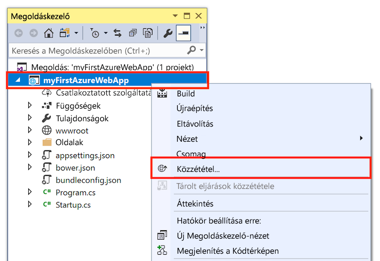
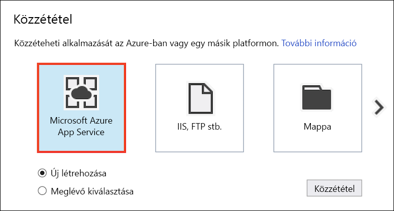
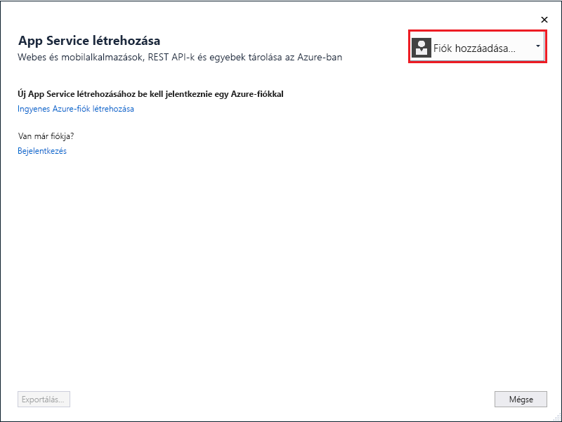
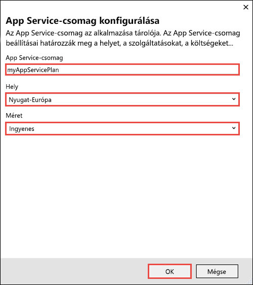
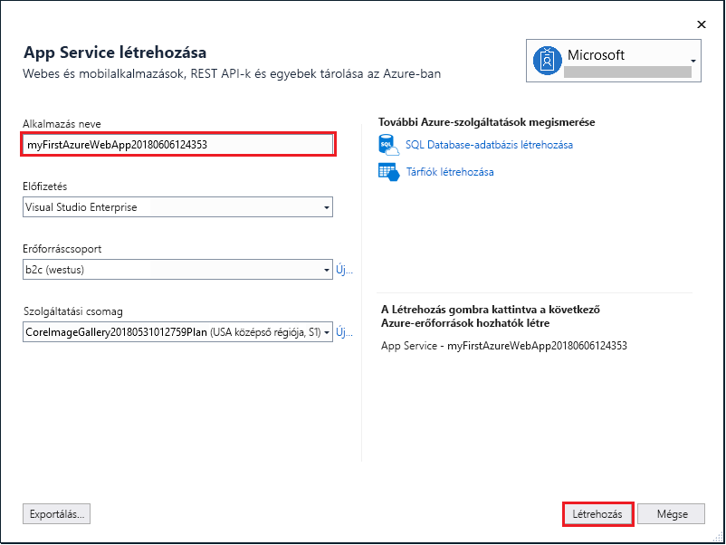

# <a name="create-an-aspnet-core-web-app-in-azure"></a>ASP.NET Core-webalkalmazás létrehozása az Azure-ban

> [!NOTE]
> Ebben a cikkben egy alkalmazást helyezünk üzembe a Windowson futó App Service-ben. A _Linuxon_ futó App Service-ben való üzembe helyezéssel kapcsolatban lásd: [.NET Core-webalkalmazás létrehozása Linuxon futó App Service-ben](./containers/quickstart-dotnetcore.md).
>

Az [Azure Web Apps](app-service-web-overview.md) egy hatékonyan méretezhető, önjavító webes üzemeltetési szolgáltatás.  Ez a gyorsútmutató az ASP.NET Core-webalkalmazás Azure Web Apps szolgáltatásban történő üzembe helyezésén vezeti végig. Az oktatóanyag végére egy olyan erőforráscsoport lesz elérhető, amely egy App Service-csomagból és egy üzembe helyezett webalkalmazással rendelkező Azure webalkalmazásból áll.

> [!NOTE]
> Ha szeretne többet megtudni az ASP.NET keretrendszerben működő webalkalmazások létrehozásáról és üzembe helyezéséről, az erre vonatkozó cikket [itt](app-service-web-get-started-dotnet-framework.md) érheti el. 
>

[!INCLUDE [quickstarts-free-trial-note](../../includes/quickstarts-free-trial-note.md)]

## <a name="prerequisites"></a>Előfeltételek

Az oktatóanyag elvégzéséhez:

* Telepítse a <a href="https://www.visualstudio.com/downloads/" target="_blank">Visual Studio 2017</a> szoftvert a következő számítási feladatokkal:
    - **ASP.NET és webfejlesztés**
    - **Azure-fejlesztés**

    

## <a name="create-an-aspnet-core-web-app"></a>ASP.NET Core-webalkalmazás létrehozása

Hozzon létre egy projektet a Visual Studióban a **File > New > Project** (Fájl > Új > Projekt) lehetőség kiválasztásával. 

A **New Project** (Új projekt) párbeszédpanelen válassza a **Visual C# > Web > ASP.NET Core Web Application** (Visual C# > Web > ASP.NET Core-webalkalmazás) lehetőséget.

Nevezze el az alkalmazást _myFirstAzureWebApp_ néven, majd kattintson az **OK** gombra.
   


Bármilyen típusú ASP.NET Core-webalkalmazást üzembe helyezhet az Azure-ban. Ennél a gyorsútmutatónál válassza a **Web Application** (Webalkalmazás) sablont, és ügyeljen arra, hogy a hitelesítés beállítása **No Authentication** (Nincs hitelesítés) legyen.
      
Kattintson az **OK** gombra.


Az ASP.NET Core-projekt létrehozása után megjelenik az ASP.NET Core kezdőlapja. Itt számos olyan erőforrásra mutató hivatkozást találhat, amelyek segítenek a munka megkezdésében. 


A menüből válassza a **Debug > Start without Debugging** (Hibakeresés > Indítás hibakeresés nélkül) lehetőséget a webalkalmazás helyi futtatásához.


## <a name="publish-to-azure"></a>Közzététel az Azure platformon

A **Solution Explorer** (Megoldáskezelő) lapon kattintson a jobb gombbal a **myFirstAzureWebApp** projektre, és válassza a **Publish** (Közzététel) elemet.



Győződjön meg arról, hogy a **Microsoft Azure App Service** van kiválasztva, és kattintson a **Publish** (Közzététel) elemre.



Ez megnyitja a **Create App Service** (App Service létrehozása) párbeszédpanelt, amelynek segítségével létrehozhatja az összes, az ASP.NET Core-webalkalmazás Azure-ban történő futtatásához szükséges Azure-erőforrást.

## <a name="sign-in-to-azure"></a>Bejelentkezés az Azure-ba

A **Create App Service** (App Service létrehozása) párbeszédpanelen kattintson az **Add an account** (Fiók hozzáadása) gombra, majd jelentkezzen be az Azure-előfizetésébe. Ha már bejelentkezett, válassza ki a kívánt előfizetést tartalmazó fiókot a legördülő listából.

> [!NOTE]
> Ha már be van jelentkezve, akkor még ne válassza a **Create** (Létrehozás) lehetőséget.
>
>
   


## <a name="create-a-resource-group"></a>Hozzon létre egy erőforráscsoportot

[!INCLUDE [resource group intro text](../../includes/resource-group.md)]

Az **Erőforráscsoport** mellett válassza az **Új** elemet.

Nevezze el a **myResourceGroup** erőforráscsoportot, majd kattintson az **OK** gombra.

## <a name="create-an-app-service-plan"></a>App Service-csomag létrehozása

[!INCLUDE [app-service-plan](../../includes/app-service-plan.md)]

Az **App Service Plan** (App Service-csomag) mellett válassza a **New** (Új) elemet. 

A **Configure App Service Plan** (App Service-csomag konfigurálása) párbeszédpanelen a képernyőképet követve használja a táblázatban szereplő beállításokat.



| Beállítás | Ajánlott érték | Leírás |
|-|-|-|
|App Service-csomag| myAppServicePlan | Az App Service-csomag neve. |
| Hely | Nyugat-Európa | Az adatközpont, ahol a webalkalmazást üzemeltetik. |
| Méret | Ingyenes | A [tarifacsomag](https://azure.microsoft.com/pricing/details/app-service/?ref=microsoft.com&utm_source=microsoft.com&utm_medium=docs&utm_campaign=visualstudio) meghatározza az üzemeltetési funkciókat. |

Kattintson az **OK** gombra.

## <a name="create-and-publish-the-web-app"></a>A webapp létrehozása és közzététele

A **Web App Name** (Webalkalmazás neve) mezőben adjon meg egy egyedi nevet az alkalmazáshoz (érvényes karakterek: `a-z`, `0-9` és `-`) vagy fogadja el az automatikusan létrehozott egyedi nevet. A webalkalmazás URL-címe `http://<app_name>.azurewebsites.net`, amelyben a `<app_name>` a webalkalmazás neve.

A **Create** (Létrehozás) gombra kattintva hozzákezdhet az Azure-erőforrások létrehozásához.



Miután a varázsló befejeződött, közzéteszi az ASP.NET Core-webalkalmazást az Azure-ban, majd elindítja azt az alapértelmezett böngészőben.


A [létrehozás és közzététel lépésben](#create-and-publish-the-web-app) megadott webalkalmazás neve lesz az URL-előtag `http://<app_name>.azurewebsites.net` formátumban.

Gratulálunk, az ASP.NET Core-webalkalmazás most már elérhető az Azure App Service-ben.

## <a name="update-the-app-and-redeploy"></a>Az alkalmazás frissítése és ismételt üzembe helyezése

A **Solution Explorer** (Megoldáskezelő) felületén nyissa meg a _Pages/Index.cshtml_ fájlt.

Keresse meg a `<div id="myCarousel" class="carousel slide" data-ride="carousel" data-interval="6000">` HTML-címkét felül, és cserélje le az egész elemet az alábbi kódra:

```HTML
<div class="jumbotron">
    <h1>ASP.NET in Azure!</h1>
    <p class="lead">This is a simple app that we’ve built that demonstrates how to deploy a .NET app to Azure App Service.</p>
</div>
```

Az Azure-beli ismételt üzembe helyezéshez kattintson a jobb gombbal a **myFirstAzureWebApp** projektre a **Solution Explorer** (Megoldáskezelő) lapon, és válassza a **Publish** (Közzététel) elemet.

A közzétételi oldalon válassza a **Publish** (Közzététel) elemet.

Miután a közzététel befejeződött, a Visual Studio tallózza a webalkalmazás URL-címét.


## <a name="manage-the-azure-web-app"></a>Az Azure webalkalmazás felügyelete

Ugorjon az <a href="https://portal.azure.com" target="_blank">Azure Portalra</a>, és felügyelje a létrehozott webalkalmazást.

A baloldali menüben válassza az **App Services** lehetőséget, majd az Azure-webalkalmazás nevét.


Megtekintheti a webalkalmazás Áttekintés oldalát. Itt elvégezhet olyan alapszintű felügyeleti feladatokat, mint a tallózás, leállítás, elindítás, újraindítás és törlés. 


A bal oldali menü az alkalmazás konfigurálásához biztosít különböző oldalakat. 

[!INCLUDE [Clean-up section](../../includes/clean-up-section-portal.md)]

## <a name="next-steps"></a>További lépések

> [!div class="nextstepaction"]
> [ASP.NET Core és SQL Database](app-service-web-tutorial-dotnetcore-sqldb.md)
