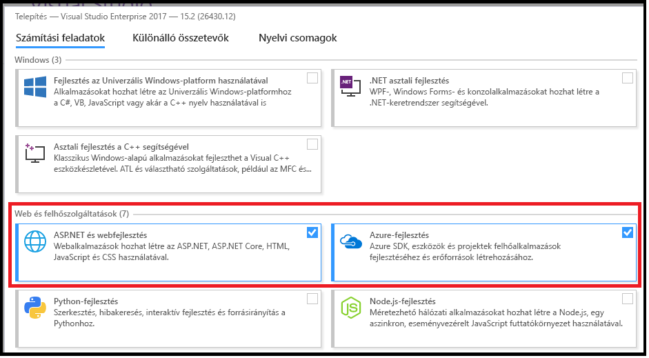
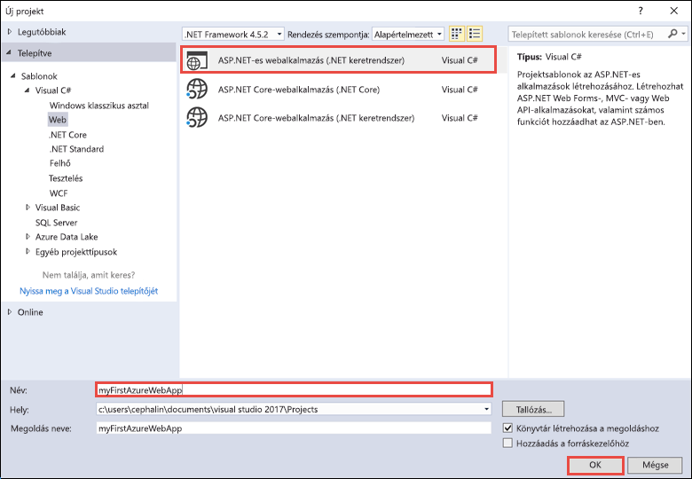
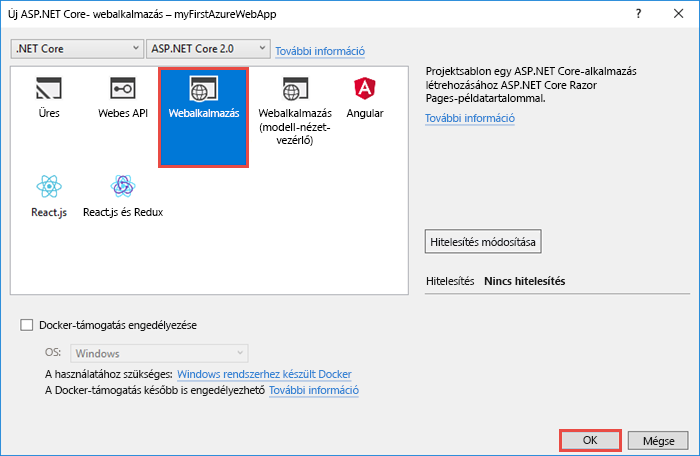
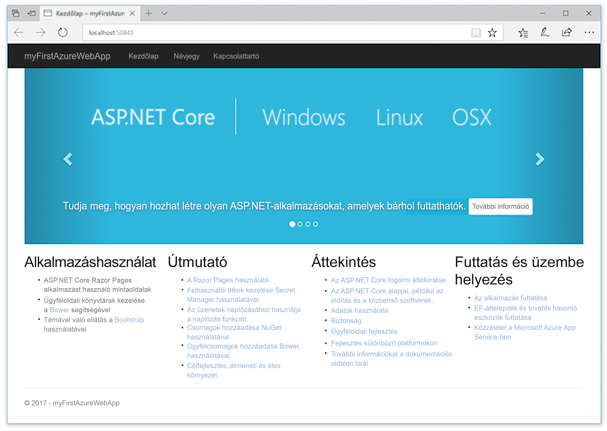
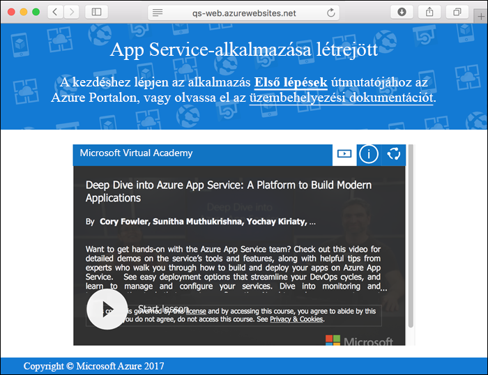
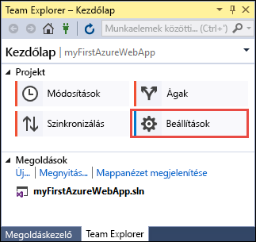
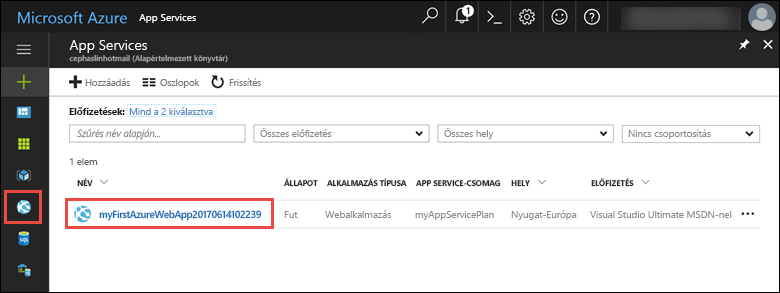
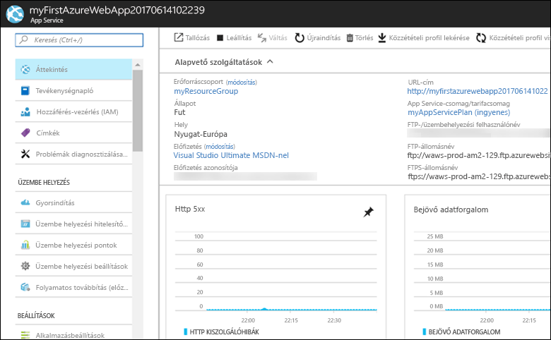

# <a name="create-an-aspnet-core-web-app-in-azure"></a>ASP.NET Core-webalkalmazás létrehozása az Azure-ban

> [!NOTE]
> Ebben a cikkben egy alkalmazást helyezünk üzembe a Windowson futó App Service-ben. A _Linuxon_ futó App Service-ben való üzembe helyezéssel kapcsolatban lásd: [.NET Core-webalkalmazás létrehozása Linuxon futó App Service-ben](./containers/quickstart-dotnetcore.md).
>
> Ha az ASP.NET-keretrendszer alkalmazásaira vonatkozó lépéseket keresi, tekintse meg az [ASP.NET-keretrendszer webalkalmazásainak az Azure-ban történő létrehozását](app-service-web-get-started-dotnet-framework.md) ismertető szakaszt. 
>

Az [Azure Web Apps](app-service-web-overview.md) egy hatékonyan méretezhető, önjavító webes üzemeltetési szolgáltatás.  Ez a gyorsútmutató az ASP.NET Core-webalkalmazás Azure Web Apps szolgáltatásban történő üzembe helyezésén vezeti végig. Az oktatóanyag végére egy olyan erőforráscsoport lesz elérhető, amely egy App Service-csomagból és egy üzembe helyezett webalkalmazással rendelkező Azure webalkalmazásból áll.

[!INCLUDE [quickstarts-free-trial-note](../../includes/quickstarts-free-trial-note.md)]

## <a name="prerequisites"></a>Előfeltételek

Az oktatóanyag elvégzéséhez:

* Telepítse a <a href="https://www.visualstudio.com/downloads/" target="_blank">Visual Studio 2017</a> szoftvert a következő számítási feladatokkal:
    - **ASP.NET és webfejlesztés**
    - **Azure-fejlesztés**

    

## <a name="create-an-aspnet-core-web-app"></a>ASP.NET Core-webalkalmazás létrehozása

Hozzon létre egy projektet a Visual Studióban a **File > New > Project** (Fájl > Új > Projekt) lehetőség kiválasztásával. 

A **New Project** (Új projekt) párbeszédpanelen válassza a **Visual C# > Web > ASP.NET Core Web Application** (Visual C# > Web > ASP.NET Core-webalkalmazás) lehetőséget.

Nevezze el az alkalmazást _myFirstAzureWebApp_ néven, válassza az **Új Git-adattár létrehozása** elemet, majd kattintson az **OK** gombra.
   


Bármilyen típusú ASP.NET Core-webalkalmazást üzembe helyezhet az Azure-ban. Ennél a gyorsútmutatónál válassza a **Web Application** (Webalkalmazás) sablont, és ügyeljen arra, hogy a hitelesítés beállítása **No Authentication** (Nincs hitelesítés) legyen.
      
Kattintson az **OK** gombra.



Az ASP.NET Core-projekt létrehozása után megjelenik az ASP.NET Core kezdőlapja. Itt számos olyan erőforrásra mutató hivatkozást találhat, amelyek segítenek a munka megkezdésében. 


A menüből válassza a **Debug > Start without Debugging** (Hibakeresés > Indítás hibakeresés nélkül) lehetőséget a webalkalmazás helyi futtatásához.



[!INCLUDE [cloud-shell-try-it.md](../../includes/cloud-shell-try-it.md)]

[!INCLUDE [Configure deployment user](../../includes/configure-deployment-user.md)] 

[!INCLUDE [Create resource group](../../includes/app-service-web-create-resource-group.md)] 

[!INCLUDE [Create app service plan](../../includes/app-service-web-create-app-service-plan.md)] 

[!INCLUDE [Create web app](../../includes/app-service-web-create-web-app.md)] 



## <a name="push-to-azure-from-visual-studio"></a>Leküldéses üzenet küldése a Visual Studióból az Azure-ra

A Visual Studio **View** (Nézet) menüjében kattintson a **Team Explorer** lehetőségre. Megjelenik a **Team Explorer**.

A **Home** (Kezdőlap) nézetben kattintson a **Settings** > **Repository Settings** (Beállítások > Adattár beállításai) lehetőségre.



A **Repository Settings** (Adattár beállításai) **Remotes** (Távoliak) területén válassza az **Add** (Hozzáadás) lehetőséget. Megjelenik az **Add Remote** (Távoli hozzáadása) párbeszédpanel.

Állítsa a **Name** (Név) mezőt _Azure_ értékre, majd állítsa a **Fetch** (Beolvasás) mezőt a [webalkalmazás létrehozásakor](#create-a-web-app) mentett URL-címre. Kattintson a **Save** (Mentés) gombra.


Ez a beállítás megegyezik a következő Git-paranccsal: `git remote add Azure <URL>`.

Kattintson a felül található **Home** (Kezdőlap) gombra.

Válassza a **Settings** > **Global Settings** (Beállítások > Globális beállítások) lehetőséget. Győződjön meg arról, hogy be van állítva a név és az e-mail-cím. Szükség esetén válassza az **Update** (Frissítés) lehetőséget.

A Visual Studio a projekt létrehozásakor már véglegesítette az összes fájlt a Git-adattárban. Most csak le kell küldenie a fájlokat az Azure-ba.

Kattintson a felül található **Home** (Kezdőlap) gombra. Válassza a **Sync** > **Actions** > **Open Command Prompt** (Szinkronizálás > Műveletek > Parancssor megnyitása) lehetőséget. 

Írja be a következő parancsot a parancssori ablakba, és amikor a rendszer kéri, írja be az üzembehelyezési jelszót:

```
git push Azure master
```

A parancs futtatása eltarthat néhány percig. Futtatás közben a parancs a következő példához hasonló információkat jelenít meg:

```
Counting objects: 4, done.
Delta compression using up to 8 threads.
Compressing objects: 100% (4/4), done.
Writing objects: 100% (4/4), 349 bytes | 349.00 KiB/s, done.
Total 4 (delta 3), reused 0 (delta 0)
remote: Updating branch 'master'.
remote: Updating submodules.
remote: Preparing deployment for commit id '9e20345e9c'.
remote: Generating deployment script.
remote: Project file path: .\myFirstAzureWebApp\myFirstAzureWebApp.csproj
remote: Solution file path: .\myFirstAzureWebApp.sln
remote: Generated deployment script files
remote: Running deployment command...
remote: Handling ASP.NET Core Web Application deployment.
remote:   Restoring packages for D:\home\site\repository\myFirstAzureWebApp\myFirstAzureWebApp.csproj...
remote:   Restoring packages for D:\home\site\repository\myFirstAzureWebApp\myFirstAzureWebApp.csproj...
...
remote: Finished successfully.
remote: Running post deployment command(s)...
remote: Deployment successful.
To https://<app_name>.scm.azurewebsites.net/<app_name>.git
 * [new branch]      master -> master
```

## <a name="browse-to-the-app"></a>Az alkalmazás megkeresése tallózással

Keresse fel a böngészőben az Azure-webalkalmazás URL-címét: `http://<app_name>.azurewebsites.net`.

Az oldal Azure App Service webalkalmazásként fut.


Gratulálunk, az ASP.NET Core-webalkalmazás most már elérhető az Azure App Service-ben.

## <a name="update-the-app-and-redeploy"></a>Az alkalmazás frissítése és ismételt üzembe helyezése

A **Solution Explorer** (Megoldáskezelő) felületén nyissa meg a _Pages/Index.cshtml_ fájlt.

Keresse meg a `<div id="myCarousel" class="carousel slide" data-ride="carousel" data-interval="6000">` HTML-címkét felül, és cserélje le az egész elemet az alábbi kódra:

```HTML
<div class="jumbotron">
    <h1>ASP.NET in Azure!</h1>
    <p class="lead">This is a simple app that we’ve built that demonstrates how to deploy a .NET app to Azure App Service.</p>
</div>
```

A **Solution Explorer** (Megoldáskezelő) felületén kattintson a jobb gombbal a _Pages/Index.cshtml_ fájlra, és kattintson a **Commit** (Véglegesítés) elemre. Adjon meg egy véglegesítési üzenetet a módosításhoz, és kattintson a **Commit All** (Összes véglegesítése) elemre.

A parancssori ablakban küldje le a kódmódosításokat az Azure-ba.

```bash
git push Azure master
```

Az üzembe helyezés befejezése keresse fel ismét a következő címet: `http://<app_name>.azurewebsites.net`.


## <a name="manage-the-azure-web-app"></a>Az Azure webalkalmazás felügyelete

Ugorjon az <a href="https://portal.azure.com" target="_blank">Azure Portalra</a>, és felügyelje a létrehozott webalkalmazást.

A baloldali menüben válassza az **App Services** lehetőséget, majd az Azure-webalkalmazás nevét.



Megtekintheti a webalkalmazás Áttekintés oldalát. Itt elvégezhet olyan alapszintű felügyeleti feladatokat, mint a tallózás, leállítás, elindítás, újraindítás és törlés. 



A bal oldali menü az alkalmazás konfigurálásához biztosít különböző oldalakat. 

[!INCLUDE [Clean-up section](../../includes/clean-up-section-portal.md)]

## <a name="next-steps"></a>További lépések

> [!div class="nextstepaction"]
> [ASP.NET Core és SQL Database](app-service-web-tutorial-dotnetcore-sqldb.md)
