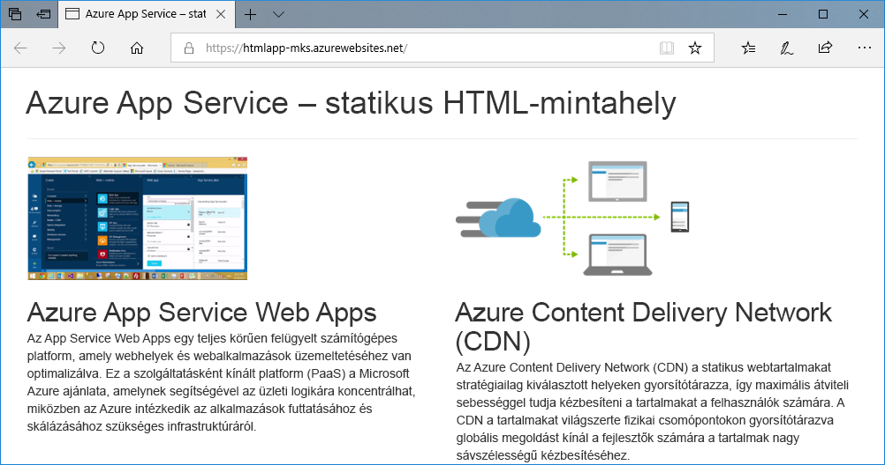
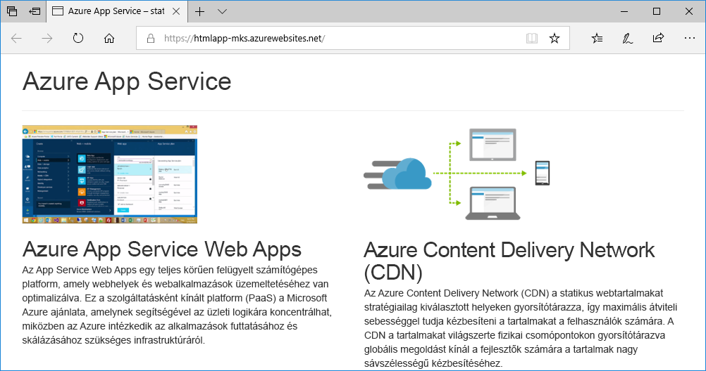
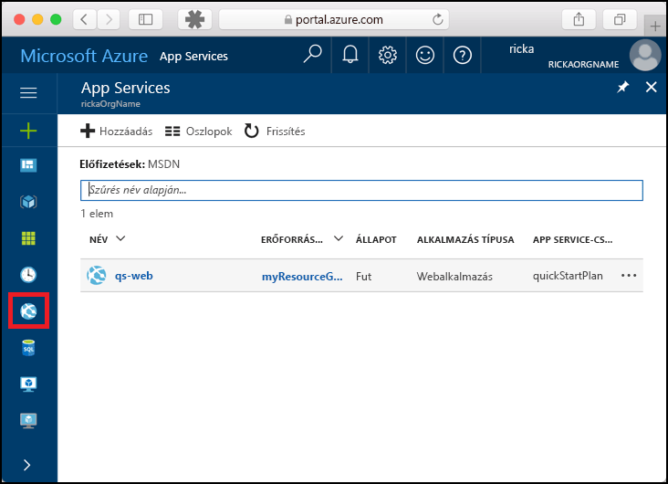
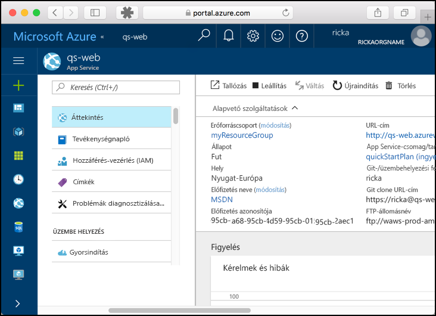

# <a name="create-a-static-html-web-app-in-azure"></a>Statikus HTML-webalkalmazás létrehozása az Azure-ban

Az [Azure Web Apps](app-service-web-overview.md) egy hatékonyan méretezhető, önjavító webes üzemeltetési szolgáltatás. Ez a gyorsútmutató egy alapszintű HTML+CSS hely Azure Web Apps szolgáltatásban történő üzembe helyezésén vezeti végig. Ezt a rövid útmutatót a [Cloud Shellben](https://docs.microsoft.com/azure/cloud-shell/overview) végezzük el, a parancsok azonban helyileg is futtathatók az [Azure CLI](/cli/azure/install-azure-cli) használatával.



[!INCLUDE [quickstarts-free-trial-note](../../includes/quickstarts-free-trial-note.md)]

[!INCLUDE [cloud-shell-try-it.md](../../includes/cloud-shell-try-it.md)]

## <a name="install-web-app-extension-for-cloud-shell"></a>A Cloud Shell webalkalmazás-bővítményének telepítése

A rövid útmutató elvégzéséhez az [az web app extension](https://docs.microsoft.com/cli/azure/extension?view=azure-cli-latest#az-extension-add) hozzáadása szükséges. Ha a bővítmény már telepítve van, frissítse a legújabb verzióra. A webalkalmazás-bővítmény frissítéséhez írja be az `az extension update -n webapp` parancsot.

A webalkalmazás-bővítmény telepítéséhez futtassa az alábbi parancsot:

```bash
az extension add --name webapp
```

A bővítmény telepítése után a Cloud Shell az alábbi példához hasonló információkat jelenít meg:

```bash
The installed extension 'webapp' is in preview.
```

## <a name="download-the-sample"></a>A minta letöltése

A Cloud Shellben hozzon létre egy quickstart könyvtárat, és lépjen a könyvtárba.

```bash
mkdir quickstart

cd quickstart
```

Ezután futtassa a következő parancsot a mintaalkalmazás-adattár a quickstart könyvtárba való klónozásához.

```bash
git clone https://github.com/Azure-Samples/html-docs-hello-world.git
```

## <a name="create-a-web-app"></a>Webalkalmazás létrehozása

Lépjen abba a könyvtárba, amelyben a mintakód található, és futtassa az `az webapp up` parancsot.

A következő példában az <app_name> helyett adjon meg egy egyedi alkalmazásnevet.

```bash
cd html-docs-hello-world

az webapp up --location westeurope --name <app_name>
```

Az `az webapp up` parancs a következő műveleteket hajtja végre:

- Egy alapértelmezett erőforráscsoport létrehozása.

- Egy alapértelmezett App Service-csomag létrehozása.

- Egy alkalmazás létrehozása a megadott néven.

- Fájlok [tömörített üzembe helyezése](https://docs.microsoft.com/azure/app-service/app-service-deploy-zip) az aktuális munkakönyvtárból a webalkalmazásba.

A parancs futtatása eltarthat néhány percig. Futtatás közben a parancs a következő példához hasonló információkat jelenít meg:

```json
{
  "app_url": "https://<app_name>.azurewebsites.net",
  "location": "westeurope",
  "name": "<app_name>",
  "os": "Windows",
  "resourcegroup": "appsvc_rg_Windows_westeurope",
  "serverfarm": "appsvc_asp_Windows_westeurope",
  "sku": "FREE",
  "src_path": "/home/<username>/quickstart/html-docs-hello-world ",
  < JSON data removed for brevity. >
}
```

Jegyezze fel a `resourceGroup` értékét. Szüksége lesz rá [az erőforrások eltávolításával](#clean-up-resources) kapcsolatos szakaszban.

## <a name="browse-to-the-app"></a>Az alkalmazás megkeresése tallózással

Nyissa meg böngészőben az Azure webalkalmazás URL-címét: `http://<app_name>.azurewebsites.net`.

Az oldal Azure App Service webalkalmazásként fut.


**Gratulálunk!** Elvégezte az első HTML-webapp üzembe helyezését az App Service-ben.

## <a name="update-and-redeploy-the-app"></a>Az alkalmazás frissítése és ismételt üzembe helyezése

A Cloud Shellben írja be a `nano index.html` parancsot a nano szövegszerkesztő megnyitásához. A `<h1>` fejléccímkében az „Azure App Service – Sample Static HTML Site” szöveget módosítsa „Azure App Service”-re a lent látható módon.


Mentse a módosításokat, és lépjen ki a nanóból. A mentéshez a `^O`, a kilépéshez a `^X` parancsot használja.

Most újra üzembe helyezzük az alkalmazást ugyanazzal az `az webapp up` paranccsal.

```bash
az webapp up --location westeurope --name <app_name>
```

Az üzembe helyezés befejezését követően váltson vissza **Az alkalmazás megkeresése tallózással** lépésben megnyitott böngészőablakra, és frissítse az oldalt.



## <a name="manage-your-new-azure-web-app"></a>Az új Azure-webapp kezelése

A létrehozott webalkalmazás felügyeletéhez ugorjon az <a href="https://portal.azure.com" target="_blank">Azure Portalra</a>.

A bal oldali menüben kattintson az **App Services** lehetőségre, majd az Azure-webalkalmazás nevére.



Megtekintheti a webalkalmazás Áttekintés oldalát. Itt elvégezhet olyan alapszintű felügyeleti feladatokat, mint a tallózás, leállítás, elindítás, újraindítás és törlés.



A bal oldali menü az alkalmazás konfigurálásához biztosít különböző oldalakat.

## <a name="clean-up-resources"></a>Az erőforrások eltávolítása

Az előző lépésekben Azure-erőforrásokat hozott létre egy erőforráscsoportban. Ha várhatóan nem lesz szüksége ezekre az erőforrásokra a jövőben, törölje az erőforráscsoportot a következő parancs Cloud Shellben történő futtatásával. Ne feledje, hogy az erőforráscsoport neve automatikusan jött létre a [webalkalmazást létrehozó](#create-a-web-app) lépés során.

```bash
az group delete --name appsvc_rg_Windows_westeurope
```

A parancs futtatása egy percig is eltarthat.

## <a name="next-steps"></a>További lépések

> [!div class="nextstepaction"]
> [Egyéni tartomány leképezése](app-service-web-tutorial-custom-domain.md)
