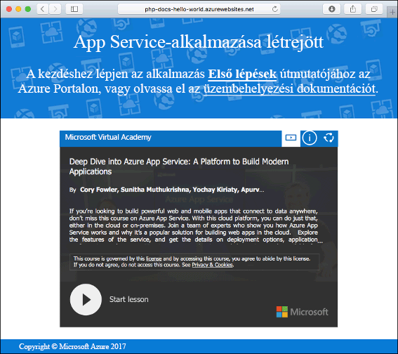

# <a name="create-a-nodejs-web-app-in-azure"></a>Node.js-webalkalmazás létrehozása az Azure-ban

> [!NOTE]
> Ebben a cikkben egy alkalmazást helyezünk üzembe a Windowson futó App Service-ben. A _Linuxon_ futó App Service-ben való üzembe helyezéssel kapcsolatban lásd: [Node.js-webalkalmazás létrehozása a Linuxon futó Azure App Service-ben](./containers/quickstart-nodejs.md).
>

Az [Azure Web Apps](app-service-web-overview.md) egy hatékonyan méretezhető, önjavító webes üzemeltetési szolgáltatás.  Ez a gyorsútmutató a Node.js-alkalmazások Azure Web Apps szolgáltatásban történő üzembe helyezésén vezeti végig. Az [Azure CLI-vel](https://docs.microsoft.com/cli/azure/get-started-with-azure-cli) létrehozhatja a webalkalmazást, a Git szoftver használatával pedig üzembe helyezheti a Node.js-mintakódot a webalkalmazásban.


Ezeket a lépéseket Mac, Windows vagy Linux rendszert futtató gépen is követheti. Az előfeltételek telepítése után a lépések végrehajtása nagyjából öt percet vesz igénybe.   

> [!VIDEO https://channel9.msdn.com/Shows/Azure-for-Node-Developers/Create-a-Nodejs-app-in-Azure-Quickstart/player]   

[!INCLUDE [quickstarts-free-trial-note](../../includes/quickstarts-free-trial-note.md)]

## <a name="prerequisites"></a>Előfeltételek

A gyorsútmutató elvégzéséhez:

* <a href="https://nodejs.org/" target="_blank">Telepítse a Node.js-t és az NPM-et</a>

## <a name="download-the-sample"></a>A minta letöltése

Töltse le a Node.js mintaprojektet a [https://github.com/Azure-Samples/nodejs-docs-hello-world/archive/master.zip](https://github.com/Azure-Samples/nodejs-docs-hello-world/archive/master.zip) címről, és bontsa ki a ZIP-archívumot.

Egy terminálablakban keresse meg a minta Node.js-projekt gyökérkönyvtárát (ez tartalmazza az _index.js_ fájlt).

## <a name="run-the-app-locally"></a>Az alkalmazás futtatása helyben

Az alkalmazás a terminálablak megnyitásával és a `npm start` szkript használatával helyben futtatható a beépített Node.js HTTP-kiszolgáló indításához.

```bash
npm start
```

Nyisson meg egy webböngészőt, majd keresse meg a mintaalkalmazást a `http://localhost:1337` címen.

Az oldalon látható mintaalkalmazáson ekkor a **Hello World** üzenetnek kell megjelennie.


A terminálablakban nyomja le a **Ctrl+C** billentyűkombinációt a webkiszolgálóból történő kilépéshez.

[!INCLUDE [Create ZIP file](../../includes/app-service-web-create-zip.md)]

[!INCLUDE [cloud-shell-try-it.md](../../includes/cloud-shell-try-it.md)]

[!INCLUDE [Create resource group](../../includes/app-service-web-create-resource-group.md)] 

[!INCLUDE [Create app service plan](../../includes/app-service-web-create-app-service-plan.md)] 

## <a name="create-a-web-app"></a>Webalkalmazás létrehozása

A Cloud Shellben az [`az webapp create`](/cli/azure/webapp?view=azure-cli-latest#az_webapp_create) paranccsal hozzon létre egy webalkalmazást a `myAppServicePlan` App Service-csomagban. 

A következő példában cserélje ki az `<app_name>` nevet egy globálisan egyedi névre (érvényes karakterek: `a-z`, `0-9` és `-`). A futtatókörnyezet beállítása `NODE|6.9` lett. Az összes támogatott futtatókörnyezet megtekintéséhez futtassa az [`az webapp list-runtimes`](/cli/azure/webapp?view=azure-cli-latest#az_webapp_list_runtimes) parancsot. 

```azurecli-interactive
# Bash
az webapp create --resource-group myResourceGroup --plan myAppServicePlan --name <app_name> --runtime "NODE|6.9"
# PowerShell
az --% webapp create --resource-group myResourceGroup --plan myAppServicePlan --name <app_name> --runtime "NODE|6.9"
```

A webalkalmazás létrehozása után az Azure CLI az alábbi példához hasonló eredményeket jelenít meg:

```json
{
  "availabilityState": "Normal",
  "clientAffinityEnabled": true,
  "clientCertEnabled": false,
  "cloningInfo": null,
  "containerSize": 0,
  "dailyMemoryTimeQuota": 0,
  "defaultHostName": "<app_name>.azurewebsites.net",
  "enabled": true,
  < JSON data removed for brevity. >
}
```

Tallózással keresse meg az újonnan létrehozott webalkalmazást. Az _&lt;app name>_ helyett adja meg a webalkalmazása nevét.

```bash
http://<app name>.azurewebsites.net
```

Az új webalkalmazásnak így kell kinéznie:



[!INCLUDE [Deploy ZIP file](../../includes/app-service-web-deploy-zip.md)]

## <a name="browse-to-the-app"></a>Az alkalmazás megkeresése tallózással

Tallózással keresse meg az üzembe helyezett alkalmazást a webböngésző használatával.

```
http://<app_name>.azurewebsites.net
```

A Node.js mintakód az Azure App Service webalkalmazásban fut.


**Gratulálunk!** Elvégezte az első Node.js-app üzembe helyezését az App Service-ben.

## <a name="update-and-redeploy-the-code"></a>A kód frissítése és ismételt üzembe helyezése

Egy szövegszerkesztő használatával nyissa meg a Node.js-alkalmazáson belüli `index.js` fájlt, majd módosítsa annak szövegét a `response.end` hívásán belül:

```nodejs
response.end("Hello Azure!");
```

Egy helyi terminálablakban keresse meg az alkalmazás gyökérkönyvtárát, majd hozzon létre egy új ZIP-fájlt a frissített projekt számára.

```
# Bash
zip -r myUpdatedAppFiles.zip .

# PowerShell
Compress-Archive -Path * -DestinationPath myUpdatedAppFiles.zip
``` 

Telepítse ezt az új ZIP-fájlt az App Service-be [A ZIP-fájl feltöltése](#upload-the-zip-file) részben már ismertetett lépésekkel.

Váltson vissza **Az alkalmazás megkeresése tallózással** lépésben megnyitott böngészőablakra, és frissítse az oldalt.


## <a name="manage-your-new-azure-web-app"></a>Az új Azure-webapp kezelése

A létrehozott webalkalmazás felügyeletéhez ugorjon az <a href="https://portal.azure.com" target="_blank">Azure Portalra</a>.

A bal oldali menüben kattintson az **App Services** lehetőségre, majd az Azure-webalkalmazás nevére.


Megtekintheti a webalkalmazás Áttekintés oldalát. Itt elvégezhet olyan alapszintű felügyeleti feladatokat, mint a tallózás, leállítás, elindítás, újraindítás és törlés. 


A bal oldali menü az alkalmazás konfigurálásához biztosít különböző oldalakat. 

[!INCLUDE [cli-samples-clean-up](../../includes/cli-samples-clean-up.md)]

## <a name="next-steps"></a>További lépések

> [!div class="nextstepaction"]
> [Node.js és MongoDB](app-service-web-tutorial-nodejs-mongodb-app.md)
