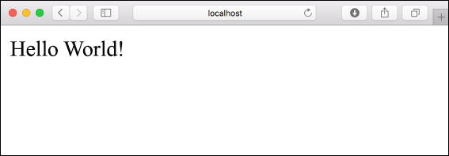
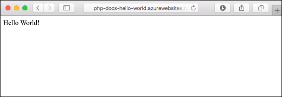
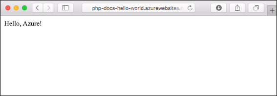
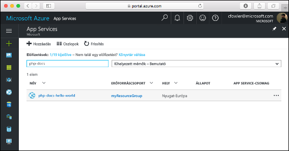
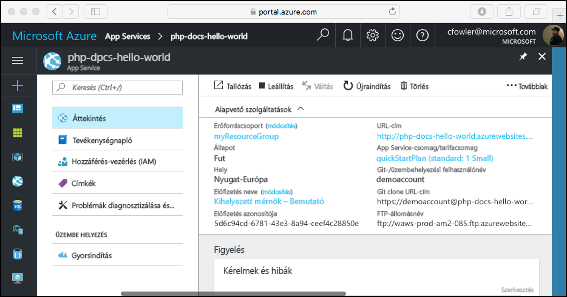

# <a name="create-a-php-web-app-in-azure"></a>PHP-webapp létrehozása az Azure-ban

> [!NOTE]
> Ebben a cikkben egy alkalmazást helyezünk üzembe a Windowson futó App Service-ben. A _Linuxon_ futó App Service-ben való üzembe helyezéssel kapcsolatban lásd: [PHP-webalkalmazás létrehozása a Linuxon futó App Service-ben](./containers/quickstart-php.md).
>

Az [Azure Web Apps](app-service-web-overview.md) egy hatékonyan méretezhető, önjavító webes üzemeltetési szolgáltatás.  Ez a gyorsútmutató a PHP-alkalmazás Azure Web Apps szolgáltatásban történő üzembe helyezésén vezeti végig. A Cloud Shellben az [Azure CLI-vel](https://docs.microsoft.com/cli/azure/get-started-with-azure-cli) létrehozza a webalkalmazást, egy [ZIP-fájl](app-service-deploy-zip.md) használatával pedig üzembe helyezi a PHP-mintakódot a webalkalmazásban.

![Az Azure-ban futó mintaalkalmazás]](media/app-service-web-get-started-php/hello-world-in-browser.png)

Ezeket a lépéseket Mac, Windows vagy Linux rendszert futtató gépen is követheti. Az előfeltételek telepítése után a lépések végrehajtása nagyjából öt percet vesz igénybe.

[!INCLUDE [quickstarts-free-trial-note](../../includes/quickstarts-free-trial-note.md)]

## <a name="prerequisites"></a>Előfeltételek

A gyorsútmutató elvégzéséhez:

* <a href="https://php.net" target="_blank">A PHP telepítése</a>

## <a name="download-the-sample-locally"></a>Minta helyi letöltése

Töltse le a minta PHP-projektet a [https://github.com/Azure-Samples/php-docs-hello-world/archive/master.zip](https://github.com/Azure-Samples/php-docs-hello-world/archive/master.zip) címről, majd csomagolja ki a tömörített archívumot.

Egy terminálablakban keresse meg a minta PHP-projekt gyökérkönyvtárát (ez tartalmazza az _index.php_ fájlt).

## <a name="run-the-app-locally"></a>Az alkalmazás futtatása helyben

Az alkalmazás a terminálablak megnyitásával és a `php` parancs használatával helyben futtatható a beépített PHP-webkiszolgáló indításához.

```bash
php -S localhost:8080
```

Nyisson meg egy webböngészőt, majd keresse meg a mintaalkalmazást a `http://localhost:8080` címen.

Az oldalon látható mintaalkalmazáson ekkor a **Hello World!** üzenet jelenik meg.



A terminálablakban nyomja le a **Ctrl+C** billentyűkombinációt a webkiszolgálóból történő kilépéshez.

[!INCLUDE [Create ZIP file](../../includes/app-service-web-create-zip.md)]

[!INCLUDE [cloud-shell-try-it.md](../../includes/cloud-shell-try-it.md)]

[!INCLUDE [Upload zip file](../../includes/app-service-web-upload-zip.md)]

[!INCLUDE [Create resource group](../../includes/app-service-web-create-resource-group.md)]

[!INCLUDE [Create app service plan](../../includes/app-service-web-create-app-service-plan.md)]

## <a name="create-a-web-app"></a>Webalkalmazás létrehozása

A Cloud Shellben az [`az webapp create`](/cli/azure/webapp?view=azure-cli-latest#az_webapp_create) paranccsal hozzon létre egy webalkalmazást a `myAppServicePlan` App Service-csomagban. 

A következő példában cserélje ki az `<app_name>` nevet egy globálisan egyedi névre (érvényes karakterek: `a-z`, `0-9` és `-`). A futtatókörnyezet beállítása `PHP|7.0` lett. Az összes támogatott futtatókörnyezet megtekintéséhez futtassa az [`az webapp list-runtimes`](/cli/azure/webapp?view=azure-cli-latest#az_webapp_list_runtimes) parancsot. 

```azurecli-interactive
az webapp create --resource-group myResourceGroup --plan myAppServicePlan --name <app_name> --runtime "PHP|7.0"
```

A webalkalmazás létrehozása után az Azure CLI az alábbi példához hasonló eredményeket jelenít meg:

```json
{
  "availabilityState": "Normal",
  "clientAffinityEnabled": true,
  "clientCertEnabled": false,
  "cloningInfo": null,
  "containerSize": 0,
  "dailyMemoryTimeQuota": 0,
  "defaultHostName": "<app_name>.azurewebsites.net",
  "enabled": true,
  < JSON data removed for brevity. >
}
```

Tallózással keresse meg az újonnan létrehozott webalkalmazást. Az _&lt;app name>_ helyett adja meg a webalkalmazása nevét.

```bash
http://<app name>.azurewebsites.net
```


[!INCLUDE [Deploy uploaded ZIP file](../../includes/app-service-web-deploy-zip.md)]

## <a name="browse-to-the-app"></a>Az alkalmazás megkeresése tallózással

Tallózással keresse meg az üzembe helyezett alkalmazást a webböngésző használatával.

```bash
http://<app_name>.azurewebsites.net
```

A PHP mintakód az Azure App Service webalkalmazásban fut.



**Gratulálunk!** Elvégezte az első PHP-webapp üzembe helyezését az App Service-ben.

## <a name="update-locally-and-redeploy-the-code"></a>A kód frissítése helyileg és ismételt üzembe helyezése

Egy helyi szövegszerkesztő használatával nyissa meg a `index.php` fájlt a PHP-alkalmazáson belül, majd módosítsa kissé annak szövegét a `echo` melletti karakterláncon belül:

```php
echo "Hello Azure!";
```

Egy helyi terminálablakban keresse meg az alkalmazás gyökérkönyvtárát, majd hozzon létre egy új ZIP-fájlt a frissített projekt számára.

```
# Bash
zip -r myUpdatedAppFiles.zip .

# PowerShell
Compress-Archive -Path * -DestinationPath myUpdatedAppFiles.zip
``` 

Töltse fel ezt az új ZIP-fájlt a Cloud Shellbe [A ZIP-fájl feltöltése](#upload-the-zip-file) részben már ismertetett lépésekkel.

Ezután a Cloud Shellben telepítse újra a feltöltött ZIP-fájlt.

```azurecli-interactive
az webapp deployment source config-zip --resource-group myResouceGroup --name <app_name> --src clouddrive/myUpdatedAppFiles.zip
```

Váltson vissza **Az alkalmazás megkeresése tallózással** lépésben megnyitott böngészőablakra, és frissítse az oldalt.



## <a name="manage-your-new-azure-web-app"></a>Az új Azure-webapp kezelése

A létrehozott webalkalmazás felügyeletéhez ugorjon az <a href="https://portal.azure.com" target="_blank">Azure Portalra</a>.

A bal oldali menüben kattintson az **App Services** lehetőségre, majd az Azure-webalkalmazás nevére.



Megtekintheti a webalkalmazás Áttekintés oldalát. Itt elvégezhet olyan alapszintű felügyeleti feladatokat, mint a tallózás, leállítás, elindítás, újraindítás és törlés.



A bal oldali menü az alkalmazás konfigurálásához biztosít különböző oldalakat. 

[!INCLUDE [cli-samples-clean-up](../../includes/cli-samples-clean-up.md)]

## <a name="next-steps"></a>További lépések

> [!div class="nextstepaction"]
> [PHP és MySQL](app-service-web-tutorial-php-mysql.md)
