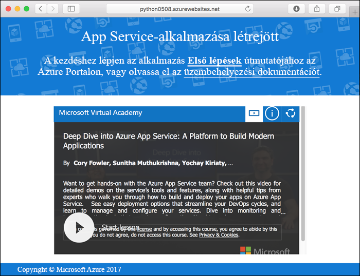
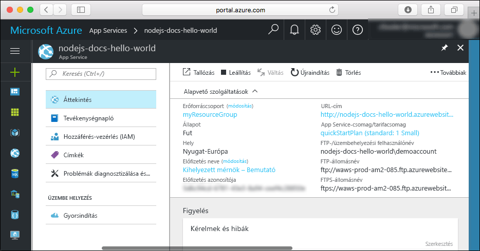

# <a name="create-a-python-web-app-in-azure"></a>Python-webapp létrehozása az Azure-ban

Az [Azure Web Apps](app-service-web-overview.md) egy hatékonyan méretezhető, önjavító webes üzemeltetési szolgáltatás.  Ez a gyorsútmutató a Python-alkalmazások Azure Web Apps szolgáltatásban történő fejlesztésén és üzembe helyezésén vezeti végig. Az [Azure CLI-vel](https://docs.microsoft.com/cli/azure/get-started-with-azure-cli) létrehozhatja a webalkalmazást, a Gittel pedig üzembe helyezheti a Python-mintakódot a webalkalmazásban.


Az oktatóanyag lépéseit Mac, Windows vagy Linux rendszert futtató gépen is követheti. Az előfeltételek telepítése után a lépések végrehajtása nagyjából öt percet vesz igénybe.

[!INCLUDE [quickstarts-free-trial-note](../../includes/quickstarts-free-trial-note.md)]

## <a name="prerequisites"></a>Előfeltételek

Az oktatóanyag elvégzéséhez:

* <a href="https://git-scm.com/" target="_blank">A Git telepítése</a>
* <a href="https://www.python.org/downloads/" target="_blank">Telepítse a Pythont</a>

## <a name="download-the-sample"></a>A minta letöltése

Egy terminálablakban futtassa a következő parancsot a mintaalkalmazás-tárház helyi számítógépre történő klónozásához.

```bash
git clone https://github.com/Azure-Samples/python-docs-hello-world
```

Váltson arra a könyvtárra, amelyben a mintakód megtalálható.

```bash
cd python-docs-hello-world
```

## <a name="run-the-app-locally"></a>Az alkalmazás futtatása helyben

Telepítse a szükséges csomagokat a(z) `pip` használatával.

```bash
pip install -r requirements.txt
```

Az alkalmazás a terminálablak megnyitásával és a `Python` parancs használatával helyben futtatható a beépített Python-webkiszolgáló indításához.

```bash
python main.py
```

Nyisson meg egy webböngészőt, majd keresse meg a mintaalkalmazást a `http://localhost:5000` címen.

Az oldalon látható mintaalkalmazáson ekkor a **Hello World** üzenetnek kell megjelennie.


A terminálablakban nyomja le a **Ctrl+C** billentyűkombinációt a webkiszolgálóból történő kilépéshez.

[!INCLUDE [cloud-shell-try-it.md](../../includes/cloud-shell-try-it.md)]

[!INCLUDE [Configure deployment user](../../includes/configure-deployment-user.md)]

[!INCLUDE [Create resource group](../../includes/app-service-web-create-resource-group.md)]

[!INCLUDE [Create app service plan](../../includes/app-service-web-create-app-service-plan.md)]

## <a name="create-a-web-app"></a>Webalkalmazás létrehozása

[!INCLUDE [Create web app](../../includes/app-service-web-create-web-app-python-no-h.md)]

Tallózással keresse meg az újonnan létrehozott webalkalmazást. Az _&lt;app name>_ helyett adja meg a webalkalmazása nevét.

```
http://<app name>.azurewebsites.net
```

Az új webalkalmazásnak így kell kinéznie:



[!INCLUDE [Push to Azure](../../includes/app-service-web-git-push-to-azure.md)]

```bash
Counting objects: 18, done.
Delta compression using up to 4 threads.
Compressing objects: 100% (16/16), done.
Writing objects: 100% (18/18), 4.31 KiB | 0 bytes/s, done.
Total 18 (delta 4), reused 0 (delta 0)
remote: Updating branch 'master'.
remote: Updating submodules.
remote: Preparing deployment for commit id '44e74fe7dd'.
remote: Generating deployment script.
remote: Generating deployment script for python Web Site
remote: Generated deployment script files
remote: Running deployment command...
remote: Handling python deployment.
remote: KuduSync.NET from: 'D:\home\site\repository' to: 'D:\home\site\wwwroot'
remote: Deleting file: 'hostingstart.html'
remote: Copying file: '.gitignore'
remote: Copying file: 'LICENSE'
remote: Copying file: 'main.py'
remote: Copying file: 'README.md'
remote: Copying file: 'requirements.txt'
remote: Copying file: 'virtualenv_proxy.py'
remote: Copying file: 'web.2.7.config'
remote: Copying file: 'web.3.4.config'
remote: Detected requirements.txt.  You can skip Python specific steps with a .skipPythonDeployment file.
remote: Detecting Python runtime from site configuration
remote: Detected python-3.4
remote: Creating python-3.4 virtual environment.
remote: .................................
remote: Pip install requirements.
remote: Successfully installed Flask click itsdangerous Jinja2 Werkzeug MarkupSafe
remote: Cleaning up...
remote: .
remote: Overwriting web.config with web.3.4.config
remote:         1 file(s) copied.
remote: Finished successfully.
remote: Running post deployment command(s)...
remote: Deployment successful.
To https://<app_name>.scm.azurewebsites.net/<app_name>.git
 * [new branch]      master -> master
```

## <a name="browse-to-the-app"></a>Az alkalmazás megkeresése tallózással

Tallózással keresse meg az üzembe helyezett alkalmazást a webböngésző használatával.

```bash
http://<app_name>.azurewebsites.net
```

A Python-mintakód az Azure App Service-webalkalmazásban fut.


**Gratulálunk!** Elvégezte az első Python-webapp üzembe helyezését az App Service-ben.

## <a name="update-and-redeploy-the-code"></a>A kód frissítése és ismételt üzembe helyezése

Egy helyi szövegszerkesztővel nyissa meg a `main.py` fájlt a Python-alkalmazásban, majd módosítsa kissé annak szövegét a `return` utasítás mellett:

```python
return 'Hello, Azure!'
```

A helyi terminálablakban mentse a módosításokat a Gitben, majd továbbítsa a kód módosításait az Azure-ba.

```bash
git commit -am "updated output"
git push azure master
```

Az üzembe helyezés befejezését követően váltson vissza [Az alkalmazás megkeresése tallózással](#browse-to-the-app) lépésben megnyitott böngészőablakra, és frissítse az oldalt.


## <a name="manage-your-new-azure-web-app"></a>Az új Azure-webapp kezelése

A létrehozott webalkalmazás felügyeletéhez ugorjon az <a href="https://portal.azure.com" target="_blank">Azure Portalra</a>.

A bal oldali menüben kattintson az **App Services** lehetőségre, majd az Azure-webalkalmazás nevére.


Megtekintheti a webalkalmazás Áttekintés oldalát. Itt elvégezhet olyan alapszintű felügyeleti feladatokat, mint a tallózás, leállítás, elindítás, újraindítás és törlés.



A bal oldali menü az alkalmazás konfigurálásához biztosít különböző oldalakat.

[!INCLUDE [cli-samples-clean-up](../../includes/cli-samples-clean-up.md)]

## <a name="next-steps"></a>További lépések

> [!div class="nextstepaction"]
> [Meglévő egyéni DNS-név hozzákapcsolása az Azure-webalkalmazásokhoz](app-service-web-tutorial-custom-domain.md)
