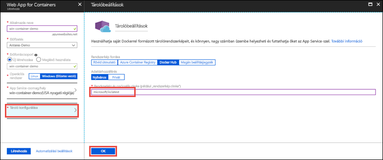

# <a name="run-a-custom-windows-container-in-azure-preview"></a>Egyéni Windows-tároló futtatása az Azure-ban (előzetes verzió)

Az [Azure App Service](app-service-web-overview.md) előre meghatározott, IIS-en futó alkalmazáscsoportokat biztosít Windows rendszeren, például az ASP.NET-et vagy a Node.js-t. Az előre konfigurált Windows-környezet letiltja az operációs rendszeren például a rendszergazdai hozzáférést, a szoftvertelepítést vagy a globális szerelvény-gyorsítótár módosítását (lásd [az operációs rendszer Azure App Service-funkcionalitásával foglalkozó részt](web-sites-available-operating-system-functionality.md)). Ha az alkalmazás az előre konfigurált környezet által engedélyezettnél nagyobb mértékű hozzáférést igényel, üzembe helyezhet egy egyéni Windows-tárolót. Ez a rövid útmutató azt ismerteti, hogyan helyezhet üzembe egyéni IIS-rendszerképet az Azure App Service-ben a [Docker Hubról](https://hub.docker.com/).


## <a name="sign-in-to-azure"></a>Bejelentkezés az Azure-ba

Jelentkezzen be az Azure Portalra a https://portal.azure.com webhelyen.

## <a name="create-a-windows-container-app"></a>Tárolóalkalmazás létrehozása Windowshoz

1. Válassza az Azure Portal bal felső sarkában az **Erőforrás létrehozása** lehetőséget.

2. Az Azure Marketplace-erőforrások fölött lévő keresőmezőben keresse meg és válassza ki a **Web App for Containers** elemet.

3. Adja meg az alkalmazás nevét (például *mywebapp*), fogadja el az alapértelmezett beállításokat egy új erőforráscsoport létrehozásához, majd kattintson a **Windows (előzetes verzió)** elemre az **Operációs rendszer** mezőben.

    

4. App Service-csomag létrehozásához kattintson az **App Service-csomag/Hely** > **Új létrehozása** elemre. Adja meg az új csomag nevét, fogadja el az alapértelmezett beállításokat, majd kattintson az **OK** gombra.

    

5. Kattintson a **Tároló konfigurálása** elemre, írja be a _microsoft/iis:latest_ sztringet a **Rendszerkép és opcionális címke** mezőbe, majd kattintson az **OK** gombra.

    

    Ebben a cikkben a nyilvános [microsoft/iis:latest](https://hub.docker.com/r/microsoft/iis/) Docker Hub-rendszerképet fogja használni. Ha az egyéni lemezkép nem a webalkalmazásban, hanem például az [Azure Container Registryben](/azure/container-registry/) vagy bármely egyéb privát adattárban található, itt konfigurálhatja.

6. Kattintson a **Létrehozás** parancsra, majd várjon, amíg az Azure létrehozza a szükséges erőforrásokat.

## <a name="browse-to-the-container-app"></a>A tárolóalkalmazás megkeresése

Értesítés jelenik meg, ha az Azure befejezte a művelet végrehajtását.


1. Kattintson az **Erőforrás megnyitása** elemre.

2. Az alkalmazás oldalán kattintson az **URL-cím** mező alatti hivatkozásra.

Egy új böngészőlapon a következő oldal jelenik meg:


Várjon néhány percet, és próbálkozzon újra, amíg meg nem jelenik az IIS kezdőlapja:


**Gratulálunk!** Első egyéni Windows-tárolója immár fut az Azure App Service-ben.

## <a name="see-container-start-up-logs"></a>A tároló rendszerindítási naplóinak megtekintése

A Windows-tároló betöltése hosszabb időbe telhet. A folyamat előrehaladásának nyomon követéséhez nyissa meg az alábbi URL-címet úgy, hogy az *\<app_name>* sztringet az alkalmazás nevére cseréli.
```
https://<app_name>.scm.azurewebsites.net/api/logstream
```

A streamelt naplók a következőképpen néznek ki:

```
2018-07-27T12:03:11  Welcome, you are now connected to log-streaming service.
27/07/2018 12:04:10.978 INFO - Site: win-container-demo - Start container succeeded. Container: facbf6cb214de86e58557a6d073396f640bbe2fdec88f8368695c8d1331fc94b
27/07/2018 12:04:16.767 INFO - Site: win-container-demo - Container start complete
27/07/2018 12:05:05.017 INFO - Site: win-container-demo - Container start complete
27/07/2018 12:05:05.020 INFO - Site: win-container-demo - Container started successfully
```

## <a name="use-a-different-docker-image"></a>Másik Docker-rendszerkép használata

Az alkalmazás futtatásához szabadon használhat bármilyen egyéni Docker-rendszerképet. Előbb ki kell azonban választania a kívánt keretrendszernek megfelelő [szülőrendszerképet](https://docs.docker.com/develop/develop-images/baseimages/): 

- .NET-keretrendszerre épülő alkalmazások üzembe helyezéséhez használjon egy, a Windows Server Core 2016 [Hosszútávú karbantartási csatorna (LTSC)](https://docs.microsoft.com/windows-server/get-started/semi-annual-channel-overview#long-term-servicing-channel-ltsc) kiadásán alapuló szülőrendszerképet. 
- .NET Core-alkalmazások üzembe helyezéséhez használjon egy, a Windows Server Nano 2016 [Hosszútávú karbantartási csatorna (LTSC)](https://docs.microsoft.com/windows-server/get-started/semi-annual-channel-overview#long-term-servicing-channel-ltsc) kiadásán alapuló szülőrendszerképet. 

Az alkalmazás indításakor a szülőrendszerkép letöltése hosszabb időbe telhet. Az indítási időt azonban lecsökkentheti az alábbi, az Azure App Service-ben már gyorsítótárazott szülőrendszerképek egyikének használatával:

- [microsoft/iis](https://hub.docker.com/r/microsoft/iis/):windowsservercore-ltsc2016 (legújabb)
- [microsoft/iis](https://hub.docker.com/r/microsoft/iis/):nanoserver-sac2016
- [microsoft/aspnet](https://hub.docker.com/r/microsoft/aspnet/):4.7.2-windowsservercore-ltsc2016, 4.7.2-es verzió (legújabb)
- [microsoft/dotnet](https://hub.docker.com/r/microsoft/dotnet/):2.1-aspnetcore-runtime
- [microsoft/dotnet](https://hub.docker.com/r/microsoft/dotnet/):2.1-sdk
