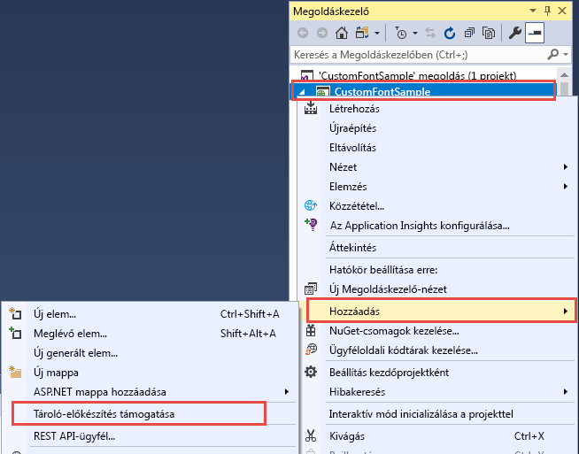
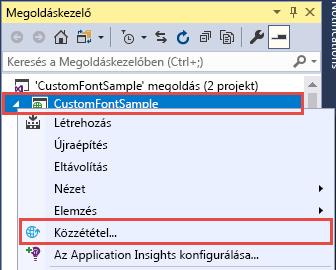
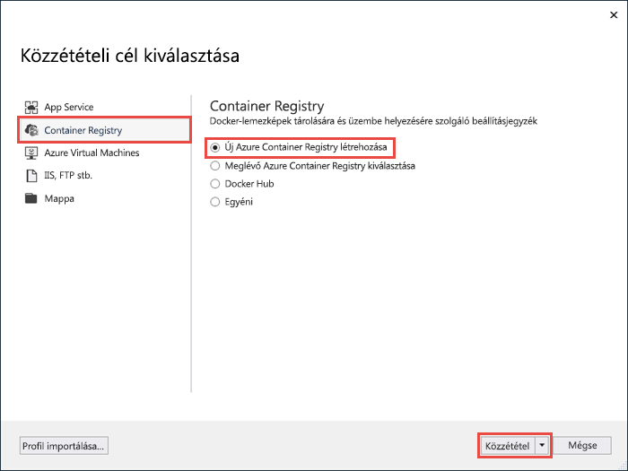
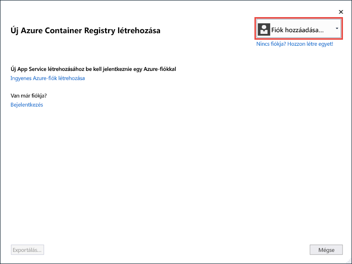
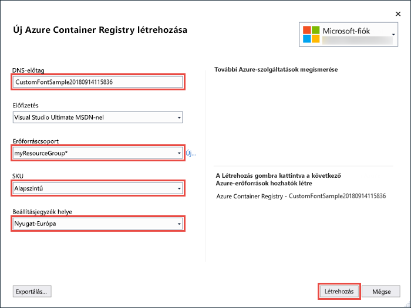
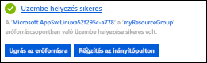

# <a name="migrate-an-aspnet-app-to-azure-app-service-using-a-windows-container-preview"></a>ASP.NET-alkalmazás áttelepítése az Azure App Service szolgáltatásba egy Windows-tároló (előzetes verzió) használatával

Az [Azure App Service](overview.md) előre meghatározott, IIS-en futó alkalmazáscsoportokat biztosít Windows rendszeren, például az ASP.NET-et vagy a Node.js-t. Az előre konfigurált Windows-környezet letiltja az operációs rendszeren például a rendszergazdai hozzáférést, a szoftvertelepítést vagy a globális szerelvény-gyorsítótár módosítását (lásd [az operációs rendszer Azure App Service-funkcionalitásával foglalkozó részt](operating-system-functionality.md)). Egy egyéni Windows-tároló az App Service-ben való használata lehetővé teszi az alkalmazáshoz szükséges operációs rendszer-módosítások végrehajtását, így egyszerűen áttelepítheti az egyéni operációsrendszer- és szoftverkonfigurációkat igénylő helyszíni alkalmazásokat. Ez az oktatóanyag bemutatja egy Windows betűkészlet-könyvtárba telepített egyéni betűkészletet használó ASP.NET-alkalmazás az App Service-be való áttelepítésének menetét. Egy Visual Studióból származó egyénileg konfigurált Windows-rendszerképet kell üzembe helyeznie az [Azure Container Registryben](https://docs.microsoft.com/azure/container-registry/), majd futtatnia az App Service-ben.


## <a name="prerequisites"></a>Előfeltételek

Az oktatóanyag elvégzéséhez:

- <a href="https://hub.docker.com/" target="_blank">Regisztráció Docker Hub-fiókra</a>
- <a href="https://docs.docker.com/docker-for-windows/install/" target="_blank">Windows rendszerhez készült Docker telepítése</a>.
- <a href="https://docs.microsoft.com/virtualization/windowscontainers/quick-start/quick-start-windows-10" target="_blank">A Docker átváltása Windows-tárolók futtatására</a>.
- <a href="https://www.visualstudio.com/downloads/" target="_blank">Telepítse a Visual Studio 2019</a> -et a **ASP.net, valamint a webes fejlesztési** és az **Azure-fejlesztési** számítási feladatokkal. Ha már telepítette a Visual Studio 2019-et:
    - Telepítse a legújabb frissítéseket a Visual Studióban a **Help** > **Check for Updates** (Súgó, Frissítések keresése) lehetőségre kattintva.
    - Adja hozzá a számítási feladatokat a Visual Studióban a **Tools** (Eszközök) >  **Get Tools and Features** (Eszközök és funkciók beszerzése) elemre kattintva.

## <a name="set-up-the-app-locally"></a>Az alkalmazás helyi beállítása

### <a name="download-the-sample"></a>A minta letöltése

Ebben a lépésben a helyi .NET-projektet állíthatja be.

- [Töltse le a mintaprojektet](https://github.com/Azure-Samples/custom-font-win-container/archive/master.zip).
- Bontsa ki az Extract paranccsal a *custom-font-win-container.zip* fájlt.

A mintaprojekt tartalmaz egy egyszerű ASP.NET-alkalmazást, amely egy Windows betűkészlet-könyvtárba telepített egyéni betűkészletet használ. A betűkészletek telepítése nem szükséges, de láthat egy példát egy mögöttes operációs rendszerrel integrált alkalmazásra. Az ilyen alkalmazások App Service-be történő áttelepítéséhez vagy újraírja a kódját az integráció eltávolításához, vagy áttelepíti egy egyéni Windows-tárolóban a jelenlegi formájában.

### <a name="install-the-font"></a>Betűkészlet telepítése

A Windows Explorerben navigáljon a _custom-font-win-container-master/CustomFontSample_ elemhez, majd kattintson a jobb gombbal a _FrederickatheGreat-Regular.ttf_ fájlra, és válassza az **Install** (Telepítés) lehetőséget.

Ez a betűkészlet nyilvánosan elérhető innen: [Google Fonts](https://fonts.google.com/specimen/Fredericka+the+Great).

### <a name="run-the-app"></a>Az alkalmazás futtatása

Nyissa meg a *custom-font-win-container/CustomFontSample.sln* fájlt a Visual Studióban. 

Az alkalmazás hibakeresés nélküli futtatásához nyomja le a `Ctrl+F5` billentyűkombinációt. Az alkalmazás megjelenik az alapértelmezett böngészőben. 


Az alkalmazás nem futtatható az App Service tesztkörnyezetben, mert egy telepített betűkészletet használ. Egy Windows-tároló használatával viszont üzembe helyezheti, mert a betűkészlet a Windows-tárolóban telepíthető.

### <a name="configure-windows-container"></a>Windows-tároló konfigurálása

A Megoldáskezelőben kattintson jobb gombbal a **CustomFontSample** projektre, és válassza az **Add** > **Container Orchestration Support** (Hozzáadás > Container Orchestration Support) lehetőséget.



Válassza a **Docker Compose** > **OK** elemet.

A projekt mostantól futtatható egy Windows-tárolóban. Egy _Docker-fájl_ lesz hozzáadva a **CustomFontSample** projekthez, illetve egy **docker-compose** projekt a megoldáshoz. 

Nyissa meg a **Docker-fájlt** a Megoldáskezelőből.

Egy [támogatott szülőrendszerképet](app-service-web-get-started-windows-container.md#use-a-different-parent-image) kell használnia. Módosítsa a szülőrendszerképet a `FROM` sor a következő kódra való lecserélésével:

```Dockerfile
FROM mcr.microsoft.com/dotnet/framework/aspnet:4.7.2-windowsservercore-ltsc2019
```

A fájl végéhez adja hozzá a következő sort, majd mentse a fájlt:

```Dockerfile
RUN ${source:-obj/Docker/publish/InstallFont.ps1}
```

Az _InstallFont.ps1_ megtalálható a **CustomFontSample** projektben. Ez egy egyszerű szkript a betűkészlet telepítéséhez. A [Script Centerben](https://gallery.technet.microsoft.com/scriptcenter/fb742f92-e594-4d0c-8b79-27564c575133) megtalálja a szkript egy összetettebb verzióját.

> [!NOTE]
> A Windows-tároló helyi teszteléséhez győződjön meg arról, hogy a Docker elindult a helyi gépen.
>

## <a name="publish-to-azure-container-registry"></a>Közzététel az Azure Container Registryben

Az [Azure Container Registry](https://docs.microsoft.com/azure/container-registry/) képes tárolni a rendszerképeket a tárolók üzembe helyezéséhez. Az App Service-t az Azure Container Registryben üzemeltetett rendszerképek használatára konfigurálhatja.

### <a name="open-publish-wizard"></a>Közzétételi varázsló megnyitása

A Megoldáskezelőben kattintson jobb gombbal a **CustomFontSample** projektre, majd válassza a **Publish** (Közzététel) lehetőséget.



### <a name="create-registry-and-publish"></a>Beállításjegyzék létrehozása és közzététele

A közzétételi varázslóban válassza a **Container Registry** > **Create New Azure Container Registry** > **Publish** (Container Registry > Új Azure Container Registry létrehozása > Közzététel) lehetőséget.



### <a name="sign-in-with-azure-account"></a>Bejelentkezés az Azure-fiók használatával

A **Create a new Azure Container Registry** (Új Azure Container Registry létrehozása) párbeszédpanelen válassza az **Add an account** (Fiók hozzáadása) gombot, majd jelentkezzen be az Azure-előfizetésébe. Ha már bejelentkezett, válassza ki a kívánt előfizetést tartalmazó fiókot a legördülő listából.



### <a name="configure-the-registry"></a>A beállításjegyzék konfigurálása

Konfigurálja az új Container Registryt a következő táblázatban javasolt értékek alapján. Ha végzett, kattintson a **Létrehozás** gombra.

| Beállítás  | Ajánlott érték | További tudnivalók |
| ----------------- | ------------ | ----|
|**DNS-előtag**| Megtarthatja a beállításjegyzék létrehozott nevét, vagy módosíthatja egy másik egyedi névre. |  |
|**Erőforráscsoport**| Kattintson a **New** (Új) lehetőségre, írja be a **myResourceGroup** kifejezést, majd kattintson az **OK** gombra. |  |
|**Termékváltozat**| Basic | [Árképzési szintek](https://azure.microsoft.com/pricing/details/container-registry/)|
|**Beállításjegyzékbeli hely**| Nyugat-Európa | |



Megnyílik egy terminálablak, és megjeleníti a rendszerkép üzembe helyezésének folyamatát. Várjon, amíg az üzembe helyezés befejeződik.

## <a name="sign-in-to-azure"></a>Bejelentkezés az Azure-ba

Jelentkezzen be az Azure Portalra a https://portal.azure.com webhelyen.

## <a name="create-a-web-app"></a>Webalkalmazás létrehozása

A bal oldali menüben válassza az **Erőforrás létrehozása** > **Web** > **Web App for Containers** lehetőséget.

### <a name="configure-app-basics"></a>Alkalmazás alapalapjainak konfigurálása

Az **alapvető** beállítások lapon konfigurálja a beállításokat az alábbi táblázat szerint, majd kattintson a Tovább gombra **: Docker**.

| Beállítás  | Ajánlott érték | További tudnivalók |
| ----------------- | ------------ | ----|
|**Előfizetés**| Győződjön meg arról, hogy a megfelelő előfizetés van kiválasztva. |  |
|**Erőforráscsoport**| Válassza az **új létrehozása**elemet, írja be a **myResourceGroup**, majd kattintson **az OK**gombra. |  |
|**Name (Név)**| Írjon be egy egyedi nevet. | A webalkalmazás URL-címe `http://<app-name>.azurewebsites.net`, amelyben az `<app-name>` az alkalmazás neve. |
|**Közzététel**| Docker-tároló | |
|**Operációs rendszer**| Windows | |
|**Régió**| Nyugat-Európa | |
|**Windows-csomag**| Válassza az **új létrehozása**elemet, írja be a **myAppServicePlan**, majd kattintson **az OK**gombra. | |

Az **alapvető beállítások** lap így néz ki:


### <a name="configure-windows-container"></a>Windows-tároló konfigurálása

A **Docker** lapon konfigurálja az egyéni Windows-tárolót az alábbi táblázatban látható módon, majd válassza a **felülvizsgálat + létrehozás**elemet.

| Beállítás  | Ajánlott érték |
| ----------------- | ------------ |
|**Rendszerkép forrása**| Azure Container-regisztráció |
|**Beállításjegyzék**| Válassza ki [a korábban létrehozott beállításjegyzéket](#publish-to-azure-container-registry). |
|**Rendszerkép**| customfontsample |
|**Tag**| legutóbbi |

### <a name="complete-app-creation"></a>Alkalmazás létrehozásának befejezése

Kattintson a **Létrehozás** parancsra, majd várjon, amíg az Azure létrehozza a szükséges erőforrásokat.

## <a name="browse-to-the-web-app"></a>A webalkalmazás kikeresése

Értesítés jelenik meg, ha az Azure befejezte a művelet végrehajtását.



1. Kattintson az **Erőforrás megnyitása** elemre.

2. Az alkalmazás oldalán kattintson az **URL-cím** mező alatti hivatkozásra.

Egy új böngészőlapon a következő oldal jelenik meg:


Várjon néhány percet, és próbálkozzon újra, amíg meg nem jelenik a kezdőlap a várt, gyönyörű betűtípussal:


**Gratulálunk!** Áttelepített egy ASP.NET-alkalmazást az Azure App Service szolgáltatásba egy Windows-tárolóban.

## <a name="see-container-start-up-logs"></a>A tároló rendszerindítási naplóinak megtekintése

A Windows-tároló betöltése hosszabb időbe telhet. Ha szeretné megtekinteni az előrehaladást, navigáljon a következő URL-címre\<az App *-name >* helyére az alkalmazás nevét.
```
https://<app-name>.scm.azurewebsites.net/api/logstream
```

A streamelt naplók a következőképpen néznek ki:

```
14/09/2018 23:16:19.889 INFO - Site: fonts-win-container - Creating container for image: customfontsample20180914115836.azurecr.io/customfontsample:latest.
14/09/2018 23:16:19.928 INFO - Site: fonts-win-container - Create container for image: customfontsample20180914115836.azurecr.io/customfontsample:latest succeeded. Container Id 329ecfedbe370f1d99857da7352a7633366b878607994ff1334461e44e6f5418
14/09/2018 23:17:23.405 INFO - Site: fonts-win-container - Start container succeeded. Container: 329ecfedbe370f1d99857da7352a7633366b878607994ff1334461e44e6f5418
14/09/2018 23:17:28.637 INFO - Site: fonts-win-container - Container ready
14/09/2018 23:17:28.637 INFO - Site: fonts-win-container - Configuring container
14/09/2018 23:18:03.823 INFO - Site: fonts-win-container - Container ready
14/09/2018 23:18:03.823 INFO - Site: fonts-win-container - Container start-up and configuration completed successfully
```

