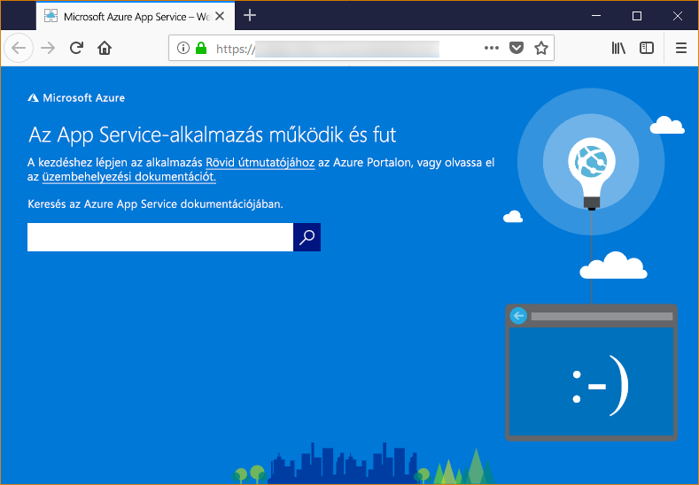

# <a name="configure-your-python-app-for-azure-app-service"></a>A Python-alkalmazás konfigurálása az Azure App Service-ben
Ez a cikk azt ismerteti, hogyan [Azure App Service](app-service-linux-intro.md) fut, a Python-alkalmazásokat, és hogyan szabhatja testre a szükség esetén az App Service viselkedését. Python-alkalmazások az összes telepíteni kell a szükséges [pip](https://pypi.org/project/pip/) modulok. Az App Service üzembe helyezési motorban (Kudu) automatikusan aktiválja a virtuális környezetet, és futtatja `pip install -r requirements.txt` , ha telepít egy [Git-tárház](../deploy-local-git.md), vagy egy [Zip-csomagját](../deploy-zip.md) az összeállítási folyamatairól kapcsolni.

> [!NOTE]
> [A Windows íz az App Service a Python](https://docs.microsoft.com/visualstudio/python/managing-python-on-azure-app-service) elavult, és a használata nem ajánlott.
>

## <a name="show-python-version"></a>Python-verzió megjelenítése

A jelenlegi Python-verzió megjelenítéséhez futtassa a következő parancsot a [Cloud Shell](https://shell.azure.com):

```azurecli-interactive
az webapp config show --resource-group <resource_group_name> --name <app_name> --query linuxFxVersion
```

Összes támogatott Python-verzió megjelenítéséhez futtassa a következő parancsot a [Cloud Shell](https://shell.azure.com):

```azurecli-interactive
az webapp list-runtimes --linux | grep PYTHON
```

Ehelyett saját tárolórendszerkép létrehozásával futtathatja a Python nem támogatott verzióját. További információkért lásd: [egyéni Docker-rendszerkép használata](tutorial-custom-docker-image.md).

## <a name="set-python-version"></a>Python-verzió beállítása

Futtassa a következő parancsot a [Cloud Shell](https://shell.azure.com) 3.7-es verzióját, a Python-verzió beállítása:

```azurecli-interactive
az webapp config set --resource-group <group_name> --name <app_name> --linux-fx-version "PYTHON|3.7"
```

## <a name="container-characteristics"></a>A tároló jellemzői

Python-alkalmazások üzembe helyezését futtathatók Docker-tároló a GitHub-adattár definiált Linuxon futó App Service [Python 3.6-os](https://github.com/Azure-App-Service/python/tree/master/3.6.6) vagy [Python 3.7](https://github.com/Azure-App-Service/python/tree/master/3.7.0).
Ez a tároló a következő jellemzőkkel rendelkezik:

- Az alkalmazások a [Gunicorn WSGI HTTP-kiszolgáló](https://gunicorn.org/) és további argumentumok használatával futnak`--bind=0.0.0.0 --timeout 600`.
- Alapértelmezés szerint az alaprendszerkép magában foglalja a Flask webes keretrendszert, de a tároló a WSGI-vel és a Python 3.7-es verziójával kompatibilis keretrendszereket is támogat, így például a Djangót.
- További csomagok, mint például a Django, telepítéséhez hozzon létre egy [*requirements.txt*](https://pip.pypa.io/en/stable/user_guide/#requirements-files) fájlt a projekt gyökérkönyvtárában a `pip freeze > requirements.txt` parancs használatával. Ezt követően a Git üzemelő példányával tegye közzé projektjét az App Service-be, amely az alkalmazásfüggőségek telepítéséhez automatikusan futtatja a tárolóban a `pip install -r requirements.txt` parancsot.

## <a name="container-startup-process"></a>Tároló indítási folyamat

Rendszerindítás során a Linux-tárolóban lévő App Service a következő lépéseket futtatja:

1. Használja a [egyéni indítási parancs](#customize-startup-command), ha meg van adva.
2. Létezik-e keresni egy [Django-alkalmazás](#django-app), és indítsa el a Gunicorn, ha észleli.
3. Létezik-e keresni egy [Flask-alkalmazás](#flask-app), és indítsa el a Gunicorn, ha észleli.
4. Ha más alkalmazás nem található, indítson el egy alapértelmezett alkalmazást, amely a tárolóba van beépítve.

A következő szakaszok további információkkal szolgálnak az egyes beállításokról.

### <a name="django-app"></a>Django-alkalmazás

Django-alkalmazások esetén az App Service a(z) `wsgi.py` nevű fájlt keresi az alkalmazáskódban, majd a Gunicorn futtatásához a következő parancsot használja:

```bash
# <module> is the path to the folder that contains wsgi.py
gunicorn --bind=0.0.0.0 --timeout 600 <module>.wsgi
```

Ha azt szeretné, hogy az indítási parancs pontosabb felett, egy egyéni indítási parancs, és cserélje le `<module>` , amely tartalmazza a modul nevével *wsgi.py*.

### <a name="flask-app"></a>Flask-alkalmazás

Flask, az App Service nevű fájlt keresi *application.py* vagy *app.py* és Gunicorn elindítja a következő:

```bash
# If application.py
gunicorn --bind=0.0.0.0 --timeout 600 application:app
# If app.py
gunicorn --bind=0.0.0.0 --timeout 600 app:app
```

Az alkalmazás fő modul megtalálható egy másik fájl, használjon másik nevet az alkalmazás objektumhoz, vagy a kívánt további argumentumok nyújtson Gunicorn, egy egyéni indítási parancs használata.

### <a name="default-behavior"></a>Alapértelmezett viselkedés

Ha az App Service nem talál egyéni parancsot, vagy Django-, illetve Flask-alkalmazást, akkor egy alapértelmezett csak olvasható alkalmazást futtat, amely az _opt/defaultsite_ mappában található. Az alapértelmezett alkalmazás a következőképpen jelenik meg:



## <a name="customize-startup-command"></a>Az indítási parancs testreszabása

A tároló indítási viselkedését egy egyéni Gunicorn indítási parancs megadásával szabályozhatja. Ha például egy olyan Flask-alkalmazással rendelkezik, amelynek a főmodulja a *hello.py*, és a fájlban a Flask-alkalmazásobjektum neve `myapp`, a parancs a következő lesz:

```bash
gunicorn --bind=0.0.0.0 --timeout 600 hello:myapp
```

Ha a főmodul egy almappában található (például `website`), a mappát a `--chdir` argumentummal határozhatja meg:

```bash
gunicorn --bind=0.0.0.0 --timeout 600 --chdir website hello:myapp
```

A Gunicorn számára további argumentumokat is adhat a parancshoz, például: `--workers=4`. További információkért lásd: [A Gunicorn futtatása](https://docs.gunicorn.org/en/stable/run.html) (docs.gunicorn.org).

Egy nem Gunicorn server használandó [aiohttp](https://aiohttp.readthedocs.io/en/stable/web_quickstart.html), futtathatja:

```bash
python3.7 -m aiohttp.web -H localhost -P 8080 package.module:init_func
```

Egyéni parancs megadásához tegye a következőket:

1. Keresse meg az [Alkalmazásbeállítások](../web-sites-configure.md?toc=%2fazure%2fapp-service%2fcontainers%2ftoc.json) oldalt a Microsoft Azure Portalon.
1. A **Futásidejű** beállításoknál a **Stack** beállításaként válassza a **Python 3.7** értéket, és adja meg a parancsot közvetlenül az **Indítási fájl** mezőben.
Azt is megteheti, mentheti a parancs a fájlt a projekt gyökérkönyvtárában található egy nevet, például *startup.txt* (vagy bármilyen más nevet). Ezután ezt a fájlt telepítse az App Service-be, és a fájlnevet adja meg az **Indítási fájl** mezőben. Ez a beállítás lehetővé teszi, hogy a parancsot az Azure Portal helyett a forráskódtárban kezelje.
1. Kattintson a **Mentés** gombra. Az App Service automatikusan újraindul, és néhány másodperc múlva a rendszer alkalmazza az egyéni indítási parancsot.

> [!Note]
> Az App Service figyelmen kívül hagyja az egyéni parancsfájl feldolgozásakor előforduló hibákat, majd az indítási folyamat következő lépéseként megkeresi a Django- és a Flask-alkalmazásokat. Ha nem várt viselkedést tapasztal, ellenőrizze, hogy az indítási fájl telepítve lett-e az App Service-be, és hogy az nem tartalmaz-e hibákat.

## <a name="access-environment-variables"></a>Hozzáférés a környezeti változókhoz

Az App Service, alkalmazás beállításait beállíthatja a kód kívül (lásd: [környezeti változókat](../web-sites-configure.md)). Ezután elérheti azokat a standard használatával [os.environ](https://docs.python.org/3/library/os.html#os.environ) mintát. Például egy alkalmazás-beállítás eléréséhez nevű `WEBSITE_SITE_NAME`, a következő kóddal:

```python
os.environ['WEBSITE_SITE_NAME']
```

## <a name="detect-https-session"></a>Észleli a HTTPS-KAPCSOLATON keresztül

Az App Service-ben [SSL-lezárást](https://wikipedia.org/wiki/TLS_termination_proxy) történik, ha a hálózati terheléselosztók, így az összes HTTPS-kérelmek elérni az alkalmazás nem titkosított HTTP-kérések. Ha az alkalmazás logikai igényeinek megfelelően, ellenőrizze, hogy ha a felhasználói kérelmek titkosítottak-e vagy sem, vizsgálja meg a `X-Forwarded-Proto` fejléc.

```python
if 'X-Forwarded-Proto' in request.headers and request.headers['X-Forwarded-Proto'] == 'https':
# Do something when HTTPS is used
```

Népszerű webes keretrendszerek, hozzáférést biztosítanak a `X-Forwarded-*` a szabványos mintában információkat. A [CodeIgniter](https://codeigniter.com/), a [is_https()](https://github.com/bcit-ci/CodeIgniter/blob/master/system/core/Common.php#L338-L365) értékét ellenőrzi `X_FORWARDED_PROTO` alapértelmezés szerint.

## <a name="troubleshooting"></a>Hibaelhárítás

- **Saját alkalmazáskódjának telepítése után megjelenik az alapértelmezett alkalmazás.** Az alapértelmezett alkalmazás jelenik meg, vagy még nem telepítette a kód App Service-ben, vagy hogy App Service-ben nem sikerült megtalálni a kód és az alapértelmezett alkalmazás ehelyett futott.
- Indítsa újra az App Service-t, várjon 15-20 másodpercet, és ellenőrizze újra az alkalmazást.
- Bizonyosodjon meg róla, hogy az App Service Linux- és nem Windows-alapú példányát használja. Az Azure CLI parancssori felületről futtassa az `az webapp show --resource-group <resource_group_name> --name <app_service_name> --query kind` parancsot, a `<resource_group_name>` és az `<app_service_name>` helyőrzőket megfelelően behelyettesítve. Az `app,linux` kimenetet kell látnia, máskülönben hozza újra létre az App Service szolgáltatást, és válassza a linuxos verziót.
- SSH- vagy a Kudu konzol használatával közvetlenül csatlakozzon az App Service-hez, és győződjön meg arról, hogy a fájlok léteznek a *site/wwwroot* könyvtárban. Ha a fájlok nem léteznek, tekintse át a telepítési folyamatot, és telepítse újra az alkalmazást.
- Ha a fájlok léteznek, az App Service nem tudta azonosítani az adott indítási fájlt. Ellenőrizze, hogy az alkalmazás felépítése, az App Service-ben a vár [Django](#django-app) vagy [Flask](#flask-app), vagy használjon egy egyéni indítási parancsot.
- **A böngészőben megjelenik „A szolgáltatás nem érhető el” üzenet.** A böngésző az App Service válaszára vára túllépte az időkorlátot, ami azt jelzi, hogy az App Service elindította a Gunicorn-kiszolgálót, de az alkalmazás kódját meghatározó argumentumok helytelenek.
- Frissítse a böngészőt, különösen akkor, ha az App Service-csomag legalacsonyabb tarifacsomagját használja. Az ingyenes szolgáltatásszintek használatakor például az alkalmazás lassabban indul, és csak a böngésző frissítése után fog ismét reagálni.
- Ellenőrizze, hogy az alkalmazás struktúrája megfelel-e annak, amit az App Service a [Django](#django-app) vagy a [Flask](#flask-app) számára elvár, vagy használjon [egyéni indítási parancsot](#customize-startup-command).
- SSH- vagy Kudu-konzol használatával kapcsolódjon az App Service-hez, majd vizsgálja meg a *LogFiles* mappában tárolt diagnosztikai naplókat. A naplózással kapcsolatos további információkért lásd: [Webalkalmazások diagnosztikai naplózása az Azure App Service szolgáltatásban](../troubleshoot-diagnostic-logs.md).
