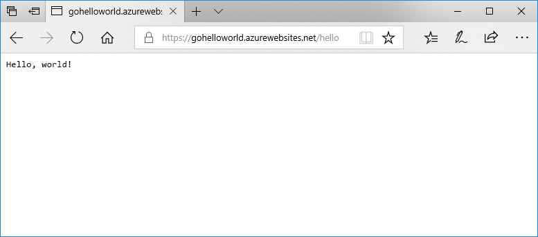

# <a name="deploy-a-dockergo-web-app-in-web-app-for-containers"></a>Docker-/Go-webalkalmazás üzembe helyezése az Azure Web App for Containersben

Az [App Service Linux](app-service-linux-intro.md) előre meghatározott, olyan programozási nyelvek támogatásával rendelkező alkalmazáscsoportokat biztosít Linuxon, amelybe beletartozik például a .NET, a PHP vagy a Node.js. Használhat egyéni Docker rendszerképet is, hogy a webalkalmazást egy, az Azure-ban nem meghatározott alkalmazáscsoportban futtassa. Ez a rövid útmutató webalkalmazások létrehozását és Go-rendszerképek Docker Hubból való üzembe helyezését mutatja be. Az [Azure CLI-vel](https://docs.microsoft.com/cli/azure/get-started-with-azure-cli) létrehozhatja a webalkalmazást.



[!INCLUDE [quickstarts-free-trial-note](../../../includes/quickstarts-free-trial-note.md)]

[!INCLUDE [cloud-shell-try-it.md](../../../includes/cloud-shell-try-it.md)]

[!INCLUDE [Configure deployment user](../../../includes/configure-deployment-user.md)]

[!INCLUDE [Create resource group](../../../includes/app-service-web-create-resource-group-linux.md)]

[!INCLUDE [Create app service plan](../../../includes/app-service-web-create-app-service-plan-linux.md)]

## <a name="create-a-web-app"></a>Webalkalmazás létrehozása

Az [ az webapp create](/cli/azure/webapp?view=azure-cli-latest#az-webapp-create) paranccsal hozzon létre egy [webalkalmazást](../app-service-web-overview.md) a `myAppServicePlan` App Service-csomagban. Ne felejtse el kicserélni az `<app name>` nevet egy globálisan egyedi alkalmazásnévre.

```azurecli-interactive
az webapp create --resource-group myResourceGroup --plan myAppServicePlan --name <app name> --deployment-container-image-name microsoft/azure-appservices-go-quickstart
```

Az előző parancsban a `--deployment-container-image-name` a nyilvános Docker Hub-rendszerképre mutat ([microsoft/azure-appservices-go-quickstart](https://hub.docker.com/r/microsoft/azure-appservices-go-quickstart/)).

A webalkalmazás létrehozása után az Azure CLI az alábbi példához hasonló eredményeket jelenít meg:

```json
{
  "availabilityState": "Normal",
  "clientAffinityEnabled": true,
  "clientCertEnabled": false,
  "cloningInfo": null,
  "containerSize": 0,
  "dailyMemoryTimeQuota": 0,
  "defaultHostName": "<app name>.azurewebsites.net",
  "deploymentLocalGitUrl": "https://<username>@<app name>.scm.azurewebsites.net/<app name>.git",
  "enabled": true,
  < JSON data removed for brevity. >
}
```

## <a name="browse-to-the-app"></a>Az alkalmazás megkeresése tallózással

```bash
http://<app_name>.azurewebsites.net/hello
```


**Gratulálunk!** Egy Go-alkalmazást futtató egyéni Docker-rendszerképet helyezett üzembe az Azure Web App for Containersben.

[!INCLUDE [Clean-up section](../../../includes/cli-script-clean-up.md)]

## <a name="next-steps"></a>További lépések

> [!div class="nextstepaction"]
> [Egyéni Docker-rendszerkép használata](tutorial-custom-docker-image.md)
