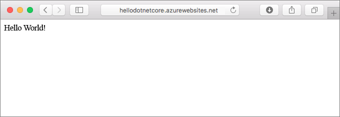
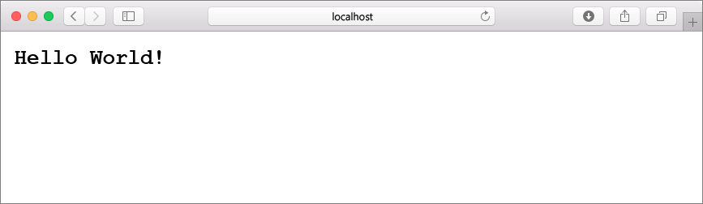
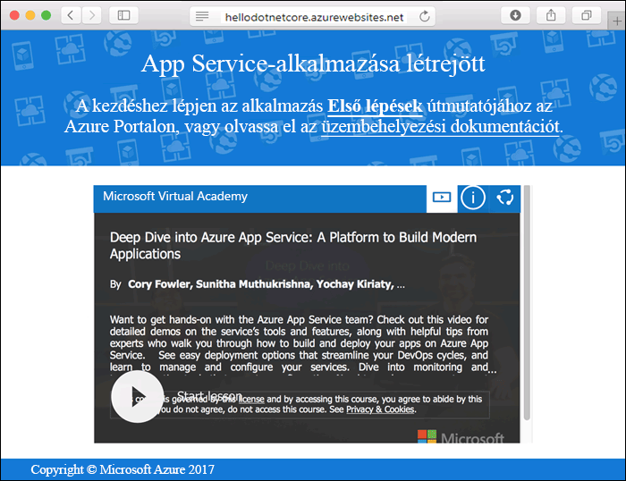
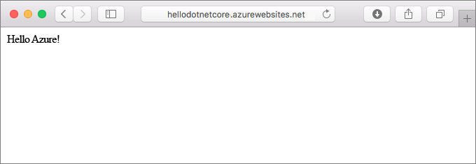
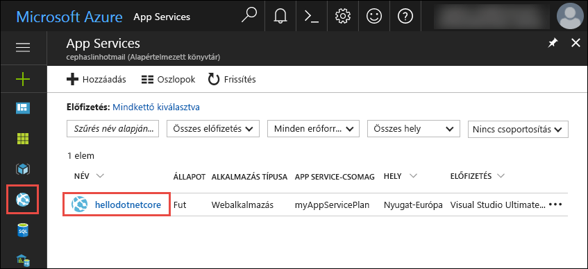
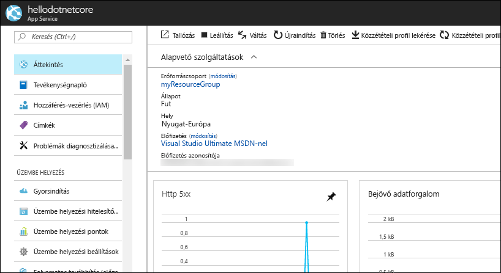

# <a name="create-a-net-core-web-app-in-app-service-on-linux"></a>.NET Core-webalkalmazás létrehozása Linuxon futó App Service-ben

A [Linuxon futó App Service](app-service-linux-intro.md) hatékonyan méretezhető, önjavító webes üzemeltetési szolgáltatást nyújt a Linux operációs rendszer használatával. Ez a rövid útmutató bemutatja, hogyan hozhat létre [.NET Core](https://docs.microsoft.com/aspnet/core/)-alkalmazást Linuxon futó App Service-ben. Az [Azure CLI-vel](https://docs.microsoft.com/cli/azure/get-started-with-azure-cli) létrehozhatja a webalkalmazást, a Git szoftver használatával pedig üzembe helyezheti a .NET Core-kódot a webalkalmazásban.



Az alábbi lépéseket Mac, Windows vagy Linux rendszert futtató gépen is követheti.

## <a name="prerequisites"></a>Előfeltételek

A gyorsútmutató elvégzéséhez:

* <a href="https://git-scm.com/" target="_blank">A Git telepítése</a>
* <a href="https://www.microsoft.com/net/download/core" target="_blank">A .NET Core SDK telepítése</a>

[!INCLUDE [quickstarts-free-trial-note](../../../includes/quickstarts-free-trial-note.md)]

## <a name="create-the-app-locally"></a>Az alkalmazás helyi létrehozása

A gép egy terminálablakában hozzon létre egy `hellodotnetcore` nevű könyvtárat, és módosítsa erre a jelenlegi könyvtárat.

```bash
md hellodotnetcore
cd hellodotnetcore
```

Hozzon létre egy új .NET Core-webalkalmazást.

```bash
dotnet new web
```

## <a name="run-the-app-locally"></a>Az alkalmazás futtatása helyben

Állítsa vissza a NuGet-csomagokat, és futtassa az alkalmazást.

```bash
dotnet restore
dotnet run
```

Nyisson meg egy webböngészőt, majd keresse fel az alkalmazást a következő címen: `http://localhost:5000`.

Az oldalon látható mintaalkalmazáson ekkor a **Hello World** üzenetnek kell megjelennie.



A terminálablakban nyomja le a **Ctrl+C** billentyűkombinációt a webkiszolgálóból történő kilépéshez. Inicializáljon egy Git-adattárat a .NET Core-projekthez.

```bash
git init
git add .
git commit -m "first commit"
```

[!INCLUDE [cloud-shell-try-it.md](../../../includes/cloud-shell-try-it.md)]

[!INCLUDE [Configure deployment user](../../../includes/configure-deployment-user.md)]

[!INCLUDE [Create resource group](../../../includes/app-service-web-create-resource-group.md)]

[!INCLUDE [Create app service plan](../../../includes/app-service-web-create-app-service-plan-linux.md)]

## <a name="create-a-web-app"></a>Webalkalmazás létrehozása

[!INCLUDE [Create web app](../../../includes/app-service-web-create-web-app-dotnetcore-no-h.md)]

Tallózással keresse meg az újonnan létrehozott webalkalmazást. Az _&lt;app name>_ helyett adja meg a webalkalmazása nevét.

```bash
http://<app name>.azurewebsites.net
```



[!INCLUDE [Push to Azure](../../../includes/app-service-web-git-push-to-azure.md)] 

```bash
Counting objects: 22, done.
Delta compression using up to 8 threads.
Compressing objects: 100% (18/18), done.
Writing objects: 100% (22/22), 51.21 KiB | 3.94 MiB/s, done.
Total 22 (delta 1), reused 0 (delta 0)
remote: Updating branch 'master'.
remote: Updating submodules.
remote: Preparing deployment for commit id '741f16d1db'.
remote: Generating deployment script.
remote: Project file path: ./hellodotnetcore.csproj
remote: Generated deployment script files
remote: Running deployment command...
remote: Handling ASP.NET Core Web Application deployment.
remote: ...............................................................................................
remote:   Restoring packages for /home/site/repository/hellodotnetcore.csproj...
remote: ....................................
remote:   Installing System.Xml.XPath 4.0.1.
remote:   Installing System.Diagnostics.Tracing 4.1.0.
remote:   Installing System.Threading.Tasks.Extensions 4.0.0.
remote:   Installing System.Reflection.Emit.ILGeneration 4.0.1.
remote:   ...
remote: Finished successfully.
remote: Running post deployment command(s)...
remote: Deployment successful.
To https://cephalin-dotnetcore.scm.azurewebsites.net/cephalin-dotnetcore.git
 * [new branch]      master -> master
```

## <a name="browse-to-the-app"></a>Az alkalmazás megkeresése tallózással

Tallózással keresse meg az üzembe helyezett alkalmazást a webböngésző használatával.

```bash
http://<app_name>.azurewebsites.net
```

A Node.js-mintakód beépített rendszerképpel rendelkező webalkalmazásban fut.


**Gratulálunk!** Elvégezte az első Node.js-alkalmazás üzembe helyezését a Linuxon futó App Service-ben.

## <a name="update-and-redeploy-the-code"></a>A kód frissítése és ismételt üzembe helyezése

A helyi könyvtárban nyissa meg a _Startup.cs_ fájlt. Végezzen el egy kis módosítást a `context.Response.WriteAsync` metódushívás szövegében:

```csharp
await context.Response.WriteAsync("Hello Azure!");
```

Mentse a módosításokat a Gitben, majd továbbítsa a kód módosításait az Azure-ba.

```bash
git commit -am "updated output"
git push azure master
```

Az üzembe helyezés befejezését követően váltson vissza **Az alkalmazás megkeresése tallózással** lépésben megnyitott böngészőablakra, és frissítse azt.



## <a name="manage-your-new-azure-web-app"></a>Az új Azure-webapp kezelése

A létrehozott webalkalmazás felügyeletéhez ugorjon az <a href="https://portal.azure.com" target="_blank">Azure Portalra</a>.

A bal oldali menüben kattintson az **App Services** lehetőségre, majd az Azure-webalkalmazás nevére.



Megtekintheti a webalkalmazás Áttekintés oldalát. Itt elvégezhet olyan alapszintű felügyeleti feladatokat, mint a tallózás, leállítás, elindítás, újraindítás és törlés. 



A bal oldali menü az alkalmazás konfigurálásához biztosít különböző oldalakat. 

[!INCLUDE [cli-samples-clean-up](../../../includes/cli-samples-clean-up.md)]

## <a name="next-steps"></a>Következő lépések

> [!div class="nextstepaction"]
> [.NET Core- és SQL Database-webalkalmazás összeállítása Linuxon futó Azure App Service-ben](tutorial-dotnetcore-sqldb-app.md)
