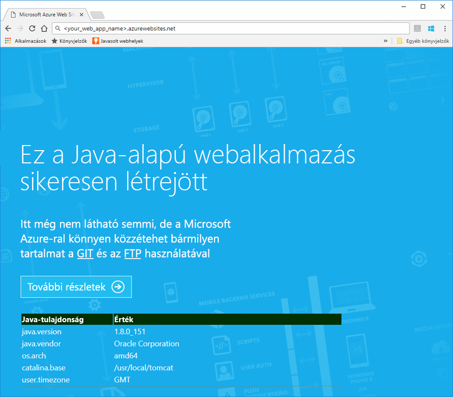
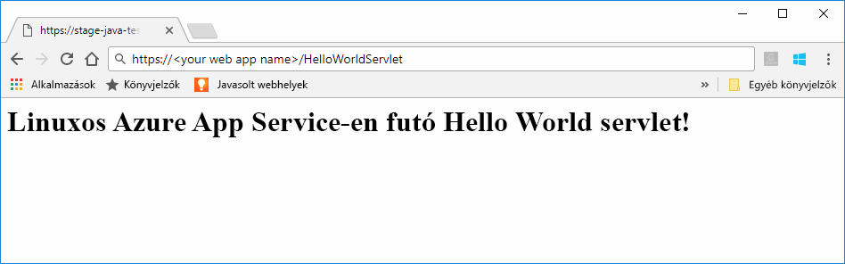
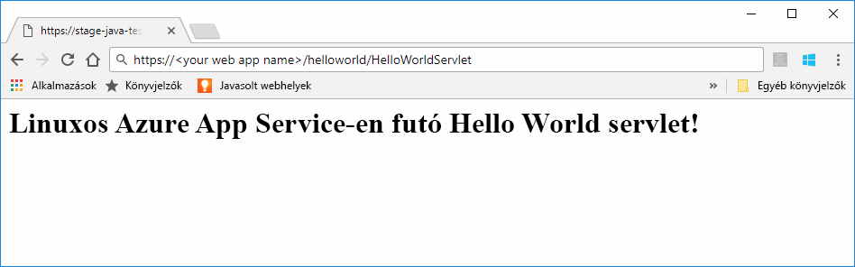

# <a name="preview-create-a-java-web-app-in-app-service-on-linux"></a>Előzetes verzió: Java-webalkalmazás létrehozása a Linuxon futó App Service-ben

A Linuxon futó App Service jelenleg előzetes verziójú funkcióként biztosítja a Java-webalkalmazások támogatását. Az előzetes verziókkal kapcsolatos további információ: [Kiegészítő használati feltételek a Microsoft Azure előzetes verziójú termékeihez](https://azure.microsoft.com/support/legal/preview-supplemental-terms/). A [Java-webalkalmazások üzembe helyezése a felhőben futó Linux-alapú tárolókban az IntelliJ-hez készült Azure-eszközkészlettel](https://docs.microsoft.com/java/azure/intellij/azure-toolkit-for-intellij-hello-world-web-app-linux) egy alternatív módszer a Java-alkalmazások saját tárolókban való üzembe helyezéséhez.

> [!NOTE]
> Ebben a cikkben egy Java-webalkalmazást helyezünk üzembe a Linuxon futó App Service-ben.
>

A [Linuxon futó App Service](app-service-linux-intro.md) hatékonyan méretezhető, önjavító webes üzemeltetési szolgáltatást nyújt a Linux operációs rendszer használatával. Ez a rövid útmutató azt ismerteti, hogyan helyezhet üzembe egy Java-alkalmazást a Linuxon futó App Service-ben egy beépített rendszerkép használatával. Az [Azure CLI-vel](https://docs.microsoft.com/cli/azure/get-started-with-azure-cli) létrehozhatja a webalkalmazást a beépített rendszerképpel, majd üzembe helyezheti a Java-alkalmazást a webalkalmazásban.


[!INCLUDE [quickstarts-free-trial-note](../../../includes/quickstarts-free-trial-note.md)]


## <a name="prerequisites"></a>Előfeltételek

A gyorsútmutató elvégzéséhez: 

* Rendelkeznie kell egy Azure-előfizetéssel. Ha nem rendelkezik Azure-előfizetéssel, mindössze néhány perc alatt létrehozhat egy [ingyenes fiókot](https://azure.microsoft.com/free/?ref=microsoft.com&utm_source=microsoft.com&utm_medium=docs&utm_campaign=visualstudio) a virtuális gép létrehozásának megkezdése előtt.
* [Telepítse a Git szoftvert](https://git-scm.com/).
* Telepítse az [Eclipse-et](https://www.eclipse.org/downloads/).


[!INCLUDE [cloud-shell-try-it.md](../../../includes/cloud-shell-try-it.md)]

[!INCLUDE [Configure deployment user](../../../includes/configure-deployment-user.md)]

[!INCLUDE [Create resource group](../../../includes/app-service-web-create-resource-group-linux.md)]

[!INCLUDE [Create app service plan](../../../includes/app-service-web-create-app-service-plan-linux.md)]


## <a name="create-a-web-app"></a>Webalkalmazás létrehozása

A Cloud Shellben hozzon létre egy [webalkalmazást](../app-service-web-overview.md) a `myAppServicePlan` App Service-csomagban. Ezt a [`az webapp create`](/cli/azure/webapp?view=azure-cli-latest#az_webapp_create) paranccsal teheti meg. A következő példában cserélje ki az *\<app_name>* nevet egy globálisan egyedi névre (érvényes karakterek: `a-z`, `0-9` és `-`). 

```azurecli-interactive
# Bash
az webapp create --name <app_name> --resource-group myResourceGroup --plan myAppServicePlan --runtime "TOMCAT|8.5-jre8"
# PowerShell
az --% webapp create --name <app_name> --resource-group myResourceGroup --plan myAppServicePlan --runtime "TOMCAT|8.5-jre8"
```

A **runtime** paraméternél használja valamelyiket a következő futtatókörnyezetek közül:
 * TOMCAT|8.5-jre8
 * TOMCAT|9.0-jre8


A webalkalmazás létrehozása után az Azure CLI az alábbi példához hasonló információkat jelenít meg:

```json
{
  "additionalProperties": {},
  "availabilityState": "Normal",
  "clientAffinityEnabled": true,
  "clientCertEnabled": false,
  "cloningInfo": null,
  "containerSize": 0,
  "dailyMemoryTimeQuota": 0,
  "defaultHostName": "<your web app name>.azurewebsites.net",
  "enabled": true,
  "enabledHostNames": [
    "<your web app name>.azurewebsites.net",
    "<your web app name>.scm.azurewebsites.net"
  ],
  "ftpPublishingUrl": "ftp://<your ftp URL>",  
  < JSON data removed for brevity. >
}
```

Másolja az **ftpPublishingUrl** értékét. Erre később lesz szüksége lesz, ha az FTP-s üzembe helyezést választja.

Tallózással keresse meg az újonnan létrehozott webalkalmazását.

```
http://<app_name>.azurewebsites.net
```

Ha a webalkalmazás működik, az alábbi képhez hasonló alapértelmezett kezdőképernyő jelenik meg:




## <a name="download-the-sample-java-app"></a>A Java-mintaalkalmazás letöltése

A gép terminálablakában futtassa a következő parancsot a mintaalkalmazás-adattár helyi számítógépre történő klónozásához. A mintaalkalmazást egy későbbi lépésben fogja üzembe helyezni.

```bash
git clone https://github.com/Azure-Samples/java-docs-hello-world
```


## <a name="deploying-the-java-app-to-app-service-on-linux"></a>A Java-alkalmazás üzembe helyezése a Linuxon futó App Service-ben

Nyissa meg a mintaprojektet az [Eclipse-ben](https://www.eclipse.org/downloads/), és [exportálja a Java-alkalmazást egy `helloworld.war` nevű Web Archive- (WAR-) fájlba](http://help.eclipse.org/kepler/index.jsp?topic=%2Forg.eclipse.wst.webtools.doc.user%2Ftopics%2Ftwcrewar.html).

A Java-alkalmazás WAR-fájlját a WarDeploy (jelenleg [előzetes verzióban](https://azure.microsoft.com/support/legal/preview-supplemental-terms/)) vagy FTP használatával is üzembe helyezheti.

Attól függően, hogy melyik üzembehelyezési módszert használja, a Java-webalkalmazás keresése során használandó relatív elérési út némiképp eltérő lesz.

### <a name="deploy-with-wardeploy"></a>Üzembe helyezés a WarDeploy használatával 

A WAR-fájl WarDeployjal való üzembe helyezéséhez küldjön egy POST kérelmet a következő cURL-példaparanccsal a *https://<your app name>.scm.azurewebsites.net/api/wardeploy* címre. A POST kérelem üzenettörzsének tartalmaznia kell a .war fájlt. Az alkalmazás üzembehelyezési hitelesítő adatai a kérelemben alapszintű HTTP-hitelesítéssel vannak megadva. További információ a WarDeployról: [Alkalmazások üzembe helyezése az Azure App Service-ben ZIP- vagy WAR-fájlokkal](../app-service-deploy-zip.md).

```bash
curl -X POST -u <username> --data-binary @"<war_file_path>" https://<app_name>.scm.azurewebsites.net/api/wardeploy
```

Frissítse a következőket:

* `username` – Használja az előzőleg létrehozott üzembehelyezési felhasználónevet.
* `war_file_path` – Használja a WAR-fájl helyi elérési útját.
* `app_name` – Használja az előzőleg létrehozott alkalmazásnevet.

Hajtsa végre a parancsot. Amikor a cURL kéri, adja meg az üzembehelyezési jelszót.

Keresse meg az üzembe helyezett alkalmazást a webböngészőjében a következő URL-cím használatával.

```bash
http://<app_name>.azurewebsites.net
```

A Java-mintakód beépített rendszerképpel rendelkező webalkalmazásban fut.


Keresse meg a servletet a webböngészővel.

```bash
http://<app_name>.azurewebsites.net/HelloWorldServlet
```

A servlet beépített rendszerképpel rendelkező webalkalmazásban fut.




**Gratulálunk!** Üzembe helyezte az első Java-webalkalmazását a Linuxon futó App Service-ben.


### <a name="ftp-deployment"></a>Üzembe helyezés FTP használatával

A WAR-fájlt FTP használatával is üzembe helyezheti. 

FTP-vel mentse a fájlt a webalkalmazás */home/site/wwwroot/webapps* könyvtárába. A következő példaparancs a cURL-t használja:

```bash
curl -T war_file_path -u "app_name\username" ftp://webappFTPURL/site/wwwroot/webapps/
```

Frissítse a következőket:

* `war_file_path` – Használja a WAR-fájl helyi elérési útját.
* `app_name` – Használja az előzőleg létrehozott alkalmazásnevet.
* `username` – Használja az előzőleg létrehozott üzembehelyezési felhasználónevet.
* `webappFTPURL` – Használja a webalkalmazás korábban másolt **FTP-gazdagépnév** értékét. Az FTP-gazdagépnév az [Azure Portalon](https://portal.azure.com/) a webalkalmazás **Áttekintés** panelén is látható.

Hajtsa végre a parancsot. Amikor a cURL kéri, adja meg az üzembehelyezési jelszót.


Keresse meg az üzembe helyezett alkalmazást a webböngészőjében a következő URL-cím használatával.

```bash
http://<app_name>.azurewebsites.net/helloworld
```

A Java-mintakód beépített rendszerképpel rendelkező webalkalmazásban fut.


Keresse meg a servletet a webböngészővel.

```bash
http://<app_name>.azurewebsites.net/helloworld/HelloWorldServlet
```

A Java-mintakód beépített rendszerképpel rendelkező webalkalmazásban fut.




**Gratulálunk!** Üzembe helyezte az első Java-webalkalmazását a Linuxon futó App Service-ben.


[!INCLUDE [cli-samples-clean-up](../../../includes/cli-samples-clean-up.md)]


## <a name="next-steps"></a>További lépések

A Java Azure-ban való használatával kapcsolatos további információért kövesse az alábbi hivatkozásokat:

* [Azure Java-fejlesztőknek](https://docs.microsoft.com/java/azure/)
* [Hello World webalkalmazás üzembe helyezése a felhőben futó Linux-tárolóban az IntelliJ-hez készült Azure-eszközkészlet használatával](https://docs.microsoft.com/java/azure/intellij/azure-toolkit-for-intellij-hello-world-web-app-linux)
* [Java-eszközök a Visual Studio Team Serviceshez](https://java.visualstudio.com/)
