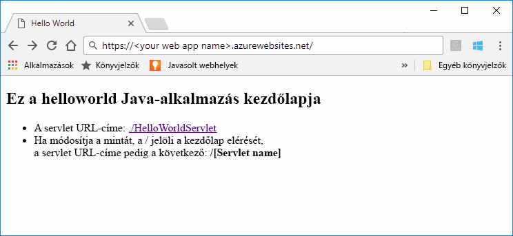
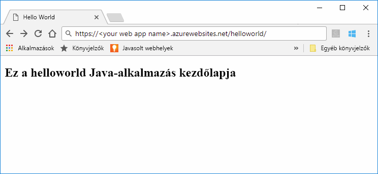

# <a name="quickstart-create-a-java-app-in-app-service-on-linux"></a>Gyors útmutató: Egy Java-alkalmazás létrehozása Linuxon futó App Service-ben

A [Linuxon futó App Service](app-service-linux-intro.md) hatékonyan méretezhető, önjavító webes üzemeltetési szolgáltatást nyújt a Linux operációs rendszer használatával. Ez a rövid útmutató bemutatja, hogyan használhatja a [Azure CLI-vel](https://docs.microsoft.com/cli/azure/get-started-with-azure-cli) együtt a [készült Azure Web Apps (előzetes verzió)](https://github.com/Microsoft/azure-maven-plugins/tree/develop/azure-webapp-maven-plugin) üzembe Java web archive-(WAR-) fájlt.



[!INCLUDE [quickstarts-free-trial-note](../../../includes/quickstarts-free-trial-note.md)]

[!INCLUDE [cloud-shell-try-it.md](../../../includes/cloud-shell-try-it.md)]

## <a name="create-a-java-app"></a>Java-alkalmazás létrehozása

Hajtsa végre a következő Maven-parancsot a Cloud Shell használatával hozzon létre egy új alkalmazást nevű `helloworld`:

```bash
mvn archetype:generate -DgroupId=example.demo -DartifactId=helloworld -DarchetypeArtifactId=maven-archetype-webapp
```

## <a name="configure-the-maven-plugin"></a>A Maven beépülő moduljának konfigurálása

A Mavenből való üzembe helyezéshez használja a Cloud Shell kódszerkesztőjét a `helloworld` könyvtár `pom.xml` projektfájljának megnyitásához. 

```bash
code pom.xml
```

Ezután adja hozzá a következő bővítménydefiníciót a `pom.xml` fájl `<build>` részéhez.

```xml
<plugins>
    <!--*************************************************-->
    <!-- Deploy to Tomcat in App Service Linux           -->
    <!--*************************************************-->
    <plugin>
        <groupId>com.microsoft.azure</groupId>
        <artifactId>azure-webapp-maven-plugin</artifactId>
        <version>1.5.3</version>
        <configuration>
            <!-- App information -->
            <resourceGroup>${RESOURCEGROUP_NAME}</resourceGroup>
            <appName>${WEBAPP_NAME}</appName>
            <region>${REGION}</region>
   
            <!-- Java Runtime Stack for App on Linux-->
            <linuxRuntime>tomcat 8.5-jre8</linuxRuntime> 
        </configuration>
    </plugin>
</plugins>
```    


> [!NOTE] 
> Ebben a cikkben csak WAR-fájlokba csomagolt Java-alkalmazásokat használunk. Ez a beépülő modul támogatja a JAR-webalkalmazásokat is. Ennek kipróbálásához tekintse meg [a Java SE JAR-fájlok Linuxon futó App Service-ben való üzembe helyezését ismertető részt](https://docs.microsoft.com/java/azure/spring-framework/deploy-spring-boot-java-app-with-maven-plugin?toc=%2fazure%2fapp-service%2fcontainers%2ftoc.json).


Frissítse a következő helyőrzőket a bővítmény konfigurációjában:

| Helyőrző | Leírás |
| ----------- | ----------- |
| `RESOURCEGROUP_NAME` | Az új erőforráscsoport, amelyben létrehozza az alkalmazás neve. Ha egy alkalmazás összes erőforrását egy csoportban helyezi el, akkor mindet együtt kezelheti. Az erőforráscsoport törlésével például az alkalmazáshoz társított összes erőforrást törli. Frissítse ezt az értéket egy egyedi új erőforráscsoport-névre, például *TestResources*. Ezt az erőforráscsoport-nevet használjuk egy későbbi szakaszban az összes Azure-erőforrás eltávolításához. |
| `WEBAPP_NAME` | Az alkalmazás neve lesz az állomásnév az alkalmazás telepítésekor az Azure-ba (WEBAPP_NAME.azurewebsites.net) rész. Frissítse ezt az értéket fogja futtatni a Java-alkalmazás, például új App Service-alkalmazás egyedi nevet *contoso*. |
| `REGION` | Ha az alkalmazás üzemel, például egy Azure-régió `westus2`. A régiók listáját az `az account list-locations` paranccsal, a Cloud Shellben vagy a CLI-ben kérheti le. |

## <a name="deploy-the-app"></a>Az alkalmazás üzembe helyezése

Helyezze üzembe a Java-alkalmazást az Azure-ban az alábbi paranccsal:

```bash
mvn package azure-webapp:deploy
```

Az üzembe helyezést követően keresse meg az üzembe helyezett alkalmazást a webböngészőjében a következő URL-cím használatával, például: `http://<webapp>.azurewebsites.net/helloworld`. 



**Gratulálunk!** Üzembe helyezte az első Java-webalkalmazását a Linuxon futó App Service-ben.


[!INCLUDE [cli-samples-clean-up](../../../includes/cli-samples-clean-up.md)]


## <a name="next-steps"></a>További lépések

Ez a rövid útmutatóban használt Maven konfigurált Java-alkalmazás létrehozása a [Azure Web Appshez készült maven bővítmény](https://github.com/Microsoft/azure-maven-plugins/tree/develop/azure-webapp-maven-plugin), majd üzembe helyezi a linuxon futó App Service web archive csomagolt Java-alkalmazás. Tekintse meg az alábbi oktatóanyagok és útmutatók további információk az App Service Linux rendszeren Java-alkalmazások futtatására.

- [Oktatóanyag: Üzembe helyezése egy Java vállalati alkalmazás-és PostgreSQL](tutorial-java-enterprise-postgresql-app.md)
- [A Tomcat-adatforrás konfigurálása](app-service-linux-java.md#tomcat)
- [CI/CD a jenkins-szel](/azure/jenkins/deploy-jenkins-app-service-plugin)
- [Alkalmazásteljesítmény-figyelési eszközök beállítása](how-to-java-apm-monitoring.md)
