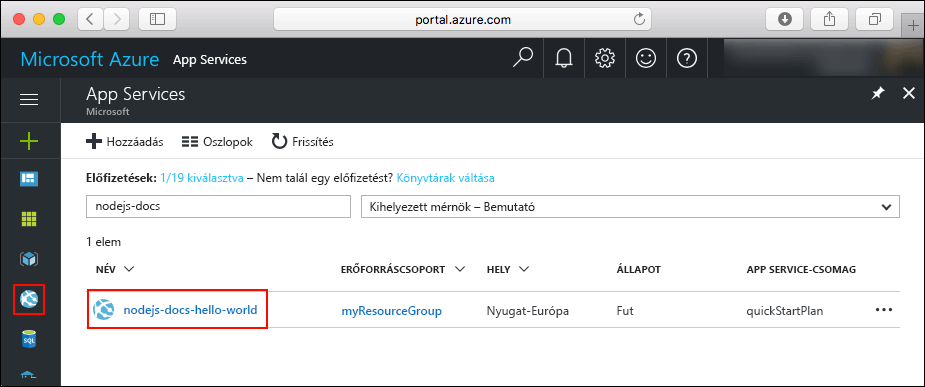
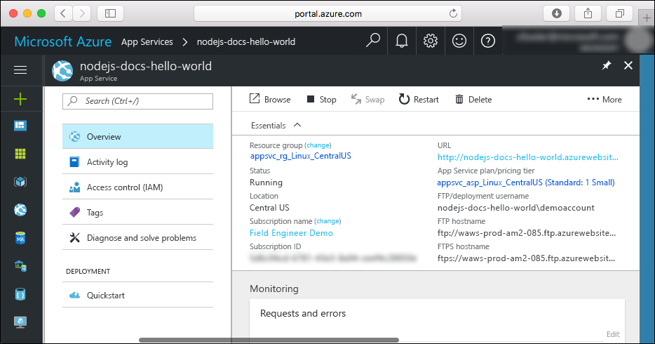

# <a name="create-a-nodejs-web-app-in-azure-app-service-on-linux"></a>Node.js-webalkalmazás létrehozása a Linuxon futó Azure App Service-ben

> [!NOTE]
> Ebben a cikkben egy alkalmazást helyezünk üzembe a Linuxon futó App Service-ben. A _Windowson_ futó App Service-ben való üzembe helyezéssel kapcsolatban lásd: [Node.js-webalkalmazás létrehozása az Azure-ban](../app-service-web-get-started-nodejs.md).
>

A [Linuxon futó App Service](app-service-linux-intro.md) hatékonyan méretezhető, önjavító webes üzemeltetési szolgáltatást nyújt a Linux operációs rendszer használatával. Ez a rövid útmutató a Node.js-alkalmazások Linuxon futó App Service-be történő üzembe helyezésén vezeti végig a [Cloud Shell](https://docs.microsoft.com/en-us/azure/cloud-shell/overview) használatával.

Ezt a rövid útmutatót a Cloud Shellben végezzük el, a parancsok azonban helyileg is futtathatók az [Azure CLI](/cli/azure/install-azure-cli) használatával.


[!INCLUDE [quickstarts-free-trial-note](../../../includes/quickstarts-free-trial-note.md)]

[!INCLUDE [cloud-shell-try-it.md](../../../includes/cloud-shell-try-it.md)]

## <a name="install-web-app-extension-for-cloud-shell"></a>A Cloud Shell webalkalmazás-bővítményének telepítése

A rövid útmutató elvégzéséhez az [az web app extension](https://docs.microsoft.com/en-us/cli/azure/extension?view=azure-cli-latest#az-extension-add) hozzáadása szükséges. Ha a bővítmény már telepítve van, frissítse a legújabb verzióra. A webalkalmazás-bővítmény frissítéséhez írja be az `az extension update -n webapp` parancsot.

A webalkalmazás-bővítmény telepítéséhez futtassa az alábbi parancsot:

```bash
az extension add -n webapp
```

A bővítmény telepítése után a Cloud Shell az alábbi példához hasonló információkat jelenít meg:

```bash
The installed extension 'webapp' is in preview.
```

## <a name="download-the-sample"></a>A minta letöltése

A Cloud Shellben hozzon létre egy quickstart könyvtárat, és lépjen a könyvtárba.

```bash
mkdir quickstart

cd quickstart
```

Ezután futtassa a következő parancsot a mintaalkalmazás-adattár a quickstart könyvtárba való klónozásához.

```bash
git clone https://github.com/Azure-Samples/nodejs-docs-hello-world
```

Futtatás közben a parancs a következő példához hasonló információkat jelenít meg:

```bash
Cloning into 'nodejs-docs-hello-world'...
remote: Counting objects: 40, done.
remote: Total 40 (delta 0), reused 0 (delta 0), pack-reused 40
Unpacking objects: 100% (40/40), done.
Checking connectivity... done.
````

## <a name="create-a-web-app"></a>Webalkalmazás létrehozása

Lépjen abba a könyvtárba, amelyben a mintakód található, és futtassa az `az webapp up` parancsot.

A következő példában az <app_name> helyett adjon meg egy egyedi alkalmazásnevet.

```bash
cd nodejs-docs-hello-world

az webapp up -n <app_name>
```

A parancs futtatása eltarthat néhány percig. Futtatás közben a parancs a következő példához hasonló információkat jelenít meg:

```json
Creating Resource group 'appsvc_rg_Linux_CentralUS' ...
Resource group creation complete
Creating App service plan 'appsvc_asp_Linux_CentralUS' ...
App service plan creation complete
Creating app '<app_name>' ....
Webapp creation complete
Updating app settings to enable build after deployment
Creating zip with contents of dir /home/username/quickstart/nodejs-docs-hello-world ...
Preparing to deploy and build contents to app.
Fetching changes.

Generating deployment script.
Generating deployment script.
Generating deployment script.
Running deployment command...
Running deployment command...
Running deployment command...
Deployment successful.
All done.
{
  "app_url": "https://<app_name>.azurewebsites.net",
  "location": "Central US",
  "name": "<app_name>",
  "os": "Linux",
  "resourcegroup": "appsvc_rg_Linux_CentralUS ",
  "serverfarm": "appsvc_asp_Linux_CentralUS",
  "sku": "STANDARD",
  "src_path": "/home/username/quickstart/nodejs-docs-hello-world ",
  "version_detected": "6.9",
  "version_to_create": "node|6.9"
}
```

Az `az webapp up` parancs a következő műveleteket hajtja végre:

- Egy alapértelmezett erőforráscsoport létrehozása.

- Egy alapértelmezett App Service-csomag létrehozása.

- Egy alkalmazás létrehozása a megadott néven.

- Fájlok [tömörített üzembe helyezése](https://docs.microsoft.com/en-us/azure/app-service/app-service-deploy-zip) az aktuális munkakönyvtárból a webalkalmazásba.

## <a name="browse-to-the-app"></a>Az alkalmazás megkeresése tallózással

Tallózással keresse meg az üzembe helyezett alkalmazást a webböngésző használatával. Az <app_name> helyett adja meg a webalkalmazás nevét.

```bash
http://<app_name>.azurewebsites.net
```

A Node.js mintakód beépített rendszerképpel rendelkező webalkalmazásban fut.


**Gratulálunk!** Elvégezte az első Node.js-alkalmazás üzembe helyezését a Linuxon futó App Service-ben.

## <a name="update-and-redeploy-the-code"></a>A kód frissítése és ismételt üzembe helyezése

A Cloud Shellben írja be a `nano index.js` parancsot a nano szövegszerkesztő megnyitásához.


 Végezzen el egy kis módosítást a `response.end` hívásának szövegében:

```nodejs
response.end("Hello Azure!");
```

Mentse a módosításokat, és lépjen ki a nanóból. A mentéshez a `^O`, a kilépéshez a `^X` parancsot használja.

Most újra üzembe helyezzük az alkalmazást. Az `<app_name>` helyére írja a webalkalmazás nevét.

```bash
az webapp up -n <app_name>
```

Az üzembe helyezés befejezését követően váltson vissza **Az alkalmazás megkeresése tallózással** lépésben megnyitott böngészőablakra, és frissítse az oldalt.


## <a name="manage-your-new-azure-web-app"></a>Az új Azure-webapp kezelése

A létrehozott webalkalmazás felügyeletéhez ugorjon az <a href="https://portal.azure.com" target="_blank">Azure Portalra</a>.

A bal oldali menüben kattintson az **App Services** lehetőségre, majd az Azure-webalkalmazás nevére.



Megtekintheti a webalkalmazás Áttekintés oldalát. Itt elvégezheti az olyan alapszintű felügyeleti feladatokat, mint a böngészés, leállítás, elindítás, újraindítás és törlés.



A bal oldali menü az alkalmazás konfigurálásához biztosít különböző oldalakat.

## <a name="clean-up-resources"></a>Az erőforrások eltávolítása

Az előző lépésekben Azure-erőforrásokat hozott létre egy erőforráscsoportban. Ha várhatóan nem lesz szüksége ezekre az erőforrásokra a jövőben, törölje az erőforráscsoportot a Cloud Shellben. Ha módosította a régiót, módosítsa az `appsvc_rg_Linux_CentralUS` erőforráscsoport-nevet az alkalmazásnak megfelelő erőforráscsoportra.

```azurecli-interactive
az group delete --name appsvc_rg_Linux_CentralUS
```

A parancs futtatása egy percig is eltarthat.

## <a name="next-steps"></a>További lépések

> [!div class="nextstepaction"]
> [Node.js és MongoDB](tutorial-nodejs-mongodb-app.md)
