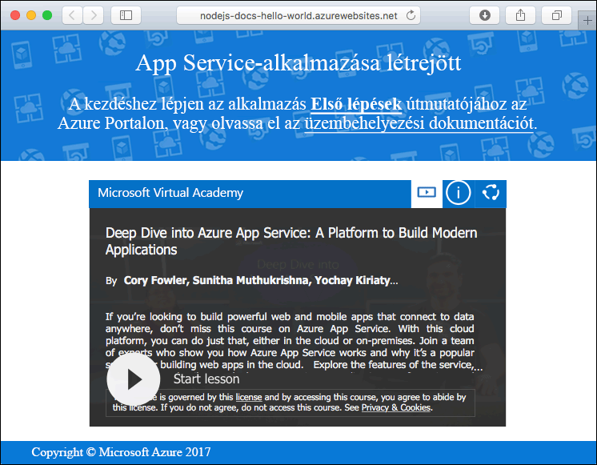

# <a name="create-a-nodejs-web-app-in-azure-app-service-on-linux"></a>Node.js-webalkalmazás létrehozása a Linuxon futó Azure App Service-ben

> [!NOTE]
> Ebben a cikkben egy alkalmazást helyezünk üzembe a Linuxon futó App Service-ben. A _Windowson_ futó App Service-ben való üzembe helyezéssel kapcsolatban lásd: [Node.js-webalkalmazás létrehozása az Azure-ban](../app-service-web-get-started-nodejs.md).
>

A [Linuxon futó App Service](app-service-linux-intro.md) hatékonyan méretezhető, önjavító webes üzemeltetési szolgáltatást nyújt a Linux operációs rendszer használatával. Ez a gyorsútmutató a Node.js-alkalmazások Linuxon futó App Service-be történő üzembe helyezésén vezeti végig egy beépített rendszerkép használatával. Az [Azure CLI-vel](https://docs.microsoft.com/cli/azure/get-started-with-azure-cli) létrehozhatja a beépített rendszerképpel rendelkező webalkalmazást, a Git szoftver használatával pedig üzembe helyezheti a Node.js-kódot a webalkalmazásban.


Az alábbi lépéseket Mac, Windows vagy Linux rendszert futtató gépen is követheti.

## <a name="prerequisites"></a>Előfeltételek

A gyorsútmutató elvégzéséhez:

* <a href="https://git-scm.com/" target="_blank">A Git telepítése</a>
* <a href="https://nodejs.org/" target="_blank">Telepítse a Node.js-t és az NPM-et</a>

[!INCLUDE [quickstarts-free-trial-note](../../../includes/quickstarts-free-trial-note.md)]

## <a name="download-the-sample"></a>A minta letöltése

A gép terminálablakában futtassa a következő parancsot a mintaalkalmazás-adattár helyi számítógépre történő klónozásához.

```bash
git clone https://github.com/Azure-Samples/nodejs-docs-hello-world
```

Ezt a terminálablakot használhatja az összes parancs gyorsútmutatóban történő futtatásához.

Váltson arra a könyvtárra, amelyben a mintakód megtalálható.

```bash
cd nodejs-docs-hello-world
```

## <a name="run-the-app-locally"></a>Az alkalmazás futtatása helyben

Az alkalmazás a terminálablak megnyitásával és a `npm start` szkript használatával helyben futtatható a beépített Node.js HTTP-kiszolgáló indításához.

```bash
npm start
```

Nyisson meg egy webböngészőt, majd keresse meg a mintaalkalmazást a `http://localhost:1337` címen.

Az oldalon látható mintaalkalmazáson ekkor a **Hello World** üzenetnek kell megjelennie.


A terminálablakban nyomja le a **Ctrl+C** billentyűkombinációt a webkiszolgálóból történő kilépéshez.

[!INCLUDE [cloud-shell-try-it.md](../../../includes/cloud-shell-try-it.md)]

[!INCLUDE [Configure deployment user](../../../includes/configure-deployment-user.md)]

[!INCLUDE [Create resource group](../../../includes/app-service-web-create-resource-group.md)]

[!INCLUDE [Create app service plan](../../../includes/app-service-web-create-app-service-plan-linux.md)]

## <a name="create-a-web-app"></a>Webalkalmazás létrehozása

[!INCLUDE [Create web app](../../../includes/app-service-web-create-web-app-nodejs-no-h.md)]

Tallózással keresse meg az újonnan létrehozott webalkalmazást. Az _&lt;app name>_ helyett adja meg a webalkalmazása nevét.

```bash
http://<app name>.azurewebsites.net
```



[!INCLUDE [Push to Azure](../../../includes/app-service-web-git-push-to-azure.md)]

```bash
Counting objects: 23, done.
Delta compression using up to 4 threads.
Compressing objects: 100% (21/21), done.
Writing objects: 100% (23/23), 3.71 KiB | 0 bytes/s, done.
Total 23 (delta 8), reused 7 (delta 1)
remote: Updating branch 'master'.
remote: Updating submodules.
remote: Preparing deployment for commit id 'bf114df591'.
remote: Generating deployment script.
remote: Generating deployment script for node.js Web Site
remote: Generated deployment script files
remote: Running deployment command...
remote: Handling node.js deployment.
remote: Kudu sync from: '/home/site/repository' to: '/home/site/wwwroot'
remote: Copying file: '.gitignore'
remote: Copying file: 'LICENSE'
remote: Copying file: 'README.md'
remote: Copying file: 'index.js'
remote: Copying file: 'package.json'
remote: Copying file: 'process.json'
remote: Deleting file: 'hostingstart.html'
remote: Ignoring: .git
remote: Using start-up script index.js from package.json.
remote: Node.js versions available on the platform are: 4.4.7, 4.5.0, 6.2.2, 6.6.0, 6.9.1.
remote: Selected node.js version 6.9.1. Use package.json file to choose a different version.
remote: Selected npm version 3.10.8
remote: Finished successfully.
remote: Running post deployment command(s)...
remote: Deployment successful.
To https://<app_name>.scm.azurewebsites.net:443/<app_name>.git
 * [new branch]      master -> master
```

## <a name="browse-to-the-app"></a>Az alkalmazás megkeresése tallózással

Tallózással keresse meg az üzembe helyezett alkalmazást a webböngésző használatával.

```bash
http://<app_name>.azurewebsites.net
```

A Node.js mintakód beépített rendszerképpel rendelkező webalkalmazásban fut.


**Gratulálunk!** Elvégezte az első Node.js-alkalmazás üzembe helyezését a Linuxon futó App Service-ben.

## <a name="update-and-redeploy-the-code"></a>A kód frissítése és ismételt üzembe helyezése

A helyi könyvtárban nyissa meg a Node.js-alkalmazáson belüli `index.js` fájlt, majd módosítsa annak szövegét a `response.end` hívásán belül:

```nodejs
response.end("Hello Azure!");
```

Mentse a módosításokat a Gitben, majd továbbítsa a kód módosításait az Azure-ba.

```bash
git commit -am "updated output"
git push azure master
```

Az üzembe helyezés befejezését követően váltson vissza **Az alkalmazás megkeresése tallózással** lépésben megnyitott böngészőablakra, és frissítse azt.


## <a name="manage-your-new-azure-web-app"></a>Az új Azure-webapp kezelése

A létrehozott webalkalmazás felügyeletéhez ugorjon az <a href="https://portal.azure.com" target="_blank">Azure Portalra</a>.

A bal oldali menüben kattintson az **App Services** lehetőségre, majd az Azure-webalkalmazás nevére.


Megtekintheti a webalkalmazás Áttekintés oldalát. Itt elvégezhet olyan alapszintű felügyeleti feladatokat, mint a tallózás, leállítás, elindítás, újraindítás és törlés. 


A bal oldali menü az alkalmazás konfigurálásához biztosít különböző oldalakat. 

[!INCLUDE [cli-samples-clean-up](../../../includes/cli-samples-clean-up.md)]

## <a name="next-steps"></a>További lépések

> [!div class="nextstepaction"]
> [Node.js és MongoDB](tutorial-nodejs-mongodb-app.md)
