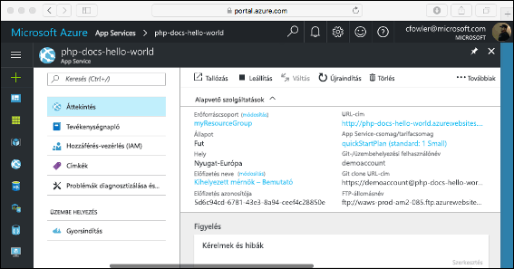

# <a name="create-a-php-app-in-app-service-on-linux"></a>PHP-alkalmazás létrehozása Linuxon futó App Service-ben

> [!NOTE]
> Ebben a cikkben egy alkalmazást helyezünk üzembe a Linuxon futó App Service-ben. Az App Service-ben üzembe _Windows_, lásd: [PHP-alkalmazás létrehozása az Azure-ban](../app-service-web-get-started-php.md).
>

A [Linuxon futó App Service](app-service-linux-intro.md) hatékonyan méretezhető, önjavító webes üzemeltetési szolgáltatást nyújt a Linux operációs rendszer használatával. Ez a gyors útmutató azt ismerteti, hogyan helyezhet üzembe egy PHP-alkalmazást a Linuxon futó Azure App Service-ben. Az alkalmazás a beépített rendszerképpel hozzon létre a [Azure CLI-vel](https://docs.microsoft.com/cli/azure/get-started-with-azure-cli) a Cloud Shellben, és a Git segítségével telepítse a PHP-kódot az App Service-alkalmazáshoz.


A cikk lépéseit Mac, Windows vagy Linux rendszert futtató gépen is követheti.

[!INCLUDE [quickstarts-free-trial-note](../../../includes/quickstarts-free-trial-note.md)]

## <a name="prerequisites"></a>Előfeltételek

A gyorsútmutató elvégzéséhez:

* <a href="https://git-scm.com/" target="_blank">A Git telepítése</a>
* <a href="https://php.net" target="_blank">A PHP telepítése</a>

## <a name="download-the-sample"></a>A minta letöltése

Futtassa a következő parancsokat egy terminálablakban. Ezzel klónozza a mintaalkalmazást a helyi gépre, és a mintakódot tartalmazó könyvtárba lép.

```bash
git clone https://github.com/Azure-Samples/php-docs-hello-world
cd php-docs-hello-world
```

## <a name="run-the-app-locally"></a>Az alkalmazás futtatása helyben

Futtassa helyileg az alkalmazást, hogy lássa, hogyan fog kinézni az Azure-ban üzembe helyezve. Nyisson meg egy terminálablakot, és a `php` parancs használatával indítsa el a beépített PHP-webkiszolgálót.

```bash
php -S localhost:8080
```

Nyisson meg egy webböngészőt, majd keresse meg a mintaalkalmazást a `http://localhost:8080` címen.

Az oldalon látható mintaalkalmazáson ekkor a **Hello World!** üzenet jelenik meg.


A terminálablakban nyomja le a **Ctrl+C** billentyűkombinációt a webkiszolgálóból történő kilépéshez.

[!INCLUDE [cloud-shell-try-it.md](../../../includes/cloud-shell-try-it.md)]

[!INCLUDE [Configure deployment user](../../../includes/configure-deployment-user.md)]

[!INCLUDE [Create resource group](../../../includes/app-service-web-create-resource-group-linux.md)]

[!INCLUDE [Create app service plan](../../../includes/app-service-web-create-app-service-plan-linux.md)]

## <a name="create-a-web-app"></a>Webalkalmazás létrehozása

[!INCLUDE [Create web app](../../../includes/app-service-web-create-web-app-php-linux-no-h.md)] 

Keresse meg a helyen szeretné megtekinteni a beépített rendszerképpel rendelkező újonnan létrehozott alkalmazást. Cserélje le  _&lt;alkalmazásnév >_ az alkalmazás nevére.

```bash
http://<app_name>.azurewebsites.net
```

Íme, mi az új alkalmazás hasonlóan kell kinéznie:


[!INCLUDE [Push to Azure](../../../includes/app-service-web-git-push-to-azure.md)] 

```bash
Counting objects: 2, done.
Delta compression using up to 4 threads.
Compressing objects: 100% (2/2), done.
Writing objects: 100% (2/2), 352 bytes | 0 bytes/s, done.
Total 2 (delta 1), reused 0 (delta 0)
remote: Updating branch 'master'.
remote: Updating submodules.
remote: Preparing deployment for commit id '25f18051e9'.
remote: Generating deployment script.
remote: Running deployment command...
remote: Handling Basic Web Site deployment.
remote: Kudu sync from: '/home/site/repository' to: '/home/site/wwwroot'
remote: Copying file: '.gitignore'
remote: Copying file: 'LICENSE'
remote: Copying file: 'README.md'
remote: Copying file: 'index.php'
remote: Ignoring: .git
remote: Finished successfully.
remote: Running post deployment command(s)...
remote: Deployment successful.
To https://<app_name>.scm.azurewebsites.net/<app_name>.git
   cc39b1e..25f1805  master -> master
```

## <a name="browse-to-the-app"></a>Az alkalmazás megkeresése tallózással

Tallózással keresse meg az üzembe helyezett alkalmazást a webböngésző használatával.

```bash
http://<app_name>.azurewebsites.net
```

A PHP-mintakód fut az App Service linuxon beépített rendszerképpel rendelkező.


**Gratulálunk!** Elvégezte az első PHP-webalkalmazás üzembe helyezését a Linuxon futó App Service-ben.

## <a name="update-locally-and-redeploy-the-code"></a>A kód frissítése helyileg és ismételt üzembe helyezése

A helyi könyvtárban nyissa meg az `index.php` fájlt a PHP-alkalmazáson belül, majd módosítsa a szövegét az `echo` melletti sztringen belül:

```php
echo "Hello Azure!";
```

Mentse a módosításokat a Gitben, majd továbbítsa a kód módosításait az Azure-ba.

```bash
git commit -am "updated output"
git push azure master
```

Az üzembe helyezés befejezését követően váltson vissza **Az alkalmazás megkeresése tallózással** lépésben megnyitott böngészőablakra, és frissítse az oldalt.


## <a name="manage-your-new-azure-app"></a>Az új Azure-alkalmazás kezelése

Nyissa meg a <a href="https://portal.azure.com" target="_blank">az Azure portal</a> kezelheti a létrehozott alkalmazást.

A bal oldali menüben kattintson a **App Services**, majd kattintson az Azure-alkalmazás neve.


Az alkalmazás áttekintése oldal jelenik meg. Itt elvégezhet olyan alapszintű felügyeleti feladatokat, mint a tallózás, leállítás, elindítás, újraindítás és törlés.



A bal oldali menü az alkalmazás konfigurálásához biztosít különböző oldalakat. 

[!INCLUDE [cli-samples-clean-up](../../../includes/cli-samples-clean-up.md)]

## <a name="next-steps"></a>További lépések

> [!div class="nextstepaction"]
> [PHP és MySQL](tutorial-php-mysql-app.md)
