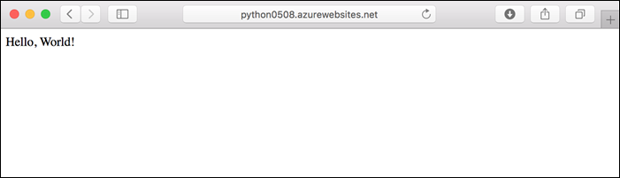
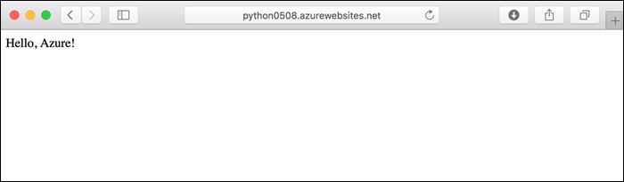
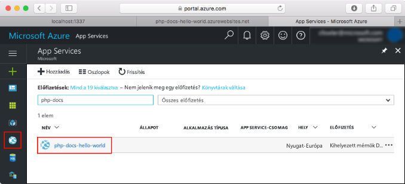
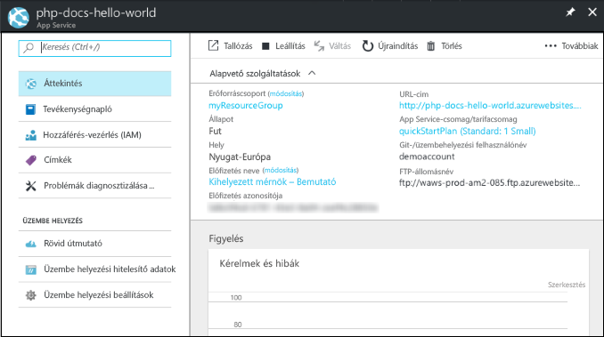

# <a name="create-a-python-app-in-azure-app-service-on-linux-preview"></a>Egy Python-alkalmazás létrehozása az Azure App Service Linux (előzetes verzió)

A [Linuxon futó App Service](app-service-linux-intro.md) hatékonyan méretezhető, önjavító webes üzemeltetési szolgáltatást nyújt a Linux operációs rendszer használatával. A jelen rövid útmutató bemutatja az App Service-ben a beépített Python-rendszerképre (előzetes verzió) épülő Python-alkalmazás üzembe helyezését Linux rendszerben az [Azure CLI](/cli/azure/install-azure-cli) használatával.

A cikk lépéseit Mac, Windows vagy Linux rendszert futtató gépen is követheti.



[!INCLUDE [quickstarts-free-trial-note](../../../includes/quickstarts-free-trial-note.md)]

## <a name="prerequisites"></a>Előfeltételek

A gyorsútmutató elvégzéséhez:

* <a href="https://www.python.org/downloads/" target="_blank">A Python 3.7 telepítése</a>
* <a href="https://git-scm.com/" target="_blank">A Git telepítése</a>

## <a name="download-the-sample-locally"></a>Minta helyi letöltése

Futtassa a következő parancsokat egy terminálablakban. Ezzel klónozza a mintaalkalmazást a helyi gépre, és a mintakódot tartalmazó könyvtárba lép.

```bash
git clone https://github.com/Azure-Samples/python-docs-hello-world
cd python-docs-hello-world
```

A tárház tartalmaz egy *application.py*, amely utasítja az App Service, hogy a tárház tartalmaz egy Flask-alkalmazást. További információkért lásd: [tároló indítási folyamat és a testreszabások](how-to-configure-python.md).

## <a name="run-the-app-locally"></a>Az alkalmazás futtatása helyben

Futtassa helyileg az alkalmazást, hogy lássa, hogyan fog kinézni az Azure-ban üzembe helyezve. Nyisson meg egy terminálablakot, és használja az alábbi parancsokat a szükséges függőségek telepítéséhez, majd indítsa el a beépített fejlesztési kiszolgálót. 

```bash
# In Bash
python3 -m venv venv
source venv/bin/activate
pip install -r requirements.txt
FLASK_APP=application.py flask run

# In PowerShell
py -3 -m venv env
env\scripts\activate
pip install -r requirements.txt
Set-Item Env:FLASK_APP ".\application.py"
flask run
```

Nyisson meg egy webböngészőt, majd keresse meg a mintaalkalmazást a `http://localhost:5000/` címen.

Az oldalon látható mintaalkalmazáson ekkor a **Hello World!** üzenet jelenik meg.


A terminálablakban nyomja le a **Ctrl+C** billentyűkombinációt a webkiszolgálóból történő kilépéshez.

[!INCLUDE [cloud-shell-try-it.md](../../../includes/cloud-shell-try-it.md)]

## <a name="download-the-sample"></a>A minta letöltése

A Cloud Shellben hozzon létre egy quickstart könyvtárat, és lépjen a könyvtárba.

```bash
mkdir quickstart

cd quickstart
```

Ezután futtassa a következő parancsot a mintaalkalmazás-adattár a quickstart könyvtárba való klónozásához.

```bash
git clone https://github.com/Azure-Samples/python-docs-hello-world
```

Futtatás közben a parancs a következő példához hasonló információkat jelenít meg:

```bash
Cloning into 'python-docs-hello-world'...
remote: Enumerating objects: 43, done.
remote: Total 43 (delta 0), reused 0 (delta 0), pack-reused 43
Unpacking objects: 100% (43/43), done.
Checking connectivity... done.
```

## <a name="create-a-web-app"></a>Webalkalmazás létrehozása

Lépjen abba a könyvtárba, amelyben a mintakód található, és futtassa az `az webapp up` parancsot.

A következő példában az <app_name> helyett adjon meg egy egyedi alkalmazásnevet.

```bash
cd python-docs-hello-world

az webapp up -n <app_name>
```

A parancs futtatása eltarthat néhány percig. Futtatás közben a parancs a következő példához hasonló információkat jelenít meg:

```json
The behavior of this command has been altered by the following extension: webapp
Creating Resource group 'appsvc_rg_Linux_CentralUS' ...
Resource group creation complete
Creating App service plan 'appsvc_asp_Linux_CentralUS' ...
App service plan creation complete
Creating app '<app_name>' ....
Webapp creation complete
Creating zip with contents of dir /home/username/quickstart/python-docs-hello-world ...
Preparing to deploy contents to app.
All done.
{
  "app_url": "https:/<app_name>.azurewebsites.net",
  "location": "Central US",
  "name": "<app_name>",
  "os": "Linux",
  "resourcegroup": "appsvc_rg_Linux_CentralUS ",
  "serverfarm": "appsvc_asp_Linux_CentralUS",
  "sku": "BASIC",
  "src_path": "/home/username/quickstart/python-docs-hello-world ",
  "version_detected": "-",
  "version_to_create": "python|3.7"
}
```

[!INCLUDE [AZ Webapp Up Note](../../../includes/app-service-web-az-webapp-up-note.md)]

## <a name="browse-to-the-app"></a>Az alkalmazás megkeresése tallózással

Tallózással keresse meg az üzembe helyezett alkalmazást a webböngésző használatával.

```bash
http://<app_name>.azurewebsites.net
```

A Python-mintakód fut az App Service Linux rendszeren egy beépített rendszerképpel rendelkező.


**Gratulálunk!** Elvégezte az első Python-webapp üzembe helyezését az App Service-ben Linux rendszeren.

## <a name="update-locally-and-redeploy-the-code"></a>A kód frissítése helyileg és ismételt üzembe helyezése

Írja be a Cloud shellben `code application.py` a Cloud Shell-szerkesztő megnyitásához.


 Végezzen el egy kis módosítást a `return` hívásának szövegében:

```python
return "Hello Azure!"
```

Mentse a módosításokat, és zárja be a szerkesztőt. A mentéshez a `^S`, a kilépéshez a `^Q` parancsot használja.

Most újra üzembe helyezzük az alkalmazást. A helyettesítő `<app_name>` az alkalmazással.

```bash
az webapp up -n <app_name>
```

Az üzembe helyezés befejezését követően váltson vissza **Az alkalmazás megkeresése tallózással** lépésben megnyitott böngészőablakra, és frissítse az oldalt.



## <a name="manage-your-new-azure-app"></a>Az új Azure-alkalmazás kezelése

Nyissa meg a <a href="https://portal.azure.com" target="_blank">az Azure portal</a> kezelheti a létrehozott alkalmazást.

A bal oldali menüben kattintson a **App Services**, majd kattintson az Azure-alkalmazás neve.



Az alkalmazás áttekintése oldal jelenik meg. Itt elvégezhet olyan alapszintű felügyeleti feladatokat, mint a tallózás, leállítás, elindítás, újraindítás és törlés.



A bal oldali menü az alkalmazás konfigurálásához biztosít különböző oldalakat. 

[!INCLUDE [cli-samples-clean-up](../../../includes/cli-samples-clean-up.md)]

## <a name="next-steps"></a>További lépések

A Linuxon futó App Service beépített Python rendszerképe jelenleg előzetes verzióban érhető el, és lehetőség van az alkalmazásindítási parancs testreszabására. Éles Python-alkalmazásokat egyéni tároló használatával is létrehozhat.

> [!div class="nextstepaction"]
> [Python és PostgreSQL](tutorial-python-postgresql-app.md)

> [!div class="nextstepaction"]
> [Egyéni indítóparancs konfigurálása](how-to-configure-python.md#customize-startup-command)

> [!div class="nextstepaction"]
> [hibaelhárítással](how-to-configure-python.md#troubleshooting)

> [!div class="nextstepaction"]
> [Egyéni rendszerképek használata](tutorial-custom-docker-image.md)
