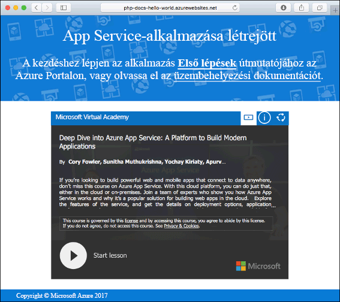

# <a name="create-a-python-web-app-in-azure-app-service-on-linux-preview"></a>Python-webalkalmazások létrehozása a Linuxon futó Azure App Service-ben (előzetes verzió)

A [Linuxon futó App Service](app-service-linux-intro.md) hatékonyan méretezhető, önjavító webes üzemeltetési szolgáltatást nyújt a Linux operációs rendszer használatával. A jelen rövid útmutató bemutatja az App Service-ben a beépített Python-rendszerképre (előzetes verzió) épülő Python-alkalmazás üzembe helyezését Linux rendszerben az [Azure CLI](/cli/azure/install-azure-cli) használatával.

A cikk lépéseit Mac, Windows vagy Linux rendszert futtató gépen is követheti.


[!INCLUDE [quickstarts-free-trial-note](../../../includes/quickstarts-free-trial-note.md)]

## <a name="prerequisites"></a>Előfeltételek

A gyorsútmutató elvégzéséhez:

* <a href="https://www.python.org/downloads/" target="_blank">A Python 3.7 telepítése</a>
* <a href="https://git-scm.com/" target="_blank">A Git telepítése</a>

## <a name="download-the-sample"></a>A minta letöltése

Futtassa a következő parancsokat egy terminálablakban. Ezzel klónozza a mintaalkalmazást a helyi gépre, és a mintakódot tartalmazó könyvtárba lép.

```bash
git clone https://github.com/Azure-Samples/python-docs-hello-world
cd python-docs-hello-world
```

## <a name="run-the-app-locally"></a>Az alkalmazás futtatása helyben

Futtassa helyileg az alkalmazást, hogy lássa, hogyan fog kinézni az Azure-ban üzembe helyezve. Nyisson meg egy terminálablakot, és használja az alábbi parancsokat a szükséges függőségek telepítéséhez, majd indítsa el a beépített fejlesztési kiszolgálót. 

```bash
# In Bash
python3 -m venv venv
source venv/bin/activate
pip install -r requirements.txt
FLASK_APP=application.py flask run

# In PowerShell
py -3 -m venv env
env\scripts\activate
pip install -r requirements.txt
Set-Item Env:FLASK_APP ".\application.py"
flask run
```

Nyisson meg egy webböngészőt, majd keresse meg a mintaalkalmazást a `http://localhost:5000/` címen.

Az oldalon látható mintaalkalmazáson ekkor a **Hello World!** üzenet jelenik meg.


A terminálablakban nyomja le a **Ctrl+C** billentyűkombinációt a webkiszolgálóból történő kilépéshez.

[!INCLUDE [cloud-shell-try-it.md](../../../includes/cloud-shell-try-it.md)]

[!INCLUDE [Configure deployment user](../../../includes/configure-deployment-user.md)]

[!INCLUDE [Create resource group](../../../includes/app-service-web-create-resource-group-linux.md)]

[!INCLUDE [Create app service plan](../../../includes/app-service-web-create-app-service-plan-linux.md)]

## <a name="create-a-web-app"></a>Webalkalmazás létrehozása

[!INCLUDE [Create app service plan](../../../includes/app-service-web-create-web-app-python-linux-no-h.md)]

Az újonnan létrehozott, beépített rendszerképpel rendelkező webalkalmazás megtekintéséhez tallózással keresse meg a helyet. Az _&lt;app name>_ helyett adja meg a webalkalmazása nevét.

```bash
http://<app_name>.azurewebsites.net
```

Az új webalkalmazásnak így kell kinéznie:



[!INCLUDE [Push to Azure](../../../includes/app-service-web-git-push-to-azure.md)] 

```bash
Counting objects: 42, done.
Delta compression using up to 8 threads.
Compressing objects: 100% (39/39), done.
Writing objects: 100% (42/42), 9.43 KiB | 0 bytes/s, done.
Total 42 (delta 15), reused 0 (delta 0)
remote: Updating branch 'master'.
remote: Updating submodules.
remote: Preparing deployment for commit id 'c40efbb40e'.
remote: Generating deployment script.
remote: Generating deployment script for python Web Site
.
.
.
remote: Finished successfully.
remote: Running post deployment command(s)...
remote: Deployment successful.
remote: App container will begin restart within 10 seconds.
To https://user2234@cephalin-python.scm.azurewebsites.net/cephalin-python.git
 * [new branch]      master -> master
 ```

## <a name="browse-to-the-app"></a>Az alkalmazás megkeresése tallózással

Tallózással keresse meg az üzembe helyezett alkalmazást a webböngésző használatával.

```bash
http://<app_name>.azurewebsites.net
```

A Python-mintakód beépített rendszerképpel rendelkező webalkalmazásban fut.


**Gratulálunk!** Elvégezte az első Python-webapp üzembe helyezését az App Service-ben Linux rendszeren.

## <a name="update-locally-and-redeploy-the-code"></a>A kód frissítése helyileg és ismételt üzembe helyezése

A helyi adattárban nyissa meg az `application.py` fájlt, majd módosítsa annak szövegét az utolsó sorban:

```python
return "Hello Azure!"
```

Mentse a módosításokat a Gitben, majd továbbítsa a kód módosításait az Azure-ba.

```bash
git commit -am "updated output"
git push azure master
```

Az üzembe helyezés befejezését követően váltson vissza **Az alkalmazás megkeresése tallózással** lépésben megnyitott böngészőablakra, és frissítse az oldalt.


## <a name="manage-your-new-azure-web-app"></a>Az új Azure-webapp kezelése

A létrehozott webalkalmazás felügyeletéhez ugorjon az <a href="https://portal.azure.com" target="_blank">Azure Portalra</a>.

A bal oldali menüben kattintson az **App Services** lehetőségre, majd az Azure-webalkalmazás nevére.


Megtekintheti a webalkalmazás Áttekintés oldalát. Itt elvégezhet olyan alapszintű felügyeleti feladatokat, mint a tallózás, leállítás, elindítás, újraindítás és törlés.


A bal oldali menü az alkalmazás konfigurálásához biztosít különböző oldalakat. 

[!INCLUDE [cli-samples-clean-up](../../../includes/cli-samples-clean-up.md)]

## <a name="next-steps"></a>További lépések

A Linuxon futó App Service beépített Python rendszerképe jelenleg előzetes verzióban érhető el, és lehetőség van az alkalmazásindítási parancs testreszabására. Éles Python-alkalmazásokat egyéni tároló használatával is létrehozhat.

> [!div class="nextstepaction"]
> [Python és PostgreSQL](tutorial-python-postgresql-app.md)

> [!div class="nextstepaction"]
> [Egyéni indítóparancs konfigurálása](how-to-configure-python.md#custom-startup-command)

> [!div class="nextstepaction"]
> [Egyéni rendszerképek használata](tutorial-custom-docker-image.md)
