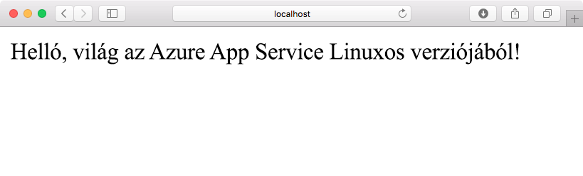
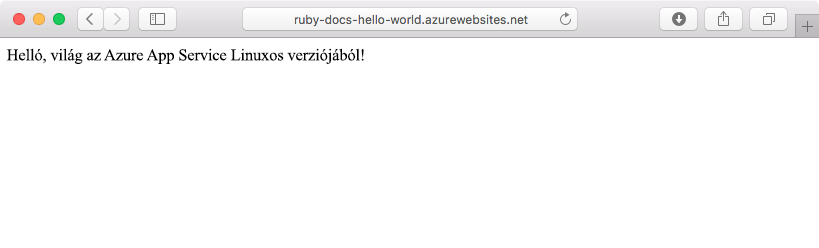
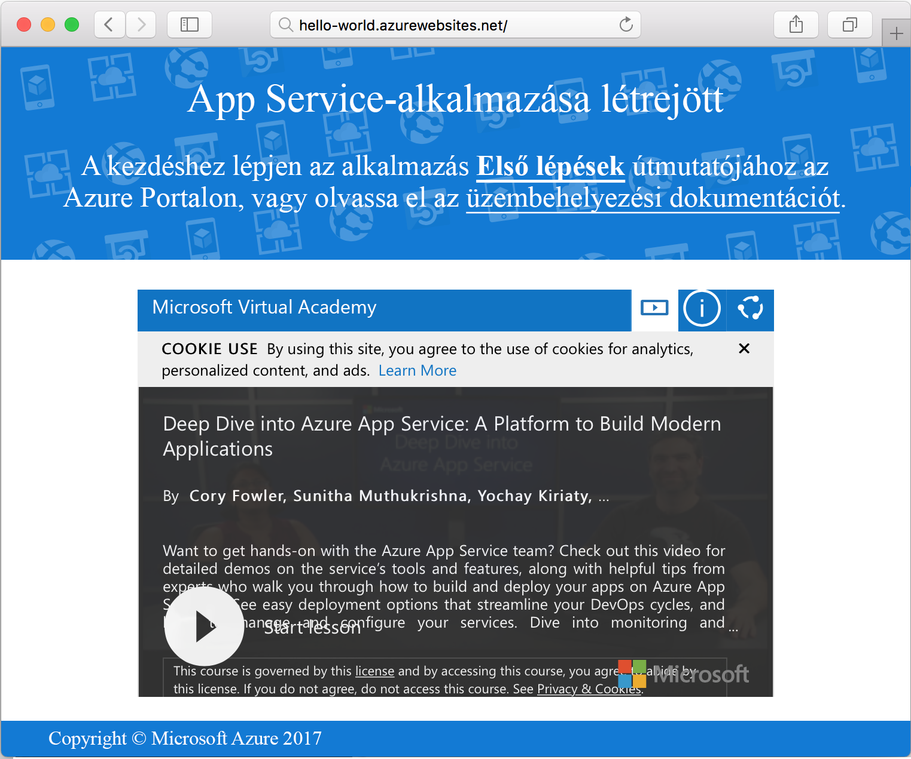

# <a name="create-a-ruby-app-in-app-service-on-linux"></a>Ruby alkalmazás létrehozása a Linux App Service-ben | Microsoft Docs

A [Linuxon futó App Service](app-service-linux-intro.md) hatékonyan skálázható, önjavító webes üzemeltetési szolgáltatást nyújt. Az alábbi gyors útmutató megmutatja, hogyan készíthet alapszintű Ruby on Rails alkalmazást, amelyet aztán a Linux rendszeren futó webalkalmazásként telepíthet az Azure-ba.



[!INCLUDE [quickstarts-free-trial-note](../../../includes/quickstarts-free-trial-note.md)]

## <a name="prerequisites"></a>Előfeltételek

* <a href="https://www.ruby-lang.org/en/documentation/installation/#rubyinstaller" target="_blank">A Ruby 2.4.1 vagy újabb telepítése</a>
* <a href="https://git-scm.com/" target="_blank">A Git telepítése</a>

## <a name="download-the-sample"></a>A minta letöltése

Egy terminálablakban futtassa a következő parancsot a mintaalkalmazás-adattár helyi számítógépre történő klónozásához:

```bash
git clone https://github.com/Azure-Samples/ruby-docs-hello-world
```

## <a name="run-the-application-locally"></a>Az alkalmazás helyi futtatása

Az alkalmazás működéséhez futtassa a Rails-kiszolgálót. Váltson át a *hello-world* könyvtárra és a `rails server` parancs elindítja a kiszolgálót.

```bash
cd hello-world\bin
rails server
```

Webböngészőjével a `http://localhost:3000` hely megkeresésével helyileg tesztelheti az alkalmazást.


## <a name="modify-app-to-display-welcome-message"></a>Alkalmazás módosítása az üdvözlő üzenet megjelenítéséhez

Módosítsa az alkalmazást, hogy az megjelenítse az üdvözlő üzenetet. Először be kell állítania egy útvonalat a *~/workspace/ruby-docs-hello-world/config/routes.rb* fájl módosításával, hogy az tartalmazzon egy `hello` nevű útvonalat.

  ```ruby
  Rails.application.routes.draw do
      #For details on the DSL available within this file, see http://guides.rubyonrails.org/routing.html
      root 'application#hello'
  end
  ```

Módosítsa az alkalmazás vezérlőjét, hogy az a böngésző számára HTML formátumban küldje vissza az üzenetet. 

Nyissa meg a *~/workspace/hello-world/app/controllers/application_controller.rb* fájlt szerkesztésre. Módosítsa az `ApplicationController` osztályt, hogy az alábbi példakódhoz hasonlítson:

  ```ruby
  class ApplicationController > ActionController :: base
    protect_from_forgery with: :exception
    def hello
      render html: "Hello, world from Azure Web App on Linux!"
    end
  end
  ```

Az alkalmazás konfigurálása ekkor kész. Webböngészőjével a `http://localhost:3000` hely megkeresésével erősítheti meg a gyökér kezdőlapját.



[!INCLUDE [Try Cloud Shell](../../../includes/cloud-shell-try-it.md)]

[!INCLUDE [Configure deployment user](../../../includes/configure-deployment-user.md)]

## <a name="create-a-ruby-web-app-on-azure"></a>Ruby-webalkalmazás létrehozása Azure-ban

A webalkalmazáshoz szükséges adategységek tárolásához szükség van egy erőforráscsoportra. Erőforráscsoport létrehozásához használja a következő parancsot: [`az group create`](/cli/azure/webapp?view=azure-cli-latest#az_webapp_create).

```azurecli-interactive
az group create --location westeurope --name myResourceGroup
```

Használja az [ `az appservice plan create` ](/cli/azure/appservice/plan?view=azure-cli-latest#az_appservice_plan_create) parancsot, ha egy App Service-csomagot szeretne létrehozni a webalkalmazáshoz.

```azurecli-interactive
az appservice plan create --name myAppServicePlan --resource-group myResourceGroup --is-linux
```

Ezt követően az [`az webapp create`](/cli/azure/webapp?view=azure-cli-latest#az_webapp_create) paranccsal hozza létre az újonnan készített App Service-csomagot használó webalkalmazást. Figyelje meg, hogy a futtatókörnyezet beállítása `ruby|2.3` lett. Ne felejtse el kicserélni az `<app name>` nevet egy egyedi alkalmazásnévre.

```azurecli-interactive
az webapp create --resource-group myResourceGroup --plan myAppServicePlan --name <app name> \
--runtime "ruby|2.3" --deployment-local-git
```

A parancs kimenete felfedi az újonnan létrehozott webalkalmazás és az üzembehelyezési URL információit. Ennek az alábbi példához kell hasonlítania. Másolja ki az URL-t, hogy az oktatóanyag további részében is használhassa.

```bash
https://<deployment user name>@<app name>.scm.azurewebsites.net/<app name>.git
```

A webalkalmazás létrehozását követően megtekintheti az **Áttekintés** oldalt. Keresse meg. A következő kezdőlap jelenik meg:




## <a name="deploy-your-application"></a>Az alkalmazás üzembe helyezése

Futtassa az alábbi parancsokat helyi alkalmazásának Azure webhelyen történő üzembehelyezéséhez:

```bash
git remote add azure <Git deployment URL from above>
git add -A
git commit -m "Initial deployment commit"
git push azure master
```

Erősítse meg, hogy az üzembehelyezési műveletek sikerrel jártak. A parancsok eredménye a következő szöveghez fog hasonlítani:

```bash
remote: Using sass-rails 5.0.6
remote: Updating files in vendor/cache
remote: Bundle gems are installed into ./vendor/bundle
remote: Updating files in vendor/cache
remote: ~site/repository
remote: Finished successfully.
remote: Running post deployment command(s)...
remote: Deployment successful.
To https://<your web app name>.scm.azurewebsites.net/<your web app name>.git
  579ccb....2ca5f31  master -> master
myuser@ubuntu1234:~workspace/<app name>$
```

Az üzembe helyezés befejezését követően az [`az webapp restart`](/cli/azure/webapp?view=azure-cli-latest#az_webapp_restart) paranccsal indítsa újra a webalkalmazást az üzembe helyezés érvénybe léptetéséhez az itt látottak szerint:

```azurecli-interactive
az webapp restart --name <app name> --resource-group myResourceGroup
```

Keresse fel a webhelyet, és ellenőrizze az eredményeket.

```bash
http://<app name>.azurewebsites.net
```


> [!NOTE]
> Az alkalmazás újraindulása alatt az oldal böngészése a `Error 503 Server unavailable` HTTP-állapotkód megjelenését eredményezi. A teljes újraindulás eltarthat néhány percig.
>

[!INCLUDE [Clean-up section](../../../includes/cli-script-clean-up.md)]

## <a name="next-steps"></a>További lépések

> [!div class="nextstepaction"]
> [Ruby on Rails és MySQL](tutorial-ruby-mysql-app.md)
