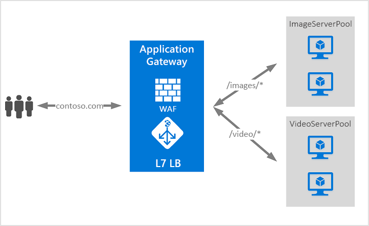

# Mi az Azure Application Gateway?

Az Azure Application Gateway egy webes forgalomra vonatkozó terheléselosztó, amellyel kezelheti a webalkalmazásai forgalmát. 

A hagyományos terheléselosztók az átviteli rétegen működnek (OSI 4. réteg – TCP és UDP), és a forrás IP-címe és portja alapján irányítják a forgalmat a célállomás IP-címére és portjára. Az Application Gateway segítségével azonban még részletesebben kezelheti mindezt. A forgalmat például a bejövő URL-cím alapján irányíthatja. Tehát ha a bejövő URL-cím a `/images` kifejezést tartalmazza, a forgalmat adott, képekre konfigurált kiszolgálókra irányíthatja (azaz egy készletbe). Ha az URL-cím a `/video` kifejezést tartalmazza, a forgalom egy másik, videók számára optimalizált készlethez kerül.

Ezt a fajta útválasztást alkalmazásrétegbeli (OSI 7. réteg) terheléselosztásnak nevezzük. Az Azure Application Gateway URL-alapú és egyéb útválasztásra is képes. 

Az Azure Application Gateway a következő funkciókkal rendelkezik: 

## Secure Sockets Layer- (SSL-) lezárás

Az Application Gateway támogatja az SSL-lezárást az átjárónál, ami után a forgalom rendszerint titkosítatlanul áramlik a háttérkiszolgálókhoz. Ez a funkció lehetővé teszi, hogy a webkiszolgálók megszabaduljanak a magas titkosítási és visszafejtési üzemeltetési költségektől. Néha azonban a háttérkiszolgálók felé irányuló titkosítatlan kommunikáció nem elfogadható megoldás. Ennek okai lehetnek biztonsági és megfelelőségi előírások, vagy az, hogy az alkalmazás kizárólag biztonságos kapcsolatot fogad el. Az ilyen alkalmazásokhoz az Application Gateway támogatja a teljes körű SSL-titkosítást.

## Web application firewall (Webalkalmazási tűzfal)

A webalkalmazási tűzfal (WAF) az Application Gateway egyik szolgáltatása, amely központi védelmet nyújt a webalkalmazásoknak a gyakori biztonsági rések ellen. A WAF az [alapvető OWASP- (Open Web Application Security Project-) szabálykészletek](https://www.owasp.org/index.php/Category:OWASP_ModSecurity_Core_Rule_Set_Project) 3.0-s vagy 2.2.9-es verzióinak szabályai alapján működik. 

A webalkalmazások egyre inkább ki vannak téve rosszindulatú támadásoknak, amelyek az ismert biztonsági réseket használják ki. Az ilyen jellegű támadások között például gyakoriak az SQL-injektálásos és a webhelyek közötti, parancsprogramot alkalmazó támadások. Az ilyen támadások megakadályozása az alkalmazás kódjában kihívást jelenthet, és szigorú felügyeletet, javítást és megfigyelést igényelhet az alkalmazás topológiájának számos rétegén. A központosított webalkalmazási tűzfal egyszerűbbé teszi a biztonságfelügyeletet, és segít az alkalmazás-rendszergazdáknak a fenyegetések vagy a behatolások elleni védekezésben. Emellett a WAF-megoldás gyorsabban képes kezelni a biztonsági fenyegetéseket azáltal, hogy kijavítja az ismert biztonsági réseket egy központi helyen, ahelyett hogy az egyes webalkalmazások védelmét biztosítaná. A meglévő alkalmazásátjárókat egyszerűen át lehet alakítani webalkalmazási tűzfallal rendelkező alkalmazásátjárókká.

## URL-alapú útválasztás

Az URL-alapú útválasztás lehetővé teszi, hogy a kérésben szereplő URL-cím alapján irányítsa a forgalmat a háttér-kiszolgálókészlethez. Az egyik lehetőség az, hogy a különböző típusú tartalmakra vonatkozó kéréseket különböző készletekhez irányítja.

Például `http://contoso.com/video/*` iránti kérelmek VideoServerPoolba, míg a `http://contoso.com/images/*` felé irányuló kérelmek az ImageServerPoolba vannak továbbítva. Ha a kérés egyik elérésiút-kategóriába sem sorolható, a DefaultServerPool az alapértelmezett kiszolgáló.

## Több hely üzemeltetése

A többhelyes üzemeltetéssel egynél több webhelyet konfigurálhat ugyanazon az Application Gateway-példányon. Ezzel a funkcióval hatékonyabb topológiát konfigurálhat telepítéseihez, mivel akár 20 webhelyet is hozzáadhat egyetlen Application Gatewayhez. Mindegyik webhelyet a saját készletéhez lehet irányítani. Az Application Gateway például a `contoso.com` és a `fabrikam.com` forgalmát is kiszolgálhatja a ContosoServerPool és a FabrikamServerPool kiszolgálókészletekből.

A `http://contoso.com` iránti kérelmek a ContosoServerPoolba, míg a `http://fabrikam.com` felé irányuló kérelmek a FabrikamServerPoolba vannak továbbítva.

Hasonlóképpen, ugyanazon szülőtartomány két altartományát ugyanazon Application Gateway-telepítésről üzemeltetheti. Az altartományok használatának példái között lehet az egyetlen Application Gateway-telepítésen üzemeltetett `http://blog.contoso.com` és `http://app.contoso.com`.

## Átirányítás

Számos webalkalmazás esetében gyakori eset az automatikus HTTP–HTTPS átirányítás annak érdekében, hogy az alkalmazás és a felhasználói közötti kommunikáció titkosított útvonalon történjen. 

Régebben olyan technikákat alkalmaztak ehhez, mint egy dedikált készlet létrehozása, amelynek egyetlen célja a bejövő HTTP-kérelmek átirányítása HTTPS-re. Az Application Gateway támogatja a forgalom az Application Gateway alapján való átirányításának lehetőségét. Ez leegyszerűsíti az alkalmazáskonfigurációt, optimalizálja az erőforrás-használatot, és új átirányítási forgatókönyveket támogat, például a globális és útvonalalapú átirányítást. Az Application Gateway átirányítási támogatása nem csak a HTTP–HTTPS átirányításra vonatkozik. Ez egy általános átirányítási mechanizmus, így a szabályokkal bármilyen megadott portról és portra átirányíthat. A szolgáltatás a külső webhelyre való átirányítást is támogatja.

Az Application Gateway átirányítási támogatása a következő funkciókat nyújtja:

- Globális átirányítás portok között a Gatewayen. Ez lehetővé teszi a HTTP–HTTPS átirányítást egy webhelyen.
- Útvonalalapú átirányítás. Ez a fajta átirányítás csak a megadott webhelyrészen engedélyezi a HTTP–HTTPS átirányítást, például egy `/cart/*` kifejezéssel jelzett bevásárlókosár részen.
- Átirányítás külső helyre.

## Munkamenet-affinitás

A Cookie-alapú munkamenet-affinitás akkor hasznos, ha egy felhasználói munkamenetet egy adott kiszolgálón szeretne tartani. Az átjáróval kezelt cookie-k használatával az Application Gateway képes egy felhasználói munkamenet minden újabb forgalmát ugyanarra a kiszolgálóra irányítani feldolgozásra. Ez a funkció olyan esetekben lehet fontos, amelyekben egy felhasználói munkamenethez tartozó munkamenet-állapotot helyileg ment a rendszer a kiszolgálón.

## Websocket- és HTTP/2-forgalom

Az Application Gateway natív támogatást nyújt a Websocket- és HTTP/2-protokollok számára. Kizárólag WebSocket-támogatásra vonatkozó felhasználói beállítás nem létezik. A HTTP/2-támogatás az Azure PowerShell használatával engedélyezhető.
 
A WebSocket és a HTTP/2 protokollok teljes körű duplex kommunikációt tesznek lehetővé egy kiszolgáló és egy ügyfél között egy hosszú ideig futó TCP-kapcsolaton. Ez interaktívabb kommunikációt eredményez a webkiszolgáló és az ügyél között, amely anélkül marad kétirányú, hogy a HTTP-alapú implementációkban kötelező lekérdezésekre lenne szükség. A HTTP-vel ellentétben ezek a protokollok alacsony többletterheléssel bírnak, és több kérelem/válasz típusú forgalomhoz is használhatják ugyanazt a TCP-kapcsolatot, ami az erőforrások hatékonyabb kihasználását eredményezi. Ezek a protokollok a hagyományos, 80-as és 443-as HTTP-portokon működnek.

## További lépések

Az igényeitől és a környezetétől függően az Azure Portallal, az Azure PowerShellel vagy az Azure CLI-vel hozhat létre egy Application Gateway-tesztet:

- [Első lépések – A webes forgalom irányítása az Azure Application Gateway szolgáltatással – Azure Portal](quick-create-portal.md).
- [Első lépések – A webes forgalom irányítása az Azure Application Gateway szolgáltatással – Azure PowerShell](quick-create-powershell.md)
- [Első lépések – A webes forgalom irányítása az Azure Application Gateway szolgáltatással – Azure CLI](quick-create-cli.md)
