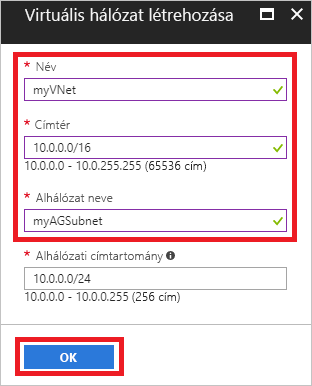
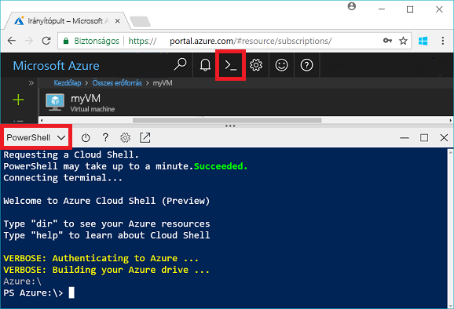
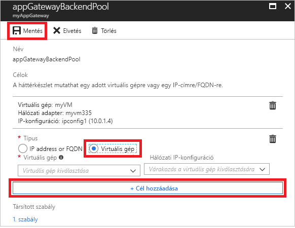
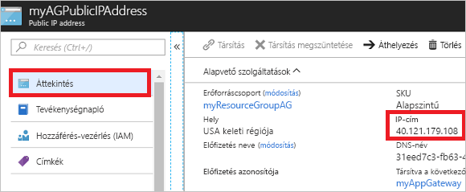

# <a name="quickstart-direct-web-traffic-with-azure-application-gateway---azure-portal"></a>Rövid útmutató: Webes forgalom irányítása az Azure Application Gatewayjel – Azure Portal

Az Azure Application Gateway segítségével a figyelők portokhoz rendelésével, szabályok létrehozásával és az erőforrások háttérkészlethez adásával adott erőforrások felé irányíthatja alkalmazásai webes forgalmát.

Ez rövid útmutató bemutatja, hogyan hozhat létre gyorsan az Azure Portallal egy olyan alkalmazásátjárót, amelynek háttérkészletében két virtuális gép található. Ezután tesztelheti, hogy megfelelően működik-e.

Ha nem rendelkezik Azure-előfizetéssel, mindössze néhány perc alatt létrehozhat egy [ingyenes fiókot](https://azure.microsoft.com/free/?WT.mc_id=A261C142F) a virtuális gép létrehozásának megkezdése előtt.

## <a name="log-in-to-azure"></a>Jelentkezzen be az Azure-ba

Jelentkezzen be az Azure Portalra a [http://portal.azure.com](http://portal.azure.com) címen.

## <a name="create-an-application-gateway"></a>Application Gateway létrehozása

Ahhoz, hogy az alkalmazásátjáró kommunikálhasson más erőforrásokkal, létre kell hoznia egy virtuális hálózatot. Virtuális hálózatot az alkalmazásátjáróval együtt is létrehozhat. Ebben a példában két alhálózatot hozunk létre: egyet az alkalmazásátjáró és egyet a virtuális gépek számára. 

1. Az Azure Portal bal felső sarkában kattintson az **Erőforrás létrehozása** gombra.
2. Válassza a **Hálózatkezelés**, majd az **Application Gateway** elemet a Kiemeltek listából.
3. Adja meg a következő értékeket az alkalmazásátjáróhoz:

    - Az alkalmazásátjáró neve *myAppGateway*.
    - Az új erőforráscsoport *myResourceGroupAG*.

    

4. Fogadja el az alapértelmezett értékeket a többi beállításnál, majd kattintson az **OK** gombra.
5. Kattintson a **Virtuális hálózat kiválasztása** > **Új létrehozása** elemre, majd adja meg következő adatokat a virtuális hálózat számára:

    - A virtuális hálózat neve *myVNet*.
    - A virtuális hálózat címtere *10.0.0.0/16*.
    - Az alhálózat neve *myAGSubnet*.
    - Az alhálózat címtere *10.0.0.0/24*.

    

6. A virtuális hálózat és az alhálózat létrehozásához kattintson az **OK** gombra.
6. Kattintson a **Nyilvános IP-cím kiválasztása** > **Új létrehozása** elemre, majd adja meg a nyilvános IP-cím nevét. Ebben a példában a nyilvános IP-cím neve *myAGPublicIPAddress*. Fogadja el az alapértelmezett értékeket a többi beállításnál, majd kattintson az **OK** gombra.
8. Fogadja el a figyelőkonfiguráció alapértelmezett értékeit, hagyja letiltva a webalkalmazási tűzfalat, majd kattintson az **OK** gombra.
9. Az összefoglaló lapon ellenőrizze a beállításokat, majd kattintson az **OK** gombra a virtuális hálózat, a nyilvános IP-cím és az alkalmazásátjáró létrehozásához. Az alkalmazásátjáró létrehozása akár 30 percig is tarthat. Várja meg az üzembe helyezés sikeres befejezését, mielőtt továbblépne a következő szakaszra.

### <a name="add-a-subnet"></a>Alhálózat hozzáadása

1. Kattintson a **Minden erőforrás** elemre a bal oldali menüben, majd kattintson a **myVNet** lehetőségre az erőforráslistában.
2. Kattintson az **Alhálózatok** > **Alhálózat** menüpontra.

    

3. Adja meg a *myBackendSubnet* nevet az alhálózat neveként, majd kattintson az **OK** gombra.

## <a name="create-backend-servers"></a>Háttérkiszolgálók létrehozása

Ebben a példában két virtuális gépet hozunk létre, amelyeket az alkalmazásátjáró háttérkiszolgálóiként fogunk használni. 

### <a name="create-a-virtual-machine"></a>Virtuális gép létrehozása

1. Kattintson az **Új** lehetőségre.
2. Válassza a **Számítás**, majd a **Windows Server 2016 Datacenter** elemet a Kiemeltek listából.
3. Adja meg a következő értékeket a virtuális gép számára:

    - A virtuális gép neve *myVM*.
    - A rendszergazda felhasználóneve: *azureuser*.
    - A jelszó *Azure123456!* .
    - Válassza a **Meglévő használata**, majd a *myResourceGroupAG* lehetőséget.

4. Kattintson az **OK** gombra.
5. A virtuális gép méretéhez válassza a **DS1_V2** lehetőséget, majd kattintson a **Kiválasztás** gombra.
6. Győződjön meg róla, hogy virtuális hálózatként a **myVNet**, alhálózatként pedig a **myBackendSubnet** van kiválasztva. 
7. A rendszerindítási diagnosztika letiltásához kattintson a **Letiltva** elemre.
8. Kattintson az **OK** gombra, majd az összefoglaló lapon ellenőrizze a beállításokat, és kattintson a **Létrehozás** gombra.

### <a name="install-iis"></a>Az IIS telepítése

A virtuális gépeken telepíti az IIS-t annak ellenőrzéséhez, hogy az alkalmazásátjáró sikeresen létrejött-e.

1. Nyissa meg az interaktív felületet, és győződjön meg róla, hogy a **PowerShell** van beállítva.

    

2. Futtassa a következő parancsot az IIS a virtuális gépen való telepítéséhez: 

    ```azurepowershell-interactive
    Set-AzureRmVMExtension `
      -ResourceGroupName myResourceGroupAG `
      -ExtensionName IIS `
      -VMName myVM `
      -Publisher Microsoft.Compute `
      -ExtensionType CustomScriptExtension `
      -TypeHandlerVersion 1.4 `
      -SettingString '{"commandToExecute":"powershell Add-WindowsFeature Web-Server; powershell Add-Content -Path \"C:\\inetpub\\wwwroot\\Default.htm\" -Value $($env:computername)"}' `
      -Location EastUS
    ```

3. Hozzon létre egy második virtuális gépet, és telepítse az IIS-t az imént befejezett lépésekkel. Adja meg a *myVM2* nevet a virtuális gép neveként és a Set-AzureRmVMExtension parancs VMName paramétereként.

### <a name="add-backend-servers"></a>Háttérkiszolgálók hozzáadása

Miután létrehozta a virtuális gépeket, hozzá kell adnia őket a háttérkészlethez az alkalmazásátjáróban.

1. Kattintson a **Minden erőforrás** > **myAppGateway** lehetőségre.
2. Kattintson a **Háttérkészletek** lehetőségre. Az alapértelmezett készlet automatikusan létrejött az alkalmazásátjáróval együtt. Kattintson az **appGatewayBackendPool** lehetőségre.
3. Kattintson a **Cél hozzáadása** > **Virtuális gép** lehetőségre, majd válassza a *myVM* elemet. Kattintson a **Cél hozzáadása** > **Virtuális gép** lehetőségre, majd válassza a *myVM2* elemet.

    

4. Kattintson a **Save** (Mentés) gombra.

## <a name="test-the-application-gateway"></a>Az alkalmazásátjáró tesztelése

Az IIS telepítése nem szükséges az alkalmazásátjáró létrehozásához. Ebben a rövid útmutatóban azért telepítettük, hogy ellenőrizhessük, sikeres volt-e az alkalmazásátjáró létrehozása.

1. Keresse meg az alkalmazásátjáró nyilvános IP-címét az Áttekintés képernyőn. Kattintson a **Minden erőforrás** > **myAGPublicIPAddress** lehetőségre.

    

2. Másolja a nyilvános IP-címet, majd illessze be a böngésző címsorába.

    

Amikor frissíti a böngészőt, megjelenik a másik virtuális gép neve.

## <a name="clean-up-resources"></a>Az erőforrások eltávolítása

Először tekintse át az alkalmazásátjáróval létrehozott erőforrásokat, és ha már nincs rájuk szükség, törölheti az erőforráscsoportot, az alkalmazásátjárót és az összes kapcsolódó erőforrást. Ehhez válassza ki az alkalmazásátjárót tartalmazó erőforráscsoportot, és kattintson a **Törlés** elemre.

## <a name="next-steps"></a>További lépések

> [!div class="nextstepaction"]
> [Webes forgalom kezelése alkalmazásátjáróval az Azure CLI használatával](./tutorial-manage-web-traffic-cli.md)
