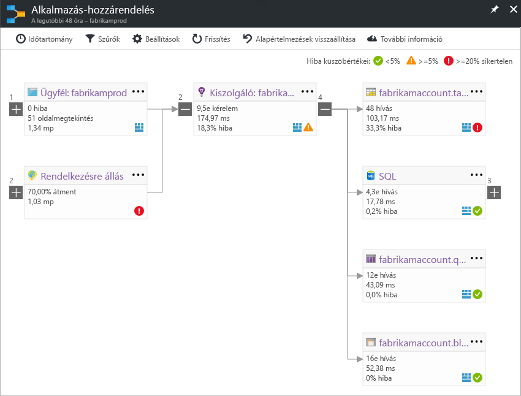

# Az Application Insightsban alkalmazás-hozzárendelés
A [Azure Application Insights](app-insights-overview.md), alkalmazás-hozzárendelés az alkalmazás-összetevői közötti függőségi kapcsolatokat visual elrendezés. Minden egyes összetevő KPI-k például a terhelés, teljesítmény, hibák és figyelmeztetések, segítségével megkeresheti az adott teljesítményprobléma vagy hiba, amely összetevők közül bármelyik jeleníti meg. Kattintva keresztül valamelyik összetevő a részletesebb diagnosztikai, például az Application Insights események. Ha az alkalmazás Azure-szolgáltatásokat használja, akkor is átkattintással is Azure Diagnostics, például az SQL Database Advisor-javaslatokra.

Más típusú diagramokkal, például PIN-kód egy alkalmazás-hozzárendelés az Azure irányítópultot, ahol is teljes körűen használható. 

## Nyissa meg az alkalmazás-hozzárendelés
Nyissa meg a térképen az alkalmazáshoz – Áttekintés paneljéről:

A térkép mutatja:

* Rendelkezésre állási tesztek
* Ügyféloldali összetevő (figyeli a JavaScript SDK-val)
* Kiszolgálóoldali összetevő
* Az ügyfél és kiszolgáló összetevők függőségei

Bontsa ki, és a függőségi hivatkozás elemcsoportok:

Ha egy típust (SQL, HTTP stb.) a számos függőségi, jelennek meg a csoportosított. 

## Problémák
Minden fürtcsomópont vonatkozó teljesítménymutatói, többek között a terhelés, teljesítmény és hiba sebesség az adott összetevő. 

Figyelmeztetés ikon jelölje ki a lehetséges problémákat. Egy narancssárga figyelmeztetést azt jelenti, hogy nincsenek sikertelen kérelmek Lapmegtekintések vagy függőségi hívások esetében. Piros azt jelenti, hogy egy több mint 5 % hibaaránya. Ha azt szeretné, hogy lehetőség ezen küszöbértékek módosítására, nyissa meg a beállításokat.

Aktív riasztásainak is megjelenítése fel: 

SQL Azure használ, nincs-e egy ikon, amely mutatja, hogy mikor van kapcsolatos javaslatok hogyan javíthatja a teljesítményt. 

Kattintson a bármely ikonra a további részletek:

## Diagnosztikai kattintson keresztül
A csomópontok a térképen kínál a célzott kattintson ide a diagnosztika. A beállítások a csomópont típusától függően eltérnek.

Az Azure-ban szolgáltatott összetevők a választható lehetőségek őket mutató közvetlen hivatkozásokat.

## Szűrők és időtartomány
Alapértelmezés szerint a térkép összes érhető el a kiválasztott időtartomány adatok összegzése látható. De szűrheti is, hogy csak a konkrét műveletek nevének és a függőségek.

* A művelet neve: Ide tartoznak a lapmegtekintések, és kiszolgálóoldali kéréstípusok. Ezzel a beállítással a térkép a kiszolgáló-vagy ügyféloldali csomóponton csak a kijelölt műveletek a fő Teljesítménymutatói jelennek meg. Azt mutatja, hogy a függőségek hívása a műveletek adott kontextusban.
* Függőség alapnévvel: Ez magában foglalja a AJAX böngésző és kiszolgálóoldali függőségei is. Ha készít jelentést az egyéni függőségi telemetria TrackDependency API-val, is szerepelnek itt. Kiválaszthatja a függőségeket a térképen megjelenítése. Ez a beállítás jelenleg nem végez a kiszolgálóoldali kérelmeket, vagy az ügyféloldali Lapmegtekintések.

## Szűrők mentése
Szeretné menteni a szűrőt, PIN-kód alakzatot szűrt nézet egy [irányítópult](app-insights-dashboards.md).

## Hiba ablaktábla
Ha a leképezés egy csomópont gombra kattint, egy hiba ablaktáblán a jobb oldalon, akiknél probléma van a csomópont összefoglalójához jelenik meg. Hibák először Műveletazonosító szerint csoportosítva, és ezután csoportosítva probléma azonosítóját.

Kattintson a hiba vesz igénybe, hogy az adott hiba utolsó példányát.

## Erőforrás állapota
Az egyes erőforrástípusok erőforrás állapota a hiba ablaktábla tetején jelenik meg. Például egy SQL-csomópontra kattintva jelennek meg az adatbázis állapotának és az riasztások kiváltó rendelkezik.

Az erőforrás nevét, az adott erőforrás szabványos áttekintése metrikák megtekintéséhez rákattinthat.

## Végpontok közötti rendszer app maps

*SDK 2.3-as vagy újabb verziója szükséges*

Ha az alkalmazás több részből áll – például egy háttér-szolgáltatás emellett a webes alkalmazás -, akkor is megjeleníthetők az összes egy integrált alkalmazás térképen.

Az alkalmazás térkép csomópontok bármely HTTP függőségi hívások esetében az Application Insights SDK telepítve a kiszolgálók közötti következő talál. Minden egyes Application Insights-erőforrás feltételezett, hogy egy kiszolgálót tartalmaz.

### Több szerepkör app térkép (előzetes verzió)

Több szerepkör app térkép előnézet lehetővé teszi, hogy az alkalmazás térkép használja az adatok küldése az Application Insights-erőforrások több kiszolgáló / instrumentation kulcs. A térkép kiszolgálók vannak szegmentált telemetriai elemek cloud_RoleName tulajdonság által. Állítsa be *alkalmazás több szerepkör-hozzárendelés* való *a* ahhoz, hogy ez a konfiguráció az előzetes verziójú funkciók paneljén.

Ez a megközelítés kívánatos lehet egy micro-szolgáltatások alkalmazás, vagy a más helyzetekben, ahol szeretné események összefüggéseket egyetlen Application Insights-erőforrás belül több kiszolgáló között.

## Videó

> [!VIDEO https://channel9.msdn.com/events/Connect/2016/112/player] 

## Visszajelzés
Adja meg a portál visszajelzési lehetőség visszajelzései.

## Következő lépések

* [Azure Portal](https://portal.azure.com)
