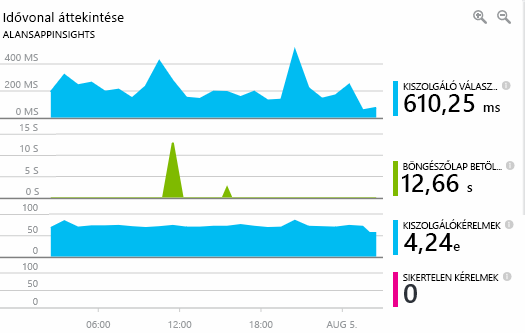
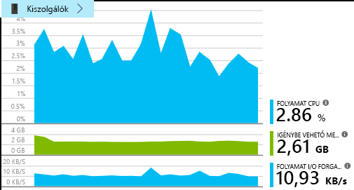
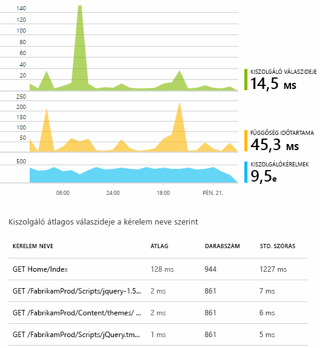
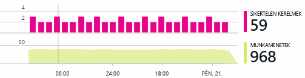
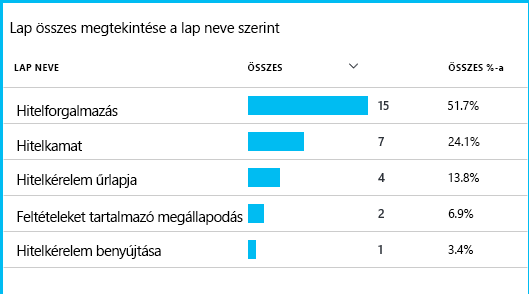

# Az Application Insights a DevOps áttekintése

A [Application Insights](app-insights-overview.md), azt gyorsan megtudhatja, hogyan működik-e az alkalmazást, és ha az élő használatban. Ha probléma van, lehetővé teszi azt, a segítségével mérje fel a hatás és a segítségével a hiba okának megállapításához.

Íme egy házon belül fejlesztett alkalmazásokra webalkalmazások csoport fiókját:

* *"Nappal ezelőtt, néhány helyeztünk üzembe egy"kisebb"gyorsjavítás. Jelenleg nem futott a széles körű tesztelési fázis, de néhány váratlan módosítási sajnos kapott egyesített a tartalom, amely az első és hátsó végpontok közötti inkompatibilitás. Azonnal megnövekedett kivételek, a riasztás következik be, és azt a helyzetet tudomást történtek. Azonnal meg az Application Insights portálon mindössze néhány kattintással azt elegendő információt kapott azonosítóértékeket kivétel callstacks szűkítéséhez a problémát. A Microsoft szolgáltatás-profilazonosítóval azonnal, és a sérülés korlátozott. Az Application Insights által végrehajtott ezen része a devops ciklus nagyon egyszerűen és végrehajthatóként."*

Ebben a cikkben azt kövesse, házon belül fejlesztett alkalmazásokra (OBS) hogyan használják az Application Insights gyorsan válaszolni az ügyfelek és a frissítések megjelenítéséhez online banki rendszerbe Fabrikam bankban csoport.  

A csapat az alábbi ábrán látható kitaláltak DevOps ciklusban működik:

A fejlesztési (feladatlista) várakozó fájlok a hírcsatorna követelményeinek. Használhatók rövid sprints, amivel gyakran működő szoftverek – általában formájában kidolgozott fejlesztéseit és a bővítmények számára, a meglévő alkalmazáshoz. Az élő app gyakran frissül új szolgáltatásokkal. Élő is, a csapat figyeli a teljesítmény- és használati Application Insights segítségével. Az APM-adatok hírcsatornák újra üzembe a fejlesztési várakozó fájlok számát.

A csapat az Application Insights az élő webalkalmazás szorosan figyeléséhez használja:

* Teljesítmény. Szeretnék tudni, hogyan válaszidők eltérő kérelem Count; milyen mértékű CPU, a hálózati, a lemez és az egyéb erőforrások használják; mely alkalmazáskód lelassítják teljesítmény; és ahol a szűk keresztmetszeteket.
* Hibák. Ha nincsenek kivételek vagy a sikertelen kérelmek, vagy ha a teljesítményszámláló az kényelmes tartományon kívüli kerül, a csapat tudnia kell, gyorsan, hogy azok hajthat végre műveleteket.
* Használat. A kiadott új szolgáltatása, a csapat tudni szeretné, milyen mértékben szolgál, és hogy felhasználók bármilyen nehézségbe vele.

A ciklus visszajelzés részét most összpontosítani:

## Gyenge rendelkezésre állás észlelése
Marcela Markova a OBS csapat vezető fejlesztő, és online teljesítmény figyeléséről átfutási vesz igénybe. Állítja be több [rendelkezésreállás figyelésére szolgáló tesztek](app-insights-monitor-web-app-availability.md):

* Az alkalmazás fő kezdőlapja single-URL-cím vizsgálata http://fabrikambank.com/onlinebanking/. 200-as HTTP-kód és a szöveges feltételeinek állítja "Üdvözöljük!". Ha a teszt sikertelen, nincs valamilyen súlyos hiba történt a hálózati vagy a kiszolgálók, illetve lehet, hogy egy központi telepítési probléma. (Vagy valaki módosította a Üdvözöljük! üzenet a lapon nem saját megkaphat.)
* Egy mélyebb többlépéses teszteket, amelyek jelentkezik be, és lekérdezi a jelenlegi fiókot listázása, minden oldalon néhány kulcs adatait ellenőrzése. Ez a vizsgálat ellenőrzi, hogy működik-e a hivatkozásra kattintva az adatbázist. Egy fiktív felhasználói azonosítót használja: néhány őket a tesztelési célokra megmaradjanak.

Állítsa be ezeket a teszteket Marcela benne lesz a csapat gyorsan tudni bármely kimaradás esetén.  

Hibák a webes teszt diagram piros pont jelenik meg:

De ennél is fontosabb, a hibával kapcsolatos riasztást az e-mailben a fejlesztői csapat. Ilyen módon tudják kapcsolatos szinte minden az ügyfelek előtt.

## Teljesítmény figyelése
Az Application Insights – áttekintés oldalra, nincs számos megjelenítő diagram [metrikák kulcs](app-insights-web-monitor-performance.md).

Böngésző lapbetöltési ideje közvetlenül weblapokhoz küldött telemetriai származik. Kiszolgáló válaszideje, a helykiszolgáló kérelem száma és a sikertelen kérelmek száma a webkiszolgáló összes történik, és ott Application insights szolgáltatásnak elküldött.

Marcela a kiszolgáló válasza Graph némileg érintett. Ez a grafikon azt ábrázolja, amikor a kiszolgáló HTTP-kérést kap a felhasználó böngészőben, és ha adja vissza, a válasz közötti átlagos idő. Nem ritka, hogy tekintse meg a változást, ez a diagram, mivel a rendszer terhelését változik. Azonban ebben az esetben úgy tűnik, hogy egy kis emelkedést a kéréseket, és nagy számot közötti összefüggést nő a válaszidőt. Amelyek oka, hogy működik-e a rendszer csak a teljes kapacitásukkal működjenek.

Ezzel megnyílik a kiszolgálók diagramok:

Úgy tűnik, hogy nincs bejelentkezési az erőforrás-korlátozás van, ezért lehet, hogy a kiszolgáló válasza diagramokban egyenetlenségek csak egybeesés.

## Céljai értesítések beállítása
Mindazonáltal ő szeretné nyomon követheti a a válaszidők. Ha azok túl nagy, és szeretné nem értesülnek arról, hogy azonnal.

Úgy állítja egy [riasztás](app-insights-metrics-explorer.md), a nagyobb, mint egy tipikus küszöbérték válaszidejét. Ez biztosítja, hogy az vetett bizalmat egyenként kell tudnia: azt, ha lassú a válaszidők.

Riasztások széles körét más metrikákkal állítható be. Például e-mailt kap, ha a kivétel számának túlságosan megnő, vagy a rendelkezésre álló memória kerül alacsony, vagy ha nincs csúcsot ügyfélkéréseket.

## Az intelligens észlelési riasztásokat tájékozott
Másnap, figyelmeztető e-mailt az Application Insights érkeznek. De amikor megnyitja azt, hogy ő válasz idő riasztást, ő beállítása nem talál. Ehelyett, amelyből megtudja, hirtelen megnövekedhet a sikertelen kérelmek – Ez azt jelenti, hogy vissza kellett volna hibát kódok legalább 500 kérelmek történt.

Sikertelen kérelmek, ahol a felhasználók láthatta hiba – általában a következő kivétel lépett fel a kódban. Lehet, hogy azok tekintse meg az üzenet jelenik meg "Sajnos nem sikerült frissíteni az adatait most." Vagy abszolút kínos legrosszabb egy Veremkiíratás képernyőn jelenik meg a felhasználó,. a webkiszolgálón.

Ez a riasztás nem nyújtható, mert a legutóbbi alkalommal ő tekintett meg, a sikertelen kérelmek száma encouragingly alacsony volt. Néhány hiba van a kiszolgáló foglaltsága várható.

Is volt rá, hogy a nyújtható bit mivel ő nem rendelkezik a riasztás konfigurálásához. Az Application Insights intelligens észlelési tartalmazza. Ez automatikusan beállítja az alkalmazás szokásos hiba mintát és egy adott oldalon, vagy nagy terhelés "lekérdezi használt" hibák, vagy egyéb kapcsolódó. A riasztás csak akkor, ha van egy megnövekedhet a fenti mit várhatnak, ismét riasztást.

Ez a nagyon hasznos e-mailt. Azt nem csak emelni egy riasztás. Túl sok az osztályozás és diagnosztikai munkahelyi létezik.

Azt jeleníti meg, hány ügyfelet érintenének, és melyik weblap vagy a műveletek. Marcela eldöntheti, hogy ő meg kell kapnia a teljes csoport, mint egy tűz részletezési ezen dolgozik, vagy e mellőzhető amíg jövő héten.

Az e-mailt is mutatja, hogy egy adott kivétel történt, és – akár több érdekes -, hogy a hibához tartozik egy adott adatbázis sikertelen hívások. Ebben a részben miért a tartalék hirtelen megjelent annak ellenére, hogy Marcela tartozó csoport nem vezette nemrég frissítéseket.

Marcella Pingeli a adatbázis csoport, az e-mailt alapján vezetője. Ő megtanulja, hogy azok megjelent-e a gyorsjavítás az elmúlt félig órában; és sajnos lehet, hogy előfordulhat, hogy történtek egy kisebb séma módosítása...

Így a probléma van folyamatban alatt álló rögzített, azelőtt naplók vizsgálja, és az eredő 15 percen belül. Marcela azonban a hivatkozásra kattintva nyissa meg az Application Insights kattint. Ekkor megnyílik egy sikertelen kérelmek alakzatot rögtön, és áttekinthetők a sikertelen adatbázis hívása a függőségi hívásokra társított közül.

## Kivételek észlelése
A telepítő csak egy kis [kivételek](app-insights-asp-net-exceptions.md) az Application Insights automatikusan jelenti. Akkor is rögzíthetők explicit módon hívások szúrja be [TrackException()](app-insights-api-custom-events-metrics.md#trackexception) szerepeltesse a kódban:  

    var telemetry = new TelemetryClient();
    ...
    try
    { ...
    }
    catch (Exception ex)
    {
       // Set up some properties:
       var properties = new Dictionary <string, string>
         {{"Game", currentGame.Name}};

       var measurements = new Dictionary <string, double>
         {{"Users", currentGame.Users.Count}};

       // Send the exception telemetry:
       telemetry.TrackException(ex, properties, measurements);
    }

A Fabrikam banki team kialakulásának mindig elküldi a kivételt, telemetriai gyakorlat, kivéve, ha egy nyilvánvaló helyreállítási.  

Stratégiai valójában még szélesebb körű, mint: azok a telemetriai adatokat küldhet a minden esetben, ha az ügyfél hiúsuljon mi kellett kapcsolniuk a kívánt tegye, hogy megfelel a kódban kivétel, vagy nem található. Például ha a külső helyek közötti banki átviteli rendszer működési valamiért (nem az ügyfél tartalék) "nem tudja végrehajtani ezt a tranzakciót" üzenetet adja vissza, majd azok nyomon követheti, hogy esemény.

    var successCode = AttemptTransfer(transferAmount, ...);
    if (successCode < 0)
    {
       var properties = new Dictionary <string, string>
            {{ "Code", returnCode, ... }};
       var measurements = new Dictionary <string, double>
         {{"Value", transferAmount}};
       telemetry.TrackEvent("transfer failed", properties, measurements);
    }

TrackException jelenti a kivételeket, mivel a veremben egy példányát küldi szolgál. A további események TrackEvent használható. Minden tulajdonság, akkor lehet hasznos diagnosztikai csatolható.

Kivételeket és eseményeket megjelennek a [diagnosztikai keresési](app-insights-diagnostic-search.md) panelen. A további tulajdonságok és Veremkiíratás részletezhető.

## Proaktív figyelésére
Marcela nem csupán elhelyezkedik körül riasztások vár. Hamarosan minden újratelepítés után azt veszi egy pillantást [válaszidők](app-insights-web-monitor-performance.md) -általános ábra és a leglassabb kérelmeket, valamint a kivételek száma a táblában.  

Ő felmérheti minden üzembe helyezés, a teljesítményre gyakorolt hatás általában összehasonlítása az egyes az elmúlt hét. Ha hirtelen romlani, ő riasztást, amely a megfelelő fejlesztőkkel.

## Osztályozás problémák
-A súlyosság és a probléma mértékének felmérése - osztályozás első lépése észlelése után. Kell nevezzük, a csapat éjfélkor? Vagy az maradhatnak, amíg a várakozó fájlok számát a következő kényelmes résnek? Nincsenek az osztályozás kulcsfontosságú kérdésekre.

Milyen gyakran történik az? Az Áttekintés panel diagramok probléma néhány perspektíva biztosítják. Például a Fabrikam alkalmazások által létrehozott négy webes teszt riasztások egy éjszakai. Megnézi a diagram reggel, a csapat látni, hogy történtek-e valóban egy piros pont továbbra is a tesztek a legtöbb zöld mintha. Állapotkategóriák vizsgálatát az elérhetőségi diagram, világossá vált, hogy az összes ilyen időszakos probléma van egy teszt helyről. Nyilvánvalóan csak egy útvonal érintő hálózati hiba történt, és akkor nagy valószínűséggel törölje magát.  

Ezzel szemben egy drámai és állandó megnövekedhet a grafikon kivétel számát vagy a válasz többször nyilvánvalóan valamit kapcsolatos vészhelyzeti.

A hasznos osztályozás tactic próbálja azt saját maga. Ha a probléma, ismernie valós.

Érintett felhasználók milyen hányada? Ha szüksége van egy durva választ, a munkamenetek száma a hibaaránya nullával való osztás.

Ha lassú válaszokat, hasonlítsa össze a tábla minden oldalon használati gyakoriságának kérelmek leglassabb válaszol.

Mennyire fontos a letiltott forgatókönyv? Ha blokkolja egy adott felhasználó szövegegység funkcionális problémák, nem számít, hogy sokkal? Ha az ügyfelek nem kell fizetnie a váltók, akkor ez az súlyos; Ha nem módosíthatják a képernyő szín preferenciáik, lehet, hogy azt várja meg, amíg. Az esemény vagy a kivétel részletei, vagy a lassú lap identitásának megtudhatja, ahol az ügyfelek problémát tapasztal.

## Eseményadatokat
Diagnosztikai nem elég azonos hibakeresést. A kód nyomkövetés megkezdése előtt kell-e egy durva meghatározni, hogy miért, hol és mikor a probléma jelentkezett.

**Ha nem ez történik?** Az esemény és metrika diagramok által biztosított ügyfélállapotainak könnyen hatások kivizsgált lehetséges okok. Ha a válasz ideje vagy kivétel díjszabás időszakos csúcsait, nézze meg a kérelem száma: Ha az egy időben csúcsaira, majd úgy tűnik erőforrás probléma. Szüksége több Processzort vagy memóriát hozzárendelni? Vagy nem tudja kezelni a terhelés függőséget?

**Ez velünk?**  Ha vannak hirtelen csökken – például amikor az ügyfél szeretne egy fiók utasítás - kérelem egy bizonyos típusú teljesítményének fennáll annak a lehetősége, majd a webalkalmazás helyett egy külső alrendszer lehet. A Metrikaböngészőben válassza ki a függőségi hiba sebesség és a függőségi időtartama díjszabás, és hasonlítsa össze az alábbi előzményeinek keresztül az elmúlt néhány órák vagy napok az Ön által észlelt probléma. Módosítások vannak adatok, ha egy külső alrendszer felelős lehet.  

Bizonyos lassú függőségi problémák a földrajzi hely meghatározásának problémák. Fabrikam banki Azure virtuális gépek használ, és, hogy azok kellett véletlenül található a webkiszolgáló és a fiók-kiszolgáló a különböző országokban felderített. Egy drámai fokozása áttelepítésével újra közül.

**Mi volt végezzük?** Ha a probléma nem jelenik meg, egy függőségi találhatók, és azt nem mindig van, az oka valószínűleg a legutóbbi változás. A metrika és az esemény diagramok által biztosított korábbi perspektíva egyszerűen hirtelen módosításokat összefüggéseket központi telepítéssel. Amely típusra van szűkítve le a keresse meg a problémát. Azonosítsa az alkalmazáskódban található sorok lelassítják a teljesítmény, engedélyezze a Application Insights Profiler. Tekintse meg [profilkészítési élő Azure-webalkalmazásokban az Application insights szolgáltatással](./app-insights-profiler.md). A Profilkészítő engedélyezése után az alábbihoz hasonló nyomkövetés jelenik meg. Az ebben a példában is könnyen észrevehető, amely a metódus *GetStorageTableData* okozta a problémát.  

**mi történik?** Egyes problémák csak ritkán fordul elő, és nehéz nyomon követheti a kapcsolat nélküli környezetben végzett teszteléséhez. Összes tehetünk ennek próbálja meg a hiba rögzítéséhez, ha a működés közbeni következik be. A verem memóriaképek kivétel jelentésekben vizsgálhatja meg. Ezenkívül írhat nyomkövetés hívások, a kedvenc naplózási keretrendszer vagy TrackTrace() vagy a trackevent() függvény.  

Fabrikam közötti fiók átvitelek, de csak bizonyos fióktípusok probléma volt. Jobban megértse, mi zajlik, azok a kódban, a fiók típusa tulajdonságként csatolása minden hívás kulcs pontokon TrackTrace() hívások szúrja be. Amely megkönnyítette kiszűrhetők a diagnosztikai keresési csak a megadott nyomkövetési adatokat. Akkor is csatolva paraméterértékek tulajdonságok és a mértékek a nyomkövetési hívások.

## Felfedezett problémákat válaszolni
Ha a probléma már megállapításához, hogy egy tervnek oldhatja meg a problémát. Állítsa vissza a legutóbbi változás kell, vagy lehet, hogy csak használatától és elhárításához. Ha a javítás végzett, az Application Insights megtudhatja, hogy sikerült.  

Fabrikam banki fejlesztői csapat TELJESÍTMÉNYMÉRÉSEK több strukturált megközelítését, mint a segítségükkel előtt az Application Insights igénybe vehet.

* Ezek célkitűzéseket teljesítmény szempontjából egyedi intézkedések az Application Insights – Áttekintés lapon.
* Az alkalmazás, például a "tölcsérek." felhasználói végrehajtási mérő metrikák Start teljesítményjellemzőit azok tervezése  

## A figyelő felhasználói tevékenység
Válaszidő következetesen helyes, és néhány kivétel, amikor a fejlesztői csapat áthelyezheti használhatóság. Ezek gondolja át a felhasználói élmény javítása érdekében, valamint ösztönözze a kívánt céljainak eléréséhez több felhasználó is.

Az Application Insights megtudhatja, milyen műveleteket a felhasználók olyan alkalmazással is használható. Ha zökkenőmentesen fut, a csapat tudni szeretné a legnépszerűbb, mely funkciók érhetők milyen felhasználók, például, vagy a nehezen, és milyen gyakran lépnek vissza. Amelyekkel azokat a jövőbeli munkahelyi rangsorolására. És azok is tervezi, hogy az egyes szolgáltatások alkalmazása sikerének mérésében a fejlesztési ciklus részeként.

Például a webhelyen keresztül jellemző felhasználói út rendelkezik egy törölje a jelet "a tölcsér." Sok ügyfél tekintse meg a díjszabás kölcsön különböző típusú. Az ajánlat űrlap kitöltése folytassa kisebb számot. Néhány, aki ajánlat beolvasni, lépjen tovább, és vegye ki a kölcsön.

Figyelembe véve, ahol a legnagyobb számú ügyfél dobja el, az üzleti úgy dolgozhatnak, hogyan kérhet több felhasználó a tölcsér alján. Bizonyos esetekben előfordulhat, hogy a felhasználói élmény (UX) hiba történt – például a "Tovább" gombra az rögzített található, vagy utasításokat nem egyértelmű. Valószínűleg több oka is lehet jelentősebb üzleti az vetett elemek: lehet, hogy a kölcsön túl magas.

A bármilyen okból az adatok segítségével a felhasználók tevékenységeit kidolgozására csoport. Több követési hívást részletesebb készíthessenek csak azután lehet beszúrni. A trackevent() függvény segítségével bármely felhasználó, az egyes gombra történő kattintás, az nagy részletességgel célzó műveletek például ki kölcsön fizető jelentős eredmények száma.

A csoport felhasználói tevékenységre vonatkozó adatokat első segítségével. Napjainkban azok kialakítása új funkciója, amikor azok kidolgozására hogyan fogja használni a használatát visszajelzést. Ezek kialakítási követési meghívja a szolgáltatást a elindítása. A szolgáltatás javítására minden fejlesztési ciklus használata a visszajelzését.

[További információk használatának követéséről](app-insights-usage-overview.md).

## Alkalmazza a DevOps ciklus
Ezért ez egy csoport Application Insights nem csak az egyes problémák megoldásával kapcsolatban, de a fejlesztési életciklus során javítása érdekében. Az adott Önnek hogyan Application Insights segíthetnek az Alkalmazáskezelés teljesítmény saját alkalmazásaiban ötleteket kívánom I.

## Videó

> [!VIDEO https://channel9.msdn.com/events/Connect/2016/112/player]

## Következő lépések
Attól függően, hogy az alkalmazás jellemzői többféle módon kezdheti. Válassza ki, milyen legmegfelelőbb beállítást:

* [ASP.NET-webalkalmazás](app-insights-asp-net.md)
* [Java-webalkalmazás](app-insights-java-get-started.md)
* [NODE.js-webalkalmazás](app-insights-nodejs.md)
* Már telepített alkalmazásokat, üzemeltetett [IIS](app-insights-monitor-web-app-availability.md), [J2EE](app-insights-java-live.md), vagy [Azure](app-insights-azure.md).
* [Weblapok](app-insights-javascript.md) -egyetlen oldal alkalmazást vagy szokásos weblap - használja ezt a saját vagy ahhoz a kiszolgálói beállításokat.
* [Rendelkezésreállás figyelésére szolgáló tesztek](app-insights-monitor-web-app-availability.md) tesztelheti az alkalmazást a nyilvános interneten keresztül.
