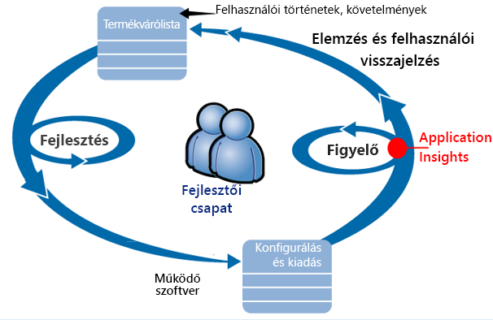
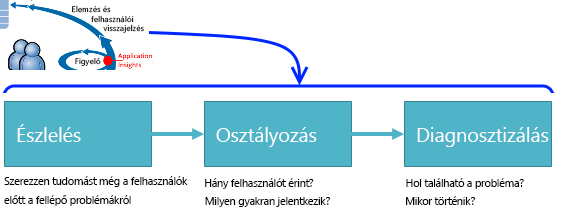
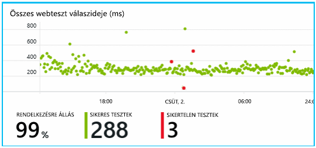
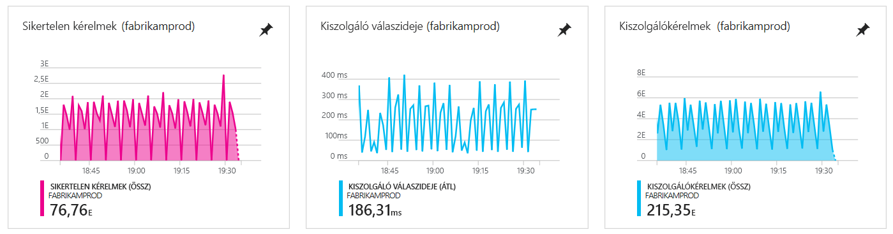
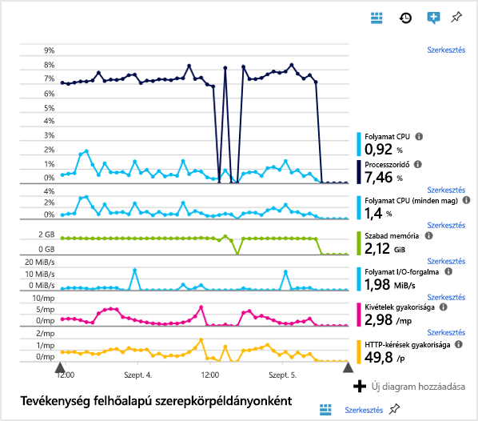
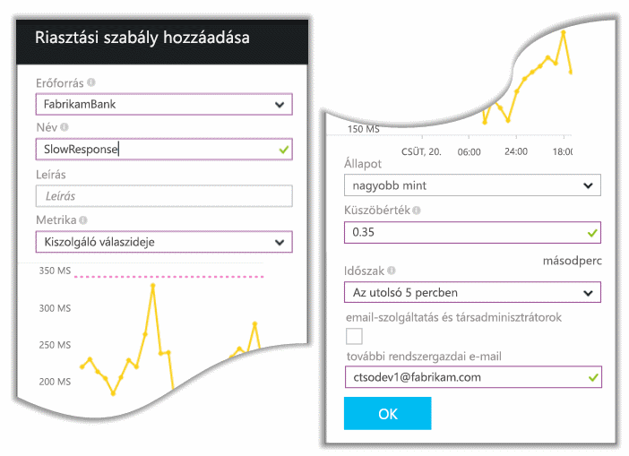
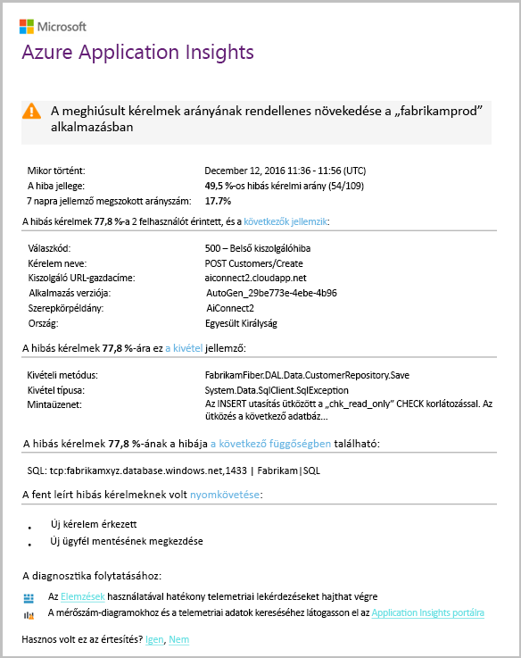
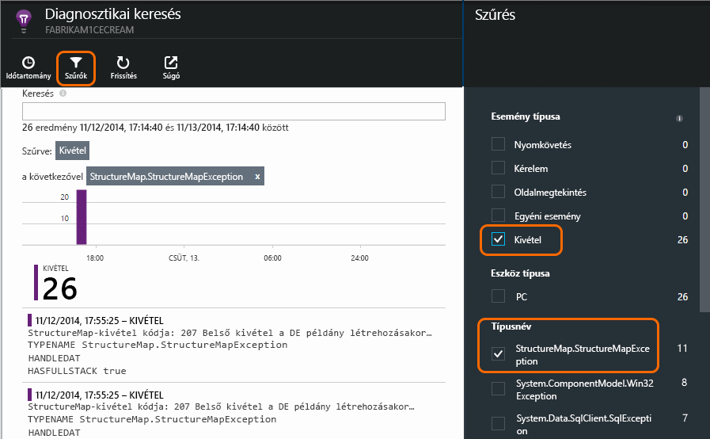
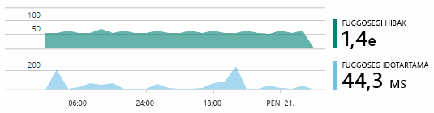

# Az Application Insights áttekintése fejlesztők és üzemeltetők számára

Az [Application Insights](app-insights-overview.md) segítségével könnyen megtekintheti az alkalmazása teljesítményét és használatát működés közben. Probléma esetén értesíti Önt, valamint segít a következmények felmérésében és az ok meghatározásában.

Lássunk egy beszámolót egy webalkalmazásokat fejlesztő csapattól:

* *„Néhány nappal ezelőtt üzembe helyeztünk egy »kisebb« gyorsjavítást. Nem végeztünk széles körű ellenőrzéseket, de sajnos néhány váratlan módosítás beépült a hasznos adatok közé, ami az előtér- és a háttérrendszerek inkompatibilitásához vezetett. Azonnal jelentkeztek a kiszolgálókivételek, riasztást kaptunk, és értesültünk a helyzetről. Az Application Insights portálon néhány kattintás után elég információnk volt a kivételek hívási vermeiről, hogy azonosítani tudjuk a problémát. Azonnal visszaállítást végeztünk, és korlátoztuk a kárt. Az Application Insights a fejlesztési és üzemeltetési ciklusnak ezt a részét igen könnyűvé és kezelhetővé.”*

Ebben a cikkben a Fabrikam Bank egyik csapatának nyomába szegődünk, akik az online banki rendszert (OBS-t) fejlesztik. Látni fogjuk, hogy az Application Insights segítségével gyorsan válaszolnak az ügyfeleknek, illetve frissítéseket hajtanak végre.  

A csapat az alábbi ábra szerint dolgozik a fejlesztői és üzemeltetői cikluson:

A követelmények bekerülnek fejlesztői várólistájukba (feladatlistájukba). Rövid sprintekben dolgoznak, amelyek gyakran eredményeznek működő szoftvert – általában a meglévő alkalmazás fejlesztéseinek és bővítéseinek formájában. Az élő alkalmazás gyakran frissül új funkciókkal. Amikor az alkalmazás használatban van, a csapat az Application Insights segítségével monitorozza a teljesítményét és használatát. Az alkalmazásteljesítmény-figyelési (APM) adatok bekerülnek fejlesztői várólistájukba.

A csapat az Application Insights segítségével pontosan monitorozza a webalkalmazást a következő szempontokból:

* Teljesítmény. Tudni szeretnék, hogyan változnak a válaszidők a kérelmek számának függvényében; mennyi processzor-erőforrást, hálózatot, lemezterületet és más erőforrást használ az alkalmazás; melyik alkalmazáskód lassította le a teljesítményt; illetve hol vannak a szűk keresztmetszetek.
* Hibák. Ha kivételek vagy sikertelen kérések jelentkeznek, illetve ha egy teljesítményszámláló a normál tartományon kívüli eredményt mutat, a csapatnak gyorsan kell értesülnie, hogy mielőbb reagálhasson.
* Használat. A csapat tudni szeretné, hogy a felhasználók mennyire használják ki az újonnan kiadott funkciókat, és hogy tapasztalnak-e problémákat.

Koncentráljunk a ciklus visszajelzési szakaszára:

## Gyenge rendelkezésre állás észlelése
Marcela Markova az OBS-csapat vezető fejlesztője, ő irányítja az online teljesítmény monitorozását. Több [rendelkezésre állási tesztet](app-insights-monitor-web-app-availability.md) is beállít:

* Egy egyetlen URL-címre kiterjedő tesztet az alkalmazás fő kezdőlapjához (http://fabrikambank.com/onlinebanking/). Beállítja a 200-as HTTP-kód és az „Üdvözöljük!” szöveg feltételeit. Ha ez a teszt sikertelen, komoly hálózati vagy kiszolgálóhiba, esetleg üzembehelyezési probléma merült fel. (Vagy valaki módosította az Üdvözöljük! üzenetet az oldalon anélkül, hogy Marcelának erről szólt volna.)
* Egy alaposabb többlépéses tesztet, amely bejelentkezik az oldalra, lekér egy aktuális fióklistát, és minden oldalon ellenőriz néhány kulcsfontosságú részletet. Ez a teszt ellenőrzi, hogy a fiókok adatbázisára mutató hivatkozás működik-e. Marcela egy fiktív ügyfél-azonosítót használ, amelyből tesztelési célokra fenntartanak néhányat.

A tesztek beállítása után, Marcela biztos lehet benne, hogy a csapat gyorsan értesül bármilyen kimaradásról.  

A hibák piros pöttyökként jelennek meg a webes tesztdiagramon:

Még fontosabb azonban, hogy minden egyes riasztásról e-mail érkezik a fejlesztői csapathoz. Így szinte minden ügyfélnél korábban értesülnek a problémáról.

## Teljesítmény monitorozása
Az Application Insights áttekintő oldalán található egy diagram, amely több [kulcsfontosságú metrikát](app-insights-web-monitor-performance.md) tartalmaz.

A böngésző oldalbetöltési ideje a közvetlenül a weboldalakról küldött telemetriai adatokból származik. A kiszolgáló válaszidejét, a kiszolgálóhoz érkező kérések számét és a sikertelen kérések számát a webkiszolgáló méri, majd továbbítja az Application Insightsnak.

Marcela kissé aggódik a kiszolgáló válaszadási diagramja miatt. Ez a diagram a felhasználók böngészőjétől kapott HTTP-kérések fogadása és a rájuk adott válasz közötti átlagos időt jeleníti meg. A szórás nem szokatlan ezen a diagramon, mivel a rendszer terhelése változó. Ebben az esetben azonban úgy tűnik, összefüggés van a kérések számának enyhe növekedése és a válaszidő nagy növekedése között. Ez azt jelezheti, hogy a rendszer elérte a teljesítménye korlátait.

Marcela megnyitja a Kiszolgálók diagramokat:

Itt nincs jele erőforráshiánynak, így a kiszolgáló válaszadási idejében látható kiugrások talán csak a véletlennek köszönhetőek.

## Riasztások beállítása a célok elérése érdekében
Ettől függetlenül Marcela szeretné szemmel tartani a válaszidőket. Ha túl magasra ugranak, azonnal tudni szeretne róla.

Ezért beállít egy [riasztást](app-insights-metrics-explorer.md) a jellemző küszöbértékeket meghaladó válaszidőkre. Így biztos lehet benne, hogy tudni fog az esetleges lassú válaszidőkről.

Számos másféle metrikára is beállíthat riasztásokat. Például kaphat e-mailt, ha a kivételek száma túl nagy, ha az elérhető memória túl alacsony, illetve ha az ügyfélkérések száma tetőzik.

## Naprakész információk az intelligens észlelési riasztásokkal
Másnap érkezik egy riasztási e-mail az Application Insightstól. Amikor Marcela megnyitja, azt látja, hogy nem a korábban beállított válaszidő-riasztás szerepel benne. Ehelyett az e-mail arról tájékoztatja, hogy hirtelen megnőtt a sikertelen – vagyis az 500-as vagy magasabb számú hibakódot visszaküldő kérések száma.

A sikertelen kérések esetében a felhasználók hibakódot látnak, általában miután kivétel kerül a kódba. Előfordulhat, hogy a következőhöz hasonló üzenetet látnak: „Sajnos jelenleg nem tudtuk frissíteni a részleteket.” Vagy a legrosszabb esetben a webkiszolgáló egy veremkiíratás jeleníthet meg a felhasználó képernyőjén.

Ez a riasztás meglepő, mert amikor Marcela utoljára látta, a sikertelen kérések száma biztatóan alacsony volt. Egy elfoglalt kiszolgálón várható, hogy előfordul néhány meghiúsult kérés.

Azért is meglepő volt ez számára, mert ezt a riasztást nem kellett konfigurálnia. Az Application Insights tartalmazza az intelligens észlelést. Automatikusan igazodik az alkalmazás megszokott sikertelenségi mintájához, és „hozzászokik” egy adott oldalhoz, a magas terheléshez vagy más mérőszámokhoz kapcsolódó hibákhoz. Csak akkor küld riasztást, ha egy érték a várt szint fölé emelkedik.

Ez egy roppant hasznos e-mail. Nem egyszerűen csak riasztást küld. Az osztályozási és diagnosztikai munka jó részét is elvégzi.

Megmutatja, hány ügyfél, mely weboldalak, illetve műveletek érintettek. Marcela eldöntheti, hogy az egész csapatot riadóztassa-e gyakorlásképpen, vagy a jövő hétig figyelmen kívül hagyhatja.

Ez az e-mail azt is megmutatja, ha szokatlan kivétel történt, és – ami még érdekesebb – azt is, hogy a hiba egy adott adatbázishoz küldött hívásokhoz kapcsolódik-e. Ez megmagyarázza, miért történt hirtelen hiba annak ellenére, hogy Marcela csapata mostanában nem helyezett üzembe frissítéseket.

Marcela az e-mail alapján értesíti az adatbáziscsapat vezetőjét. Megtudja, hogy ez a csapat kiadott egy gyorsjavítást az elmúlt fél órában – és hoppá, elképzelhető, hogy történt egy kisebb sémaváltozás...

Így a probléma megoldása folyamatban van még azelőtt, hogy megvizsgálták volna a naplókat – a megjelenéstől számított 15 percen belül. Marcela a hivatkozásra kattint, hogy megnyissa az Application Insightsot. Az Application Insights rögtön egy sikertelen kéréssel nyílik meg, és Marcela a sikertelen adatbázishívást is látja a függőségi hívások kapcsolódó listájában.

## Kivételek észlelése
Némi beállítással a rendszer automatikusan jelenti a [kivételeket](app-insights-asp-net-exceptions.md) az Application Insightsnak. Részletesen rögzíthetők is, ha a [TrackException()](../azure-monitor/app/api-custom-events-metrics.md#trackexception) hívásait beilleszti a kódba:  

    var telemetry = new TelemetryClient();
    ...
    try
    { ...
    }
    catch (Exception ex)
    {
       // Set up some properties:
       var properties = new Dictionary <string, string>
         {{"Game", currentGame.Name}};

       var measurements = new Dictionary <string, double>
         {{"Users", currentGame.Users.Count}};

       // Send the exception telemetry:
       telemetry.TrackException(ex, properties, measurements);
    }

A Fabrikam Bank csapata mindig küld telemetriát a kivételekről, hacsak nem nyilvánvaló helyreállításról van szó.  

Valójában a stratégiájuk még szélesebb körű, mint a következő: Küldenek telemetriát, minden esetben, ha az ügyfél hiúsuljon meg a kívánt szeretné elvégezni, akár a kódban kivétel vagy sem. Ha például a külső bankközi átutalási rendszer „ez a tranzakció nem teljesíthető” üzenetet küld vissza valamilyen működési ok (tehát nem az ügyfél hibája) miatt, nyomon követik ezt az eseményt.

    var successCode = AttemptTransfer(transferAmount, ...);
    if (successCode < 0)
    {
       var properties = new Dictionary <string, string>
            {{ "Code", returnCode, ... }};
       var measurements = new Dictionary <string, double>
         {{"Value", transferAmount}};
       telemetry.TrackEvent("transfer failed", properties, measurements);
    }

A TrackException használatával jelenítik meg a kivételeket, mert az másolatot küld a veremről. A TrackEvent használatával más eseményeket lehet jelenteni. Bármilyen tulajdonság csatolható, amely hasznos lehet a diagnózis során.

A kivételek és az események a [Diagnosztikai keresés](app-insights-diagnostic-search.md) panelen jelennek meg. Részletesen is megvizsgálhatja őket a további tulajdonságok és a híváslánc megtekintéséhez.

## Proaktív monitorozás
Marcela nem várja tétlenül a riasztásokat. Minden ismételt üzembe helyezés után nem sokkal ellenőrzi a [válaszidőket](app-insights-web-monitor-performance.md) – a teljes képet, a leglassabb kérések táblázatát és a kivételek számát is.  

Minden üzembe helyezés teljesítményét fel tudja mérni, és általában minden hetet az előzővel hasonlít össze. Ha hirtelen romlást tapasztal, megvitatja az érintett fejlesztőkkel.

## Osztályozási problémák
Az osztályozás – a probléma komolyságának és kiterjedésének felmérése – az első lépés az észlelés után. Hívjuk-e éjfélkor a csapatot? Vagy ráér a probléma a következő alkalmas időpontig, amikor kevesebb a feladat? Az osztályozásban felmerül néhány kulcsfontosságú kérdés.

Milyen gyakran történik? Az Áttekintés panel diagramjai több szempontból is megvilágítják a problémát. Például a Fabrikam alkalmazása négy webtesztriasztást is létrehozott egy éjszaka alatt. A reggel láthatta, hogy valóban volt néhány piros pötty a diagramon, bár a tesztek többsége még mindig zöld volt. A rendelkezésre állási diagram alaposabb megtekintésekor világossá vált, hogy ezek az időszakos problémák egyetlen teszthelyről származtak. Nyilvánvalóan hálózati problémáról volt szó, egyetlen útvonalat érintett, és valószínűleg magától megszűnt.  

Ezzel szemben a kivételszámok vagy válaszidők diagramján látható hirtelen és stabil növekedés egyértelműen aggodalomra ad okot.

A személyes próba hasznos osztályozási technika. Ha Ön is tapasztalja a problémát, akkor biztosan valós.

A felhasználók mely része érintett? A hozzávetőleges válaszhoz ossza el a sikertelenségi rátát a munkamenetek számával.

Ha lassúak a válaszok, hasonlítsa össze a leglassabban válaszoló kérések számának táblázatát az egyes oldalak használati gyakoriságával.

Mennyire fontos a letiltási forgatókönyv? Ha egy funkcionális problémáról van szó, amely egy adott felhasználói történetet blokkol, az mennyire fontos? Ha a felhasználók nem tudják kifizetni a számláikat, akkor komoly a helyzet; ha nem tudják megváltoztatni a kijelzőjük színbeállításait, akkor talán várhat a megoldás. Az esemény vagy a kivétel részleteinek megtekintéséből, illetve a lassú oldal azonosításából megtudhatja, hol tapasztalnak problémákat a felhasználók.

## Problémák diagnosztizálása
A diagnosztizálás nem teljesen ugyanaz, mint a hibakeresés. Mielőtt elkezdené átvizsgálni a kódot, érdemes hozzávetőleges elképzeléssel rendelkeznie arról, hogy miért, hol és mikor történik a probléma.

**Mikor történik?** Az esemény- és a mérőszám-diagramok által biztosított előzménynézettel könnyen összekapcsolhatja a hatásokat és a lehetséges okokat. Ha időszakos kiugrások tapasztalhatók a válaszidőben vagy a kivételarányokban, nézze meg a kérelmek számát: ha ugyanabban az időben mutat kiugrást, akkor valószínűleg erőforrásproblémáról van szó. Több processzort vagy memóriát kell hozzárendelnie? Vagy egy függőség nem tudja kezelni a terhelést?

**A mi hibánk?**  Ha hirtelen esést tapasztal egy adott kérelemtípus teljesítményében – például ha az ügyfél számlakivonatot szeretne – akkor lehetséges, hogy egy külső alrendszer a hibás, és nem az ön webalkalmazása. A Metrikaböngészőben jelölje ki a Függőséghibák arányát és a Függőségi időtartam-arányokat, és hasonlítsa össze az elmúlt néhány óra vagy nap előzményeit az észlelt problémával. Ha vannak összefüggő változások, valószínűleg egy külső alrendszer okozza a problémát.  

Egyes lassúsági függőségi problémákat földrajzi hely okoz. A Fabrikam Bank Azure-beli virtuális gépeket használ, és felfedezték, hogy a webkiszolgálót és a fiókkiszolgálót véletlenül eltérő országokban helyezték el. Miután az egyiket migrálták, drámai javulás következett be.

**Mit tettünk?** Ha úgy tűnik, hogy a probléma nem függőségben van, és nem volt mindig tapasztalható, valószínűleg egy friss változás okozhatja. Az esemény- és a mérőszám-diagramok által biztosított előzményekkel könnyen összekapcsolhatja a hirtelen változásokat és az üzembe helyezéseket. Ez megkönnyíti a probléma keresését. Engedélyezze az Application Insights Profilert az alkalmazáskód azon sorainak azonosításához, amelyek a lassú teljesítményt okozták. Lásd az [élő Azure-webalkalmazások Application Insightsszal történő profilkészítését](./app-insights-profiler.md) ismertető szakaszt. Miután engedélyezte a profilkészítőt, a következőhöz hasonló nyomot fog látni. Az alábbi példában könnyen észrevehető, hogy a *GetStorageTableData* metódus okozta a problémát.  

**Mi történik?** Néhány probléma csak ritkán jelentkezik, és offline teszteléssel nehezen lehet megtalálni. Egy dolgot lehet tenni: meg kell próbálni akkor elkapni a hibát, amikor élő használat közben jelentkezik. A veremkiírásokat megtekintheti a kivételjelentésekben. Ezenkívül írhat nyomkövetési hívásokat kedvenc naplózási keretrendszerével, illetve a TrackTrace() vagy a TrackEvent() használatával.  

A Fabrikam időnként problémákat tapasztalt a fiókközi átutalásokkal, de csak bizonyos fióktípusoknál. Hogy jobban megérthessék, mi történik, TrackTrace() hívásokat illesztettek a kód kulcspontjaiba, és minden egyes híváshoz hozzácsatolták a fióktípust tulajdonságként. Így könnyen rá tudtak szűrni ezekre a nyomokra a Diagnosztikai keresésben. Ezenkívül paraméterértékeket is csatoltak tulajdonságként és mértékként a nyomkövetési hívásokhoz.

## Válasz a felfedezett problémákra
Ha sikerült diagnosztizálni a problémát, megtervezheti az elhárítását. Lehet, hogy vissza kell vonni egy módosítást, vagy egyszerűen csak kijavíthatja a hibát. Ha a javítás elkészült, az Application Insights tájékoztatja, hogy sikeres volt-e.  

A Fabrikam Bank fejlesztési csapata most már sokkal szervezettebb módon végzi a teljesítménymérést, mint az Application Insights használata előtt.

* Az Application Insights áttekintő oldalán célokat határoznak meg bizonyos mértékekhez.
* Kezdettől fogva teljesítménymértékeket terveznek az alkalmazásba, például olyan mérőszámokat, amelyek a felhasználók előrehaladását mérik a „tölcsérekben”.  

## A felhasználói tevékenység monitorozása
Ha a válaszidő egységesen jó, és kevés kivétel van, a fejlesztői csapat továbbléphet a használhatóságra. Most már azon is gondolkodhatnak, hogyan javítsanak a felhasználói élményen és hogyan segítség elő, hogy több felhasználó érje el a kívánt célokat.

Az Application Insights segítségével ezenkívül azt is megtudhatják, mire használják a felhasználók az alkalmazásokat. Ha az alkalmazás már simán fut, a csapat szeretné tudni, mely szolgáltatások a legnépszerűbbek, mit szeretnek a felhasználók vagy mivel vannak nehézségeik, illetve milyen gyakran térnek vissza. Ez segíti a csapatot abban, hogy meghatározza a soron következő munkák fontossági sorrendjét. Így a fejlesztési ciklus részeként megtervezheti az egyes szolgáltatások sikerének mérését is.

Egy átlagos felhasználó tevékenysége a webhelyen jól látható „tölcsérként” írható le. Sok ügyfél a különböző típusú hitelek árait nézi meg. Néhányuk kitölti az árajánlatkérő űrlapot. Azok közül, akik megkapják az árajánlatot, néhány úgy döntenek, hogy felveszik a hitelt.

Annak áttekintésével, hol tűnik el a legtöbb ügyfél, a vállalkozás megtervezheti, hogyan juttathat el több felhasználót a tölcsér aljára. Néhány esetben ez a felhasználói felület (UX) hibája lehet; például nehéz megtalálni a Tovább gombot, vagy nem elég egyértelműek az utasítások. Még valószínűbb, hogy az eltűnésekért alapvető üzleti okok felelősek: talán túl magasak a hitelköltségek.

Bármi is az ok, az adatok segítik a csapatot annak meghatározásában, hogy mit is csinálnak a felhasználók. További nyomkövetési hívások beszúrásával még több részlet nyerhető ki. A TrackEvent() segítségével bármilyen felhasználói művelet számát meg lehet határozni, az egyedi kattintások pontos részleteitől a jelentős teljesítményekig, mint például egy hitel kifizetése.

A csapat lassan hozzászokik, hogy információkat kap a felhasználói tevékenységekről. Mostanában a szolgáltatások tervezésekor azt is kidolgozzák, hogyan fognak visszajelzést kapni a használatáról. A kezdetektől beépítik a szolgáltatásba a nyomkövető hívást. A visszajelzés segítségével javítják a szolgáltatást minden fejlesztési szakaszban.

[További információk a használat követéséről](app-insights-usage-overview.md).

## A fejlesztői és üzemeltetői ciklus alkalmazása
Ez csapat tehát így használja az Application Insightsot az egyes hibák elhárítására és a fejlesztési ciklus javítására. Remélem, ez a példa adott néhány ötletet arról, hogyan segíthet az Application Insights a saját alkalmazása teljesítményének kezelésében.

## Videó

> [!VIDEO https://channel9.msdn.com/events/Connect/2016/112/player]

## További lépések
Az alkalmazása tulajdonságaitól függően több módon is hozzáláthat. Válassza ki a legmegfelelőbbet:

* [ASP.NET-es webalkalmazás](app-insights-asp-net.md)
* [Java-webalkalmazás](app-insights-java-get-started.md)
* [Node.js-webalkalmazás](app-insights-nodejs.md)
* Már üzembe helyezett, az [IIS](app-insights-monitor-web-app-availability.md)-ben, [J2EE](app-insights-java-live.md)-ben vagy [Azure](app-insights-overview.md)-ban működő alkalmazások.
* [Weblapok](app-insights-javascript.md) – Egylapos alkalmazás vagy átlagos weblap – önmagában vagy bármelyik kiszolgálói lehetőséggel együtt is használható.
* [Rendelkezésre állási tesztek](app-insights-monitor-web-app-availability.md) az alkalmazás nyilvános internetről való teszteléséhez.
