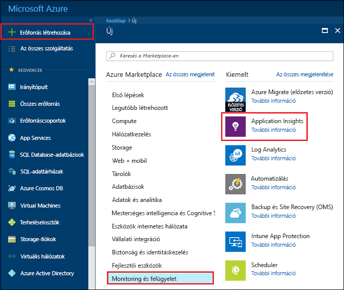
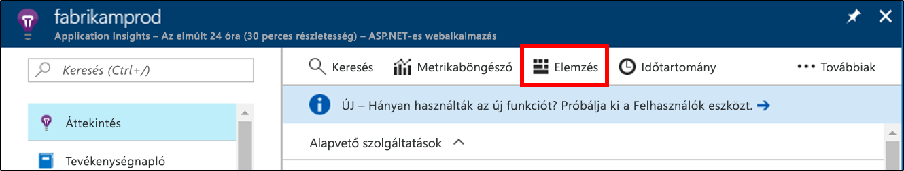
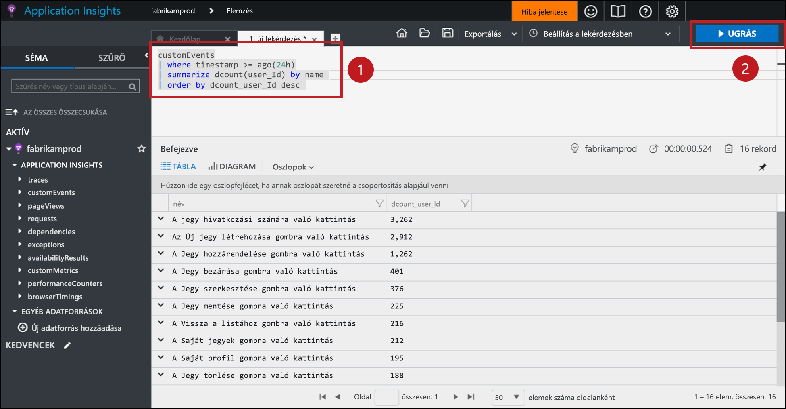
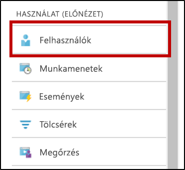
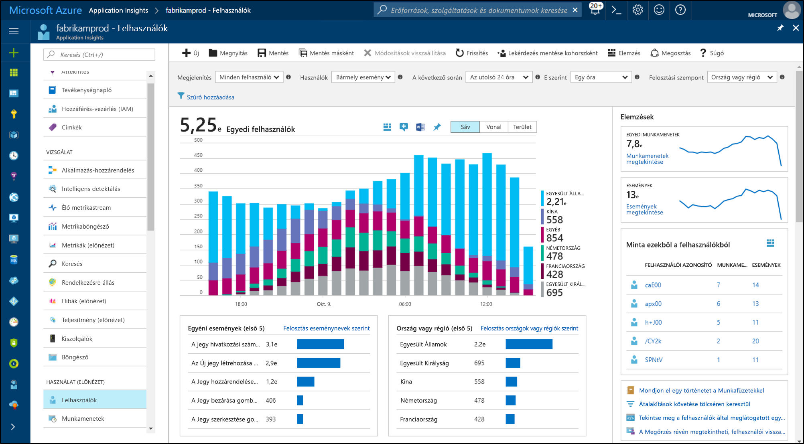
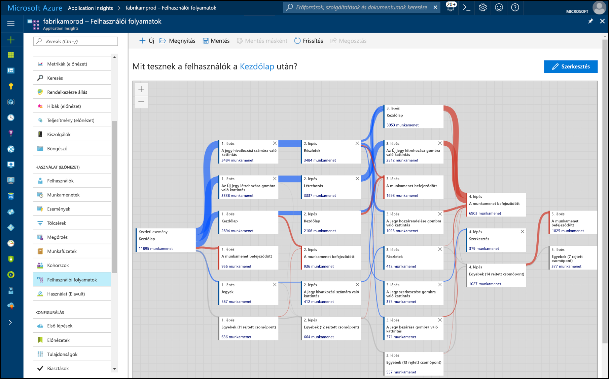

# <a name="start-analyzing-your-mobile-app-with-app-center-and-application-insights"></a>A mobilalkalmazás elemzésének első lépései az App Center és az Application Insights használatával

Ez a rövid útmutató végigvezeti az alkalmazáshoz tartozó App Center-példány Application Insightshoz való csatlakoztatásának lépésein. Az Application Insights hatékonyabb eszközöket biztosít a telemetria lekérdezésére, szegmentálására, szűrésére és elemzésére, mint amelyek az App Center [Elemzés](https://docs.microsoft.com/mobile-center/analytics/) szolgáltatásában elérhetők.

## <a name="prerequisites"></a>Előfeltételek

A rövid útmutató elvégzéséhez a következőkre lesz szüksége:

- Azure-előfizetés.
- iOS-, Android-, Xamarin-, Univerzális Windows- vagy React Native-alkalmazás.
 
Ha nem rendelkezik Azure-előfizetéssel, első lépésként mindössze néhány perc alatt létrehozhat egy [ingyenes](https://azure.microsoft.com/free/) fiókot.

## <a name="onboard-to-app-center"></a>Az App Center előkészítése

Mielőtt használni tudná az Application Insightsot a mobilalkalmazásával, elő kell készítenie az alkalmazást az [App Center](https://docs.microsoft.com/mobile-center/) számára. Az Application Insights nem fogad telemetriát közvetlenül a mobilalkalmazásból. Az alkalmazás ehelyett egyéniesemény-telemetriát küld az App Centernek. Az App Center ezután folyamatosan exportálja az egyéni események másolatait az Application Insightsba, amint megkapja az eseményeket.

Az alkalmazás előkészítéséhez kövesse az App Center rövid útmutatóját az alkalmazás által támogatott platformokhoz. Hozzon létre külön App Center-példányt az egyes platformok számára:

* [iOS](https://docs.microsoft.com/mobile-center/sdk/getting-started/ios).
* [Android](https://docs.microsoft.com/mobile-center/sdk/getting-started/android).
* [Xamarin](https://docs.microsoft.com/mobile-center/sdk/getting-started/xamarin).
* [Univerzális Windows](https://docs.microsoft.com/mobile-center/sdk/getting-started/uwp).
* [React Native](https://docs.microsoft.com/mobile-center/sdk/getting-started/react-native).

## <a name="track-events-in-your-app"></a>Események nyomon követése az alkalmazásban

Miután előkészítette az alkalmazást az App Center számára, módosítani kell, hogy egyéni esemény telemetriát küldjön az App Center SDK segítségével. Az egyéni esemény az egyetlen App Center-telemetriatípus, amelyet az App Center az Application Insightsba exportál.

Ha iOS-alkalmazásokból szeretne egyéni eseményeket küldeni, használja a `trackEvent` vagy a `trackEvent:withProperties` metódust az App Center SDK-ban. [További információk az iOS-alkalmazások eseményeinek követéséről.](https://docs.microsoft.com/mobile-center/sdk/analytics/ios)

```Swift
MSAnalytics.trackEvent("Video clicked")
```

Ha Android-alkalmazásokból szeretne egyéni eseményeket küldeni, használja a `trackEvent` metódust az App Center SDK-ban. [További információk az Android-alkalmazások eseményeinek követéséről.](https://docs.microsoft.com/mobile-center/sdk/analytics/android)

```Java
Analytics.trackEvent("Video clicked")
```

Ha más alkalmazásplatformokról szeretne egyéni eseményeket küldeni, használja a `trackEvent` metódusokat a hozzájuk tartozó App Center SDK-kban.

Ha meg szeretne győződni arról, hogy az App Center fogadja az egyéni eseményeket, az App Centerben lépjen az **Elemzés** szakasz **Események** lapjára. Az elküldéstől számítva eltarthat néhány percig, mire az események megjelennek.

## <a name="create-an-application-insights-resource"></a>Application Insights-erőforrás létrehozása

Ha az alkalmazás egyéni eseményeket küld, és az App Center fogadja ezeket az eseményeket, létre kell hoznia egy App Center-típusú Application Insights-erőforrást az Azure Portalon:

1. Jelentkezzen be az [Azure Portalra](https://portal.azure.com/).
2. Válassza az **Erőforrás létrehozása** > **Monitoring és felügyelet** > **Application Insights** elemet.

    

    Megjelenik egy konfigurációs képernyő. Az adatbeviteli mezők kitöltéséhez használja az alábbi táblázatot.

    | Beállítások        |  Érték           | Leírás  |
   | ------------- |:-------------|:-----|
   | **Name (Név)**      | Néhány globálisan egyedi érték, például „myApp-iOS” | A figyelt alkalmazást azonosító név |
   | **Alkalmazás típusa** | App Center-alkalmazás | A figyelt alkalmazás típusa |
   | **Erőforráscsoport**     | Egy új erőforráscsoport, vagy egy meglévő a menüből | Az erőforráscsoport, amelyben létrehozza az új Application Insights-erőforrást |
   | **Hely** | Egy hely a menüből | Válasszon egy Önhöz vagy az alkalmazást futtató gazdagéphez közeli helyet. |

3. Kattintson a **Create** (Létrehozás) gombra.

Ha az alkalmazás több platformot (iOS, Android stb.) támogat, érdemes minden platform számára külön Application Insights-erőforrást létrehozni.

## <a name="export-to-application-insights"></a>Exportálás az Application Insightsba

Az új Application Insights-erőforrásban másolja ki az erőforrás kialakítási kulcsát az **Áttekintés** oldal **Alapvető szolgáltatások** szakaszának felső részéről.

Az alkalmazáshoz tartozó App Center-példányban:

1. A **Beállítások** oldalon kattintson az **Exportálás** lehetőségre.
2. Válassza az **Új exportálás**, majd az **Application Insights** elemet, végül pedig kattintson a **Testreszabás** lehetőségre.
3. Illessze be az Application Insights-kialakítási kulcsot a mezőbe.
4. Hagyja jóvá az Application Insights-erőforrást tartalmazó Azure-előfizetés használatának növelését. Minden Application Insights-erőforrás esetén havonta az első 1 GB fogadott adat ingyenes. [További információ az Application Insights díjszabásáról.](https://azure.microsoft.com/pricing/details/application-insights/)

Ne felejtse el megismételni ezt a folyamatot az alkalmazás által támogatott összes platformnál.

Az [exportálás](https://docs.microsoft.com/mobile-center/analytics/export) beállítása után az App Center az összes fogadott egyéni eseményt átmásolja az Application Insightsba. Több percig is eltarthat, mire az események elérnek az Application Insightsba, így ha nem jelennek meg azonnal, várjon egy kicsit a további diagnosztizálással.

Hogy még több adatot kapjon az első csatlakozáskor, az App Center automatikusan exportálja az elmúlt 48 óra egyéni eseményeit az Application Insightsba.

## <a name="start-monitoring-your-app"></a>Az alkalmazás figyelésének megkezdése

Az App Center által biztosított elemzőeszközök mellett az Application Insights is képes az alkalmazásoktól kapott egyéniesemény-telemetriák lekérdezésére, szegmentálására, szűrésére és elemzésére.

1. **Kérdezze le az egyéniesemény-telemetriát.** Az Application Insights **Áttekintés** oldalán válassza az **Elemzés** lehetőséget. 

   

   Megnyílik az Application Insights-erőforráshoz társított Application Insights Analytics-portál. Az Analytics-portálon közvetlenül lekérdezheti az adatokat a Log Analytics lekérdezési nyelv használatával, így tetszőlegesen bonyolult kérdéseket tehet fel az alkalmazással és a felhasználóival kapcsolatban.
   
   Nyisson meg egy új lapot az Analytics-portálon, majd illessze be a következő lekérdezést. Ez visszaadja, hogy hány különböző felhasználó küldte el az egyes egyéni eseményeket az alkalmazásból az elmúlt 24 órában, számok szerint rendezve.

   ```AIQL
   customEvents
   | where timestamp >= ago(24h)
   | summarize dcount(user_Id) by name 
   | order by dcount_user_Id desc 
   ```

   

   1. Jelölje ki a lekérdezést úgy, hogy a lekérdezés egy tetszőleges pontjára kattint a szövegszerkesztőben.
   2. Ezután kattintson az **Indítás** lehetőségre a lekérdezés futtatásához. 

   További információk az [Application Insights Analyticsről](app-insights-analytics.md) és a [Log Analytics lekérdezési nyelvről](https://docs.loganalytics.io/docs/Language-Reference).


2. **Szegmentálja és szűrje az egyéniesemény-telemetriát.** Az Application Insights **Áttekintés** oldalán a tartalomjegyzékből válassza ki a **Felhasználók** lehetőséget.

   

   A Felhasználók eszköz megjeleníti, hogy az alkalmazás hány felhasználója kattintott rá bizonyos gombokra, látogatott meg bizonyos képernyőket vagy hajtott végre bármely más műveletet, amelyet nyomon követ eseményként az App Center SDK-val. Ha megoldást keres az App Center eseményeinek szegmentálására és szűrésére, a Felhasználók eszköz remek választás lehet.

    

   Például ha az **Ország vagy régió** lehetőséget választja a **Felosztás** legördülő menüben, földrajzi régiók szerint szegmentálhatja a használatot.

3. **Elemezze az alkalmazás átalakítási, megtartási és navigációs mintáit.** Az Application Insights **Áttekintés** oldalán a tartalomjegyzékből válassza ki a **Felhasználói folyamatok** lehetőséget.

   

   A Felhasználói folyamatok eszköz megjeleníti, hogy a felhasználók mely eseményeket küldik el az indítási események után. A segítségével átfogó képet lehet kapni arról, hogy hogyan navigálnak a felhasználók az alkalmazásban. Az eszköz továbbá megmutathatja azokat a helyeket, ahol sok felhasználó megfordul az alkalmazásban, vagy ahol többször is végrehajtják ugyanazokat a műveleteket.

   A Felhasználói folyamatok mellett az Application Insights a felhasználói viselkedést elemző egyéb eszközökkel is rendelkezik a konkrét kérdések megválaszolásához:

   * **Tölcsérek** – a konverziós arányok elemzéséhez és figyelemmel kíséréséhez.
   * **Megtartás** – annak elemzésére, hogy milyen jól tartja meg az alkalmazás a felhasználókat az idő múlásával.
   * **Munkafüzetek** – képi megjelenítések és szöveg megosztható jelentésbe való egyesítéséhez.
   * **Kohorszok** – az adott felhasználó- vagy eseménycsoportok elnevezéséhez és mentéséhez, hogy könnyen lehessen rájuk hivatkozni más elemzési eszközökből.

## <a name="clean-up-resources"></a>Az erőforrások eltávolítása

Ha nem szeretné tovább használni az Application Insightsot az App Centerrel, kapcsolja ki az exportálást az App Centerben, és törölje az Application Insights-erőforrást. Ez meg fogja akadályozni, hogy az Application Insights további díjakat számoljon fel ezért az erőforrásért.

Az exportálás kikapcsolása az App Centerben:

1. Az App Centerben nyissa meg a **Beállítások** elemet, és válassza az **Exportálás** lehetőséget.
2. Kattintson a törölni kívánt Application Insights exportálásra, majd alul kattintson az **Exportálás törlése** lehetőségre, és hagyja jóvá.

Az Application Insights-erőforrás törlése:

1. Az Azure Portal bal oldali menüjében kattintson az **Erőforráscsoportok** lehetőségre, majd válassza ki az erőforráscsoportot, amelyben az Application Insights-erőforrás létrejött.
2. Nyissa meg a törölni kívánt Application Insights-erőforrást. Kattintson a **Törlés** gombra az erőforrás felső menüjében, és hagyja jóvá. Ez véglegesen törölni fogja az adatok Application Insightsba exportált másolatát.

## <a name="next-steps"></a>További lépések

> [!div class="nextstepaction"]
> [Ismerje meg, hogyan használják az ügyfelek az alkalmazást](app-insights-usage-overview.md)