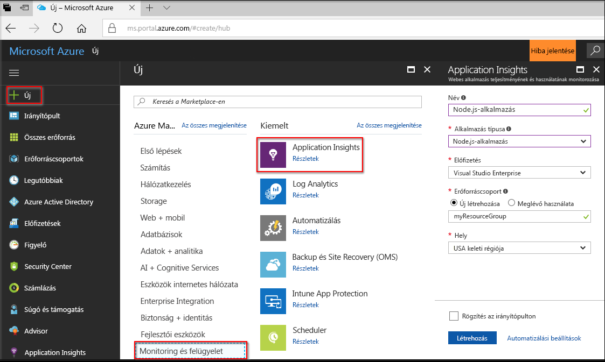
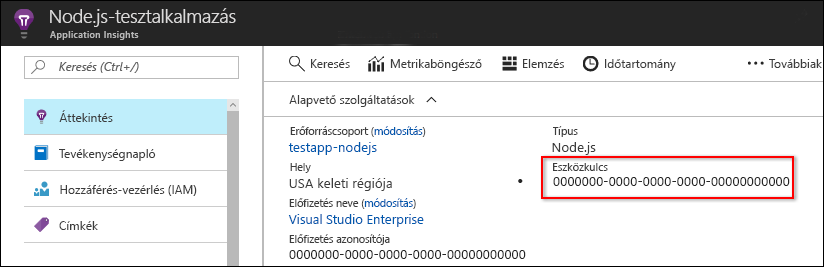
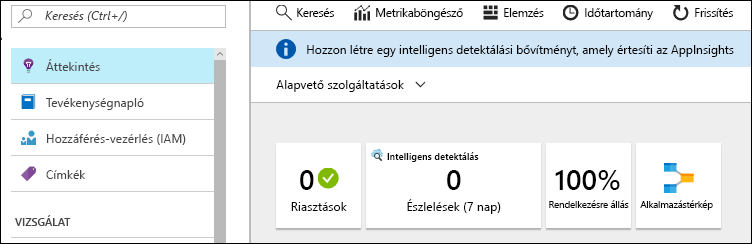
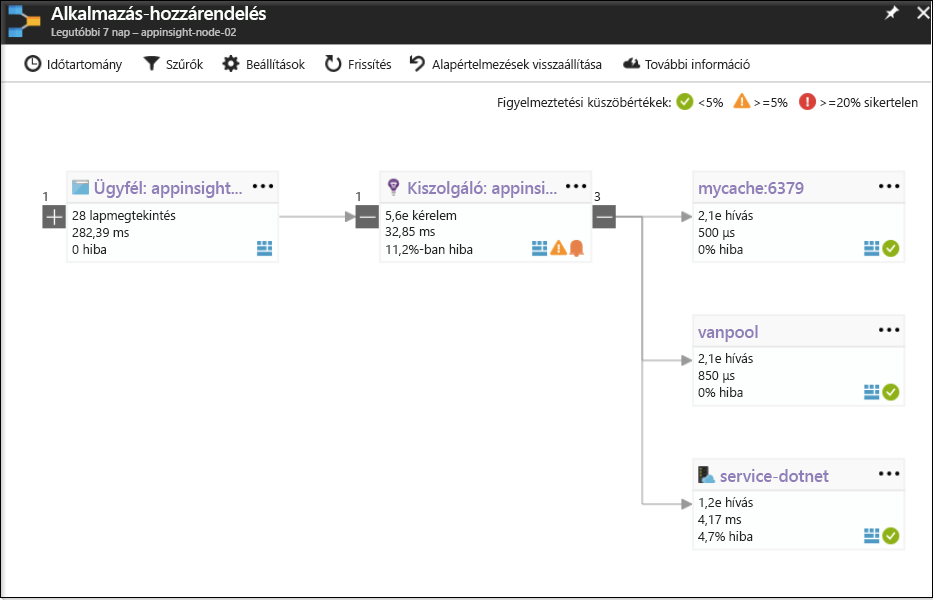
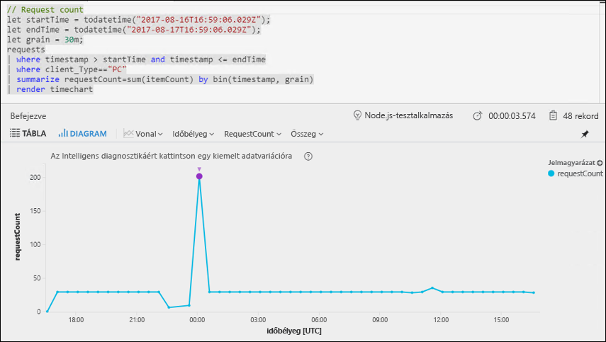
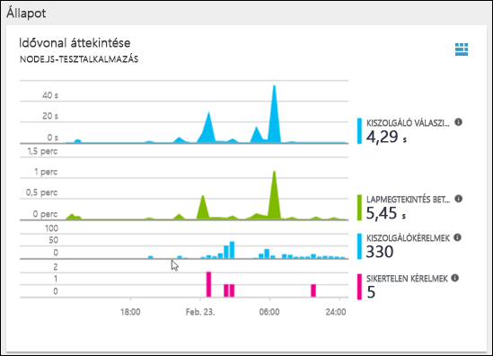
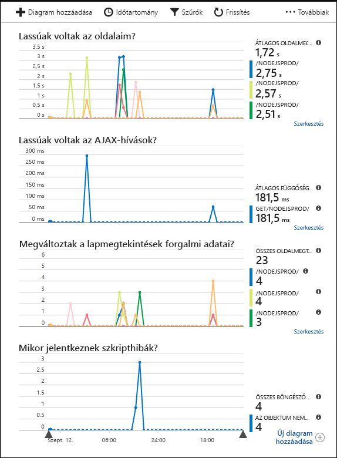

# <a name="start-monitoring-your-nodejs-web-application"></a>A Node.js-webalkalmazás monitorozásának indítása

Az Azure Application Insights segítségével egyszerűen monitorozhatja webalkalmazása rendelkezésre állását, teljesítményét és használatát. Emellett egyszerűen azonosíthatja és diagnosztizálhatja az alkalmazás hibáit anélkül, hogy meg kellene várnia, amíg egy felhasználó jelenti azokat. Az SDK 0.20-as verziós kiadásától kezdve a gyakori külsős csomagok, például a MongoDB, a MySQL és a Redis monitorozása is lehetségessé vált.

Ez a rövid útmutató végigvezeti a Node.js-hez készült Application Insights SDK 0.22-es verziója egy meglévő Node.js-webalkalmazáshoz történő hozzáadásának folyamatán.

## <a name="prerequisites"></a>Előfeltételek

A gyorsútmutató elvégzéséhez:

- Szüksége lesz egy Azure-előfizetésre és egy meglévő Node.js-webalkalmazásra.

Ha nem rendelkezik Node.js-webalkalmazással, a létrehozásához követheti a [Node.js-webalkalmazások létrehozásához készült útmutató](https://docs.microsoft.com/azure/app-service/app-service-web-get-started-nodejs) utasításait.
 
Ha nem rendelkezik Azure-előfizetéssel, első lépésként mindössze néhány perc alatt létrehozhat egy [ingyenes](https://azure.microsoft.com/free/) fiókot.

## <a name="log-in-to-the-azure-portal"></a>Jelentkezzen be az Azure portálra.

Jelentkezzen be az [Azure portálra](https://portal.azure.com/).

## <a name="enable-application-insights"></a>Az Application Insights engedélyezése

Az Application Insights bármely, az internethez csatlakozó alkalmazásról képes telemetriaadatokat gyűjteni, függetlenül attól, hogy az a helyszínen vagy a felhőben fut-e. Az adatok megjelenítéséhez hajtsa végre az alábbi lépéseket.

1. Válassza az **Új** > **Felügyelet és kezelés** > **Application Insights** elemet.

   

   Megjelenik egy konfigurációs képernyő. Az adatbeviteli mezők kitöltéséhez használhatja az alábbi táblázatot.

    | Beállítások        | Érték           | Leírás  |
   | ------------- |:-------------|:-----|
   | **Name (Név)**      | Globálisan egyedi érték | A figyelt alkalmazást azonosító név |
   | **Alkalmazás típusa** | Node.js-alkalmazás | A figyelt alkalmazás típusa |
   | **Erőforráscsoport**     | myResourceGroup      | Az App Insights-adatokat futtató új erőforráscsoport neve |
   | **Hely** | USA keleti régiója | Válasszon egy Önhöz vagy az alkalmazást futtató gazdagéphez közeli helyet. |

2. Kattintson a **Create** (Létrehozás) gombra.

## <a name="configure-app-insights-sdk"></a>Az App Insights SDK konfigurálása

1. Válassza az **Áttekintés** > **Alapvető erőforrások** elemet, és másolja ki az alkalmazás **Kialakítási kulcsát**.

   

2. Adja hozzá a Node.js-hez készült Application Insights SDK-t az alkalmazáshoz. Az alkalmazás gyökérmappájából futtassa a következőket:

   ```bash
   npm install applicationinsights --save
   ```

3. Módosítsa az alkalmazás első .js-fájlját, és adja hozzá az alábbi két sort a szkript legtetejéhez. A [Node.js rövid útmutatójában található alkalmazás](https://docs.microsoft.com/azure/app-service/app-service-web-get-started-nodejs) használata esetén az index.js fájlt kell módosítania. Az &lt;instrumentation_key&gt; helyére írja be az alkalmazása eszközkulcsát. 

   ```JavaScript
   const appInsights = require('applicationinsights');
   appInsights.setup('<instrumentation_key>').start();
   ```

4. Indítsa újra az alkalmazást.

> [!NOTE]
> 3–5 percet is igénybe vehet, mire az adatok elkezdenek megjelenni a portálon. Ha az alkalmazás egy alacsony forgalmú tesztalkalmazás, vegye figyelembe, hogy a legtöbb metrika rögzítése csak akkor történik, ha aktív kérések és műveletek vannak folyamatban.

## <a name="start-monitoring-in-the-azure-portal"></a>Monitorozás indítása az Azure Portalon

1. Most megnyithatja ismét az Application Insights **Áttekintés** lapját az Azure Portalon (ahol a kialakítási kulcsot is megjelenítette) a jelenleg futó alkalmazás részleteinek megtekintéséhez.

   

2. Kattintson az **Alkalmazástérkép** elemre az alkalmazás-összetevők függőségi viszonyait mutató vizuális elrendezés megjelenítéséhez. Minden egyes összetevőnél megjelennek a KPI-k, például a terhelés, a teljesítmény, a hibák és a riasztások.

   

3. Kattintson az **Alkalmazáselemzés** ikonra .  Megnyílik az **Application Insights Analytics**, amely egy részletes lekérdezési nyelvet biztosít az Application Insights által gyűjtött adatok elemzéséhez. Esetünkben most egy lekérdezés jön létre, amely a kérések számát egy diagramon jeleníti meg. A további adatok elemzéséhez írhat saját lekérdezéseket is.

   

4. Lépjen vissza az **Áttekintés** lapra, és vizsgálja meg az **Állapotáttekintési időegyenest**.  Ezen az irányítópulton az alkalmazás állapotával kapcsolatos statisztikák jelennek meg, köztük a bejövő kérések száma, az egyes kérések időtartama, valamint az esetleges hibák. 

   

   Ahhoz, hogy a **Lapmegtekintés betöltési ideje** diagramon megjelenjenek az **ügyféloldali telemetria** adatai, adja az alábbi szkriptet minden olyan oldalhoz, amelyet nyomon kíván követni:

   ```HTML
   <!-- 
   To collect end-user usage analytics about your application, 
   insert the following script into each page you want to track.
   Place this code immediately before the closing </head> tag,
   and before any other scripts. Your first data will appear 
   automatically in just a few seconds.
   -->
   <script type="text/javascript">
     var appInsights=window.appInsights||function(config){
       function i(config){t[config]=function(){var i=arguments;t.queue.push(function(){t[config].apply(t,i)})}}var t={config:config},u=document,e=window,o="script",s="AuthenticatedUserContext",h="start",c="stop",l="Track",a=l+"Event",v=l+"Page",y=u.createElement(o),r,f;y.src=config.url||"https://az416426.vo.msecnd.net/scripts/a/ai.0.js";u.getElementsByTagName(o)[0].parentNode.appendChild(y);try{t.cookie=u.cookie}catch(p){}for(t.queue=[],t.version="1.0",r=["Event","Exception","Metric","PageView","Trace","Dependency"];r.length;)i("track"+r.pop());return i("set"+s),i("clear"+s),i(h+a),i(c+a),i(h+v),i(c+v),i("flush"),config.disableExceptionTracking||(r="onerror",i("_"+r),f=e[r],e[r]=function(config,i,u,e,o){var s=f&&f(config,i,u,e,o);return s!==!0&&t["_"+r](config,i,u,e,o),s}),t
       }({
           instrumentationKey:"<insert instrumentation key>"
       });
       
       window.appInsights=appInsights;
       appInsights.trackPageView();
   </script>
   ```

5. Kattintson a **Böngésző** gombra a **Vizsgálat** fejléc alatt. Itt találja az alkalmazás lapjainak teljesítményével kapcsolatos metrikákat. Az **Új diagram hozzáadása** gombra kattintva további egyéni nézeteket adhat hozzá, a **Szerkesztés** gombra kattintva pedig módosíthatja a meglévő diagramok típusát, magasságát, színpalettáját, csoportosításait és metrikáit.

   

A Node.js monitorozásával kapcsolatos további információkért tekintse át [az App Insights további Node.js-dokumentációját](app-insights-nodejs.md).

## <a name="clean-up-resources"></a>Az erőforrások eltávolítása

Ha azt tervezi, hogy az ezt követő rövid útmutatókkal vagy az oktatóanyagokkal dolgozik tovább, akkor ne törölje az ebben a rövid útmutatóban létrehozott erőforrásokat. Ha nem folytatja a munkát, akkor a következő lépésekkel törölheti az Azure Portalon a rövid útmutatóhoz létrehozott összes erőforrást.

1. Az Azure Portal bal oldali menüjében kattintson az **Erőforráscsoportok** lehetőségre, majd kattintson a **myResourceGroup** elemre.
2. Az erőforráscsoport oldalán kattintson a **Törlés** elemre, írja be a **myResourceGroup** szöveget a szövegmezőbe, majd kattintson a **Törlés** gombra.

## <a name="next-steps"></a>Következő lépések

> [!div class="nextstepaction"]
> [Teljesítményproblémák észlelése és diagnosztizálása](https://docs.microsoft.com/azure/application-insights/app-insights-analytics)
