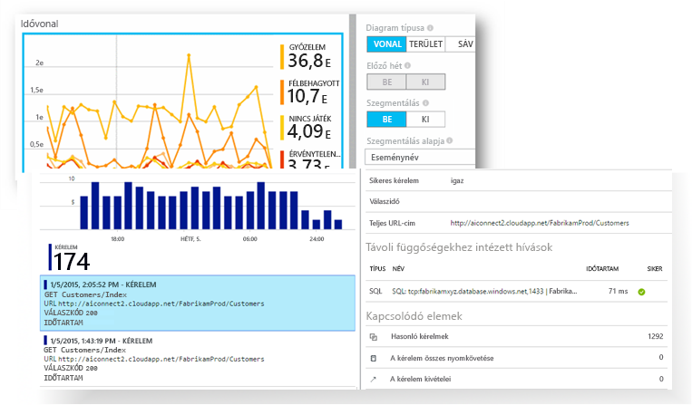

# Mi az Application Insights?
Az Application Insights egy bővíthető és több platformon működő alkalmazásteljesítmény-felügyeleti (APM) szolgáltatás webfejlesztőknek. Az élő webalkalmazásának figyelésére használhatja. Automatikusan felismeri a teljesítményanomáliákat. Hatékony elemzőeszközöket tartalmaz, amelyek segítenek a problémák felismerésében, és annak a megértésében, hogy a felhasználók mire használják ténylegesen az alkalmazást.  Úgy tervezték, hogy használatával folyamatosan javíthassa a teljesítményt és a használhatóságot. Sokféle platform alkalmazásaival együttműködik, ilyen többek között a .NET, a Node.js és a J2EE platform helyszíni vagy felhőbeli tárolás esetén is. Emellett a devOps folyamattal is integrálható, és eszközök széles köréhez rendelkezik kapcsolódási ponttal.

[Tekintse meg a bevezető animációt](https://www.youtube.com/watch?v=fX2NtGrh-Y0).

## Hogyan működik az Application Insights?
Ön telepít egy kis méretű kialakítási csomagot az alkalmazásban, és beállít egy Application Insights-erőforrást a Microsoft Azure Portalon. A kialakítási csomag figyeli az alkalmazást, és telemetriai adatokat küld a portálnak. (Az alkalmazás bárhol futhat – nem kötelező az Azure-ban üzemeltetni.)

Ráadásul nem csak webszolgáltatási alkalmazásokat vizsgálhat, hanem háttérösszetevőket és weboldalak JavaScript-kódjait is. 

Emellett telemetriai adatok olvashatók be a gazdakörnyezetekből, például teljesítményszámlálók, Azure-beli diagnosztikai adatok vagy Docker-naplók. Olyan webes teszteket is beállíthat, amelyek rendszeres időközönként szintetikus kéréseket küldenek a webszolgáltatásnak.

A telemetriai adatok integrálása az Azure Portalon történik, ahol hatékony elemzési és keresési eszközöket alkalmazhat a nyers adatokra.

### Milyen mértékű a többletterhelés?
Az alkalmazásteljesítményre gyakorolt hatás rendkívül kicsi. A nem blokkoló nyomkövetési hívásokat a rendszer kötegeli, és a küldés külön szálakon történik.

## Mit figyel az Application Insights?

A fejlesztőcsapatoknak készült Application Insights segít az adott alkalmazás teljesítményének megismerésében, valamint abban, hogy a felhasználók miként használják az alkalmazást. A szolgáltatás az alábbiakat figyeli:

* **Kérések sebessége, válaszidők és hibaarányok** – megtudhatja, hogy mely lapok, mely napszakokban a legnépszerűbbek, és hol találhatók a felhasználók. Megtekintheti, hogy mely lapok teljesítenek a legjobban. Ha több kérés esetén a válaszidők és a hibaarányok értéke megnő, valószínűleg erőforrás-gazdálkodási hibáról van szó. 
* **Függőségi értékek, válaszidők és hibaarányok** – megtudhatja, hogy mely külső szolgáltatások okoznak lassulást.
* **Kivételek** – elemezheti az összesített statisztikákat, vagy konkrét példányok kijelölése után részletesen tekintheti meg a hívásláncot és a kapcsolódó kéréseket. A kiszolgálói és a böngészői kivételekről egyaránt készül jelentés.
* **Lapmegtekintések és betöltési teljesítmény** – a felhasználói böngészők jelentése alapján készül.
* Weblapokról származó **AJAX-hívások** – értékek, válaszidők és hibaarányok.
* **Felhasználók és munkamenetek száma**.
* Windows vagy Linux rendszerű kiszolgálói gépekről származó **teljesítményszámlálók**, például processzor-, memória- és hálózathasználat. 
* Dockerből vagy Azure-ból származó **gazdadiagnosztika**. 
* Alkalmazásból származó **nyomkövetési naplók diagnosztikája** – megállapíthatja a nyomkövetési események és a kérések korrelációját.
* **Egyéni események és metrikák**, amelyeket saját kezűleg helyezhet el az ügyfél vagy a kiszolgáló kódjában, és ezáltal üzleti eseményeket követhet (például eladott tételek vagy megnyert játékok).

## Hol láthatók a telemetriai adatok?

Az adatokat többféle módon lehet böngészni. Olvassa el az alábbi cikkeket:

|  |  |
| --- | --- |
| [**Intelligens észlelés és manuális riasztások**](app-insights-proactive-diagnostics.md) Az automatikus riasztások alkalmazkodnak az alkalmazás normál telemetriai mintáihoz, és a riasztásokat a szokásos mintán kívüli események váltják ki. [Riasztásokat is beállíthat](app-insights-alerts.md) egyéni vagy Standard mérőszámok adott szintjeire. | |
| [**Alkalmazástérkép**](app-insights-app-map.md) Az alkalmazás összetevői, alapvető metrikákkal és riasztásokkal. |  |
| [**Profilkészítő**](app-insights-profiler.md) A mintavételezett kérelmek végrehajtási profiljainak vizsgálata. | |
| [**Használatelemzés**](app-insights-usage-overview.md) Felhasználószegmentálás és -megtartás elemzése.| |
| [**Példányadatok diagnosztikai keresése**](app-insights-diagnostic-search.md) Események keresése és szűrése, például kérések, kivételek, függőségi hívások, naplókivonatok és lapmegtekintések.  | |
| [**Összesített adatok metrikaböngészője**](app-insights-metrics-explorer.md) Összesített adatok – például kérés- és hibaarányok, valamint kivételek, válaszidők és lapbetöltési idők – böngészése, szűrése és szegmentálása. | |
| [**Irányítópultok**](app-insights-dashboards.md#dashboards) Különböző erőforrásokból származó adatokat fűzhet össze és oszthat meg másokkal. Kiváló megoldás több összetevőből álló alkalmazások, valamint csoportszobában való folyamatos megjelenítés esetén. | |
| [**Élő metrikastream**](app-insights-live-stream.md) Új buildverzió telepítésekor közel valós idejű teljesítménymutatókat figyelhet, és meggyőződhet arról, hogy minden megfelelő módon működik-e. | |
| [**Elemzés**](app-insights-analytics.md) A hatékony lekérdezési nyelvnek köszönhetően válaszokat kaphat az alkalmazás teljesítményére és használatára vonatkozó legégetőbb kérdésekre. | |
| [**Visual Studio**](app-insights-visual-studio.md) A kódban tekintheti meg a teljesítményadatokat. A hívásláncokból a kódba ugorhat.| |
| [**Pillanatkép-hibakereső**](app-insights-snapshot-debugger.md) A működés közbeni műveletekről készült pillanatképek hibakeresése paraméterértékekkel.| |
| [**Power BI**](app-insights-export-power-bi.md) Integrálhatja a használati metrikákat más üzleti intelligenciával.| |
| [**REST API**](https://dev.applicationinsights.io/) Kód írásával lekérdezéseket futtathat a metrikákhoz és a nyers adatokhoz kapcsolódóan.|  |
| [**Folyamatos exportálás**](app-insights-export-telemetry.md) Az adatok beérkezésével párhuzamosan végezheti a nyers adatok tömeges exportálását a tárba. | |

## Hogyan használható az Application Insights?

### Figyelés
Telepítse az Application Insightsot az alkalmazásba, állítsa be a [rendelkezésre állási webes teszteket](app-insights-monitor-web-app-availability.md), és az alábbiakra nyílik lehetőség:

* Beállíthat egy [irányítópultot](app-insights-dashboards.md) a csoportszobában, és nyomon követheti a terhelést, a válaszidőt, a függőségek teljesítményét, a lapbetöltéseket és az AJAX-hívásokat.
* Megismerheti a leglassabb és a legsikertelenebb kéréseket.
* Figyelheti az [élő streamet](app-insights-live-stream.md) új kiadások telepítésekor, és azonnal értesülhet bármilyen teljesítménycsökkenésről.

### Észlelés, diagnosztizálás
Riasztások fogadásakor vagy problémák észlelésekor:

* Felmérheti, hogy hány felhasználó érintett.
* Elvégezheti a kivételek, a függőségi hívások és a nyomkövetési adatok korrelációját.
* A profilkészítő, a pillanatképek, a veremkiíratások és a nyomkövetési naplók vizsgálata.

### Fejlesztés, mérés, tapasztalatszerzés
Az újonnan üzembe helyezett szolgáltatások [hatékonyságának mérése](app-insights-usage-overview.md).

* Megtervezheti az új felhasználói felület vagy üzleti szolgáltatások ügyfelek általi használatának mérését.
* Egyéni telemetriai adatokat vehet fel a kódba.
* A következési fejlesztési ciklust a telemetriai adatokból származó konkrét tényekre alapozhatja.

## Bevezetés
Az Application Insights a Microsoft Azure-ban üzemeltetett számos szolgáltatás egyike, és a telemetriai adatok ide érkeznek be elemzésre és megjelenítésre. A használat megkezdéséhez egy [Microsoft Azure-előfizetésre](http://azure.com) van szükség. A regisztráció ingyenes, és ha az Application Insights alapszintű [díjcsomagját](https://azure.microsoft.com/pricing/details/application-insights/) választja, a használat mindaddig díjmentes, amíg az alkalmazás el nem ér egy jelentős használati értéket. Ha a munkahelye már rendelkezik előfizetéssel, lehetőség van felvenni az Ön Microsoft-fiókját az adott előfizetésbe.

Az első lépések megtételének számos módja van. Kezdje azzal, amelyik Önnek a legmegfelelőbb. További szolgáltatásokat később is felvehet.

* **Futtatáskor: webalkalmazás vizsgálata a kiszolgálón.** Elkerülheti a kódfrissítéseket. Adminisztrátori hozzáféréssel kell rendelkeznie a kiszolgálón.
  * [**IIS a helyszínen vagy egy virtuális gépen**](app-insights-monitor-performance-live-website-now.md)
  * [**Azure-webalkalmazás vagy virtuális gép**](app-insights-monitor-performance-live-website-now.md)
  * [**J2EE**](app-insights-java-live.md)
* **Fejlesztéskor: az Application Insights hozzáadása a kódhoz.** Egyéni telemetriai adatok használatát, valamint háttérbeli szolgáltatások és asztali alkalmazások vizsgálatát teszi lehetővé.
  * [Visual Studio](app-insights-asp-net.md) 2013 2. frissítés vagy újabb.
  * Java és [Eclipse](app-insights-java-eclipse.md) vagy [más eszközök](app-insights-java-get-started.md)
  * [Node.js](app-insights-nodejs.md)
  * [Más platformok](app-insights-platforms.md)
* **[Vizsgálhatja a weblapokat](app-insights-javascript.md)** lapmegtekintés, AJAX-használat és egyéb ügyféloldali telemetria tekintetében.
* **[Rendelkezésre állási tesztek](app-insights-monitor-web-app-availability.md)** – rendszeresen pingelheti webhelyét kiszolgálóinkról.

## Következő lépések
Első lépések futtatáskor:

* [IIS-kiszolgáló](app-insights-monitor-performance-live-website-now.md)
* [J2EE-kiszolgáló](app-insights-java-live.md)

Első lépések fejlesztéskor:

* [ASP.NET](app-insights-asp-net.md)
* [Java](app-insights-java-get-started.md)
* [Node.js](app-insights-nodejs.md)

## Támogatás és visszajelzés
* Kérdések és problémák:
  * [Hibaelhárítás][qna]
  * [MSDN-fórum](https://social.msdn.microsoft.com/Forums/vstudio/home?forum=ApplicationInsights)
  * [StackOverflow](http://stackoverflow.com/questions/tagged/ms-application-insights)
* Javaslatok:
  * [UserVoice-on](https://visualstudio.uservoice.com/forums/357324)
* Blog:
  * [Application Insights blog](https://azure.microsoft.com/blog/tag/application-insights)

## Videók

> [!VIDEO https://channel9.msdn.com/events/Connect/2016/100/player] 

<!--Link references-->

[android]: https://github.com/Microsoft/ApplicationInsights-Android
[azure]: ../insights-perf-analytics.md
[client]: app-insights-javascript.md
[desktop]: app-insights-windows-desktop.md
[detect]: app-insights-detect-triage-diagnose.md
[greenbrown]: app-insights-asp-net.md
[ios]: https://github.com/Microsoft/ApplicationInsights-iOS
[java]: app-insights-java-get-started.md
[knowUsers]: app-insights-web-track-usage.md
[platforms]: app-insights-platforms.md
[portal]: http://portal.azure.com/
[qna]: app-insights-troubleshoot-faq.md
[redfield]: app-insights-monitor-performance-live-website-now.md

