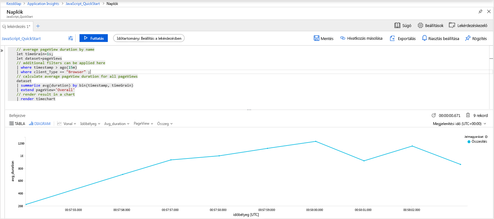
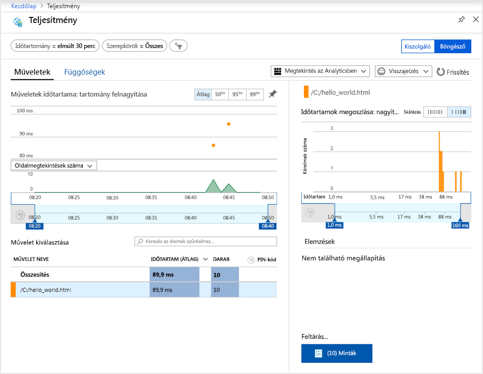
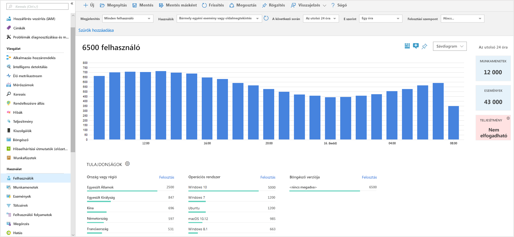
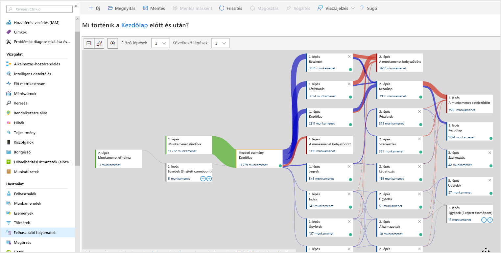

# <a name="start-monitoring-your-website"></a>A webhely monitorozásának megkezdése

Az Azure Monitor Application Insights segítségével egyszerűen monitorozhatja webhelye rendelkezésre állását, teljesítményét és használatát. Emellett egyszerűen azonosíthatja és diagnosztizálhatja az alkalmazás hibáit anélkül, hogy meg kellene várnia, amíg egy felhasználó jelenti azokat. Az Application Insights kiszolgálóoldali és ügyfél-/böngészőoldali monitorozási képességeket is biztosít.

Ez a rövid útmutató ismerteti, hogyan adhatja hozzá a [nyílt forráskódú Application Insights JavaScript SDK-t](https://github.com/Microsoft/ApplicationInsights-JS), amellyel felmérheti a webhely látogatóinak ügyfél-/böngészőoldali élményét.

## <a name="prerequisites"></a>Előfeltételek

A gyorsútmutató elvégzéséhez:

- Rendelkeznie kell Azure-előfizetéssel.

Ha nem rendelkezik Azure-előfizetéssel, első lépésként mindössze néhány perc alatt létrehozhat egy [ingyenes](https://azure.microsoft.com/free/) fiókot.

## <a name="sign-in-to-the-azure-portal"></a>Jelentkezzen be az Azure Portalra

Jelentkezzen be az [Azure Portalra](https://portal.azure.com/).

## <a name="enable-application-insights"></a>Az Application Insights engedélyezése

Az Application Insights bármely, az internethez csatlakozó alkalmazásról képes telemetria-adatokat gyűjteni, akár a helyszínen, akár a felhőben fut. Az adatok megjelenítéséhez hajtsa végre az alábbi lépéseket.

1. Válassza az **Erőforrás létrehozása** > **Kezelőeszközök** > **Application Insights** elemet.

   Megjelenik egy konfigurációs mező. Az adatbeviteli mezők kitöltéséhez használja az alábbi táblát.

    | Beállítások        | Érték           | Leírás  |
   | ------------- |:-------------|:-----|
   | **Name (Név)**      | Globálisan egyedi érték | A figyelt alkalmazást azonosító név |
   | **Alkalmazás típusa** | Általános alkalmazás | A figyelt alkalmazás típusa |
   | **Erőforráscsoport**     | myResourceGroup      | Az App Insights-adatokat futtató új erőforráscsoport neve |
   | **Hely** | USA keleti régiója | Válasszon egy Önhöz vagy az alkalmazást futtató gazdagéphez közeli helyet. |

2. Kattintson a **Create** (Létrehozás) gombra.

## <a name="create-an-html-file"></a>HTML-fájl létrehozása

1. A helyi számítógépen hozzon létre egy ``hello_world.html`` nevű fájlt. Ebben a példában a fájlt a C: meghajtó gyökerében helyezzük el: ``C:\hello_world.html``.
2. Másolja a szkriptet a ``hello_world.html`` fájlba:

    ```html
    <!DOCTYPE html>
    <html>
    <head>
    <title>Azure Monitor Application Insights</title>
    </head>
    <body>
    <h1>Azure Monitor Application Insights Hello World!</h1>
    <p>You can use the Application Insights JavaScript SDK to perform client/browser-side monitoring of your website. To learn about more advanced JavaScript SDK configurations visit the <a href="https://github.com/Microsoft/ApplicationInsights-JS/blob/master/API-reference.md" title="API Reference">API reference</a>.</p>
    </body>
    </html>
    ```

## <a name="configure-app-insights-sdk"></a>Az App Insights SDK konfigurálása

1. Válassza az **Áttekintés** > **Alapvető erőforrások** elemet, és másolja ki az alkalmazás **Kialakítási kulcsát**.

   

2. Adja hozzá az alábbi szkriptet a ``hello_world.html`` fájlhoz a záró ``</head>`` címke előtt:

   ```javascript
      <script type="text/javascript">
        var appInsights=window.appInsights||function(a){
            function b(a){c[a]=function(){var b=arguments;c.queue.push(function(){c[a].apply(c,b)})}}var c={config:a},d=document,e=window;setTimeout(function(){var b=d.createElement("script");b.src=a.url||"https://az416426.vo.msecnd.net/scripts/a/ai.0.js",d.getElementsByTagName("script")[0].parentNode.appendChild(b)});try{c.cookie=d.cookie}catch(a){}c.queue=[];for(var f=["Event","Exception","Metric","PageView","Trace","Dependency"];f.length;)b("track"+f.pop());if(b("setAuthenticatedUserContext"),b("clearAuthenticatedUserContext"),b("startTrackEvent"),b("stopTrackEvent"),b("startTrackPage"),b("stopTrackPage"),b("flush"),!a.disableExceptionTracking){f="onerror",b("_"+f);var g=e[f];e[f]=function(a,b,d,e,h){var i=g&&g(a,b,d,e,h);return!0!==i&&c["_"+f](a,b,d,e,h),i}}return c
        }({
            instrumentationKey: "xxxxxxxx-xxxx-xxxx-xxxx-xxxxxxxx"
        });
        
        window.appInsights=appInsights,appInsights.queue&&0===appInsights.queue.length&&appInsights.trackPageView();
</script>
   ```

3. Szerkessze a ``hello_world.html`` fájlt, és adja hozzá az eszközkulcsát.

4. Nyissa meg a ``hello_world.html`` fájlt egy helyi böngésző-munkamenetben. Ez egy egyszeri oldalmegtekintést hoz létre. A böngésző frissítésével több teszt oldalmegtekintést is létrehozhat.

## <a name="start-monitoring-in-the-azure-portal"></a>Monitorozás indítása az Azure Portalon

1. Most megnyithatja ismét az Application Insights **Áttekintés** lapját az Azure Portalon (ahol a kialakítási kulcsot is megjelenítette) a jelenleg futó alkalmazás részleteinek megtekintéséhez. Az áttekintő oldal négy alapértelmezett diagramjának hatóköre a kiszolgálóoldali alkalmazásadatokra van beállítva. Mivel az ügyfél-/böngészőoldali interakció kialakítását végezzük a JavaScript SDK-val, ez az adott nézet most nem releváns, hacsak nincs egy kiszolgálóoldali SDK is telepítve.

2. Kattintson az  **Analytics** elemre.  Megnyílik az **Analytics**, amely egy részletes lekérdezési nyelvet biztosít az Application Insights által gyűjtött adatok elemzéséhez. Az ügyféloldali böngészőkérésekkel kapcsolatos adatok megtekintéséhez futtassa az alábbi lekérdezést:

    ```kusto
    // average pageView duration by name
    let timeGrain=1s;
    let dataset=pageViews
    // additional filters can be applied here
    | where timestamp > ago(15m)
    | where client_Type == "Browser" ;
    // calculate average pageView duration for all pageViews
    dataset
    | summarize avg(duration) by bin(timestamp, timeGrain)
    | extend pageView='Overall'
    // render result in a chart
    | render timechart
    ```

   

3. Térjen vissza az **Áttekintés** oldalra. Kattintson a **Böngészés** elemre a **Vizsgálat** fejléc alatt, majd válassza a **Teljesítmény** lehetőséget. Ezen a felületen találja a webhely teljesítményével kapcsolatos metrikákat. Emellett egy megfelelő nézetet is talál itt a webhelyen található hibák és kivételek elemzéséhez. A **Minták** elemre kattintva megtekintheti az egyes tranzakciók részleteit. Innen pedig elérheti a [tranzakciók részletes adatait tartalmazó](../azure-monitor/app/transaction-diagnostics.md) felületet.

   

4. A [felhasználói viselkedést elemző eszközök](../azure-monitor/app/usage-overview.md) megismeréséhez az Application Insights fő menüjében válassza a [**Felhasználók**](../azure-monitor/app/usage-segmentation.md) elemet a **Használat** fejléc alatt. Mivel a tesztelést egyetlen gépről végezzük, csak egy felhasználó adatait fogjuk látni. Egy élő webhely esetében a felhasználók eloszlása az alábbihoz hasonlóan nézhet ki:

     

5. Ha egy összetettebb webhelyet alakítottunk volna ki több oldallal, ehhez egy másik hasznos eszköz a [**Felhasználói folyamatok**](../azure-monitor/app/usage-flows.md). A **Felhasználókövetéssel** nyomon követheti a látogatóknak a webhely különböző részeit érintő útját.

  

A webhelyek monitorozásával kapcsolatos speciális konfigurációkról a [JavaScript SDK API-referenciáiban](https://github.com/Microsoft/ApplicationInsights-JS/blob/master/API-reference.md) olvashat.

## <a name="clean-up-resources"></a>Az erőforrások eltávolítása

Ha azt tervezi, hogy az ezt követő rövid útmutatókkal vagy az oktatóanyagokkal dolgozik tovább, akkor ne törölje az ebben a rövid útmutatóban létrehozott erőforrásokat. Ha azonban nem folytatja a munkát, akkor a következő lépésekkel törölheti az Azure Portalon a rövid útmutatóhoz létrehozott összes erőforrást.

1. Az Azure Portal bal oldali menüjében kattintson az **Erőforráscsoportok** lehetőségre, majd kattintson a **myResourceGroup** elemre.
2. Az erőforráscsoport oldalán kattintson a **Törlés** elemre, írja be a **myResourceGroup** szöveget a szövegmezőbe, majd kattintson a **Törlés** gombra.

## <a name="next-steps"></a>További lépések

> [!div class="nextstepaction"]
> [Teljesítményproblémák észlelése és diagnosztizálása](https://docs.microsoft.com/azure/application-insights/app-insights-analytics)
