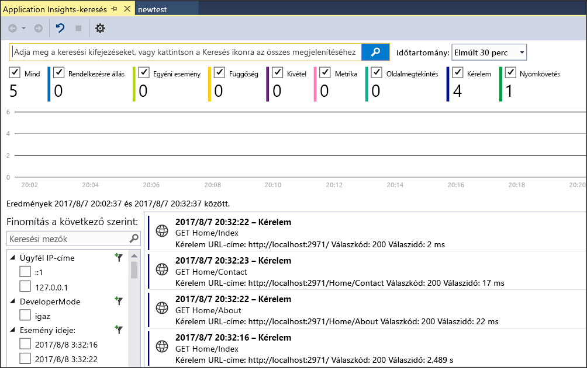
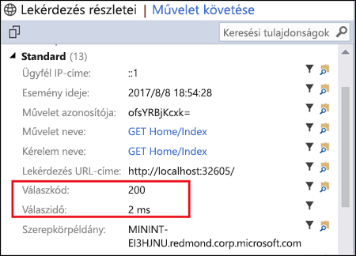
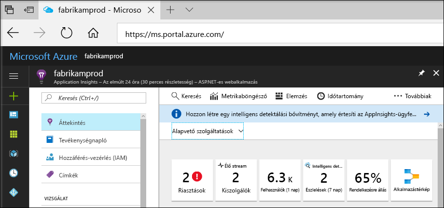
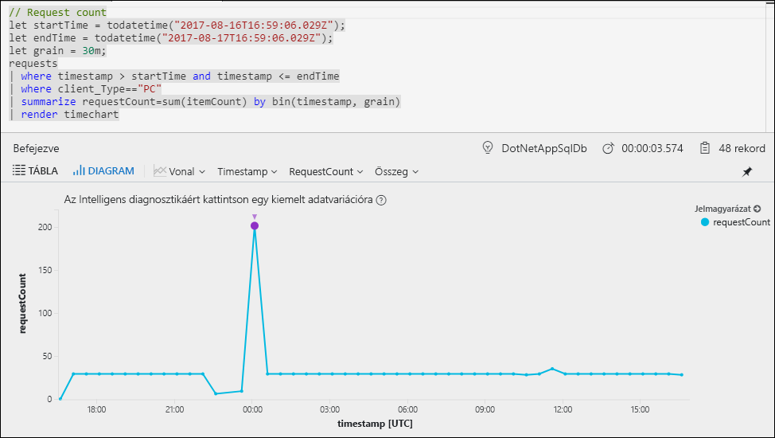
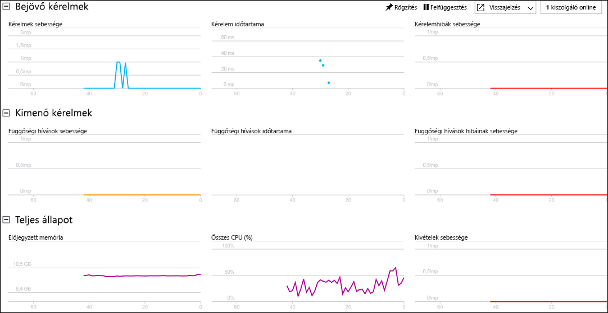

# Az ASP.NET-alkalmazás monitorozásának indítása

Az Azure Application Insights segítségével egyszerűen monitorozhatja webalkalmazása rendelkezésre állását, teljesítményét és használatát.  Emellett egyszerűen azonosíthatja és diagnosztizálhatja az alkalmazás hibáit anélkül, hogy meg kellene várnia, amíg egy felhasználó jelenti azokat.  Az Application Insightsból az alkalmazás teljesítményéről és hatékonyságáról gyűjtött információkkal tájékozott döntéseket hozhat az alkalmazás karbantartásával és továbbfejlesztésével kapcsolatban.

Ez a rövid útmutató bemutatja, hogyan adhatja hozzá az Application Insightst a meglévő ASP.NET-webalkalmazáshoz, és hogyan indíthatja el az élő statisztika monitorozását, amely az alkalmazás elemzésére használható számos módszer egyike. Ha még nem rendelkezik ASP.NET-webalkalmazással, létrehozhat egyet, ha követi az [ASP.NET-webalkalmazás létrehozását ismertető rövid útmutató](../app-service/app-service-web-get-started-dotnet.md) utasításait.

## Előfeltételek
A gyorsútmutató elvégzéséhez:

- Telepítse a [Visual Studio 2017](https://www.visualstudio.com/downloads/) szoftvert a következő számítási feladatokkal:
    - ASP.NET és webfejlesztés
    - Azure-fejlesztés

Ha nem rendelkezik Azure-előfizetéssel, első lépésként mindössze néhány perc alatt létrehozhat egy [ingyenes](https://azure.microsoft.com/free/) fiókot.

## Az Application Insights engedélyezése

1. Nyissa meg a projektjét a Visual Studio 2017-ben.
2. Válassza **Az Application Insights konfigurálása** elemet a Projekt menüben. A Visual Studio hozzáadja az Application Insights SDK-t az alkalmazásához.
3. Kattintson az **Ingyenes próba megkezdése** elemre, válassza ki a kívánt számlázási csomagot, majd kattintson a **Regisztráció** parancsra.

    

4. Futtassa az alkalmazást a **Hibakeresés** menü **Hibakeresés indítása** elemének kiválasztásával vagy az F5 billentyű lenyomásával.

## Alkalmazáskonfiguráció jóváhagyása

Az Application Insights a futtatás helyétől függetlenül telemetriai adatokat gyűjt az alkalmazásról. Az adatok megjelenítéséhez hajtsa végre az alábbi lépéseket.

1. Az Application Insights megnyitásához kattintson a **Projekt** -> **Application Insights** -> **Keresés a hibakeresési munkamenet telemetriájában** elemre.  Megjelenik az aktuális munkamenetből származó telemetria.  

2. A kérés részleteinek megtekintéséhez kattintson a lista első kérésére (ebben a példában: GET Home/Index). Figyelje meg, hogy az állapotkód és a válaszidő is megtalálható a részletek között, a kérésre vonatkozó más értékes információkkal együtt.  

## Monitorozás indítása az Azure Portalon

Most megnyithatja az Application Insightst az Azure Portalon a futó alkalmazás különböző részleteinek megtekintéséhez.

1. A Megoldáskezelőben kattintson a jobb gombbal **Az Application Insights kapcsolódó szolgáltatásai** mappára, majd kattintson az **Application Insights portál megnyitása** parancsra.  Megjelenik számos lehetőség és néhány információ az alkalmazásról.

    

2. Kattintson az **Alkalmazástérkép** elemre az alkalmazás-összetevők függőségi viszonyait mutató vizuális elrendezés megjelenítéséhez.  Minden egyes összetevőnél megjelennek a KPI-k, például a terhelés, a teljesítmény, a hibák és a riasztások.

    

3. Kattintson az **Alkalmazáselemzés** ikonra, majd az  az alkalmazás egyik összetevőjén.  Megnyílik az **Application Insights Analytics**, amely egy részletes lekérdezési nyelvet biztosít az Application Insights által gyűjtött adatok elemzéséhez.  Esetünkben most egy lekérdezés jön létre, amely a kérések számát egy diagramon jeleníti meg.  A további adatok elemzéséhez írhat saját lekérdezéseket is.

    

4. Lépjen vissza az **Áttekintés** lapra, és kattintson az **Élő stream** elemre.  Ezzel élő statisztikát jeleníthet meg az alkalmazásról futás közben.  Ez a bejövő kérések számával, az adott kérések időtartamával, valamint az esetleges hibákkal kapcsolatos adatokat tartalmaz.  Emellett a kritikus teljesítménymutatókat is figyelemmel kísérheti, például a processzor- és memóriahasználatot.

    

Ha készen áll az alkalmazás Azure-on történő üzemeltetésére, most már közzéteheti. Kövesse az [ASP.NET-webalkalmazás létrehozását ismertető rövid útmutató](../app-service/app-service-web-get-started-dotnet.md#update-the-app-and-redeploy) lépéseit.

## Következő lépések
Ebben a rövid útmutatóban engedélyezte, hogy az Azure Application Insights monitorozza az alkalmazását.  Folytassa a további oktatóanyagokkal, amelyekből megtudhatja, hogyan használhatja a statisztika monitorozására és az alkalmazáshibák észlelésére is.

> [!div class="nextstepaction"]
> [Azure Application Insights-oktatóanyagok](app-insights-tutorial-runtime-exceptions.md)