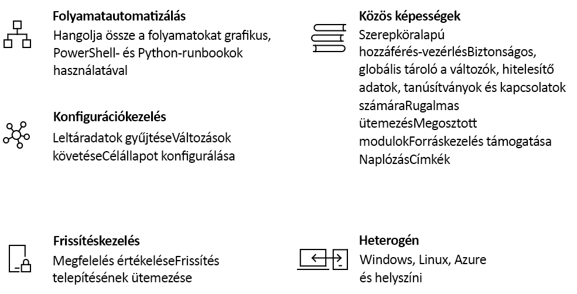

# Az Azure Automation bemutatása

Az Azure Automation egy felhőalapú automatizálási és konfigurálási szolgáltatást kínál, amely biztosítja az Azure-beli és nem Azure-beli környezetek konzisztens felügyeletét. Folyamatautomatizálást, frissítéskezelést és konfigurálási szolgáltatásokat foglal magában. Az Azure Automation teljes körű felügyeletet biztosít a számítási feladatok és erőforrások üzembe helyezése, üzemeltetése és leszerelése során.
Ez a cikk röviden áttekinti az Azure Automationt, valamint választ ad néhány gyakran felmerülő kérdésre. A különböző képességekkel kapcsolatos további információért kattintson a jelen áttekintésben található hivatkozásokra.

## Az Azure Automation képességei

### Folyamatautomatizálás

Az Azure Automation segítségével automatizálhatja a gyakori, időigényes és hibalehetőségekkel teli felhőfelügyeleti feladatokat. Az automatizálásnak köszönhetően így azokra a feladatokra koncentrálhat, amelyek valóban üzleti értéket teremtenek. A hibák csökkentése és a hatékonyság növelése révén az üzemeltetési költségek is csökkennek. A folyamatok teljes körű üzembe helyezéséhez, konfigurálásához és felügyeletéhez szükséges Azure-szolgáltatások és egyéb nyilvános rendszerek integrálhatók. A szolgáltatás segítségével grafikus úton [hozhat létre runbookokat](automation-runbook-types.md) PowerShellben vagy Pythonban. Hibrid runbook-feldolgozók használatával és a helyszíni környezetek irányításának összevonásával egységesítheti a felügyeleti tevékenységeket. A [webhookok](automation-webhooks.md) biztosítják a kérések teljesítését és a folyamatos szolgáltatást és üzemeltetést az ITSM-, DevOps- és monitorozási rendszerek automatizált folyamatainak aktiválásával.

### Konfigurációkezelés

Az Azure Automation [desired state configuration](automation-dsc-overview.md) egy felhőalapú megoldás a PowerShell DSC-hez, amely vállalati környezetekhez szükséges szolgáltatásokat biztosít. A DSC-erőforrásait kezelheti az Azure Automationben, és konfigurációkat alkalmazhat a virtuális és fizikai gépekre az Azure-felhőben lévő DSC lekérési kiszolgálóról. Gazdag jelentések készíthetők, amelyek tájékoztatást adnak olyan fontos eseményekről, mint például amikor a csomópontok eltérnek a hozzájuk rendelt konfigurációtól. Monitorozhatja és automatizálhatja a gépkonfigurációkat a fizikai és virtuális gépeken, Windows vagy Linux rendszeren, felhőbeli vagy helyszíni környezetekben egyaránt.

A vendégen futtatott erőforrások leltáradatai révén betekintést nyerhet a telepített alkalmazásokról és egyéb konfigurációs elemekről. A rendelkezésre álló gazdag jelentéskészítési és keresési funkciókkal gyorsan lekérhető részletes információk segítségével könnyedén áttekinthető az operációs rendszerek konfigurációja. Nyomon követhetők a szolgáltatások, démonok, szoftverek, beállításjegyzékek és fájlok változásai, így gyorsan azonosítható, hogy mi okozza a hibákat. Emellett a DSC képes diagnosztizálni és jelezni a környezet nem kívánt változásait.

### Frissítéskezelés

Az Azure Automationnel frissítheti a windowsos és linuxos rendszereket a hibrid környezetekben. Így láthatóvá válik a frissítési megfelelőség az Azure-beli, a helyszíni és egyéb felhőkben. Ütemezett üzembe helyezéseket hozhat létre a frissítések telepítésének egy adott karbantartási időablakban való végrehajtatásához. Ha egy adott frissítést nem szeretne telepíteni a gépekre, kizárhatja azt az üzembe helyezésből.

### Közös képességek

Az Azure Automation megosztott erőforrásainak segítségével könnyebben automatizálhatja és konfigurálhatja a nagy méretű környezeteket.

* **[Szerepköralapú hozzáférés-vezérlés](automation-role-based-access-control.md)** – Az Automation-kezelői szerepkör segítségével szabályozhatja a fiókhoz való hozzáférést, mivel ez a szerepkör feladatokat futtathat, írási jogokkal azonban nem rendelkezik.
* **[Változók](automation-variables.md)** – A változókban olyan tartalmakat tárolhat, amelyek több runbookban és konfigurációban is felhasználhatók. Az értékeket anélkül módosíthatja, hogy szerkesztenie kellene az azokra hivatkozó runbookokat és konfigurációkat.
* **[Hitelesítő adatok](automation-credentials.md)** – A runbookokban és konfigurációkban használt bizalmas adatok biztonságosan tárolhatók.
* **[Tanúsítványok](automation-certificates.md)** – A tanúsítványok tárolhatók, és futásidőben elérhetővé tehetők, így hitelesítésre és az üzembe helyezett erőforrások védelmére használhatók.
* **[Kapcsolatok](automation-connections.md)** – Gyakori adatokat tartalmazó név-érték adatpárokat tárolhat a kapcsolati erőforrásokban lévő rendszerekhez való kapcsolódáshoz. A kapcsolatokat a modul létrehozója definiálja a runbookokban és konfigurációkban való futásidejű használatra.
* **[Ütemezések](automation-schedules.md)** – Az ütemezések használatával az automatizmusok előre meghatározott időpontokban aktiválhatók.
* **[Verziókövetés-integráció](automation-source-control-integration.md)** – Segíti a kóddal való konfigurálást, amennyiben a runbookok és a konfigurációk beadhatók egy verziókövetési rendszerbe.
* **[PowerShell-modulok](automation-integration-modules.md)** – A modulok segítségével felügyelhető az Azure és az egyéb rendszerek. Importálhatók az Automation-fiókba a Microsofttól, külső felektől vagy a közösségtől származó, illetve az egyénileg definiált parancsmagokhoz és DSC-erőforrásokhoz.

### Windows és Linux

Az Azure Automation úgy lett kifejlesztve, hogy együttműködjön a hibrid felhőkörnyezetekkel, valamint a Windows- és Linux-környezetekkel. Egy egységes platformot biztosít az üzembe helyezett számítási feladatok és az azokat futtató operációs rendszerek automatizálásához és konfigurálásához.

### Közösségi katalógus

Az [Automation-katalógus](automation-runbook-gallery.md) runbookjai és moduljai használatával gyorsan nekiláthat saját folyamatai a PowerShell-galéria és a Microsoft Script Center segítségével történő integrálásának és kialakításának.

## Általános példák az Automation használatára

Az Azure Automationnel az infrastruktúra és az alkalmazások életciklusát felügyelheti. A használatával beadhatja a rendszerbe a vállalat számítási feladatainak működésével és karbantartásával kapcsolatos adatokat. A forgatókönyveket különféle gyakori nyelveken, például PowerShell, DSC vagy Python nyelven, illetve grafikus runbookként hozhatja létre. Az üzembe helyezett erőforrásokról teljes leltár áll a rendelkezésére célkezelési, jelentéskészítési és megfelelőségi célokra. Azonosíthatja azokat a változtatásokat, amelyek hibás konfigurációt okozhatnak, és javíthatja a működési megfelelőséget.

* **Erőforrások kiépítése és üzembe helyezése** – Üzembe helyezhet virtuális gépeket a hibrid környezetekben runbookok és Azure Resource Manager-sablonok használatával. A rendszert integrálhatja a Jenkinsszel, a Visual Studio Team Services használatával és egyéb fejlesztői eszközökkel.
* **Virtuális gépek konfigurálása** – Felmérheti a windowsos és linuxos gépek állapotát, és konfigurálhatja azokat az infrastruktúrának és az alkalmazásoknak megfelelő kívánt beállításokkal.
* **Monitorozás** – Azonosíthatja a problémákat okozó gépeken ejtett módosításokat, és kijavíthatja azokat, vagy felterjesztheti a felügyeleti rendszerekre.
* **Védelem** – Biztonsági riasztás esetén karanténba helyezheti a virtuális gépeket. Megadhatja a vendégen futtatott rendszerekre vonatkozó követelményeket.
* **Irányítás** – Szerepköralapú hozzáférés-vezérlést állíthat be csapatok számára. Visszanyerheti a nem használt erőforrásokat.

## Az Automation szolgáltatás díjszabása

Az Azure Automation árait a [díjszabást](https://azure.microsoft.com/pricing/details/automation/) ismertető oldalon tekintheti meg.

## További lépések

> [!div class="nextstepaction"]
> [Automation-fiók létrehozása](automation-quickstart-create-account.md)
