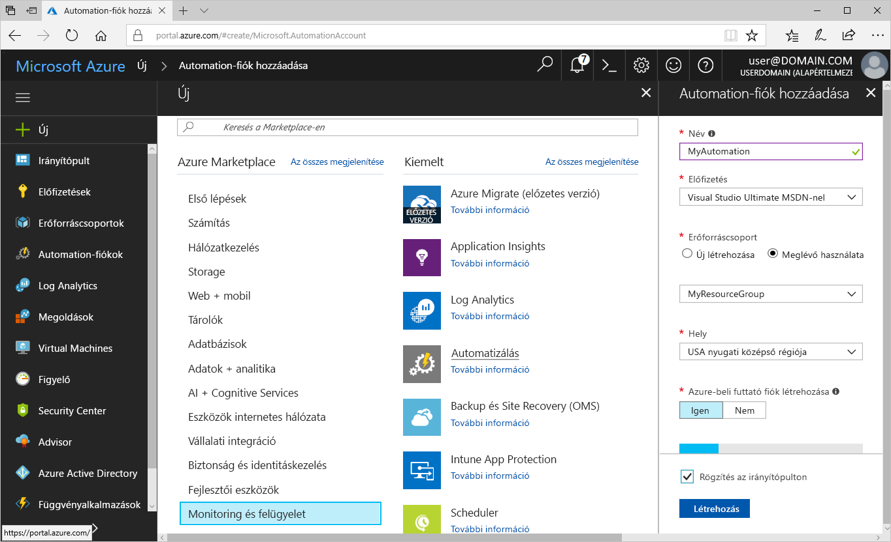
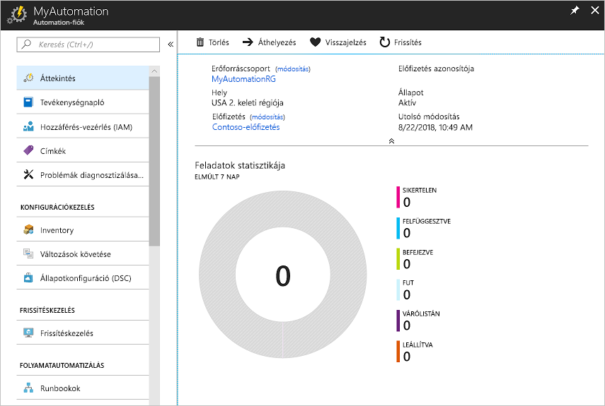
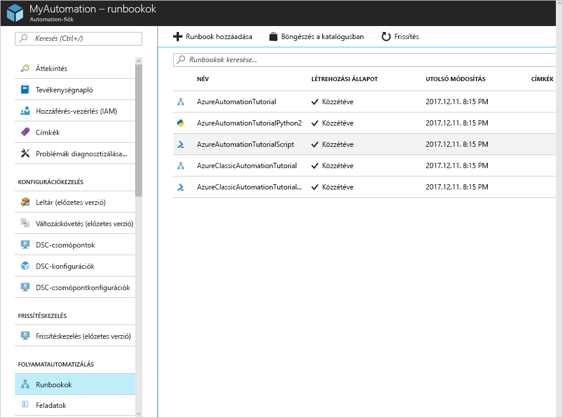
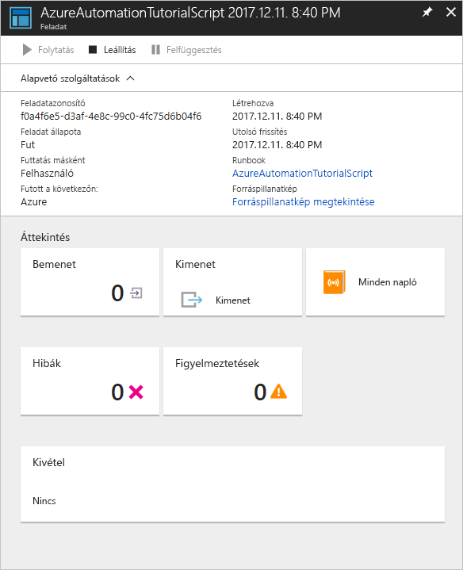

# Azure Automation-fiók létrehozása

Az Azure Automation-fiókok az Azure-on keresztül hozhatók létre. Ez a módszer egy böngészőalapú felhasználói felületet biztosít az Automation-fiókok és a kapcsolódó erőforrások létrehozásához és konfigurálásához. Ez a rövid útmutató végigvezeti az Automation-fiókok létrehozásának és a fiókokban a runbookok futtatásának lépésein.

Ha nem rendelkezik Azure-előfizetéssel, mindössze néhány perc alatt létrehozhat egy [ingyenes Azure-fiókot](https://azure.microsoft.com/free/?WT.mc_id=A261C142F) a virtuális gép létrehozásának megkezdése előtt.

## Bejelentkezés az Azure-ba

Jelentkezzen be az Azure-ba a https://portal.azure.com címen.

## Automation-fiók létrehozása

1. Kattintson az Azure bal felső sarkában található **Erőforrás létrehozása** gombra.

1. Válassza a **Felügyeleti eszközök**, majd az **Automation** lehetőséget.

1. Adja meg a fiókinformációkat. Az **Azure-beli futtató fiók létrehozása** területen válassza az **Igen** lehetőséget az Azure-beli hitelesítést leegyszerűsítő összetevők automatikus engedélyezéséhez. Fontos tudni, hogy Automation-fiókok létrehozásakor a választott nevet utólag nem lehet módosítani. *Automation-fióknevek minden régióban és erőforráscsoportban egyedi. Törölt Automation-fiókok nevei nem lehet azonnal elérhetővé válik.* Egy Automation-fiókkal egy adott bérlő több régiójában és előfizetésén is kezelhetők erőforrások. Amikor végzett, kattintson a **Létrehozás** gombra az Automation-fiók üzembe helyezésének megkezdéséhez.

      

    > [!NOTE]
    > A [régiónként elérhető termékeket](https://azure.microsoft.com/en-us/global-infrastructure/services/?products=automation&regions=all) bemutató szakaszban találja azon helyek frissített listáját, ahol Automation-fiókot helyezhet üzembe.

1. Az üzembe helyezés befejezése után kattintson ** a **Minden szolgáltatás** elemre, válassza az **Automation-fiókok** lehetőséget, majd válassza ki a létrehozott Automation-fiókot.

    

## Runbook futtatása

Futtassa az oktatóanyag egyik runbookját.

1. Kattintson a **FOLYAMATOK AUTOMATIZÁLÁSA** területen lévő **Runbookok** lehetőségre. Megjelenik a runbookok listája. Alapértelmezés szerint több runbook is engedélyezett a fiókban.

    

1. Válassza ki az **AzureAutomationTutorialScript** runbookot. Ezzel megnyílik a runbook áttekintési oldala.

    

1. Kattintson az **Indítás** gombra, és a **Runbook indítása** oldalon kattintson az **OK** gombra a runbook elindításához.

    

1. Miután a **Feladat állapota** **Fut** értékre vált, kattintson a **Kimenet** vagy a **Minden napló** lehetőségre a runbookfeladat kimenetének megtekintéséhez. A jelen oktatóanyag runbookjának kimenete az Azure-erőforrások listája.

## Az erőforrások eltávolítása

Ha már nincs rá szükség, törölje az erőforráscsoportot, az Automation-fiókot és az összes kapcsolódó erőforrást. Ehhez válassza ki az Automation-fiók erőforráscsoportját, és kattintson a **Törlés** elemre.

## További lépések

Ebben a rövid útmutatóban üzembe helyezett egy Automation-fiókot, elindított egy runbook feladatot, és megtekintette a feladat részleteit. Ha bővebb információra van szüksége az Azure Automationnel kapcsolatban, folytassa az első runbook létrehozásával foglalkozó oktatóanyaggal.

> [!div class="nextstepaction"]
> [Automation rövid útmutató – Runbook létrehozása](./automation-quickstart-create-runbook.md)
