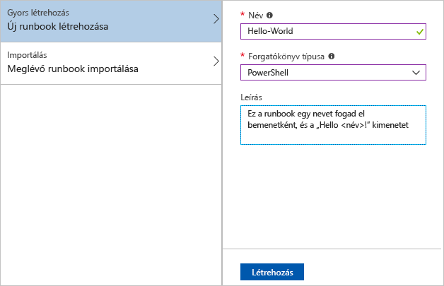
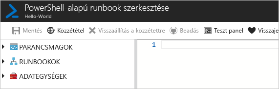
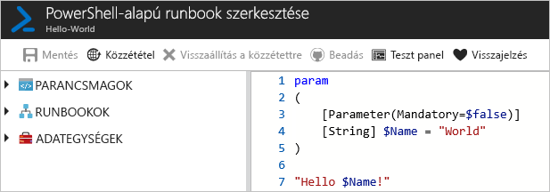
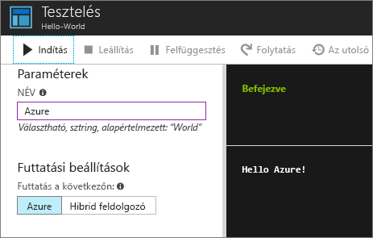
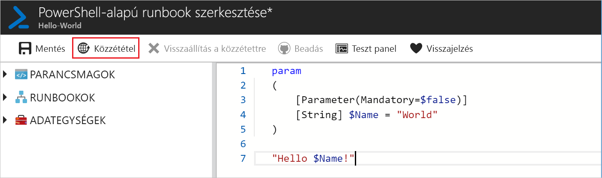
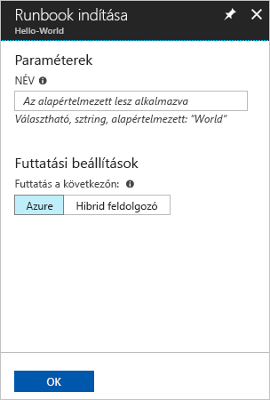
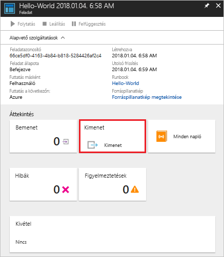

# <a name="create-an-azure-automation-runbook"></a>Azure Automation-runbook létrehozása

Az Azure Automation-runbookok az Azure-on keresztül hozhatók létre. Ez a módszer egy böngészőalapú felhasználói felületet biztosít az Automation-runbookok létrehozásához. Ez a rövid útmutató az Automation PowerShell-runbookok létrehozásán, szerkesztésén, tesztelésén és közzétételén vezeti át.

Ha nem rendelkezik Azure-előfizetéssel, mindössze néhány perc alatt létrehozhat egy [ingyenes Azure-fiókot](https://azure.microsoft.com/free/?WT.mc_id=A261C142F) a virtuális gép létrehozásának megkezdése előtt.

## <a name="log-in-to-azure"></a>Jelentkezzen be az Azure-ba

Jelentkezzen be az Azure-ba a https://portal.azure.com címen

## <a name="create-runbook"></a>Runbook létrehozása

Először hozzunk létre egy runbookot. Az ebben a rövid útmutatóban létrehozott minta runbook alapértelmezett kimenete: `Hello World`.

1. Nyissa meg az Automation-fiókját.

1. Kattintson a **FOLYAMATOK AUTOMATIZÁLÁSA** területen lévő **Runbookok** lehetőségre. Megjelenik a runbookok listája.

1. Kattintson a lista tetején található **Runbook hozzáadása** gombra. A **Runbook hozzáadása** oldalon válassza a **Gyors létrehozás** lehetőséget.

1. Adja a runbooknak a „Hello-World” **nevet**, és válassza a **PowerShell** lehetőséget a **runbook típusaként**. Kattintson a **Create** (Létrehozás) gombra.

   

1. Létrejön a runbook, és megnyílik a **PowerShell-runbook szerkesztése** oldal.

    

1. Írja be vagy másolja és illessze be a következő kódot a szerkesztés panelre. Ez a „Name” nevű opcionális bemeneti paramétert hozza létre a „World” alapértelmezett értékkel, és ezt a bemeneti értéket használó karakterláncot eredményezi:
   
   ```powershell-interactive
   param
   (
       [Parameter(Mandatory=$false)]
       [String] $Name = "World"
   )

   "Hello $Name!"
   ```

1. Kattintson a **Mentés** gombra a runbook vázlatának mentéséhez.

    

## <a name="test-the-runbook"></a>A runbook tesztelése

A runbook létrehozása után tesztelje, hogy működik-e a runbook.

1. Kattintson a **Teszt panelre** a **Teszt** oldal megnyitásához.

1. Írjon be egy értéket a **Név** mezőbe, és kattintson az **Indítás** gombra. Elindul a tesztfeladat, és megjelenik a feladat állapota és kimenete.

    

1. A jobb felső sarokban látható **X** gombra kattintva zárja be a **Teszt** oldalt. A megjelenő felugró ablakban válassza az **OK** lehetőséget.

1. A **PowerShell-runbook szerkesztése** oldalon kattintson a **Közzététel** lehetőségre, hogy a runbookot a fiókban lévő runbook hivatalos verziójaként tegye közzé.

   

## <a name="run-the-runbook"></a>A runbook futtatása

A runbook közzététele után megjelenik az áttekintő oldal.

1. A runbook áttekintése oldalon kattintson az **Indítás** gombra a runbook **Runbook indítása** konfigurációs oldalának megnyitásához.

   

1. Hagyja üresen a **Név** mezőt, hogy az alapértelmezett értéket használja, és kattintson az **OK** gombra. Elküldi a runbookfeladatot, és megjelenik a feladat oldala.

   

1. Amikor a **Feladat állapota** **Fut** vagy **Befejezve**, kattintson a **Kimenet** lehetőségre a **Kimenet** panel megnyitásához és a runbook kimenetének megtekintéséhez.

   

## <a name="clean-up-resources"></a>Az erőforrások eltávolítása

Ha már nincs rá szükség, törölje a runbookot. Ehhez válassza ki a runbook listából a runbookot, és kattintson a **Törlés** elemre.

## <a name="next-steps"></a>További lépések

Ebben a rövid útmutatóban létrehozott, szerkesztett, tesztelt és közzétett egy runbookot, és elindított egy runbookfeladatot. Az Automation-runbookokkal kapcsolatos további információkért folytassa az Automationben létrehozható és használható különböző runbooktípusokkal foglalkozó cikkel.

> [!div class="nextstepaction"]
> [Automation útmutató – Runbooktípusok](./automation-runbook-types.md)
