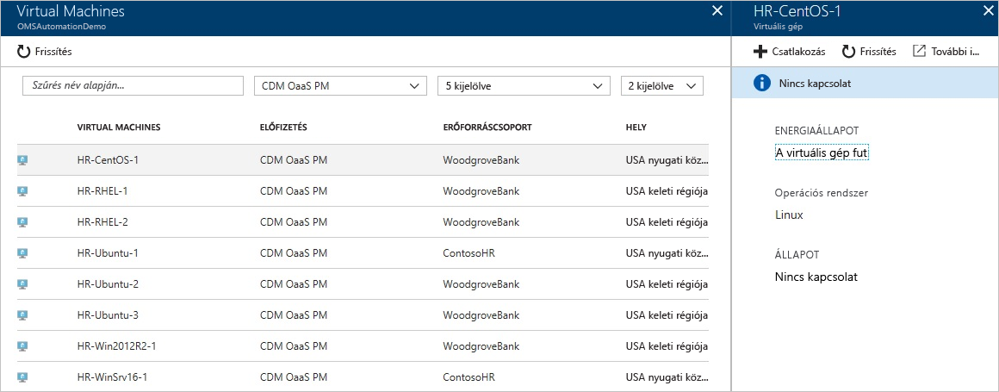
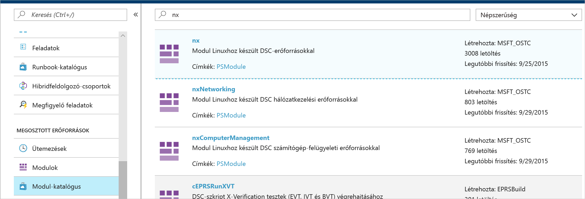
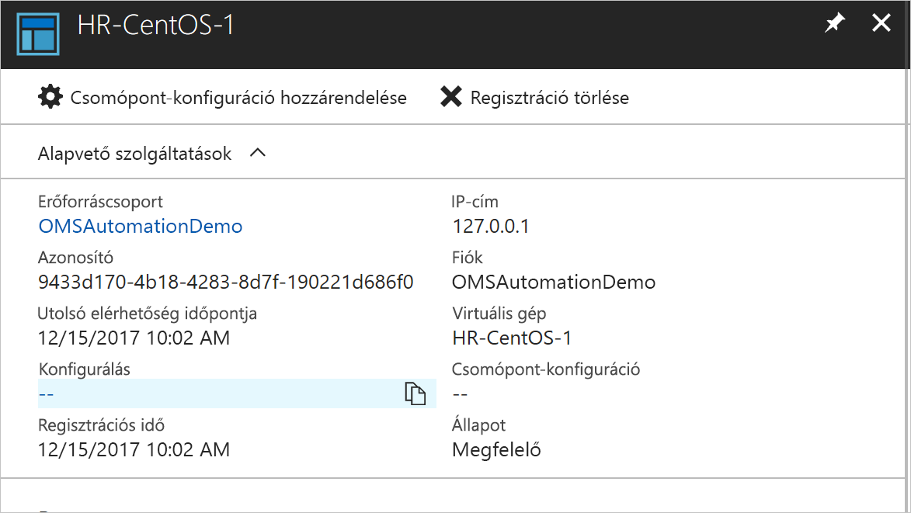
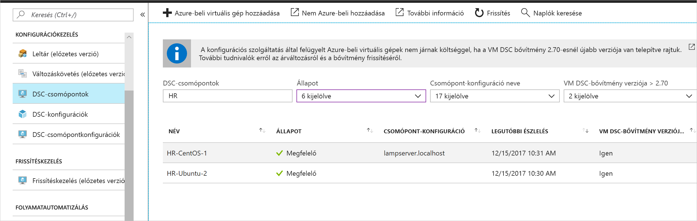

# <a name="configure-a-linux-virtual-machine-with-desired-state-configuration"></a>Konfigurálás Linux rendszerű virtuális gépen a Desired State Configurationnel

A Desired State Configuration (DSC) engedélyezésével kezelheti és monitorozhatja a Windows- és Linux-kiszolgálók konfigurációit. A kívánt konfigurációtól eltérő konfigurációk azonosíthatók vagy automatikusan kijavíthatók. Ez a rövid útmutató végigvezeti a Linux rendszerű virtuális gépek előkészítésén és a LAMP-vermek DSC-vel való üzembe helyezésén.

## <a name="prerequisites"></a>Előfeltételek

A rövid útmutató elvégzéséhez a következőkre lesz szüksége:

* Azure-előfizetés. Ha nem rendelkezik Azure-előfizetéssel, [hozzon létre egy ingyenes fiókot](https://azure.microsoft.com/free/).
* Egy Azure Automation-fiókra. Azure Automation futtató fiók létrehozásával kapcsolatos információkért tekintse meg az [Azure-beli futtató fiókkal](automation-sec-configure-azure-runas-account.md) kapcsolatos részt.
* Red Hat Enterprise Linux, CentOS vagy Oracle Linux rendszert futtató Azure Resource Manager-alapú virtuális gép (nem klasszikus). A virtuális gépek létrehozásával kapcsolatos útmutatásért tekintse meg [az első Linux virtuális gép Azure Portallal való létrehozását](../virtual-machines/linux/quick-create-portal.md) bemutató cikket.

## <a name="sign-in-to-azure"></a>Bejelentkezés az Azure-ba
Jelentkezzen be az Azure-ba a https://portal.azure.com címen.

## <a name="onboard-a-virtual-machine"></a>Virtuális gép előkészítése
Különböző módszerekkel készíthetők elő a gépek és engedélyezhető a Desired State Configuration. Ez a rövid útmutató az Automation-fiókon keresztüli előkészítést részletezi. A gépek Desired State Configurationnel való előkészítésének módszereiről az [előkészítéssel](https://docs.microsoft.com/azure/automation/automation-dsc-onboarding) foglalkozó cikkben talál további információkat.

1. Az Azure Portal bal oldali panelén válassza az **Automation-fiókok** elemet. Ha nem látja ezt az elemet a bal oldali panelen, kattintson a **Minden szolgáltatás** elemre, és keressen rá az eredményül kapott nézetben.
1. Válasszon egy Automation-fiókot a listában.
1. Az Automation-fiók bal oldali panelén válassza az **Állapotkonfiguráció (DSC)** elemet.
2. Kattintson a **Hozzáadás** elemre a virtuális gép kiválasztását lehetővé tevő oldal megnyitásához.
3. Keresse meg azt a virtuális gépet, amelyhez engedélyezni szeretné a DSC-t. A keresőmező és a szűrési lehetőségek használatával kereshet meg egy adott virtuális gépet.
4. Kattintson a virtuális gépre, majd válassza a **Csatlakozás** elemet.
5. Válassza ki a virtuális géphez megfelelő DSC-beállításokat. Ha már előkészített egy konfigurációt, megadhatja azt a *Csomópont-konfiguráció neveként*. Beállíthatja a [konfigurációs módot](https://docs.microsoft.com/powershell/dsc/metaconfig) a gép konfigurációs viselkedésének vezérléséhez.
6. Kattintson az **OK** gombra



A Desired State Configuration bővítmény virtuális gépen való üzembe helyezése alatt a *Kapcsolódás* állapot jelenik meg.

## <a name="import-modules"></a>Modulok importálása

A modulok DSC-erőforrásokat tartalmaznak, és számos modul megtalálható a [PowerShell-galériában](https://www.powershellgallery.com). A fordítás előtt a konfigurációkban használt összes erőforrást importálni kell az Automation-fiókba. Ebben az oktatóanyagban az **nx** nevű modulra van szükség.

1. Az Automation-fiók bal oldali panelén válassza a **Modulkatalógus** elemet (a Megosztott erőforrások alatt).
1. Az importálni kívánt modul megkereséséhez írja be a neve egy részét: *nx*
1. Kattintson az importálni kívánt modulra
1. Kattintson az **Importálás** gombra



## <a name="import-the-configuration"></a>A konfiguráció importálása

Ez a rövid útmutató a gépen Apache HTTP-kiszolgálót, MySQL-t és PHP-t konfiguráló DSC-konfigurációt használ.

A DSC-konfigurációkról információért lásd: [DCS-konfigurációk](https://docs.microsoft.com/powershell/dsc/configurations).

Egy szövegszerkesztőben írja be a következőt, és mentse helyileg `LAMPServer.ps1` névvel.

```powershell-interactive
configuration LAMPServer {
   Import-DSCResource -module "nx"

   Node localhost {

        $requiredPackages = @("httpd","mod_ssl","php","php-mysql","mariadb","mariadb-server")
        $enabledServices = @("httpd","mariadb")

        #Ensure packages are installed
        ForEach ($package in $requiredPackages){
            nxPackage $Package{
                Ensure = "Present"
                Name = $Package
                PackageManager = "yum"
            }
        }

        #Ensure daemons are enabled
        ForEach ($service in $enabledServices){
            nxService $service{
                Enabled = $true
                Name = $service
                Controller = "SystemD"
                State = "running"
            }
        }
   }
}
```

A konfiguráció importálása:

1. Az Automation-fiók bal oldali panelén válassza az **Állapotkonfiguráció (DSC)** elemet, majd kattintson a **Konfigurációk** lapra.
2. Kattintson a **+ Hozzáadás** lehetőségre
3. Válassza ki az előző lépésben mentett *konfigurációs fájlt*
4. Kattintson az **OK** gombra

## <a name="compile-a-configuration"></a>Konfiguráció fordítása

A DSC-konfigurációkat csomópont-konfigurációvá (MOF-dokumentummá) kell fordítani, mielőtt csomóponthoz lehetne rendelni azokat. A fordítás érvényesíti a konfigurációt, és lehetővé teszi a paraméterértékek bevitelét. A konfigurációk fordításáról további információ: [Konfigurációk fordítása az Azure Automation DSC-ben](https://docs.microsoft.com/azure/automation/automation-dsc-compile)

Konfiguráció fordítása:

1. Az Automation-fiók bal oldali panelén válassza az **Állapotkonfiguráció (DSC)** elemet, majd kattintson a **Konfigurációk** lapra.
1. Válassza ki az előző lépésben importált „LAMPServer” konfigurációt
1. A menüelemekért kattintson a **Fordítás** elemre, majd az **Igen** gombra
1. A Konfiguráció nézet sorában megjelenik egy új *Fordítási feladat*. Amikor a feladat sikeresen elkészül, továbbléphet a következő lépésre. Hiba esetén a részletekért a fordítási feladatra kattinthat.

## <a name="assign-a-node-configuration"></a>Csomópont-konfiguráció hozzárendelése

A lefordított *Csomópont-konfigurációk* DSC-csomópontokhoz rendelhetők. A hozzárendelés a gépre alkalmazza a konfigurációt, és monitorozza (vagy automatikusa kijavítja) a konfigurációtól való eltéréseket.

1. Az Automation-fiók bal oldali panelén válassza az **Állapotkonfiguráció (DSC) elemet, majd kattintson a **Csomópontok** lapra.
1. Válassza ki azt a csomópontot, amelyhez konfigurációt szeretne rendelni
1. Kattintson a **Csomópont-konfiguráció hozzárendelése** elemre
1. Válassza a *Csomópont-konfiguráció* - **LAMPServer.localhost** elemet a hozzárendeléshez, és kattintson az **OK** gombra
1. A lefordított konfiguráció ezzel a csomóponthoz rendelhető, és a csomópont *Függőben* állapotra vált. A következő szokásos ellenőrzésnél a csomópont lekéri a konfigurációt, alkalmazza, és visszaküldi az állapotot. A csomópont beállításaitól függően akár 30 percet is igénybe vehet, hogy a csomópont lekérje a konfigurációt. Az azonnali ellenőrzés kényszerítéséhez futtassa a következő parancsot helyileg a Linux rendszerű virtuális gépen: `sudo /opt/microsoft/dsc/Scripts/PerformRequiredConfigurationChecks.py`



## <a name="viewing-node-status"></a>Csomópont állapotának megtekintése

Az összes felügyelt csomópont állapota megtalálható az Automation-fiók **Állapotkonfiguráció (DSC)** felületének **Csomópontok** lapján. Állapot, csomópont-konfiguráció vagy névkeresés alapján szűrheti a megjelenítést.



## <a name="next-steps"></a>További lépések

Ebben a rövid útmutatóban előkészített egy Linux rendszerű virtuális gépet a DSC-hez, létrehozta egy LAMP-verem konfigurációját, és üzembe helyezte azt a virtuális gépen. Az Automation DSC folyamatos üzembe helyezéshez való használatáról folytassa a következő cikkel:

> [!div class="nextstepaction"]
> [Folyamatos üzembe helyezés virtuális gépre a DSC és a Chocolatey használatával](./automation-dsc-cd-chocolatey.md)

* A PowerShell Desired State Configurationről további információkért lásd: [A PowerShell célállapot-konfiguráló áttekintése](https://docs.microsoft.com/powershell/dsc/overview).
* Az Automation DSC PowerShellről való kezeléséről további információkért lásd: [Azure PowerShell](https://docs.microsoft.com/powershell/module/azurerm.automation/?view=azurermps-5.0.0)
* A jelentéskészítés és a riasztás érdekében a DSC-jelentések Log Analyticsnek való továbbításáról további információkért lásd: [DSC-jelentések továbbítása a Log Analyticsnek](https://docs.microsoft.com/azure/automation/automation-dsc-diagnostics) 
