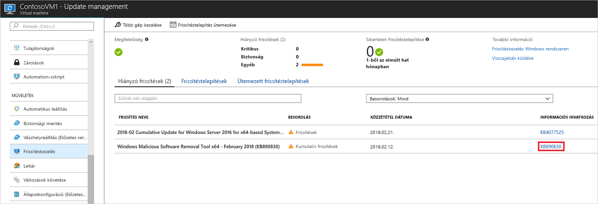
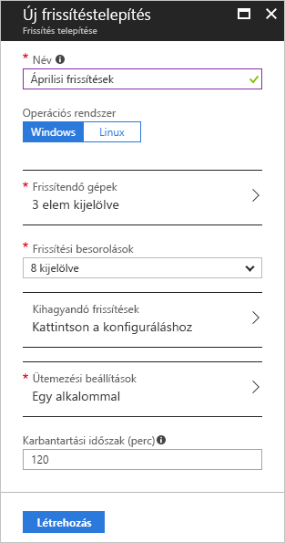
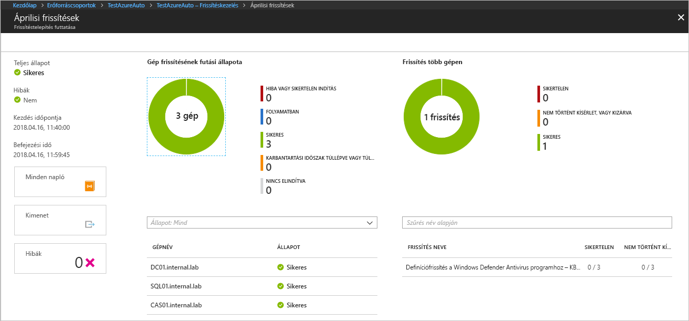

# Windows-frissítések kezelése az Azure Automationnel

Az Update Management segítségével kezelheti a virtuális gépek frissítéseit és javításait.
Ebben az oktatóanyagban megismerheti, hogyan mérheti fel az elérhető frissítések állapotát, ütemezheti a szükséges frissítések telepítését, és tekintheti át a telepítési eredményeket, hogy ellenőrizze, sikeres volt-e a frissítések telepítése.

Díjszabási információkért tekintse meg az [Automation Update Management-díjszabását](https://azure.microsoft.com/pricing/details/automation/) ismertető cikket.

Eben az oktatóanyagban az alábbiakkal fog megismerkedni:

> [!div class="checklist"]
> * Virtuális gép felvétele az Update Management megoldásba
> * Frissítésfelmérés megtekintése
> * Frissítéstelepítés ütemezése
> * Telepítés eredményeinek megtekintése

## Előfeltételek

Az oktatóanyag elvégzéséhez a következőkre lesz szüksége:

* Azure-előfizetés. Ha még nem rendelkezik fiókkal, [aktiválhatja MSDN-előfizetői előnyeit](https://azure.microsoft.com/pricing/member-offers/msdn-benefits-details/), illetve [regisztrálhat egy ingyenes fiókot](https://azure.microsoft.com/free/?WT.mc_id=A261C142F).
* [Automation-fiók](automation-offering-get-started.md) a megfigyelő és műveleti runbookok, valamint a figyelőfeladat tárolásához.
* A szolgáltatásba felvenni kívánt [virtuális gép](../virtual-machines/windows/quick-create-portal.md).

## Jelentkezzen be az Azure-ba

Jelentkezzen be az Azure Portalra a http://portal.azure.com webhelyen.

## Az Update Management engedélyezése

Az oktatóanyag első lépéseként engedélyeznie kell az Update Management megoldást a virtuális gépen. Ha előzőleg már engedélyezett egy másik automatizálási megoldást valamely virtuális gépen, ez a lépés kihagyható.

1. A bal oldali menüben kattintson a **Virtuális gépek** elemre, majd válasszon ki egy virtuális gépet a listából.
2. A bal oldali menüben, a **Műveletek** szakaszban kattintson az **Update Management** elemre. Megjelenik az **Update Management engedélyezése** lap.

A rendszer ellenőrzi, hogy az Update Management engedélyezve van-e a virtuális gépen.
A rendszer eközben azt is ellenőrzi, hogy létezik-e Log Analytics-munkaterület és egy csatlakoztatott Automation-fiók, valamint hogy a megoldás már jelen van-e a munkaterületen.

A [Log Analytics](../log-analytics/log-analytics-overview.md?toc=%2fazure%2fautomation%2ftoc.json)-munkaterület az Update Management, valamint a hasonló funkciók és szolgáltatások által létrehozott adatok gyűjtésére szolgál.
A munkaterület egyetlen központi helyet biztosít a több forrásból származó adatok áttekintéséhez és elemzéséhez.
A frissítést igénylő virtuális gépeken további műveletek elvégzése érdekében az Azure Automation runbookok futtatását is lehetővé teszi a virtuális gépeken (pl. letöltés és frissítések alkalmazása).

Az ellenőrzési folyamat arra is kiterjed, hogy a virtuális gépen működik-e a Microsoft Monitoring Agent (MMA) és egy hibrid feldolgozó.
Ez az ügynök kommunikál a virtuális géppel, továbbá begyűjti a frissítési állapottal kapcsolatos információkat.
Az ellenőrzési folyamat arra is kiterjed, hogy a virtuális gépen működik-e a Microsoft Monitoring Agent (MMA) és az Automation hibrid runbook-feldolgozó.

Ha az előfeltételek nem teljesülnek, egy szalagcím jelenik meg, amelyen engedélyezheti a megoldást.

A megoldás engedélyezéséhez kattintson a szalagcímre.
Ha az ellenőrzést követően az alábbi előfeltételek bármelyike hiányzik, a rendszer automatikusan hozzáadja azt:

* [Log Analytics](../log-analytics/log-analytics-overview.md?toc=%2fazure%2fautomation%2ftoc.json)-munkaterület
* [Automatizálás](./automation-offering-get-started.md)
* Engedélyezett [hibrid runbook-feldolgozó](./automation-hybrid-runbook-worker.md) a virtuális gépen

Megnyílik az **Update Management** képernyő. Konfigurálja a használni kívánt helyet, Log Analytics-munkaterületet és Automation-fiókot, majd kattintson az **Engedélyezés** gombra. Ha a mezők szürkén jelennek meg, az azt jelenti, hogy egy másik automatizálási megoldás már engedélyezve van a virtuális gépen, ezért az ahhoz tartozó munkaterületet és Automation-fiókot kell használnia.

A megoldás engedélyezése akár 15 percet is igénybe vehet. Ez idő alatt ne zárja be a böngészőablakot.
A megoldás engedélyezését követően a virtuális gép hiányzó frissítéseivel kapcsolatos adatok elkezdenek beérkezni a Log Analytics szolgáltatásba.
Az adatok legalább 30 perc és legfeljebb 6 óra múlva állnak készen az elemzésre.

## A frissítésfelmérés megtekintése

A **Frissítéskezelés** engedélyezése után megjelenik a **Frissítéskezelés** képernyő.
Hiányzó frissítések esetén azok listája a **Hiányzó frissítések** lapon található.

A frissítésekkel kapcsolatos támogatási cikk megnyitásához kattintson a frissítésen található **INFORMÁCIÓS HIVATKOZÁSRA**. Itt fontos információkhoz juthat a frissítéssel kapcsolatban.

A frissítés bármely más részére kattintva megnyílik a kiválasztott frissítésre vonatkozó **Naplók keresése** ablak. A naplókeresés lekérdezése az adott frissítéshez előre meg van adva. Ezt a lekérdezést módosíthatja, vagy létrehozhatja saját lekérdezését, amellyel részletes információkat jeleníthet meg a környezetben telepített vagy a hiányzó frissítésekre vonatkozóan.

## Frissítéstelepítés ütemezése

Megtudta, hogy a virtuális gépről frissítések hiányoznak. A frissítések telepítéséhez ütemezzen egy olyan telepítést, amely megfelel a kiadási ütemtervnek és a szolgáltatási időkeretnek.
Kiválaszthatja, hogy a telepítés milyen típusú frissítéseket tartalmazzon.
Például hozzáadhatja a kritikus vagy a biztonsági frissítéseket, és kizárhatja a kumulatív frissítéseket.

> [!WARNING]
> Ha a frissítésekhez újraindításra van szükség, a rendszer automatikusan újraindítja a virtuális gépet.

Ütemezzen egy új frissítéstelepítést a virtuális géphez. Ehhez lépjen vissza az **Update Management** párbeszédpanelre, és válassza a képernyő felső részén található **Update Management ütemezése** lehetőséget.

Az **Új frissítéstelepítés** képernyőn adja meg a következő információkat:

* **Név** – Adjon meg egy egyedi nevet a frissítéstelepítés számára.
* **Frissítési besorolás** – Válassza ki azokat a szoftvertípusokat, amelyeket a frissítéstelepítés belefoglal a telepítésbe. Ebben az oktatóanyagban hagyjon minden típust kiválasztva.

  A választható besorolási típusok a következők:

  * Kritikus frissítések
  * Biztonsági frissítések
  * Kumulatív frissítések
  * Funkciócsomagok
  * Szervizcsomagok
  * Definíciófrissítések
  * Eszközök
  * Frissítések

* **Ütemezési beállítások** – Állítsa az időt az aktuálisnál 5 perccel későbbi időpontra. Elfogadhatja az alapértelmezett időpontot is, amely az aktuális időpontnál 30 perccel későbbi.
Azt is megadhatja, hogy a telepítés egyszer történjen meg, vagy ismétlődjön.
Válassza az **Ismétlődő** lehetőséget az **Ismétlődés** menüpontban. Fogadja el az alapértelmezett 1 napos értékeket, és kattintson az **OK** gombra. Ezzel egy ismétlődő ütemezést állít be.

* **Karbantartási időszak (perc)** – Fogadja el az alapértelmezett értéket. Megadhatja azt az időtartamot, amelyen belül szeretné, hogy a frissítés telepítése megtörténjen. Ez a beállítás biztosítja, hogy a módosítások a megadott szolgáltatási időkereten belül menjenek végbe.

Ha befejezte az ütemezés konfigurálását, kattintson a **Létrehozás** gombra. Ekkor visszalép az állapot-irányítópultra. Kattintson az **Ütemezett frissítéstelepítések** lehetőségre a létrehozott telepítési ütemezés megjelenítéséhez.

## Frissítéstelepítés eredményeinek megtekintése

Miután az ütemezett telepítés elindult, az **Update Management** képernyő **Frissítéstelepítések** lapján láthatóvá válik a telepítés állapota.
Ha éppen fut, az állapota **Folyamatban**.
Ha sikeresen befejeződik, **Sikeres** állapotúra változik.
Ha a telepítésben lévő frissítések közül egy vagy több meghiúsul, az állapota **Részben sikertelen**.
Ha rákattint a befejezett frissítéstelepítésre, megjelenik az adott frissítéstelepítés irányítópultja.

A **Frissítés eredményei** csempe összesíti a frissítések teljes számát és az adott virtuális gépre vonatkozó telepítési eredményeket.
A jobb oldali táblázat az egyes frissítések részletes áttekintését és a telepítés eredményét tartalmazza.
A következő lista az elérhető értékeket jeleníti meg:

* **Nem lett megkísérelve** – a frissítés nem lett telepítve, mert a megadott karbantartási időszak alapján nem lett volna rá elég idő.
* **Sikeres** – a frissítés sikeres volt
* **Sikertelen** – a frissítés sikertelen volt

Kattintson a **Minden napló** csempére a telepítés által létrehozott összes naplóbejegyzés megtekintéséhez.

Kattintson a **Kimenet** csempére azon runbook feladatstreamjének megtekintéséhez, amely a frissítések telepítését kezeli a cél virtuális gépen.

Kattintson a **Hibák** csempére a telepítés közben felmerülő hibák részletes információinak megtekintéséhez.

## További lépések

Ez az oktatóanyag bemutatta, hogyan végezheti el az alábbi műveleteket:

> [!div class="checklist"]
> * Virtuális gép felvétele az Update Management megoldásba
> * Frissítésfelmérés megtekintése
> * Frissítéstelepítés ütemezése
> * Telepítés eredményeinek megtekintése

Folytassa az Update Management megoldás áttekintésével.

> [!div class="nextstepaction"]
> [Az Update Management megoldás](../operations-management-suite/oms-solution-update-management.md?toc=%2fazure%2fautomation%2ftoc.json)