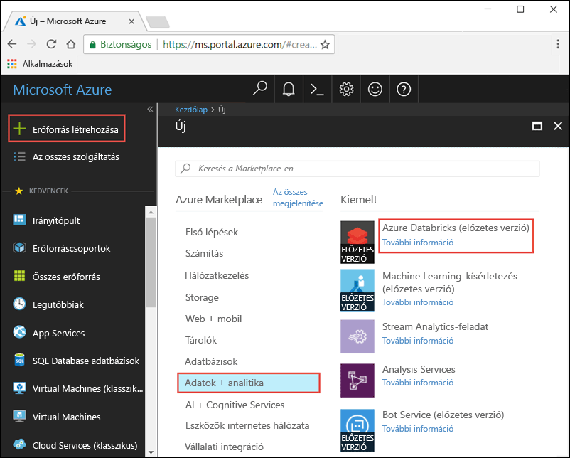
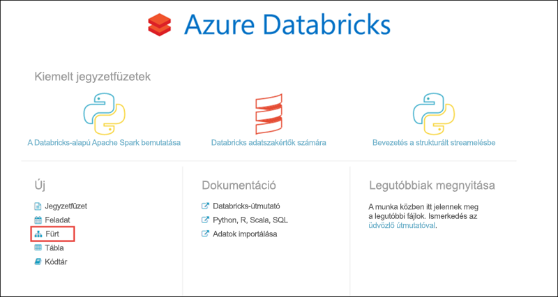
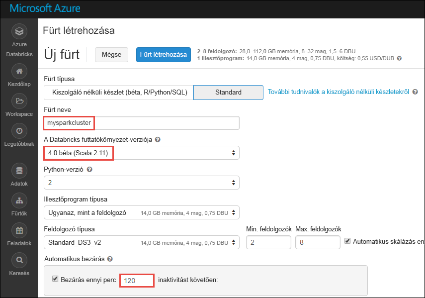
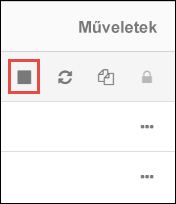

# Oktatóanyag: Streamelési adatok hangulatelemzése az Azure Databricks használatával

Ez az oktatóanyag bemutatja, hogyan végezhet közel valós idejű hangulatelemzést streamelési adatokon az Azure Databricks használatával. Az Azure Event Hubs használatával beállít egy adatbetöltési rendszert. Az Event Hubs szolgáltatás üzeneteit az Azure Databricks szolgáltatásban a Spark Event Hubs összekötő segítségével használhatja fel. Végül használja a Microsoft Cognitive Service API-kat a streamelési adatok hangulatelemzéséhez.

Az oktatóanyag elvégzésével „Azure” kifejezéseket tartalmazó Twitter-tweetek streamelését valósította meg, és hangulatelemzést végzett a tweeteken.

Az alábbi ábrán az alkalmazásfolyam látható:

Ez az oktatóanyag a következő feladatokat mutatja be:

> [!div class="checklist"]
> * Azure Databricks-munkaterület létrehozása
> * Spark-fürt létrehozása az Azure Databricksben
> * Twitter-alkalmazás létrehozása a streamadatok eléréséhez
> * Jegyzetfüzetek létrehozása az Azure Databricksben
> * Kódtárak csatlakoztatása az Event Hubshoz és a Twitter API-hoz
> * Microsoft Cognitive Services-fiók létrehozása és a hozzáférési kulcs lekérése
> * Tweetek küldése az Event Hubsnak
> * Tweetek beolvasása az Event Hubsról
> * Hangulatelemzés futtatása tweeteken

Ha nem rendelkezik Azure-előfizetéssel, [hozzon létre egy ingyenes fiókot](https://azure.microsoft.com/free/) a feladatok megkezdése előtt.

## Előfeltételek

Mielőtt nekilát az oktatóanyagnak, ellenőrizze, hogy megfelel-e a következő feltételeknek:
- Egy Azure Event Hubs névtér.
- Egy eseményközpont a névtéren belül.
- Az Event Hubs-névtér elérésére szolgáló kapcsolati karakterlánc. A kapcsolati karakterlánc formátumának a következőhöz hasonlónak kell lennie: `Endpoint=sb://<namespace>.servicebus.windows.net/;SharedAccessKeyName=<key name>;SharedAccessKey=<key value>`.
- Megosztott hozzáférési szabályzat neve és szabályzatkulcs az Event Hubshoz.

Ezeket az előfeltételeket az [Azure Event Hubs-névtér és eseményközpont létrehozását](../event-hubs/event-hubs-create.md) ismertető cikk lépéseit követve teljesítheti.

## Bejelentkezés az Azure Portalra

Jelentkezzen be az [Azure portálra](https://portal.azure.com/).

## Azure Databricks-munkaterület létrehozása

Ebben a szakaszban egy Azure Databricks-munkaterületet fog létrehozni az Azure Portal használatával.

1. Az Azure Portalon válassza az **Erőforrás létrehozása** > **Adatok + analitika** > **Azure Databricks** elemet.

    

3. Az **Azure Databricks szolgáltatás** pontban adja meg az értékeket Databricks-munkaterület létrehozásához.

    

    Adja meg a következő értékeket:

    |Tulajdonság  |Leírás  |
    |---------|---------|
    |**Munkaterület neve**     | Adja meg a Databricks-munkaterület nevét.        |
    |**Előfizetés**     | Válassza ki a legördülő menüből a saját Azure-előfizetését.        |
    |**Erőforráscsoport**     | Adja meg, hogy új erőforráscsoportot kíván-e létrehozni, vagy egy meglévőt szeretne használni. Az erőforráscsoport egy tároló, amely Azure-megoldásokhoz kapcsolódó erőforrásokat tárol. További információért olvassa el az [Azure-erőforráscsoportok áttekintését](../azure-resource-manager/resource-group-overview.md). |
    |**Hely**     | Válassza az **USA 2. keleti régiója** lehetőséget. A további elérhető régiókért tekintse meg az [elérhető Azure-szolgáltatások régiók szerinti bontását](https://azure.microsoft.com/regions/services/).        |
    |**Tarifacsomag**     |  Válassza a **Standard** vagy a **Prémium** előfizetést. További információkért a csomagokkal kapcsolatban tekintse meg a [Databricks díjszabását ismertető oldalt](https://azure.microsoft.com/pricing/details/databricks/).       |

    Válassza a **Rögzítés az irányítópulton**, majd a **Létrehozás** lehetőséget.

4. A fiók létrehozása eltarthat néhány percig. A fiók létrehozása során a portál jobb oldalán megjelenik az **Üzembe helyezés beküldése a következőhöz: Azure Databricks** csempe. Lehetséges, hogy jobbra kell görgetnie az irányítópulton, hogy megjelenjen a csempe. Megjelenik egy folyamatjelző is a képernyő tetejéhez közel. Mindkét területen nyomon követheti a folyamat előrehaladását.

    

## Spark-fürt létrehozása a Databricks használatával

1. Az Azure Portalon lépjen a létrehozott Databricks-munkaterülethez, majd válassza a **Munkaterület indítása** elemet.

2. A rendszer átirányítja az Azure Databricks portáljára. A portálon válassza a **Fürt** elemet.

    

3. Az **Új fürt** lapon adja meg a fürt létrehozásához szükséges értékeket.

    

    Fogadja el az összes alapértelmezett értéket, kivéve a következőket:

    * Adjon egy nevet a fürtnek.
    * Ehhez a cikkhez a **4.0 (béta)** futtatókörnyezetben hozzon létre fürtöt.
    * Mindenképpen jelölje be a **Leállítás ___ percnyi tétlenség után** jelölőnégyzetet. Adja meg az időtartamot (percben), amelynek elteltével le kell állítani a fürtöt, amennyiben az használaton kívül van.

    Válassza a **Fürt létrehozása** lehetőséget. Ha a fürt már fut, notebookokat csatlakoztathat hozzá, illetve Spark-feladatokat futtathat.

## Twitter-alkalmazás létrehozása

A tweetstream fogadásához létre kell hoznia egy alkalmazást a Twitteren. Kövesse a Twitter-alkalmazás létrehozására vonatkozó lépéseket, és jegyezze fel az értékeket, amelyek az oktatóanyag elvégzéséhez szükségesek.

1. Egy webböngészőben nyissa meg a [Twitter Application Management](http://twitter.com/app) oldalt, és válassza az **Új alkalmazás létrehozása** elemet.

    

2. Az **Alkalmazás létrehozása** oldalon adja meg az új alkalmazás adatait, majd válassza a **Twitter-alkalmazás létrehozása** parancsot.

    

3. Az alkalmazás oldalán válassza a **Kulcsok és hozzáférési tokenek** fület, és másolja a **Fogyasztói kulcs** és a **Fogyasztói titkos kulcs** mezők értékeit. Ezenkívül válassza a **Saját hozzáférési token létrehozása** lehetőséget a hozzáférési tokenek létrehozásához. Másolja a **Hozzáférési token** és a **Hozzáférési token titkos kulcsa** mező értékeit.

    

Mentse a Twitter-alkalmazáshoz lekért értékeket. Az oktatóanyag későbbi részében szüksége lesz rájuk.

## Kódtárak csatolása Spark-fürthöz

Ez az oktatóanyag bemutatja, hogyan küldhet tweeteket az Event Hubsnak a Twitter API-k segítségével. Ezenkívül az [Apache Spark Event Hubs-összekötő](https://github.com/Azure/azure-event-hubs-spark) segítségével adatokat olvashat be és írhat az Azure Event Hubsba. Ha az API-kat a fürt részeként kívánja használni, adja hozzá azokat kódtárként az Azure Databrickshez, majd társítsa a Spark-fürthöz. A következőkben megtudhatja, hogyan adhatja hozzá a kódtárat a munkaterület **Megosztott** mappájához.

1.  Az Azure Databricks-munkaterületen válassza a **Munkaterület** lehetőséget, majd kattintson a jobb gombbal a **Megosztott** elemre. A helyi menüben kattintson a **Létrehozás** > **Kódtár** parancsra.

    

2. Az Új kódtár oldalon a **Forrás** listából válassza a **Maven-koordináta** lehetőséget. A **Koordináta** mezőben adja meg a hozzáadni kívánt csomag koordinátáit. Az oktatóanyagban használt kódtárak Maven-koordinátái a következők:

    * Spark Event Hubs-összekötő – `com.microsoft.azure:azure-eventhubs-spark_2.11:2.3.1`
    * Twitter API – `org.twitter4j:twitter4j-core:4.0.6`

    

3. Válassza a **Kódtár létrehozása** lehetőséget.

4. Válassza ki a mappát, amelyhez hozzáadta a kódtárat, majd válassza ki a kódtár nevét.

    

5. A kódtár oldalán válassza ki a fürtöt, amelyhez hozzá kívánja adni a kódtárat. Ha sikeresen társította a kódtárat a fürthöz, annak állapota azonnal **Csatolt** lesz.

    

6. Ismételje meg ezeket a lépéseket a Twitter-csomag (`twitter4j-core:4.0.6`) esetében is.

## Cognitive Services hozzáférési kulcs beszerzése

Ez az oktatóanyag bemutatja, hogyan végezhet hangulatelemzést közel valós időben streamelt tweeteken a [Microsoft Cognitive Services Text Analytics API-k](../cognitive-services/text-analytics/overview.md) futtatásával. Az API-k használata előtt létre kell hoznia egy Microsoft Cognitive Services-fiókot az Azure-ban, és be kell szereznie egy hozzáférési kulcsot a Text Analytics API-k használatához.

1. Jelentkezzen be az [Azure Portalra](https://portal.azure.com/).

2. Válassza a **+ Erőforrás létrehozása** lehetőséget.

3. Az Azure Marketplace területen válassza a **Mesterséges intelligencia és Cognitive Services** > **Text Analytics API** lehetőséget.

    

4. A **Létrehozás** párbeszédpanelen adja meg az alábbi értékeket:

    

    - Adja meg a Cognitive Services-fiók nevét.
    - Adja meg az Azure-előfizetés nevét, amelyben a fiókot létrehozta.
    - Válasszon egy Azure-beli helyet.
    - Válasszon egy tarifacsomagot a szolgáltatáshoz. További információ a Cognitive Services díjszabásáról: [díjszabási lap](https://azure.microsoft.com/pricing/details/cognitive-services/).
    - Adja meg, hogy új erőforráscsoportot kíván-e létrehozni, vagy egy meglévőt szeretne használni.

    Kattintson a **Létrehozás** gombra.

5. A fiók létrehozását követően az **Áttekintés** lapon kattintson a **Hozzáférési kulcsok megjelenítése** lehetőségre.

    

    Emellett másolja a végpont URL-címének egy részét a képernyőképen látható módon. Erre az URL-címre szükség lesz az oktatóanyagban.

6. A **Kulcsok kezelése** területen kattintson a használni kívánt kulcs mellett található másolás ikonra.

    

7. Mentse a végponti URL-cím és a hozzáférési kulcs ebben a lépésben beszerzett értékeit. Az oktatóanyag későbbi részében szüksége lesz rájuk.

## Jegyzetfüzetek létrehozása a Databricksben

Ebben a szakaszban két jegyzetfüzetet hoz létre a Databricks munkaterületen a következő nevekkel

- **SendTweetsToEventHub** – Előállítói jegyzetfüzet a tweetek beszerzésére a Twitterről, majd azok streamelésére az Event Hubsnak.
- **AnalyzeTweetsFromEventHub** – Fogyasztói jegyzetfüzet tweetek olvasásához az Event Hubsról, valamint hangulatelemzések futtatásához.

1. A bal oldali panelen válassza a **Munkaterület** elemet. A **Munkaterület** legördülő menüjében válassza a **Létrehozás**, majd a **Jegyzetfüzet** elemet.

    

2. A **Jegyzetfüzet létrehozása** párbeszédpanelen írja be a **SendTweetsToEventHub** nevet, a nyelvnél válassza a **Scala** lehetőséget, majd válassza ki a korábban létrehozott Spark-fürtöt.

    

    Kattintson a **Létrehozás** gombra.

3. Az **AnalyzeTweetsFromEventHub** jegyzetfüzet létrehozásához ismételje meg ezeket a lépéseket.

## Tweetek küldése az Event Hubsnak

Illessze be a következő kódot a **SendTweetsToEventHub** jegyzetfüzetbe, és a helyőrzőt cserélje le a korábban létrehozott Event Hubs-névtér és Twitter-alkalmazás értékeire. Ez a jegyzetfüzet valós időben streameli az „Azure” kifejezést tartalmazó tweeteket az Event Hubsba.

    import java.util._
    import scala.collection.JavaConverters._
    import com.microsoft.azure.eventhubs._
    import java.util.concurrent._

    val namespaceName = "<EVENT HUBS NAMESPACE>"
    val eventHubName = "<EVENT HUB NAME>"
    val sasKeyName = "<POLICY NAME>"
    val sasKey = "<POLICY KEY>"
    val connStr = new ConnectionStringBuilder()
                .setNamespaceName(namespaceName)
                .setEventHubName(eventHubName)
                .setSasKeyName(sasKeyName)
                .setSasKey(sasKey)

    val pool = Executors.newFixedThreadPool(1)
    val eventHubClient = EventHubClient.create(connStr.toString(), pool)

    def sendEvent(message: String) = {
      val messageData = EventData.create(message.getBytes("UTF-8"))
      eventHubClient.get().send(messageData)
      System.out.println("Sent event: " + message + "\n")
    }

    import twitter4j._
    import twitter4j.TwitterFactory
    import twitter4j.Twitter
    import twitter4j.conf.ConfigurationBuilder

    // Twitter configuration!
    // Replace values below with yours

    val twitterConsumerKey = "<CONSUMER KEY>"
    val twitterConsumerSecret = "<CONSUMER SECRET>"
    val twitterOauthAccessToken = "<ACCESS TOKEN>"
    val twitterOauthTokenSecret = "<TOKEN SECRET>"

    val cb = new ConfigurationBuilder()
      cb.setDebugEnabled(true)
      .setOAuthConsumerKey(twitterConsumerKey)
      .setOAuthConsumerSecret(twitterConsumerSecret)
      .setOAuthAccessToken(twitterOauthAccessToken)
      .setOAuthAccessTokenSecret(twitterOauthTokenSecret)

    val twitterFactory = new TwitterFactory(cb.build())
    val twitter = twitterFactory.getInstance()

    // Getting tweets with keyword "Azure" and sending them to the Event Hub in realtime!

    val query = new Query(" #Azure ")
    query.setCount(100)
    query.lang("en")
    var finished = false
    while (!finished) {
      val result = twitter.search(query)
      val statuses = result.getTweets()
      var lowestStatusId = Long.MaxValue
      for (status <- statuses.asScala) {
        if(!status.isRetweet()){
          sendEvent(status.getText())
        }
        lowestStatusId = Math.min(status.getId(), lowestStatusId)
        Thread.sleep(2000)
      }
      query.setMaxId(lowestStatusId - 1)
    }

    // Closing connection to the Event Hub
    eventHubClient.get().close()

A jegyzetfüzet futtatásához használja a **SHIFT + ENTER** billentyűparancsot. A következő kódrészlethez hasonló kimenetnek kell megjelennie. A kimenetben szereplő minden esemény egy, az Event Hubsba betöltött tweet.

    Sent event: @Microsoft and @Esri launch Geospatial AI on Azure https://t.co/VmLUCiPm6q via @geoworldmedia #geoai #azure #gis #ArtificialIntelligence

    Sent event: Public preview of Java on App Service, built-in support for Tomcat and OpenJDK
    https://t.co/7vs7cKtvah
    #cloudcomputing #Azure

    Sent event: 4 Killer #Azure Features for #Data #Performance https://t.co/kpIb7hFO2j by @RedPixie

    Sent event: Migrate your databases to a fully managed service with Azure SQL Database Managed Instance | #Azure | #Cloud https://t.co/sJHXN4trDk

    Sent event: Top 10 Tricks to #Save Money with #Azure Virtual Machines https://t.co/F2wshBXdoz #Cloud

    ...
    ...

## Tweetek beolvasása az Event Hubsról

Illessze be a következő kódot az **AnalyzeTweetsFromEventHub** jegyzetfüzetbe, és a helyőrzőket cserélje le a korábban létrehozott Azure Event Hubs értékeire. Ez a jegyzetfüzet beolvassa a tweeteket, amelyeket korábban az Event Hubsba streamelt a **SendTweetsToEventHub** jegyzetfüzet segítségével.

    import org.apache.spark.eventhubs._

    // Build connection string with the above information
    val connectionString = ConnectionStringBuilder("<EVENT HUBS CONNECTION STRING>")
      .setEventHubName("<EVENT HUB NAME>")
      .build

    val customEventhubParameters =
      EventHubsConf(connectionString)
      .setMaxEventsPerTrigger(5)

    val incomingStream = spark.readStream.format("eventhubs").options(customEventhubParameters.toMap).load()

    incomingStream.printSchema

    // Sending the incoming stream into the console.
    // Data comes in batches!
    incomingStream.writeStream.outputMode("append").format("console").option("truncate", false).start().awaitTermination()

A következő kimenetet kapja:

    root
     |-- body: binary (nullable = true)
     |-- offset: long (nullable = true)
     |-- seqNumber: long (nullable = true)
     |-- enqueuedTime: long (nullable = true)
     |-- publisher: string (nullable = true)
     |-- partitionKey: string (nullable = true)

    -------------------------------------------
    Batch: 0
    -------------------------------------------
    +------+------+--------------+---------------+---------+------------+
    |body  |offset|sequenceNumber|enqueuedTime   |publisher|partitionKey|
    +------+------+--------------+---------------+---------+------------+
    |[50 75 62 6C 69 63 20 70 72 65 76 69 65 77 20 6F 66 20 4A 61 76 61 20 6F 6E 20 41 70 70 20 53 65 72 76 69 63 65 2C 20 62 75 69 6C 74 2D 69 6E 20 73 75 70 70 6F 72 74 20 66 6F 72 20 54 6F 6D 63 61 74 20 61 6E 64 20 4F 70 65 6E 4A 44 4B 0A 68 74 74 70 73 3A 2F 2F 74 2E 63 6F 2F 37 76 73 37 63 4B 74 76 61 68 20 0A 23 63 6C 6F 75 64 63 6F 6D 70 75 74 69 6E 67 20 23 41 7A 75 72 65]                              |0     |0             |2018-03-09 05:49:08.86 |null     |null        |
    |[4D 69 67 72 61 74 65 20 79 6F 75 72 20 64 61 74 61 62 61 73 65 73 20 74 6F 20 61 20 66 75 6C 6C 79 20 6D 61 6E 61 67 65 64 20 73 65 72 76 69 63 65 20 77 69 74 68 20 41 7A 75 72 65 20 53 51 4C 20 44 61 74 61 62 61 73 65 20 4D 61 6E 61 67 65 64 20 49 6E 73 74 61 6E 63 65 20 7C 20 23 41 7A 75 72 65 20 7C 20 23 43 6C 6F 75 64 20 68 74 74 70 73 3A 2F 2F 74 2E 63 6F 2F 73 4A 48 58 4E 34 74 72 44 6B]            |168   |1             |2018-03-09 05:49:24.752|null     |null        |
    +------+------+--------------+---------------+---------+------------+

    -------------------------------------------
    Batch: 1
    -------------------------------------------
    ...
    ...

A bináris módú kimenetet a következő kódrészlettel konvertálhatja karakterlánccá.

    import org.apache.spark.sql.types._
    import org.apache.spark.sql.functions._

    // Event Hub message format is JSON and contains "body" field
    // Body is binary, so we cast it to string to see the actual content of the message
    val messages =
      incomingStream
      .withColumn("Offset", $"offset".cast(LongType))
      .withColumn("Time (readable)", $"enqueuedTime".cast(TimestampType))
      .withColumn("Timestamp", $"enqueuedTime".cast(LongType))
      .withColumn("Body", $"body".cast(StringType))
      .select("Offset", "Time (readable)", "Timestamp", "Body")

    messages.printSchema

    messages.writeStream.outputMode("append").format("console").option("truncate", false).start().awaitTermination()

A kimenetnek ezután a következő kódrészlethez hasonlónak kell lennie:

    root
     |-- Offset: long (nullable = true)
     |-- Time (readable): timestamp (nullable = true)
     |-- Timestamp: long (nullable = true)
     |-- Body: string (nullable = true)

    -------------------------------------------
    Batch: 0
    -------------------------------------------
    +------+-----------------+----------+-------+
    |Offset|Time (readable)  |Timestamp |Body
    +------+-----------------+----------+-------+
    |0     |2018-03-09 05:49:08.86 |1520574548|Public preview of Java on App Service, built-in support for Tomcat and OpenJDK
    https://t.co/7vs7cKtvah
    #cloudcomputing #Azure          |
    |168   |2018-03-09 05:49:24.752|1520574564|Migrate your databases to a fully managed service with Azure SQL Database Managed Instance | #Azure | #Cloud https://t.co/sJHXN4trDk    |
    |0     |2018-03-09 05:49:02.936|1520574542|@Microsoft and @Esri launch Geospatial AI on Azure https://t.co/VmLUCiPm6q via @geoworldmedia #geoai #azure #gis #ArtificialIntelligence|
    |176   |2018-03-09 05:49:20.801|1520574560|4 Killer #Azure Features for #Data #Performance https://t.co/kpIb7hFO2j by @RedPixie                                                    |
    +------+-----------------+----------+-------+
    -------------------------------------------
    Batch: 1
    -------------------------------------------
    ...
    ...

Közel valós időben streamelt adatokat az Azure Event Hubsból az Azure Databricksbe az Apache Spark Event Hubs-összekötőjével. A Spark Event Hubs-összekötőinek használatáról az [összekötő dokumentációjában](https://github.com/Azure/azure-event-hubs-spark/tree/master/docs) talál további információt.

## Hangulatelemzés futtatása tweeteken

Ebben a szakaszban hangulatelemzést futtat a Twitter API használatával fogadott tweeteken. Ebben a szakaszban a kódrészleteket fogja hozzáadni ugyanazon **AnalyzeTweetsFromEventHub** jegyzetfüzethez.

Első lépésként adjon hozzá egy új kódcellát a jegyzetfüzethez, és illessze be az alábbi kódrészletet. Ez a kódrészlet a Language and Sentiment API-val használható adattípusokat határozza meg.

    import java.io._
    import java.net._
    import java.util._

    class Document(var id: String, var text: String, var language: String = "", var sentiment: Double = 0.0) extends Serializable

    class Documents(var documents: List[Document] = new ArrayList[Document]()) extends Serializable {

        def add(id: String, text: String, language: String = "") {
            documents.add (new Document(id, text, language))
        }
        def add(doc: Document) {
            documents.add (doc)
        }
    }

Adjon hozzá egy új kódcellát, és illessze be az alábbi kódrészletet. A kódrészletre a JSON-sztringek elemzéséhez van szükség.

    class CC[T] extends Serializable { def unapply(a:Any):Option[T] = Some(a.asInstanceOf[T]) }
    object M extends CC[scala.collection.immutable.Map[String, Any]]
    object L extends CC[scala.collection.immutable.List[Any]]
    object S extends CC[String]
    object D extends CC[Double]

Adjon hozzá egy új kódcellát, és illessze be az alábbi részletet. Ez a kódrészlet egy olyan objektumot tartalmaz, amely a Text Analysis API nyelvfelismerés és hangulatelemzés céljára való hívásához szükséges függvényeket tartalmaz. Győződjön meg arról, hogy a `<PROVIDE ACCESS KEY HERE>` és `<PROVIDE HOST HERE>` helyőrzőket lecserélte a Cognitive Services-fiókhoz kapott értékekre.

    import javax.net.ssl.HttpsURLConnection
    import com.google.gson.Gson
    import com.google.gson.GsonBuilder
    import com.google.gson.JsonObject
    import com.google.gson.JsonParser
    import scala.util.parsing.json._

    object SentimentDetector extends Serializable {

      // Cognitive Services API connection settings
      val accessKey = "<PROVIDE ACCESS KEY HERE>"
      val host = "<PROVIDE HOST HERE>"
      val languagesPath = "/text/analytics/v2.0/languages"
      val sentimentPath = "/text/analytics/v2.0/sentiment"
      val languagesUrl = new URL(host+languagesPath)
      val sentimenUrl = new URL(host+sentimentPath)

      def getConnection(path: URL): HttpsURLConnection = {
        val connection = path.openConnection().asInstanceOf[HttpsURLConnection]
        connection.setRequestMethod("POST")
        connection.setRequestProperty("Content-Type", "text/json")
        connection.setRequestProperty("Ocp-Apim-Subscription-Key", accessKey)
        connection.setDoOutput(true)
        return connection
      }

      def prettify (json_text: String): String = {
        val parser = new JsonParser()
        val json = parser.parse(json_text).getAsJsonObject()
        val gson = new GsonBuilder().setPrettyPrinting().create()
        return gson.toJson(json)
      }

      // Handles the call to Cognitive Services API.
      // Expects Documents as parameters and the address of the API to call.
      // Returns an instance of Documents in response.
      def processUsingApi(inputDocs: Documents, path: URL): String = {
        val docText = new Gson().toJson(inputDocs)
        val encoded_text = docText.getBytes("UTF-8")
        val connection = getConnection(path)
        val wr = new DataOutputStream(connection.getOutputStream())
        wr.write(encoded_text, 0, encoded_text.length)
        wr.flush()
        wr.close()

        val response = new StringBuilder()
        val in = new BufferedReader(new InputStreamReader(connection.getInputStream()))
        var line = in.readLine()
        while (line != null) {
            response.append(line)
            line = in.readLine()
        }
        in.close()
        return response.toString()
      }

      // Calls the language API for specified documents.
      // Returns a documents with language field set.
      def getLanguage (inputDocs: Documents): Documents = {
        try {
          val response = processUsingApi(inputDocs, languagesUrl)
          // In case we need to log the json response somewhere
          val niceResponse = prettify(response)
          val docs = new Documents()
          val result = for {
                // Deserializing the JSON response from the API into Scala types
                Some(M(map)) <- scala.collection.immutable.List(JSON.parseFull(niceResponse))
                L(documents) = map("documents")
                M(document) <- documents
                S(id) = document("id")
                L(detectedLanguages) = document("detectedLanguages")
                M(detectedLanguage) <- detectedLanguages
                S(language) = detectedLanguage("iso6391Name")
          } yield {
                docs.add(new Document(id = id, text = id, language = language))
          }
          return docs
        } catch {
              case e: Exception => return new Documents()
        }
      }

      // Calls the sentiment API for specified documents. Needs a language field to be set for each of them.
      // Returns documents with sentiment field set, taking a value in the range from 0 to 1.
      def getSentiment (inputDocs: Documents): Documents = {
        try {
          val response = processUsingApi(inputDocs, sentimenUrl)
          val niceResponse = prettify(response)
          val docs = new Documents()
          val result = for {
                // Deserializing the JSON response from the API into Scala types
                Some(M(map)) <- scala.collection.immutable.List(JSON.parseFull(niceResponse))
                L(documents) = map("documents")
                M(document) <- documents
                S(id) = document("id")
                D(sentiment) = document("score")
          } yield {
                docs.add(new Document(id = id, text = id, sentiment = sentiment))
          }
          return docs
        } catch {
            case e: Exception => return new Documents()
        }
      }
    }

    // User Defined Function for processing content of messages to return their sentiment.
    val toSentiment = udf((textContent: String) => {
      val inputDocs = new Documents()
      inputDocs.add (textContent, textContent)
      val docsWithLanguage = SentimentDetector.getLanguage(inputDocs)
      val docsWithSentiment = SentimentDetector.getSentiment(docsWithLanguage)
      if (docsWithLanguage.documents.isEmpty) {
        // Placeholder value to display for no score returned by the sentiment API
        (-1).toDouble
      } else {
        docsWithSentiment.documents.get(0).sentiment.toDouble
      }
    })

Adjon hozzá egy utolsó kódcellát, amellyel előkészítheti az adatkeretet a tweet tartalmával és a tweethez társított hangulatértékkel.

    // Prepare a dataframe with Content and Sentiment columns
    val streamingDataFrame = incomingStream.selectExpr("cast (body as string) AS Content").withColumn("Sentiment", toSentiment($"Content"))

    // Display the streaming data with the sentiment
    streamingDataFrame.writeStream.outputMode("append").format("console").option("truncate", false).start().awaitTermination()

A következő kódrészlethez hasonló kimenetnek kell megjelennie:

    -------------------------------------------
    Batch: 0
    -------------------------------------------
    +--------------------------------+------------------+
    |Content                         |Sentiment         |
    +--------------------------------+------------------+
    |Public preview of Java on App Service, built-in support for Tomcat and OpenJDK
    https://t.co/7vs7cKtvah   #cloudcomputing #Azure          |0.7761918306350708|
    |Migrate your databases to a fully managed service with Azure SQL Database Managed Instance | #Azure | #Cloud https://t.co/sJHXN4trDk    |0.8558163642883301|
    |@Microsoft and @Esri launch Geospatial AI on Azure https://t.co/VmLUCiPm6q via @geoworldmedia #geoai #azure #gis #ArtificialIntelligence|0.5               |
    |4 Killer #Azure Features for #Data #Performance https://t.co/kpIb7hFO2j by @RedPixie                                                    |0.5               |
    +--------------------------------+------------------+

A **Hangulat** oszlopban szereplő **1**-hez közeli érték nagyszerű Azure felhasználói élményre utal. A **0**-hoz közeli érték arra utal, hogy a felhasználók a Microsoft Azure használata során hibákkal találkoztak.

Ennyi az egész! Az Azure Databricks segítségével adatokat streamelt az Azure Event Hubsba, a streamelt adatokat az Event Hubs összekötője segítségével használta fel, majd közel valós idejű hangulatelemzést hajtott végre rajtuk.

## Az erőforrások eltávolítása

Az oktatóanyag befejezése után leállíthatja a fürtöt. Ehhez az Azure Databricks-munkaterület bal oldali panelén kattintson a **Fürtök** elemre. A leállítani kívánt fürtnél vigye az egérmutatót a **Műveletek** oszlopban található három pont fölé, majd kattintson a **Leállítás** ikonra.

Ha nem állítja le manuálisan a fürtöt, az automatikusan le fog állni, amennyiben a fürt létrehozásakor bejelölte a **Leállítás ___ percnyi tétlenség után** jelölőnégyzetet. Ebben az esetben a fürt automatikusan leáll, ha a megadott ideig inaktív volt.

## További lépések
Ez az oktatóanyag bemutatta, hogyan használhatja az Azure Databricks szolgáltatást az adatok Azure Event Hubsra való streamelésére, és hogyan olvashatja valós időben a streamelt adatokat az Event Hubsról. Megismerte, hogyan végezheti el az alábbi műveleteket:
> [!div class="checklist"]
> * Azure Databricks-munkaterület létrehozása
> * Spark-fürt létrehozása az Azure Databricksben
> * Twitter-alkalmazás létrehozása a streamadatok eléréséhez
> * Jegyzetfüzetek létrehozása az Azure Databricksben
> * Kódtárak hozzáadása és csatlakoztatása az Event Hubshoz és a Twitter API-hoz
> * Microsoft Cognitive Services-fiók létrehozása és a hozzáférési kulcs lekérése
> * Tweetek küldése az Event Hubsnak
> * Tweetek beolvasása az Event Hubsról
> * Hangulatelemzés futtatása tweeteken

Folytassa a következő oktatóanyaggal, amelyből megtudhatja, hogyan hajthat végre gépi tanulási feladatokat az Azure Databricks használatával.

> [!div class="nextstepaction"]
>[Machine Learning az Azure Databricks használatával](https://docs.azuredatabricks.net/spark/latest/mllib/decision-trees.html)
