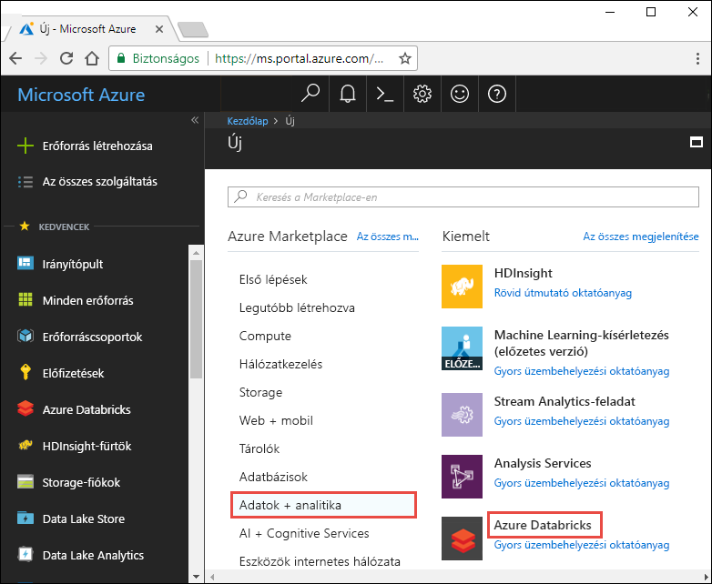
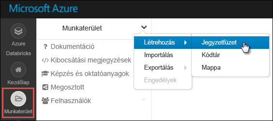

# <a name="tutorial-stream-data-into-azure-databricks-using-event-hubs"></a>Oktatóanyag: Adatok streamelése az Azure Databricksbe az Event Hubs használatával

Ebben az oktatóanyagban összekapcsolhat egy adatbetöltési rendszert az Azure Databricksszel, és közel valós időben streamelhet adatokat egy Apache Spark-fürtbe. Az Azure Event Hubs használatával beállíthat egy adatbetöltési rendszert, és csatlakoztathatja Azure Databrickshez, amely feldolgozza a beérkező üzeneteket. Az adatstream elérése érdekében Twitter API-kkal töltheti be a tweeteket az Event Hubsba. Ha az adatok megérkeztek az Azure Databricksbe, elemzési feladatok futtatásával részletesebben elemezhetőek.

Az oktatóanyag végére az „Azure” kifejezést tartalmazó tweeteket streamelt, és elolvasta a tweeteket az Azure Databricksben.

Az alábbi ábrán az alkalmazásfolyam látható:


Ez az oktatóanyag a következő feladatokat mutatja be:

> [!div class="checklist"]
> * Azure Databricks-munkaterület létrehozása
> * Spark-fürt létrehozása az Azure Databricksben
> * Twitter-alkalmazás létrehozása a streamadatok eléréséhez
> * Jegyzetfüzetek létrehozása az Azure Databricksben
> * Kódtárak csatlakoztatása az Event Hubshoz és a Twitter API-hoz
> * Tweetek küldése az Event Hubsnak
> * Tweetek beolvasása az Event Hubsról

Ha nem rendelkezik Azure-előfizetéssel, [hozzon létre egy ingyenes fiókot](https://azure.microsoft.com/free/) a feladatok megkezdése előtt.

> [!Note]
> Ez az oktatóanyag nem hajtható végre az **Azure ingyenes próbaverziós előfizetésével**.
> Ha ingyenes fiókkal rendelkezik, lépjen a profilba, és változtassa meg az előfizetését **az utólagos**elszámolású verzióra. További információkért lásd az [ingyenes Azure-fiókot](https://azure.microsoft.com/free/) ismertető cikket. Ezután [távolítsa el a](https://docs.microsoft.com/azure/billing/billing-spending-limit#why-you-might-want-to-remove-the-spending-limit)költségkeretet, és [igényeljen kvóta-növekedést](https://docs.microsoft.com/azure/azure-supportability/resource-manager-core-quotas-request) a régiójában lévő vCPU. A Azure Databricks munkaterületének létrehozásakor kiválaszthatja a **próbaverzió (prémium-14 napos ingyenes dBu)** díjszabását, hogy a munkaterület 14 napig elérhető legyen az ingyenes prémium Azure Databricks dBu.

## <a name="prerequisites"></a>Előfeltételek

Mielőtt nekilát az oktatóanyagnak, ellenőrizze, hogy megfelel-e a következő feltételeknek:
- Egy Azure Event Hubs névtér.
- Egy eseményközpont a névtéren belül.
- Az Event Hubs-névtér elérésére szolgáló kapcsolati sztring. A kapcsolati sztring formátumának a következőhöz hasonlónak kell lennie: `Endpoint=sb://<namespace>.servicebus.windows.net/;SharedAccessKeyName=<key name>;SharedAccessKey=<key value>`.
- Megosztott hozzáférési szabályzat neve és szabályzatkulcs az Event Hubshoz.

Ezeket az előfeltételeket az [Azure Event Hubs-névtér és eseményközpont létrehozását](../event-hubs/event-hubs-create.md) ismertető cikk lépéseit követve teljesítheti.

## <a name="sign-in-to-the-azure-portal"></a>Jelentkezzen be az Azure Portalra

Bejelentkezés az [Azure Portalra](https://portal.azure.com/).

## <a name="create-an-azure-databricks-workspace"></a>Azure Databricks-munkaterület létrehozása

Ebben a szakaszban egy Azure Databricks-munkaterületet fog létrehozni az Azure Portal használatával.

1. Az Azure Portalon válassza az **Erőforrás létrehozása** > **Adatok + analitika** > **Azure Databricks** elemet.

    

3. Az **Azure Databricks szolgáltatás** pontban adja meg az értékeket Databricks-munkaterület létrehozásához.

    

    Adja meg a következő értékeket:

    |Tulajdonság  |Leírás  |
    |---------|---------|
    |**Munkaterület neve**     | Adja meg a Databricks-munkaterület nevét.        |
    |**Előfizetés**     | Válassza ki a legördülő menüből a saját Azure-előfizetését.        |
    |**Erőforráscsoport**     | Adja meg, hogy új erőforráscsoportot kíván-e létrehozni, vagy egy meglévőt szeretne használni. Az erőforráscsoport egy tároló, amely Azure-megoldásokhoz kapcsolódó erőforrásokat tárol. További információért olvassa el az [Azure-erőforráscsoportok áttekintését](../azure-resource-manager/resource-group-overview.md). |
    |**Hely**     | Válassza az **USA 2. keleti régiója** lehetőséget. A további elérhető régiókért tekintse meg az [elérhető Azure-szolgáltatások régiók szerinti bontását](https://azure.microsoft.com/regions/services/).        |
    |**Tarifacsomag**     |  Válassza a **Standard** vagy a **Prémium** előfizetést. További információkért a csomagokkal kapcsolatban tekintse meg a [Databricks díjszabását ismertető oldalt](https://azure.microsoft.com/pricing/details/databricks/).       |

    Válassza a **Rögzítés az irányítópulton**, majd a **Létrehozás** lehetőséget.

4. A fiók létrehozása eltarthat néhány percig. A fiók létrehozása során a portál jobb oldalán megjelenik az **Üzembe helyezés beküldése a következőhöz: Azure Databricks** csempe. Lehetséges, hogy jobbra kell görgetnie az irányítópulton, hogy megjelenjen a csempe. Megjelenik egy folyamatjelző is a képernyő tetejéhez közel. Mindkét területen nyomon követheti a folyamat előrehaladását.

    

## <a name="create-a-spark-cluster-in-databricks"></a>Spark-fürt létrehozása a Databricks használatával

1. Az Azure Portalon lépjen a létrehozott Databricks-munkaterülethez, majd válassza a **Munkaterület indítása** elemet.

2. A rendszer átirányítja az Azure Databricks portáljára. A portálon válassza a **Fürt** elemet.

    

3. Az **Új fürt** lapon adja meg a fürt létrehozásához szükséges értékeket.

    

    Fogadja el az összes alapértelmezett értéket, kivéve a következőket:

   * Adjon egy nevet a fürtnek.
   * Ehhez a cikkhez hozzon létre egy **6,0* futtatókörnyezettel rendelkező fürtöt.
   * Mindenképpen jelölje be a **Leállítás \_\_ percnyi tétlenség után** jelölőnégyzetet. Adja meg az időtartamot (percben), amelynek elteltével le kell állítani a fürtöt, amennyiben az használaton kívül van.

   Válassza ki a fürt feldolgozója és az illesztőprogram-csomópontok méretét a technikai feltételekhez és a [költségvetéshez](https://azure.microsoft.com/pricing/details/databricks/).

     Válassza a **Fürt létrehozása** lehetőséget. Ha a fürt már fut, notebookokat csatlakoztathat hozzá, illetve Spark-feladatokat futtathat.

## <a name="create-a-twitter-application"></a>Twitter-alkalmazás létrehozása

A valós idejű tweetstream fogadásához létre kell hoznia egy alkalmazást a Twitteren. Kövesse a Twitter-alkalmazás létrehozására vonatkozó utasításokat, és jegyezze fel az értékeket, amelyek az oktatóanyag elvégzéséhez szükségesek.

1. A böngészőben nyissa meg a [Twitter fejlesztőket](https://developer.twitter.com/en/apps), és válassza **az alkalmazás létrehozása**lehetőséget. Előfordulhat, hogy megjelenik egy üzenet, amely azt jelzi, hogy egy Twitter fejlesztői fiókra van szüksége. Nyugodtan megteheti, és az alkalmazás jóváhagyását követően meg kell jelennie egy megerősítő e-mailben. Több napot is igénybe vehet egy fejlesztői fiók jóváhagyása.

    

2. Az **Alkalmazás létrehozása** oldalon adja meg az új alkalmazás adatait, majd válassza a **Twitter-alkalmazás létrehozása** parancsot.

    

    

3. Az alkalmazás lapon válassza a **kulcsok és tokenek** fület, és másolja a **fogyasztói API-kulcs** és a **fogyasztói API titkos kulcsa**értékeit. A hozzáférési tokenek létrehozásához a hozzáférési jogkivonat **és a hozzáférési jogkivonat titka** területen válassza a **Létrehozás** lehetőséget. Másolja a **Hozzáférési token** és a **Hozzáférési token titkos kulcsa** mező értékeit.

    

Mentse a Twitter-alkalmazáshoz lekért értékeket. Az oktatóanyag későbbi részében szüksége lesz rájuk.

## <a name="attach-libraries-to-spark-cluster"></a>Kódtárak csatolása Spark-fürthöz

Ez az oktatóanyag bemutatja, hogyan küldhet tweeteket az Event Hubsnak a Twitter API-k segítségével. Ezenkívül az [Apache Spark Event Hubs-összekötő](https://github.com/Azure/azure-event-hubs-spark) segítségével adatokat olvashat be és írhat az Azure Event Hubsba. Ha ezeket az API-kat a fürt részeként szeretné használni, vegye fel őket könyvtárakként Azure Databricks és társítsa őket a Spark-fürthöz. A következő utasítások bemutatják, hogyan adhat hozzá egy tárat.

1. A Azure Databricks munkaterületen válassza a **fürtök**lehetőséget, majd válassza ki a meglévő Spark-fürtöt. A fürt menüben válassza a **tárak** lehetőséget, majd kattintson az **új telepítése**elemre.

   

   

2. Az új könyvtár lapon a **forrás** kiválasztásához válassza a **Maven**lehetőséget. A **koordináta**esetében kattintson a hozzáadni kívánt csomaghoz tartozó **csomagok keresése** elemre. Az oktatóanyagban használt kódtárak Maven-koordinátái a következők:

   * Spark Event Hubs-összekötő – `com.microsoft.azure:azure-eventhubs-spark_2.11:2.3.10`
   * Twitter API – `org.twitter4j:twitter4j-core:4.0.7`

     

     

3. Válassza az **Install** (Telepítés) lehetőséget.

4. Győződjön meg arról, hogy a fürt menüjében mindkét függvénytár telepítve van és megfelelően van csatolva.

    

6. Ismételje meg ezeket a lépéseket a Twitter-csomag (`twitter4j-core:4.0.7`) esetében is.

## <a name="create-notebooks-in-databricks"></a>Jegyzetfüzetek létrehozása a Databricksben

Ebben a szakaszban két jegyzetfüzetet hoz létre a Databricks-munkaterületen a következő nevekkel:

- **SendTweetsToEventHub** – Előállítói jegyzetfüzet a tweetek beszerzésére a Twitterről, majd azok streamelésére az Event Hubsnak.
- **ReadTweetsFromEventHub** – Fogyasztói jegyzetfüzet tweetek beolvasására az Event Hubsból.

1. A bal oldali panelen válassza a **Munkaterület** elemet. A **Munkaterület** legördülő menüből válassza a **Létrehozás** > **Jegyzetfüzet** lehetőséget.

    

2. A **Jegyzetfüzet létrehozása** párbeszédpanelen írja be a **SendTweetsToEventHub** nevet, a nyelvnél válassza a **Scala** lehetőséget, majd válassza ki a korábban létrehozott Spark-fürtöt.

    

    Kattintson a **Létrehozás** gombra.

3. A **ReadTweetsFromEventHub** jegyzetfüzet létrehozásához ismételje meg ezeket a lépéseket.

## <a name="send-tweets-to-event-hubs"></a>Tweetek küldése az Event Hubsnak

Illessze be a következő kódot a **SendTweetsToEventHub** jegyzetfüzetbe, és cserélje le a helyőrzőket a korábban létrehozott Event Hubs névtér és Twitter-alkalmazás értékeire. Ez a jegyzetfüzet valós időben streameli az „Azure” kifejezést tartalmazó tweeteket az Event Hubsba.

> [!NOTE]
> A Twitter API bizonyos kérelmekre vonatkozó korlátozásokat és [kvótákat](https://developer.twitter.com/en/docs/basics/rate-limiting.html)tartalmaz. Ha nem elégedett meg a Twitter API-ban érvényes standard díjszabással, a jelen példában szereplő Twitter API használata nélkül is létrehozhat szöveges tartalmakat. Ehhez állítsa be a változó **Adatforrást** `test` helyett `twitter` és töltse ki a lista **testSource** az előnyben részesített teszt bemenettel.

```scala
    import scala.collection.JavaConverters._
    import com.microsoft.azure.eventhubs._
    import java.util.concurrent._
    import scala.collection.immutable._
    import scala.concurrent.Future
    import scala.concurrent.ExecutionContext.Implicits.global

    val namespaceName = "<EVENT HUBS NAMESPACE>"
    val eventHubName = "<EVENT HUB NAME>"
    val sasKeyName = "<POLICY NAME>"
    val sasKey = "<POLICY KEY>"
    val connStr = new ConnectionStringBuilder()
                .setNamespaceName(namespaceName)
                .setEventHubName(eventHubName)
                .setSasKeyName(sasKeyName)
                .setSasKey(sasKey)

    val pool = Executors.newScheduledThreadPool(1)
    val eventHubClient = EventHubClient.create(connStr.toString(), pool)

    def sleep(time: Long): Unit = Thread.sleep(time)

    def sendEvent(message: String, delay: Long) = {
      sleep(delay)
      val messageData = EventData.create(message.getBytes("UTF-8"))
      eventHubClient.get().send(messageData)
      System.out.println("Sent event: " + message + "\n")
    }

    // Add your own values to the list
    val testSource = List("Azure is the greatest!", "Azure isn't working :(", "Azure is okay.")

    // Specify 'test' if you prefer to not use Twitter API and loop through a list of values you define in `testSource`
    // Otherwise specify 'twitter'
    val dataSource = "test"

    if (dataSource == "twitter") {

      import twitter4j._
      import twitter4j.TwitterFactory
      import twitter4j.Twitter
      import twitter4j.conf.ConfigurationBuilder

      // Twitter configuration!
      // Replace values below with you

      val twitterConsumerKey = "<CONSUMER API KEY>"
      val twitterConsumerSecret = "<CONSUMER API SECRET>"
      val twitterOauthAccessToken = "<ACCESS TOKEN>"
      val twitterOauthTokenSecret = "<TOKEN SECRET>"

      val cb = new ConfigurationBuilder()
        cb.setDebugEnabled(true)
        .setOAuthConsumerKey(twitterConsumerKey)
        .setOAuthConsumerSecret(twitterConsumerSecret)
        .setOAuthAccessToken(twitterOauthAccessToken)
        .setOAuthAccessTokenSecret(twitterOauthTokenSecret)

      val twitterFactory = new TwitterFactory(cb.build())
      val twitter = twitterFactory.getInstance()

      // Getting tweets with keyword "Azure" and sending them to the Event Hub in realtime!
      val query = new Query(" #Azure ")
      query.setCount(100)
      query.lang("en")
      var finished = false
      while (!finished) {
        val result = twitter.search(query)
        val statuses = result.getTweets()
        var lowestStatusId = Long.MaxValue
        for (status <- statuses.asScala) {
          if(!status.isRetweet()){
            sendEvent(status.getText(), 5000)
          }
          lowestStatusId = Math.min(status.getId(), lowestStatusId)
        }
        query.setMaxId(lowestStatusId - 1)
      }

    } else if (dataSource == "test") {
      // Loop through the list of test input data
      while (true) {
        testSource.foreach {
          sendEvent(_,5000)
        }
      }

    } else {
      System.out.println("Unsupported Data Source. Set 'dataSource' to \"twitter\" or \"test\"")
    }

    // Closing connection to the Event Hub
    eventHubClient.get().close()
```

A jegyzetfüzet futtatásához használja a **SHIFT + ENTER** billentyűparancsot. Ekkor az alábbi kódrészlethez hasonló kimenetnek kell megjelennie. A kimenetben szereplő minden egyes esemény egy, az „Azure” kifejezést tartalmazó tweet, amely be lett töltve az Event Hubsba.

    Sent event: @Microsoft and @Esri launch Geospatial AI on Azure https://t.co/VmLUCiPm6q via @geoworldmedia #geoai #azure #gis #ArtificialIntelligence

    Sent event: Public preview of Java on App Service, built-in support for Tomcat and OpenJDK
    https://t.co/7vs7cKtvah
    #cloudcomputing #Azure

    Sent event: 4 Killer #Azure Features for #Data #Performance https://t.co/kpIb7hFO2j by @RedPixie

    Sent event: Migrate your databases to a fully managed service with Azure SQL Database Managed Instance | #Azure | #Cloud https://t.co/sJHXN4trDk

    Sent event: Top 10 Tricks to #Save Money with #Azure Virtual Machines https://t.co/F2wshBXdoz #Cloud

    ...
    ...

## <a name="read-tweets-from-event-hubs"></a>Tweetek beolvasása az Event Hubsról

Illessze be a következő kódot a **ReadTweetsFromEventHub** jegyzetfüzetbe, és a helyőrzőket cserélje le a korábban létrehozott Azure Event Hubs értékeire. Ez a jegyzetfüzet beolvassa a tweeteket, amelyeket korábban az Event Hubsba streamelt a **SendTweetsToEventHub** jegyzetfüzet segítségével.

```scala

    import org.apache.spark.eventhubs._
    import com.microsoft.azure.eventhubs._

    // Build connection string with the above information
    val namespaceName = "<EVENT HUBS NAMESPACE>"
    val eventHubName = "<EVENT HUB NAME>"
    val sasKeyName = "<POLICY NAME>"
    val sasKey = "<POLICY KEY>"
    val connStr = new com.microsoft.azure.eventhubs.ConnectionStringBuilder()
                .setNamespaceName(namespaceName)
                .setEventHubName(eventHubName)
                .setSasKeyName(sasKeyName)
                .setSasKey(sasKey)

    val customEventhubParameters =
      EventHubsConf(connStr.toString())
      .setMaxEventsPerTrigger(5)

    val incomingStream = spark.readStream.format("eventhubs").options(customEventhubParameters.toMap).load()

    incomingStream.printSchema

    // Sending the incoming stream into the console.
    // Data comes in batches!
    incomingStream.writeStream.outputMode("append").format("console").option("truncate", false).start().awaitTermination()
```

A következő kimenetet kapja:


    root
     |-- body: binary (nullable = true)
     |-- offset: long (nullable = true)
     |-- seqNumber: long (nullable = true)
     |-- enqueuedTime: long (nullable = true)
     |-- publisher: string (nullable = true)
     |-- partitionKey: string (nullable = true)

    -------------------------------------------
    Batch: 0
    -------------------------------------------
    +------+------+--------------+---------------+---------+------------+
    |body  |offset|sequenceNumber|enqueuedTime   |publisher|partitionKey|
    +------+------+--------------+---------------+---------+------------+
    |[50 75 62 6C 69 63 20 70 72 65 76 69 65 77 20 6F 66 20 4A 61 76 61 20 6F 6E 20 41 70 70 20 53 65 72 76 69 63 65 2C 20 62 75 69 6C 74 2D 69 6E 20 73 75 70 70 6F 72 74 20 66 6F 72 20 54 6F 6D 63 61 74 20 61 6E 64 20 4F 70 65 6E 4A 44 4B 0A 68 74 74 70 73 3A 2F 2F 74 2E 63 6F 2F 37 76 73 37 63 4B 74 76 61 68 20 0A 23 63 6C 6F 75 64 63 6F 6D 70 75 74 69 6E 67 20 23 41 7A 75 72 65]                              |0     |0             |2018-03-09 05:49:08.86 |null     |null        |
    |[4D 69 67 72 61 74 65 20 79 6F 75 72 20 64 61 74 61 62 61 73 65 73 20 74 6F 20 61 20 66 75 6C 6C 79 20 6D 61 6E 61 67 65 64 20 73 65 72 76 69 63 65 20 77 69 74 68 20 41 7A 75 72 65 20 53 51 4C 20 44 61 74 61 62 61 73 65 20 4D 61 6E 61 67 65 64 20 49 6E 73 74 61 6E 63 65 20 7C 20 23 41 7A 75 72 65 20 7C 20 23 43 6C 6F 75 64 20 68 74 74 70 73 3A 2F 2F 74 2E 63 6F 2F 73 4A 48 58 4E 34 74 72 44 6B]            |168   |1             |2018-03-09 05:49:24.752|null     |null        |
    +------+------+--------------+---------------+---------+------------+

    -------------------------------------------
    Batch: 1
    -------------------------------------------
    ...
    ...

A bináris módú kimenetet a következő kódrészlettel konvertálhatja sztringgé.

```scala
    import org.apache.spark.sql.types._
    import org.apache.spark.sql.functions._

    // Event Hub message format is JSON and contains "body" field
    // Body is binary, so we cast it to string to see the actual content of the message
    val messages =
      incomingStream
      .withColumn("Offset", $"offset".cast(LongType))
      .withColumn("Time (readable)", $"enqueuedTime".cast(TimestampType))
      .withColumn("Timestamp", $"enqueuedTime".cast(LongType))
      .withColumn("Body", $"body".cast(StringType))
      .select("Offset", "Time (readable)", "Timestamp", "Body")

    messages.printSchema

    messages.writeStream.outputMode("append").format("console").option("truncate", false).start().awaitTermination()
```

A kimenetnek ezután a következő kódrészlethez hasonlónak kell lennie:

    root
     |-- Offset: long (nullable = true)
     |-- Time (readable): timestamp (nullable = true)
     |-- Timestamp: long (nullable = true)
     |-- Body: string (nullable = true)

    -------------------------------------------
    Batch: 0
    -------------------------------------------
    +------+-----------------+----------+-------+
    |Offset|Time (readable)  |Timestamp |Body
    +------+-----------------+----------+-------+
    |0     |2018-03-09 05:49:08.86 |1520574548|Public preview of Java on App Service, built-in support for Tomcat and OpenJDK
    https://t.co/7vs7cKtvah
    #cloudcomputing #Azure          |
    |168   |2018-03-09 05:49:24.752|1520574564|Migrate your databases to a fully managed service with Azure SQL Database Managed Instance | #Azure | #Cloud https://t.co/sJHXN4trDk    |
    |0     |2018-03-09 05:49:02.936|1520574542|@Microsoft and @Esri launch Geospatial AI on Azure https://t.co/VmLUCiPm6q via @geoworldmedia #geoai #azure #gis #ArtificialIntelligence|
    |176   |2018-03-09 05:49:20.801|1520574560|4 Killer #Azure Features for #Data #Performance https://t.co/kpIb7hFO2j by @RedPixie                                                    |
    +------+-----------------+----------+-------+
    -------------------------------------------
    Batch: 1
    -------------------------------------------
    ...
    ...

Ennyi az egész! Az Azure Databricks segítségével közel valós időben streamelt adatokat az Azure Event Hubsba. A streamadatokat ezután az Apache Spark Event Hubs-összekötője segítségével használta fel. A Spark Event Hubs-összekötőinek használatáról az [összekötő dokumentációjában](https://github.com/Azure/azure-event-hubs-spark/tree/master/docs) talál további információt.

## <a name="clean-up-resources"></a>Az erőforrások eltávolítása

Az oktatóanyag befejezése után leállíthatja a fürtöt. Ehhez az Azure Databricks-munkaterület bal oldali panelén kattintson a **Fürtök** elemre. A leállítani kívánt fürtnél vigye az egérmutatót a **Műveletek** oszlopban található három pont fölé, majd kattintson a **Leállítás** ikonra.


Ön nem állítja le manuálisan a fürt automatikusan leáll, ha a kiválasztott megadott a **leállítása után \_ \_ ennyi perc inaktivitás** jelölőnégyzetet a fürt létrehozásakor. Ebben az esetben a fürt automatikusan leáll, ha a megadott ideig inaktív volt.

## <a name="next-steps"></a>További lépések
Ez az oktatóanyag bemutatta, hogyan végezheti el az alábbi műveleteket:

> [!div class="checklist"]
> * Azure Databricks-munkaterület létrehozása
> * Spark-fürt létrehozása az Azure Databricksben
> * Twitter-alkalmazás létrehozása streamadatok létrehozásához
> * Jegyzetfüzetek létrehozása az Azure Databricksben
> * Kódtárak hozzáadása az Event Hubshoz és a Twitter API-hoz
> * Tweetek küldése az Event Hubsnak
> * Tweetek beolvasása az Event Hubsról

Folytassa a következő oktatóanyaggal, amely azt mutatja be, hogyan végezheti el a Azure Databricks és [Cognitive Services API](../cognitive-services/text-analytics/overview.md)használatával végzett adatelemzést az adatfolyammal rendelkező adatokon.

> [!div class="nextstepaction"]
>[Az adatátviteli elemzések Azure Databricks használatával](databricks-sentiment-analysis-cognitive-services.md)
