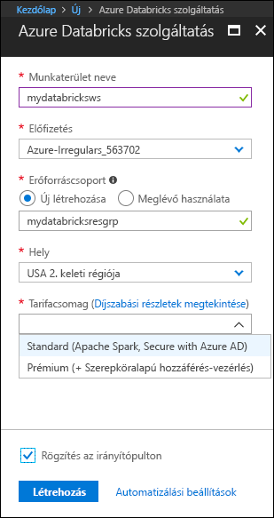

# <a name="quickstart-run-a-spark-job-on-azure-databricks-using-the-azure-portal"></a>Rövid útmutató: Spark-feladatok futtatása Azure Databricksen az Azure Portal használatával

Ez a rövid útmutató bemutatja, hogyan hozható létre Azure Databricks-munkaterület, illetve azon belül egy Apache Spark-fürt. Végezetül azt is ismertetjük, hogyan futtathat Spark-feladatokat a Databricks-fürtön. További információt az Azure Databricksről [az Azure Databrickset](what-is-azure-databricks.md) ismertető cikkben talál.

## <a name="log-in-to-the-azure-portal"></a>Bejelentkezés az Azure Portalra

Jelentkezzen be az [Azure Portalra](https://portal.azure.com).

## <a name="create-a-databricks-workspace"></a>Databricks-munkaterület létrehozása

Ebben a szakaszban egy Azure Databricks-munkaterületet fog létrehozni az Azure Portal használatával. 

1. Az Azure Portalon kattintson a **+** jelre, majd az **Adatok + analitika**, végül az **Azure Databricks (előzetes verzió)** elemre. 

    

2. Az **Azure Databricks (előzetes verzió)** alatt kattintson a **Létrehozás** elemre.

3. Az **Azure Databricks szolgáltatás** alatt a következő értékeket kell megadni:

    

    * A **Munkaterület neve** mezőben adja meg a Databricks-munkaterület nevét.
    * Az **Előfizetés** mezőnél válassza ki a legördülő menüből a saját Azure-előfizetését.
    * Az **Erőforráscsoport** alatt adja meg, hogy új erőforráscsoportot kíván-e létrehozni, vagy egy meglévőt szeretne használni. Az erőforráscsoport egy tároló, amely Azure-megoldásokhoz kapcsolódó erőforrásokat tárol. További információért olvassa el az [Azure-erőforráscsoportok áttekintését](../azure-resource-manager/resource-group-overview.md).
    * A **Hely** mezőnél válassza az **USA 2. keleti régiója** lehetőséget. A további elérhető régiókért tekintse meg az [elérhető Azure-szolgáltatások régiók szerinti bontását](https://azure.microsoft.com/regions/services/).

4. Kattintson a **Create** (Létrehozás) gombra.

## <a name="create-a-spark-cluster-in-databricks"></a>Spark-fürt létrehozása a Databricks használatával

1. Az Azure Portalon lépjen a korábban létrehozott Databricks-munkaterülethez, majd kattintson a **Munkaterület inicializálása** elemre.

2. A rendszer átirányítja az Azure Databricks portáljára. A portálon kattintson a **Fürt** elemre.

    

3. Az **Új fürt** lapon adja meg a fürt létrehozásához szükséges értékeket.

    

    * Adjon egy nevet a fürtnek.
    * Mindenképpen jelölje be a **Leállítás ___ percnyi tétlenség után** jelölőnégyzetet. Adja meg az időtartamot (percben), amelynek elteltével le kell állítani a fürtöt, amennyiben az használaton kívül van.
    * Fogadja el az összes többi alapértelmezett értéket. 
    * Kattintson a **Fürt létrehozása** parancsra. Ha a fürt már fut, notebookokat csatlakoztathat hozzá, illetve Spark-feladatokat futtathat.

További információt a fürtök létrehozásáról a [Spark-fürtök az Azure Databricks használatával történő létrehozását](https://docs.azuredatabricks.net/user-guide/clusters/create.html) ismertető szakaszban talál.

## <a name="run-a-spark-sql-job"></a>Spark SQL-feladat futtatása

Mielőtt ehhez a szakaszhoz hozzáfogna, a következőket kell elvégeznie:

* [Hozzon létre egy Azure-tárfiókot](../storage/common/storage-create-storage-account.md#create-a-storage-account). 
* Töltsön le egy JSON-mintafájlt a [GitHubról](https://github.com/Azure/usql/blob/master/Examples/Samples/Data/json/radiowebsite/small_radio_json.json). 
* A JSON-mintafájlt töltse fel a már létrehozott Azure-tárfiókba. A fájlfeltöltéshez a [Microsoft Azure Storage Explorer](../vs-azure-tools-storage-manage-with-storage-explorer.md) használatát javasoljuk.

A következő lépések végrehajtásával hozzon létre egy notebookot a Databricksben, konfigurálja a notebookot úgy, hogy az Azure Blob-tárfiókból olvassa be az adatokat, majd ezt követően futtassa le a Spark SQL-feladatot az adatokon.

1. A bal oldali panelen kattintson a **Munkaterület** elemre. A **Munkaterület** legördülő menüjében kattintson a **Létrehozás**, majd a **Notebook** elemre.

    

2. A **Notebook létrehozása** párbeszédpanelen adjon meg egy nevet, a nyelvnél válassza a **Scala** lehetőséget, majd válassza ki a korábban létrehozott Spark-fürtöt.

    

    Kattintson a **Create** (Létrehozás) gombra.

3. A következő kódtöredék `{YOUR STORAGE ACCOUNT NAME}` helyőrzőjét cserélje le a létrehozott Azure-tárfiók nevére, a `{YOUR STORAGE ACCOUNT ACCESS KEY}` helyére pedig a saját tárfiók hozzáférési kulcsát írja be. Illessze be a kódtöredéket a notebook egyik üres cellájába, majd nyomja le a SHIFT + ENTER billentyűparancsot a kódcella futtatásához. A kódtöredék úgy konfigurálja a notebookot, hogy az Azure Blob-tárfiókból olvassa be az adatokat.

       spark.conf.set("fs.azure.account.key.{YOUR STORAGE ACCOUNT NAME}.blob.core.windows.net", "{YOUR STORAGE ACCOUNT ACCESS KEY}")
    
    A tárfiók elérési kulcsának lekérésével kapcsolatos útmutatásért olvassa el [a tárelérési kulcsok kezelését](../storage/common/storage-create-storage-account.md#manage-your-storage-account) ismertető cikket.

    > [!NOTE]
    > Olyan Spark-fürtöt is létrehozhat, amely az Azure Data Lake Store-t használja az Azure Databricksszel. Útmutatásért lásd [a Data Lake Store és az Azure Databricks együttes használatát](https://go.microsoft.com/fwlink/?linkid=864084) ismertető cikket.

4. SQL-utasítás futtatásával hozzon létre egy ideiglenes táblát a JSON-mintaadatfájl, a **small_radio_json.json** adataiból. Az alábbi kódtöredékben cserélje le a helyőrzőket a tároló és a tárfiók nevére. Illessze be a kódtöredéket a notebook egyik kódcellájába, majd nyomja le a SHIFT + ENTER billentyűparancsot. A kódtöredék `path` eleme jelöli annak a JSON-mintafájlnak a helyét, amelyet korábban feltöltött Azure Storage-fiókjába.

    ```sql
    %sql 
    CREATE TEMPORARY TABLE radio_sample_data
    USING json
    OPTIONS (
     path "wasbs://{YOUR CONTAINER NAME}@{YOUR STORAGE ACCOUNT NAME}.blob.core.windows.net/small_radio_json.json"
    )
    ```

    A parancs sikeres végrehajtása után a JSON-fájl összes adata táblaként jelenik meg a Databricks-fürtben.

    Az `%sql` nyelvi varázsparancs segítségével SQL-kódot futtathat egy másik típusba tartozó notebookról is. További információért olvassa el a [többféle nyelv notebookokban történő használatát](https://docs.azuredatabricks.net/user-guide/notebooks/index.html#mixing-languages-in-a-notebook) ismertető cikket.

5. A futtatott lekérdezés jobb megértéséhez vessünk egy pillantást a JSON-mintafájl adatairól készült pillanatfelvételre. Illessze be a következő kódtöredéket a kódcellába, majd nyomja le a **SHIFT + ENTER** billentyűparancsot.

    ```sql
    %sql 
    SELECT * from radio_sample_data
    ```

6. Így egy, az alábbi képernyőképhez hasonló táblázatos kimenet jelenik meg (csak egyes oszlopok láthatók):

    

    A mintaadatok többek között tartalmazzák egy rádióadó hallgatóinak nemét (az oszlop neve **gender** (nem)), illetve azt, hogy ingyenes vagy fizetős előfizetéssel rendelkeznek-e (az oszlop neve **level** (szint)).

7. A következőkben vizuálisan jelenítjük meg ezeket az adatokat annak megfelelően, hogy az egyes nemek szerint hány felhasználó rendelkezik ingyenes fiókkal, illetve hányan fizetnek az előfizetésért. A táblázatos kimenet alján kattintson az **Oszlopdiagram** ikonra, majd az **Ábrázolási beállítások** elemre.

    

8. A **Ábrázolás testreszabása** lapon húzza az értékeket a megfelelő helyre a képernyőképen látható módon.

    

    * A **Kulcsok** mezőben adja meg a **gender** értéket.
    * Az **Adatsorozat-csoportok** mezőben adja meg a **level** értéket.
    * Az **Értékek** mezőben adja meg a **level** értéket.
    * Az **Összesítés** mezőben adja meg a **COUNT** értéket.

    Kattintson az **Alkalmaz** gombra.

9. A kimenetben a következő képernyőképen látható vizuális megjelenítés jelenik meg:

     

## <a name="clean-up-resources"></a>Az erőforrások eltávolítása

Ha a Spark-fürt létrehozásakor bejelölte a **Leállítás __ percnyi tétlenség után** jelölőnégyzetet, a fürt a megadott tétlenségi időkeret lejárta után automatikusan leáll.

Amennyiben korábban nem jelölte be ezt a jelölőnégyzetet, manuálisan kell leállítania a fürtöt. Ehhez az Azure Databricks-munkaterület bal oldali panelén kattintson a **Fürtök** elemre. A leállítani kívánt fürtnél vigye az egérmutatót a **Műveletek** oszlopban található három pont fölé, majd kattintson a **Leállítás** ikonra.


## <a name="next-steps"></a>További lépések

Ennek a cikknek a segítségével létrehozott egy Spark-fürtöt az Azure Databricksben, illetve lefuttatott egy Spark-feladatot az Azure-tárterület adatainak felhasználásával. A [Spark-adatforrások](https://docs.azuredatabricks.net/spark/latest/data-sources/index.html) áttekintésével azt is megismerheti, hogyan importálhat adatokat más adatforrásokból az Azure Databricksbe. A következő cikk az Azure Data Lake Store és az Azure Databricks együttes használatát ismerteti.

> [!div class="nextstepaction"]
>[A Data Lake Store és az Azure Databricks együttes használata](https://go.microsoft.com/fwlink/?linkid=864084)
