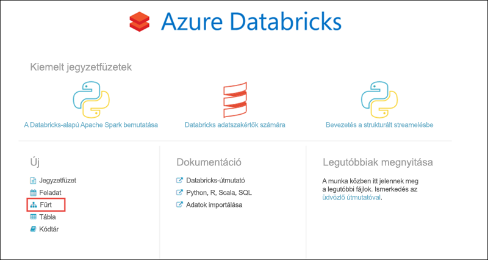
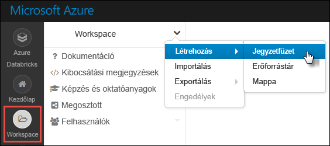

# <a name="quickstart-run-a-spark-job-on-azure-databricks-using-the-azure-resource-manager-template"></a>Rövid útmutató: Spark-feladatok futtatása Azure Databricksen az Azure Resource Manager-sablon használatával

Ebben a rövid útmutatóban egy Azure Resource Manager-sablon használatával hozzon létre egy Azure Databricks-munkaterületet egy Apache Spark-fürttel. Futtategy feladatot a fürtön, és egyéni diagramok használatával valós idejű jelentéseket készíthet a demográfiai adatok on-t használó ingyenes/fizetős használatból.

## <a name="prerequisites"></a>Előfeltételek

- Azure-előfizetés – [hozzon létre egyet ingyen](https://azure.microsoft.com/free/)

## <a name="sign-in-to-the-azure-portal"></a>Jelentkezzen be az Azure Portalra

Jelentkezzen be az [Azure Portalra.](https://portal.azure.com)

> [!Note]
> Ez az oktatóanyag nem hajtható végre **az Azure ingyenes próba-előfizetésével.**
> Ha van ingyenes fiókja, nyissa meg a profilját, és módosítsa az előfizetését **a felosztó-kirovó szolgáltatásra.** További információkért lásd az [ingyenes Azure-fiókot](https://azure.microsoft.com/free/) ismertető cikket. Ezután [távolítsa el a költségkeretet,](https://docs.microsoft.com/azure/billing/billing-spending-limit#why-you-might-want-to-remove-the-spending-limit)és kérjen [kvótanövelést](https://docs.microsoft.com/azure/azure-portal/supportability/resource-manager-core-quotas-request) a régióban a vCPU-khoz. Az Azure Databricks-munkaterület létrehozásakor kiválaszthatja a **próbaverziós (prémium – 14 napos ingyenes dbári)** díjszabási szintet, hogy a munkaterület 14 napig hozzáférést biztosítson az ingyenes prémium szintű Azure Databricks KBB-khoz.

## <a name="create-an-azure-databricks-workspace"></a>Azure Databricks-munkaterület létrehozása

Ebben a szakaszban egy Azure Databricks-munkaterületet hoz létre az Azure Resource Manager-sablon használatával.

1. Az alábbi képre kattintva megnyithatja a sablont az Azure Portalon.

   <a href="https://portal.azure.com/#create/Microsoft.Template/uri/https%3A%2F%2Fraw.githubusercontent.com%2FAzure%2Fazure-quickstart-templates%2Fmaster%2F101-databricks-workspace%2Fazuredeploy.json" target="_blank"></a>

2. Adja meg az Azure Databricks-munkaterület létrehozásához szükséges értékeket

   

   Adja meg a következő értékeket:

   |Tulajdonság  |Leírás  |
   |---------|---------|
   |**Előfizetés**     | Válassza ki a legördülő menüből a saját Azure-előfizetését.        |
   |**Erőforráscsoport**     | Adja meg, hogy új erőforráscsoportot kíván-e létrehozni, vagy egy meglévőt szeretne használni. Az erőforráscsoport egy tároló, amely Azure-megoldásokhoz kapcsolódó erőforrásokat tárol. További információért olvassa el az [Azure-erőforráscsoportok áttekintését](../azure-resource-manager/management/overview.md). |
   |**Helyen**     | Válassza az **USA 2. keleti régiója** lehetőséget. A további elérhető régiókért tekintse meg az [elérhető Azure-szolgáltatások régiók szerinti bontását](https://azure.microsoft.com/regions/services/).        |
   |**Munkaterület neve**     | Adja meg a Databricks-munkaterület nevét.        |
   |**Árképzési szint**     |  Válassza a **Standard** vagy a **Prémium** előfizetést. További információkért a csomagokkal kapcsolatban tekintse meg a [Databricks díjszabását ismertető oldalt](https://azure.microsoft.com/pricing/details/databricks/).       |

3. Jelölje be az **Elfogadom a fenti feltételeket** és a **Rögzítés az irányítópulton** lehetőséget, majd kattintson a **Vásárlás** elemre.

4. A munkaterület létrehozása eltarthat néhány percig. A munkaterület létrehozása alatt a portál jobb oldalán megjelenik az **Üzembehelyezési kérés elküldése az Azure Databricksnek** csempe. Lehetséges, hogy jobbra kell görgetnie az irányítópulton, hogy megjelenjen a csempe. Megjelenik egy folyamatjelző is a képernyő tetejéhez közel. Mindkét területen nyomon követheti a folyamat előrehaladását.

   

   Ha egy munkaterület telepítése sikertelen, a munkaterület továbbra is hibás állapotban jön létre. Törölje a sikertelen munkaterületet, és hozzon létre egy új munkaterületet, amely megoldja a telepítési hibákat. A sikertelen munkaterület törlésekor a felügyelt erőforráscsoport és a sikeresen üzembe helyezett erőforrások is törlődnek.

## <a name="create-a-spark-cluster-in-databricks"></a>Spark-fürt létrehozása a Databricks használatával

1. Az Azure Portalon lépjen a korábban létrehozott Databricks-munkaterülethez, majd kattintson a **Munkaterület indítása** elemre.

2. A rendszer átirányítja az Azure Databricks portáljára. A portálon kattintson a **Fürt** elemre.

   

3. Az **Új fürt** lapon adja meg a fürt létrehozásához szükséges értékeket.

   

   Fogadja el az összes alapértelmezett értéket, kivéve a következőket:

   * Adjon egy nevet a fürtnek.
   * Ehhez a cikkhez a **4.0** futtatókörnyezetben hozzon létre fürtöt.
   * Győződjön meg arról, hogy bejelöli a **Percek \_ \_ utáni inaktivitás** jelölőnégyzetet. Adja meg az időtartamot (percben), amelynek elteltével le kell állítani a fürtöt, amennyiben az használaton kívül van.

   Válassza a **Fürt létrehozása** lehetőséget. Ha a fürt már fut, notebookokat csatlakoztathat hozzá, illetve Spark-feladatokat futtathat.

További információt a fürtök létrehozásáról a [Spark-fürtök az Azure Databricks használatával történő létrehozását](/azure/databricks/clusters/create) ismertető szakaszban talál.

## <a name="run-a-spark-sql-job"></a>Spark SQL-feladat futtatása

Mielőtt ehhez a szakaszhoz hozzáfogna, a következő előfeltételeknek kell eleget tennie:

* [Hozzon létre egy Azure Blob-tárfiókot](../storage/common/storage-account-create.md).
* Töltsön le egy minta JSON-fájlt [a GitHubról.](https://github.com/Azure/usql/blob/master/Examples/Samples/Data/json/radiowebsite/small_radio_json.json)
* Töltse fel a JSON-mintafájlt a már létrehozott Azure Blob-tárfiókba. A fájlfeltöltéshez a [Microsoft Azure Storage Explorer](../vs-azure-tools-storage-manage-with-storage-explorer.md) használatát javasoljuk.

A következő feladatok végrehajtásával hozzon létre egy jegyzetfüzetet a Databricksben, konfigurálja a jegyzetfüzetet úgy, hogy az Azure Blob-tárfiókból olvassa be az adatokat, majd ezt követően futtassa le a Spark SQL-feladatot az adatokon.

1. A bal oldali panelen kattintson a **Munkaterület** elemre. A **Munkaterület** legördülő menüjében kattintson a **Létrehozás**, majd a **Notebook** elemre.

   

2. A **Notebook létrehozása** párbeszédpanelen adjon meg egy nevet, a nyelvnél válassza a **Scala** lehetőséget, majd válassza ki a korábban létrehozott Spark-fürtöt.

   

   Kattintson **a Létrehozás gombra.**

3. Ebben a lépésben társítsa az Azure Storage-fiókot a Databricks Spark-fürttel. A társítás két különböző módon végezhető el. Az Azure Storage-fiókot csatlakoztathatja a Databricks fájlrendszerhez (DBFS), vagy közvetlenül hozzáférhet a létrehozott alkalmazásból.

   > [!IMPORTANT]
   >Ez a cikk **a tároló DBFS-sel való csatlakoztatásának módszerét alkalmazza**. Ez a módszer biztosítja, hogy a csatlakoztatott tároló magával a fürt fájlrendszerével legyen társítva. Ezért a fürthöz hozzáférő bármely alkalmazás használhatja a társított tárolót is. A közvetlen hozzáférési módszer arra az alkalmazásra van korlátozva, ahonnan a hozzáférést konfigurálja.
   >
   > A csatlakoztatási módszer használatához létre kell hoznia egy Spark-fürtöt a Databricks futtatókörnyezet **4.0-s** verziójával, amelyet ebben a cikkben választott.

   A következő kódtöredékben cserélje le a `{YOUR CONTAINER NAME}`, `{YOUR STORAGE ACCOUNT NAME}` és `{YOUR STORAGE ACCOUNT ACCESS KEY}` értékeket az Azure Storage-fiókjának megfelelő értékekre. Illessze be a kódtöredéket a notebook egyik üres cellájába, majd nyomja le a SHIFT + ENTER billentyűparancsot a kódcella futtatásához.

   * **A tárfiók csatlakoztatása DBFS-szel (ajánlott)**. Ebben a kódtöredékben az Azure Storage-fiók útvonala a következőhöz van csatlakoztatva: `/mnt/mypath`. Így a jövőben az Azure Storage-fiók hozzáférésekor nem kell megadnia a teljes útvonalat. Egyszerűen használhatja a következőt: `/mnt/mypath`.

          dbutils.fs.mount(
            source = "wasbs://{YOUR CONTAINER NAME}@{YOUR STORAGE ACCOUNT NAME}.blob.core.windows.net/",
            mountPoint = "/mnt/mypath",
            extraConfigs = Map("fs.azure.account.key.{YOUR STORAGE ACCOUNT NAME}.blob.core.windows.net" -> "{YOUR STORAGE ACCOUNT ACCESS KEY}"))

   * **A tárfiók közvetlen hozzáférése**

          spark.conf.set("fs.azure.account.key.{YOUR STORAGE ACCOUNT NAME}.blob.core.windows.net", "{YOUR STORAGE ACCOUNT ACCESS KEY}")

     A tárfiók hozzáférési kulcsainak beolvasásáról a [Tárfiók hozzáférési kulcsainak kezelése](../storage/common/storage-account-keys-manage.md)című témakörben talál további információt.

   > [!NOTE]
   > Olyan Spark-fürtöt is létrehozhat, amely az Azure Data Lake Store-t használja az Azure Databricksszel. Útmutatásért lásd [a Data Lake Store és az Azure Databricks együttes használatát](/azure/databricks/data/data-sources/azure/azure-datalake-gen2) ismertető cikket.

4. SQL-utasítás futtatásával hozzon létre egy ideiglenes táblát a JSON-mintaadatfájl, a **small_radio_json.json** adataiból. Az alábbi kódtöredékben cserélje le a helyőrzőket a tároló és a tárfiók nevére. Illessze be a kódtöredéket a notebook egyik kódcellájába, majd nyomja le a SHIFT + ENTER billentyűparancsot. A kódtöredék `path` eleme jelöli annak a JSON-mintafájlnak a helyét, amelyet korábban feltöltött Azure Storage-fiókjába.

   ```sql
   %sql
   DROP TABLE IF EXISTS radio_sample_data;
   CREATE TABLE radio_sample_data
   USING json
   OPTIONS (
    path "/mnt/mypath/small_radio_json.json"
   )
   ```

   A parancs sikeres végrehajtása után a JSON-fájl összes adata táblaként jelenik meg a Databricks-fürtben.

   Az `%sql` nyelvi varázsparancs segítségével SQL-kódot futtathat egy másik típusba tartozó notebookról is. További információért olvassa el a [többféle nyelv notebookokban történő használatát](/azure/databricks/notebooks/index) ismertető cikket.

5. A futtatott lekérdezés jobb megértéséhez vessünk egy pillantást a JSON-mintafájl adatairól készült pillanatfelvételre. Illessze be a következő kódtöredéket a kódcellába, majd nyomja le a **SHIFT + ENTER** billentyűparancsot.

   ```sql
   %sql
   SELECT * from radio_sample_data
   ```

6. Így egy, az alábbi képernyőképhez hasonló táblázatos kimenet jelenik meg (csak egyes oszlopok láthatók):

   

   A mintaadatok többek között a rádiócsatorna közönségének nemét (oszlopnév, **nem)** rögzítik, valamint azt, hogy előfizetésük ingyenes vagy fizetős -e (oszlopnév, **szint).**

7. A következőkben vizuálisan jelenítjük meg ezeket az adatokat annak megfelelően, hogy az egyes nemek szerint hány felhasználó rendelkezik ingyenes fiókkal, illetve hányan fizetnek az előfizetésért. A táblázatos kimenet alján kattintson az **Oszlopdiagram** ikonra, majd az **Ábrázolási beállítások** elemre.

   

8. A **Ábrázolás testreszabása** lapon húzza az értékeket a megfelelő helyre a képernyőképen látható módon.

   

   * A **Kulcsok** mezőben adja meg a **gender** értéket.
   * Az **Adatsorozat-csoportok** mezőben adja meg a **level** értéket.
   * Az **Értékek** mezőben adja meg a **level** értéket.
   * Az **Összesítés** mezőben adja meg a **COUNT** értéket.

   Kattintson az **Alkalmaz** gombra.

9. A kimenetben a következő képernyőképen látható vizuális megjelenítés jelenik meg:

   

## <a name="clean-up-resources"></a>Az erőforrások eltávolítása

Ha végzett a cikkel, leállíthatja a fürtöt. Ehhez az Azure Databricks-munkaterület bal oldali panelén kattintson a **Fürtök** elemre. A leállítani kívánt fürtnél vigye az egérmutatót a **Műveletek** oszlopban található három pont fölé, majd kattintson a **Leállítás** ikonra.


Ha nem szakítja meg manuálisan a fürtöt, az automatikusan leáll, feltéve, hogy a fürt létrehozásakor bejelölte a **Percek \_ \_ utáni inaktivitás** után jelölőnégyzetet. Ebben az esetben a fürt automatikusan leáll, ha a megadott ideig inaktív volt.

## <a name="next-steps"></a>További lépések

Ennek a cikknek a segítségével létrehozott egy Spark-fürtöt az Azure Databricksben, illetve lefuttatott egy Spark-feladatot az Azure-tárterület adatainak felhasználásával. A [Spark-adatforrások](/azure/databricks/data/data-sources/index) áttekintésével azt is megismerheti, hogyan importálhat adatokat más adatforrásokból az Azure Databricksbe. A Resource Manager-sablont is megtekintheti, ha [egyéni VNET-címmel szeretne létrehozni Azure Databricks-munkaterületet](https://github.com/Azure/azure-quickstart-templates/tree/master/101-databricks-workspace-with-custom-vnet-address). A JSON szintaxisát és a sablonokban használható tulajdonságokat a [Microsoft.Databricks/workspaces](/azure/templates/microsoft.databricks/workspaces) sablon hivatkozási száma című témakörben olvashat.

Folytassa a következő cikkel annak megismeréséhez, hogyan végezhet ETL-műveletet (adatok kinyerését, átalakítását és betöltését) az Azure Databricks használatával.

> [!div class="nextstepaction"]
> [Adatok kinyerése, átalakítása és betöltése az Azure Databricks használatával](databricks-extract-load-sql-data-warehouse.md)
