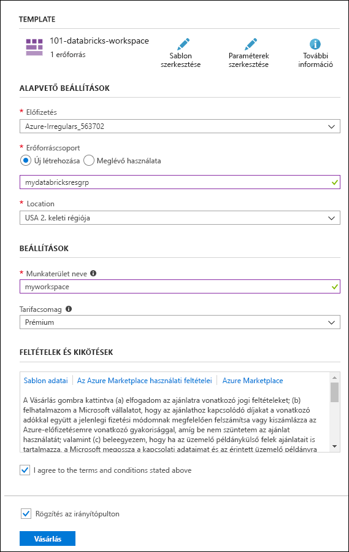
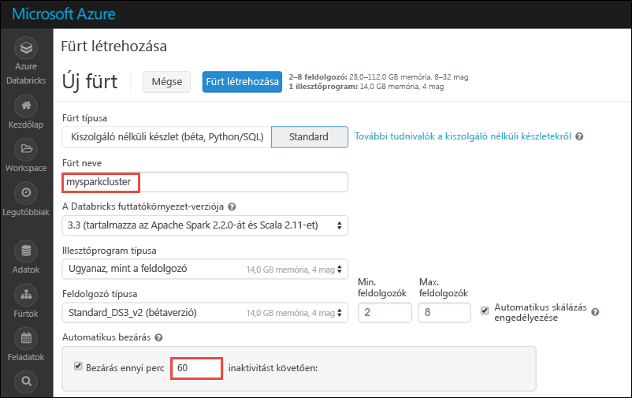
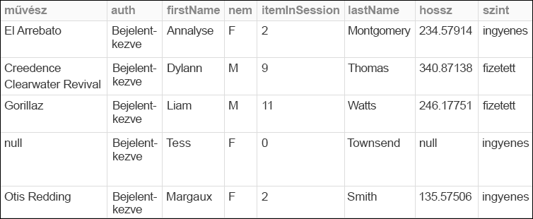
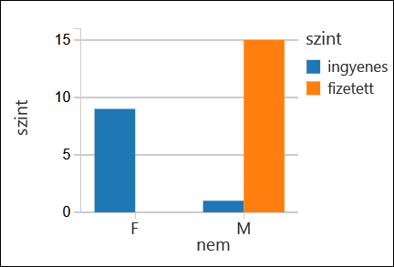

# <a name="quickstart-run-a-spark-job-on-azure-databricks-using-the-azure-resource-manager-template"></a>Rövid útmutató: Spark-feladatok futtatása Azure Databricksen az Azure Resource Manager-sablon használatával

Ez a rövid útmutató bemutatja, hogyan hozhat létre egy Azure Databricks-munkaterületet az Azure Resource Manager-sablon használatával. A munkaterület segítségével létrehoz egy Apache Spark-fürtöt, és futtat egy Spark-feladatot a Databricks-fürtön. További információt az Azure Databricksről [az Azure Databrickset](what-is-azure-databricks.md) ismertető cikkben talál.

Ebben a rövid útmutatóban a Spark-feladat részeként egy rádióadó előfizetési adatait elemzi, hogy a demográfiai adatok alapján betekintést nyerjen az ingyenes/fizetős használatba.

Ha nem rendelkezik Azure-előfizetéssel, [hozzon létre egy ingyenes fiókot](https://azure.microsoft.com/free/) a feladatok megkezdése előtt.

## <a name="create-an-azure-databricks-workspace"></a>Azure Databricks-munkaterület létrehozása

Ebben a szakaszban egy Azure Databricks-munkaterületet hoz létre az Azure Resource Manager-sablon használatával. 

1. Az alábbi képre kattintva megnyithatja a sablont az Azure Portalon.         

    <a href="https://portal.azure.com/#create/Microsoft.Template/uri/https%3A%2F%2Fraw.githubusercontent.com%2FAzure%2Fazure-quickstart-templates%2Fmaster%2F101-databricks-workspace%2Fazuredeploy.json" target="_blank"></a>

2. Adja meg az Azure Databricks-munkaterület létrehozásához szükséges értékeket 

    

    Adja meg a következő értékeket: 
     
    |Tulajdonság  |Leírás  |
    |---------|---------|
    |**Előfizetés**     | Válassza ki a legördülő menüből a saját Azure-előfizetését.        |
    |**Erőforráscsoport**     | Adja meg, hogy új erőforráscsoportot kíván-e létrehozni, vagy egy meglévőt szeretne használni. Az erőforráscsoport egy tároló, amely Azure-megoldásokhoz kapcsolódó erőforrásokat tárol. További információért olvassa el az [Azure-erőforráscsoportok áttekintését](../azure-resource-manager/resource-group-overview.md). |
    |**Hely**     | Válassza az **USA 2. keleti régiója** lehetőséget. A további elérhető régiókért tekintse meg az [elérhető Azure-szolgáltatások régiók szerinti bontását](https://azure.microsoft.com/regions/services/).        |
    |**Munkaterület neve**     | Adja meg a Databricks-munkaterület nevét.        |
    |**Tarifacsomag**     |  Válassza a **Standard** vagy a **Prémium** előfizetést. További információkért a csomagokkal kapcsolatban tekintse meg a [Databricks díjszabását ismertető oldalt](https://azure.microsoft.com/pricing/details/databricks/).       |

3. Jelölje be az **Elfogadom a fenti feltételeket** és a **Rögzítés az irányítópulton** lehetőséget, majd kattintson a **Vásárlás** elemre.

4. A munkaterület létrehozása eltarthat néhány percig. A munkaterület létrehozása alatt a portál jobb oldalán megjelenik az **Üzembehelyezési kérés elküldése az Azure Databricksnek** csempe. Lehetséges, hogy jobbra kell görgetnie az irányítópulton, hogy megjelenjen a csempe. Megjelenik egy folyamatjelző is a képernyő tetejéhez közel. Mindkét területen nyomon követheti a folyamat előrehaladását.

    

## <a name="create-a-spark-cluster-in-databricks"></a>Spark-fürt létrehozása a Databricks használatával

1. Az Azure Portalon lépjen a korábban létrehozott Databricks-munkaterülethez, majd kattintson a **Munkaterület indítása** elemre.

2. A rendszer átirányítja az Azure Databricks portáljára. A portálon kattintson a **Fürt** elemre.

    

3. Az **Új fürt** lapon adja meg a fürt létrehozásához szükséges értékeket.

    

    Fogadja el az összes alapértelmezett értéket, kivéve a következőket:

    * Adjon egy nevet a fürtnek.
    * Ehhez a cikkhez a **4.0** futtatókörnyezetben hozzon létre fürtöt. 
    * Mindenképpen jelölje be a **Leállítás ___ percnyi tétlenség után** jelölőnégyzetet. Adja meg az időtartamot (percben), amelynek elteltével le kell állítani a fürtöt, amennyiben az használaton kívül van.
    
    Válassza a **Fürt létrehozása** lehetőséget. Ha a fürt már fut, notebookokat csatlakoztathat hozzá, illetve Spark-feladatokat futtathat. 

További információt a fürtök létrehozásáról a [Spark-fürtök az Azure Databricks használatával történő létrehozását](https://docs.azuredatabricks.net/user-guide/clusters/create.html) ismertető szakaszban talál.

## <a name="run-a-spark-sql-job"></a>Spark SQL-feladat futtatása

Mielőtt ehhez a szakaszhoz hozzáfogna, a következő előfeltételeknek kell eleget tennie:

* [Hozzon létre egy Azure Blob-tárfiókot](../storage/common/storage-quickstart-create-account.md). 
* Töltsön le egy JSON-mintafájlt a [GitHubról](https://github.com/Azure/usql/blob/master/Examples/Samples/Data/json/radiowebsite/small_radio_json.json). 
* Töltse fel a JSON-mintafájlt a már létrehozott Azure Blob-tárfiókba. A fájlfeltöltéshez a [Microsoft Azure Storage Explorer](../vs-azure-tools-storage-manage-with-storage-explorer.md) használatát javasoljuk.

A következő feladatok végrehajtásával hozzon létre egy jegyzetfüzetet a Databricksben, konfigurálja a jegyzetfüzetet úgy, hogy az Azure Blob-tárfiókból olvassa be az adatokat, majd ezt követően futtassa le a Spark SQL-feladatot az adatokon.

1. A bal oldali panelen kattintson a **Munkaterület** elemre. A **Munkaterület** legördülő menüjében kattintson a **Létrehozás**, majd a **Notebook** elemre.

    

2. A **Notebook létrehozása** párbeszédpanelen adjon meg egy nevet, a nyelvnél válassza a **Scala** lehetőséget, majd válassza ki a korábban létrehozott Spark-fürtöt.

    

    Kattintson a **Create** (Létrehozás) gombra.

3. Ebben a lépésben társítsa az Azure Storage-fiókot a Databricks Spark-fürttel. A társítás két különböző módon végezhető el. Az Azure Storage-fiókot csatlakoztathatja a Databricks fájlrendszerhez (DBFS), vagy közvetlenül hozzáférhet a létrehozott alkalmazásból.  

    > [!IMPORTANT]
    >Ez a cikk **a tároló DBFS-sel való csatlakoztatásának módszerét alkalmazza**. Ez a módszer biztosítja, hogy a csatlakoztatott tároló magával a fürt fájlrendszerével legyen társítva. Ezért a fürthöz hozzáférő bármely alkalmazás használhatja a társított tárolót is. A közvetlen hozzáférési módszer arra az alkalmazásra van korlátozva, ahonnan a hozzáférést konfigurálja.
    >
    > A csatlakoztatási módszer használatához létre kell hoznia egy Spark-fürtöt a Databricks futtatókörnyezet **4.0-s** verziójával, amelyet ebben a cikkben választott.

    A következő kódtöredékben cserélje le a `{YOUR CONTAINER NAME}`, `{YOUR STORAGE ACCOUNT NAME}` és `{YOUR STORAGE ACCOUNT ACCESS KEY}` értékeket az Azure Storage-fiókjának megfelelő értékekre. Illessze be a kódtöredéket a notebook egyik üres cellájába, majd nyomja le a SHIFT + ENTER billentyűparancsot a kódcella futtatásához.

    * **A tárfiók csatlakoztatása DBFS-szel (ajánlott)**. Ebben a kódtöredékben az Azure Storage-fiók útvonala a következőhöz van csatlakoztatva: `/mnt/mypath`. Így a jövőben az Azure Storage-fiók hozzáférésekor nem kell megadnia a teljes útvonalat. Egyszerűen használhatja a következőt: `/mnt/mypath`.

          dbutils.fs.mount(
            source = "wasbs://{YOUR CONTAINER NAME}@{YOUR STORAGE ACCOUNT NAME}.blob.core.windows.net/",
            mountPoint = "/mnt/mypath",
            extraConfigs = Map("fs.azure.account.key.{YOUR STORAGE ACCOUNT NAME}.blob.core.windows.net" -> "{YOUR STORAGE ACCOUNT ACCESS KEY}"))

    * **A tárfiók közvetlen hozzáférése**

          spark.conf.set("fs.azure.account.key.{YOUR STORAGE ACCOUNT NAME}.blob.core.windows.net", "{YOUR STORAGE ACCOUNT ACCESS KEY}")

    A tárfiók elérési kulcsának lekérésével kapcsolatos útmutatásért olvassa el [a tárelérési kulcsok kezelését](../storage/common/storage-create-storage-account.md#manage-your-storage-account) ismertető cikket.

    > [!NOTE]
    > Olyan Spark-fürtöt is létrehozhat, amely az Azure Data Lake Store-t használja az Azure Databricksszel. Útmutatásért lásd [a Data Lake Store és az Azure Databricks együttes használatát](https://go.microsoft.com/fwlink/?linkid=864084) ismertető cikket.

4. SQL-utasítás futtatásával hozzon létre egy ideiglenes táblát a JSON-mintaadatfájl, a **small_radio_json.json** adataiból. Az alábbi kódtöredékben cserélje le a helyőrzőket a tároló és a tárfiók nevére. Illessze be a kódtöredéket a notebook egyik kódcellájába, majd nyomja le a SHIFT + ENTER billentyűparancsot. A kódtöredék `path` eleme jelöli annak a JSON-mintafájlnak a helyét, amelyet korábban feltöltött Azure Storage-fiókjába.

    ```sql
    %sql 
    DROP TABLE IF EXISTS radio_sample_data;
    CREATE TABLE radio_sample_data
    USING json
    OPTIONS (
     path "/mnt/mypath/small_radio_json.json"
    )
    ```

    A parancs sikeres végrehajtása után a JSON-fájl összes adata táblaként jelenik meg a Databricks-fürtben.

    Az `%sql` nyelvi varázsparancs segítségével SQL-kódot futtathat egy másik típusba tartozó notebookról is. További információért olvassa el a [többféle nyelv notebookokban történő használatát](https://docs.azuredatabricks.net/user-guide/notebooks/index.html#mixing-languages-in-a-notebook) ismertető cikket.

5. A futtatott lekérdezés jobb megértéséhez vessünk egy pillantást a JSON-mintafájl adatairól készült pillanatfelvételre. Illessze be a következő kódtöredéket a kódcellába, majd nyomja le a **SHIFT + ENTER** billentyűparancsot.

    ```sql
    %sql 
    SELECT * from radio_sample_data
    ```

6. Így egy, az alábbi képernyőképhez hasonló táblázatos kimenet jelenik meg (csak egyes oszlopok láthatók):

    

    A mintaadatok többek között tartalmazzák egy rádióadó hallgatóinak nemét (az oszlop neve **gender** (nem)), illetve azt, hogy ingyenes vagy fizetős előfizetéssel rendelkeznek-e (az oszlop neve **level** (szint)).

7. A következőkben vizuálisan jelenítjük meg ezeket az adatokat annak megfelelően, hogy az egyes nemek szerint hány felhasználó rendelkezik ingyenes fiókkal, illetve hányan fizetnek az előfizetésért. A táblázatos kimenet alján kattintson az **Oszlopdiagram** ikonra, majd az **Ábrázolási beállítások** elemre.

    

8. A **Ábrázolás testreszabása** lapon húzza az értékeket a megfelelő helyre a képernyőképen látható módon.

    

    * A **Kulcsok** mezőben adja meg a **gender** értéket.
    * Az **Adatsorozat-csoportok** mezőben adja meg a **level** értéket.
    * Az **Értékek** mezőben adja meg a **level** értéket.
    * Az **Összesítés** mezőben adja meg a **COUNT** értéket.

    Kattintson az **Alkalmaz** gombra.

9. A kimenetben a következő képernyőképen látható vizuális megjelenítés jelenik meg:

     

## <a name="clean-up-resources"></a>Az erőforrások eltávolítása

Ha végzett a cikkel, leállíthatja a fürtöt. Ehhez az Azure Databricks-munkaterület bal oldali panelén kattintson a **Fürtök** elemre. A leállítani kívánt fürtnél vigye az egérmutatót a **Műveletek** oszlopban található három pont fölé, majd kattintson a **Leállítás** ikonra.


Ha nem állítja le manuálisan a fürtöt, az automatikusan le fog állni, amennyiben a fürt létrehozásakor bejelölte a **Leállítás ___ percnyi tétlenség után** jelölőnégyzetet. Ebben az esetben a fürt automatikusan leáll, ha a megadott ideig inaktív volt.

## <a name="next-steps"></a>További lépések

Ennek a cikknek a segítségével létrehozott egy Spark-fürtöt az Azure Databricksben, illetve lefuttatott egy Spark-feladatot az Azure-tárterület adatainak felhasználásával. A [Spark-adatforrások](https://docs.azuredatabricks.net/spark/latest/data-sources/index.html) áttekintésével azt is megismerheti, hogyan importálhat adatokat más adatforrásokból az Azure Databricksbe. A Resource Manager-sablont is megtekintheti, ha [egyéni VNET-címmel szeretne létrehozni Azure Databricks-munkaterületet](https://github.com/Azure/azure-quickstart-templates/tree/master/101-databricks-workspace-with-custom-vnet-address).

Folytassa a következő cikkel annak megismeréséhez, hogyan végezhet ETL-műveletet (adatok kinyerését, átalakítását és betöltését) az Azure Databricks használatával.

> [!div class="nextstepaction"]
>[Adatok kinyerése, átalakítása és betöltése az Azure Databricks használatával](databricks-extract-load-sql-data-warehouse.md)
